# Garmin 国际区运动数据获取应用 — 设计方案

> 版本: v3.0  
> 日期: 2026-06-24  
> 基于库: [garmy](https://github.com/bes-dev/garmy) v1.0.0

---

## 1. 项目目标

构建一个 Python 命令行应用，通过 **garmy** 库对接 Garmin Connect 国际区 API，实现：

- 通过环境变量注入 Garmin 账号密码，完成认证
- 拉取运动活动列表（跑步、骑行、游泳等）
- 拉取日常健康指标（睡眠、心率、HRV、压力、身体电量等）
- 数据本地持久化（SQLite），支持离线查询与分析
- **记忆存储系统**：在原始数据之上构建结构化的运动知识库，包括每日综合报告、运动摘要、恢复摘要、竞技水平评估、训练目标与计划、执行跟踪、教练倾向与案例等
- **AI 教练对话**：通过 MCP Server 对接 OpenClaw / Claude Desktop，以日报为上下文进行智能训练对话，实现"每天早上 AI 帮你分析状态、规划训练、回答问题"
- **每日报告**：自动生成包含活动、睡眠、恢复、负荷、异常检测、训练建议的全方位日报

---

## 2. 前置调研结论

### 2.1 为什么选 garmy

| 对比维度 | garmy | garminconnect | garth |
|---------|-------|---------------|-------|
| 维护状态 | ✅ 活跃 (2025.06 发布 v1.0) | ✅ 活跃 | ❌ 已停止维护 |
| AI/LLM 集成 | ✅ 内置 MCP Server | ❌ 无 | ❌ 无 |
| 本地数据库 | ✅ 内置 SQLite + SyncManager | ❌ 无 | ❌ 无 |
| 类型安全 | ✅ 完整 dataclass + 类型标注 | 部分 | 部分 |
| 中国区支持 | ✅ domain 参数切换 | ✅ is_cn 参数 | ✅ domain 参数 |
| 自动发现指标 | ✅ 自动注册 metric | ❌ | ❌ |
| CLI 工具 | ✅ garmy-sync / garmy-mcp | ❌ | ❌ |

**结论**: garmy 是最契合需求的选择——其 LocalDB 模块天然解决了"拉取→存储→查询"的闭环，MCP Server 为后续 AI 分析预留了扩展空间。

### 2.2 国际区 vs 中国区

用户使用"佳明国际"账号，即 Garmin Connect 国际区（`garmin.com`）。garmy 默认连接 `garmin.com`，无需额外配置。若后续需要切换到中国区（`garmin.cn`），仅需将 `domain` 参数改为 `"garmin.cn"`。

### 2.3 认证机制

garmy 使用 Garmin Connect 移动端 SSO OAuth 流程：
1. 模拟 Android 应用 User-Agent 请求 SSO 嵌入页
2. 提取 CSRF Token
3. 提交邮箱/密码表单
4. 如有 MFA，支持交互式输入或返回 MFA 状态
5. 获取 OAuth1 Token → 交换 OAuth2 Token
6. Token 自动持久化到 `~/.garmy/`（支持自动刷新）

---

## 3. 整体架构

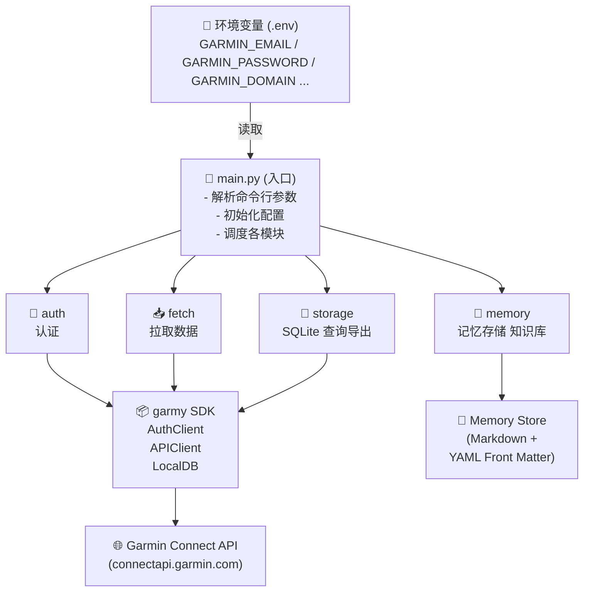

---

## 4. 模块设计

### 4.1 配置模块 (`config.py`)

**职责**: 统一管理所有配置项，从环境变量读取。

**环境变量设计**:

| 变量名 | 必填 | 默认值 | 说明 |
|--------|:---:|--------|------|
| `GARMIN_EMAIL` | ✅ | — | Garmin Connect 国际区登录邮箱 |
| `GARMIN_PASSWORD` | ✅ | — | Garmin Connect 登录密码 |
| `GARMIN_DOMAIN` | ❌ | `garmin.com` | API 域名（国际区默认，中国区用 `garmin.cn`）|
| `GARMIN_TOKEN_DIR` | ❌ | `~/.garmy` | Token 持久化目录 |
| `GARMIN_DB_PATH` | ❌ | `./data/garmin_data.db` | SQLite 数据库路径 |
| `GARMIN_SYNC_DAYS` | ❌ | `30` | 默认同步最近 N 天的数据 |
| `GARMIN_LOG_LEVEL` | ❌ | `INFO` | 日志级别 |

**设计要点**:
- 使用 `python-dotenv` 支持 `.env` 文件（方便本地开发）
- 环境变量优先级: 系统环境变量 > `.env` 文件 > 默认值
- 密码类敏感信息绝不打印到日志
- 启动时校验必填变量，缺失则明确报错退出

---

### 4.2 认证模块 (`auth.py`)

**职责**: 封装 garmy `AuthClient`，处理登录与 Token 生命周期。

**设计要点**:
- 创建 `AuthClient(domain=config.domain, token_dir=config.token_dir)`
- 检查已有 Token 是否有效（garmy 自动从 `~/.garmy/` 加载）
- 无效则调用 `auth_client.login(email, password)`
- 支持 MFA：若账号开启了二次验证，通过回调函数交互式输入
- 提供 `get_auth_headers()` 供 API 调用使用（garmy 内部自动处理）
- 日志中脱敏显示邮箱（如 `ga***@gmail.com`）

**Token 生命周期**（garmy 自动管理）:

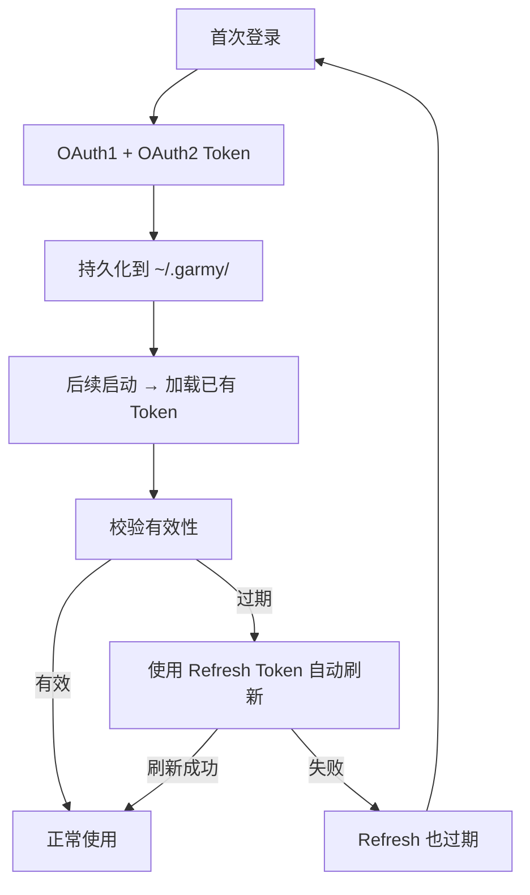

---

### 4.3 数据获取模块 (`fetcher.py`)

**职责**: 封装 garmy `APIClient` 的 Metrics 系统，提供统一的数据拉取接口。

#### 4.3.1 运动活动数据

使用 `api_client.metrics.get("activities")` 获取 `ActivitiesAccessor`:

| 方法 | 说明 | 使用场景 |
|------|------|---------|
| `.list(limit, start)` | 分页获取活动列表 | 初次全量同步 |
| `.get_recent(days, limit)` | 获取最近 N 天活动 | 日常增量同步 |
| `.get_by_type(type)` | 按运动类型筛选 | 专项分析（跑步/骑行） |
| `.raw(limit, start)` | 获取原始 JSON | 调试/自定义解析 |

**活动数据字段**（`ActivitySummary` dataclass 提供 50+ 字段）:
- 基础: `activity_id`, `activity_name`, `activity_type_name`, `start_time_local`, `duration`
- 心率: `average_hr`, `max_hr`, `heart_rate_range`
- 训练效果: `aerobic_training_effect`, `anaerobic_training_effect`, `activity_training_load`
- 压力: `avg_stress`, `start_stress`, `end_stress`, `difference_stress`
- 体电: `difference_body_battery`
- 呼吸: `avg_respiration_rate`, `min_respiration_rate`, `max_respiration_rate`
- 其他: `lap_count`, `has_polyline`（GPS 轨迹）, `device_id`, `privacy_type`

#### 4.3.2 日常健康指标

通过 `api_client.metrics[key].get(date)` / `.list(days=N)` 拉取:

| 指标 Key | 数据类型 | 关键字段 |
|----------|---------|---------|
| `sleep` | 睡眠 | 总时长、深睡/浅睡/REM 占比、平均 SpO2、睡眠评分 |
| `heart_rate` | 心率 | 静息心率、最大心率、全天连续读数 |
| `hrv` | HRV | 7天均值、昨晚均值、HRV 状态 |
| `stress` | 压力 | 平均/最大压力水平、全天连续读数 |
| `body_battery` | 身体电量 | 全天充放电曲线、最高/最低值 |
| `steps` | 步数 | 日步数、目标、距离、周统计 |
| `calories` | 卡路里 | 总消耗、活动消耗、BMR、目标 |
| `respiration` | 呼吸 | 日均/夜间呼吸率、全天连续读数 |
| `training_readiness` | 训练准备 | 综合评分、各维度贡献因子 |
| `daily_summary` | 日综合 | 以上指标的综合日摘要 |

#### 4.3.3 数据拉取策略

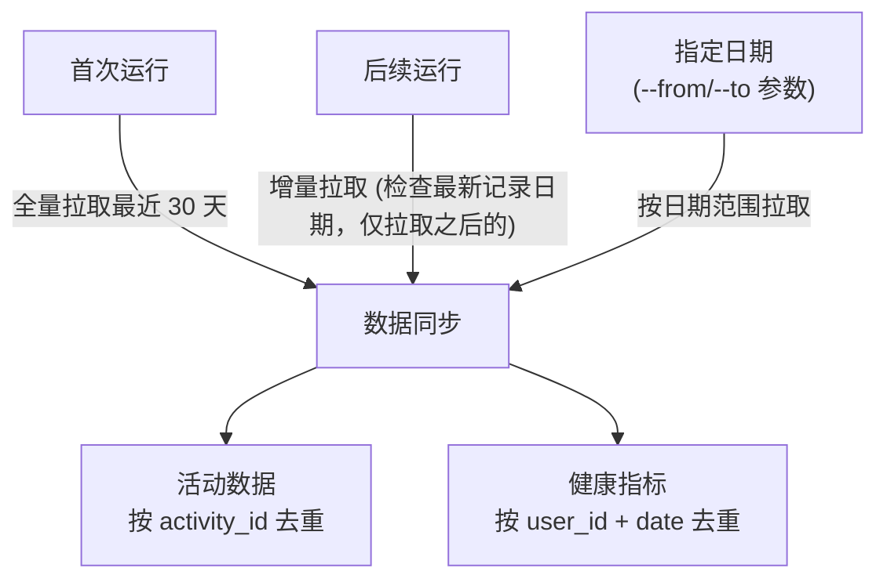

---

### 4.4 存储模块 (`storage.py`)

**职责**: 管理 SQLite 数据库，提供数据持久化与查询接口。

#### 4.4.1 方案选择

garmy 本身提供了 `LocalDB` 模块（`SyncManager` + `HealthDB`），已实现完整的 SQLite 存储方案。设计上有两个选择:

| 方案 | 优势 | 劣势 |
|------|------|------|
| **A: 复用 garmy LocalDB** | 开箱即用，有 `SyncManager` 自动调度 | 表结构固定，定制受限 |
| **B: 自建存储层** | 灵活定制表结构、索引、导出格式 | 需要自行处理去重、增量逻辑 |

**推荐方案**: **A（复用 garmy LocalDB）** + 补充自定义查询/导出层。

理由:
- garmy LocalDB 已覆盖所有指标类型的存储
- `SyncManager` 已处理去重、增量同步、失败重试
- 自建存储层的收益不足以覆盖开发成本
- 自定义查询直接在 SQLite 上写 SQL 即可

#### 4.4.2 garmy LocalDB 表结构（摘要）

```
health_metrics:    用户日级健康指标（睡眠、心率、HRV、步数等，宽表）
timeseries:        时序数据（身体电量曲线、心率曲线、压力曲线等）
activities:        运动活动记录（类型、时长、心率、训练效果等）
sync_status:       同步状态追踪（user_id, date, metric_type, status）
```

#### 4.4.3 补充查询接口

在 garmy LocalDB 之上封装常用查询:

- `get_activities_range(start, end)` — 日期范围活动查询
- `get_activities_by_type(activity_type)` — 按类型统计
- `get_weekly_summary(date)` — 周训练汇总
- `get_health_trend(metric, days)` — 健康指标趋势
- `export_csv(table, path)` — 导出 CSV

---

### 4.5 记忆存储模块 (`memory.py`)

**职责**: 在原始 Garmin 数据之上构建结构化运动知识库，将数据抽象为有语义的"记忆"，支持人工维护与 AI 消费。

#### 4.5.1 设计理念

记忆存储模块解决一个核心问题：**原始数据不等于知识**。Garmin 拉下来的是离散的数值（某天跑了 30 分钟、心率 150），而用户和 AI 需要的是有上下文的认知（"这个月跑量在增加，但恢复质量下降，需要调整强度"）。

记忆模块的核心设计原则：

| 原则 | 说明 |
|------|------|
| **数据升维** | 将原始数值聚合为带语义的摘要和趋势 |
| **人机协同** | 自动生成的部分（摘要、统计）和人工维护的部分（目标、案例）共存 |
| **结构化但可读** | 选用 Markdown + YAML Front Matter，既能被程序解析，也能被人直接阅读和编辑 |
| **时间感知** | 每条记忆带时间戳，支持版本演化和历史追溯 |
| **Git 友好** | 纯文本存储，变更可 diff，可回滚 |
| **AI 原生** | 文件格式天然适合作为 LLM 上下文，也方便 MCP Server 直接读取 |

#### 4.5.2 存储格式选型

| 方案 | 可查询 | 人类可编辑 | Git 友好 | LLM 友好 | 迁移成本 |
|------|:---:|:---:|:---:|:---:|:---:|
| SQLite 新增表 | ✅ | ❌ 需工具 | ❌ 二进制 | ❌ 需转换 | 需 migration |
| JSON 文件 | 部分 | 勉强 | 差（一行一 JSON） | 一般 | 低 |
| **Markdown + YAML Front Matter** | ✅ 按目录+文件名 | ✅ 任意编辑器 | ✅ 纯文本 diff | ✅ 原生格式 | 无 |
| TOML/YAML 纯配置 | ✅ | ✅ | ✅ | 一般 | 低 |

**选定方案: Markdown + YAML Front Matter**

结构示例：
```markdown
---
id: goal-2025-h1
type: goal
category: running
status: active
created: 2025-01-01
target_date: 2025-06-30
metrics:
  target_5k: "19:30"
  target_10k: "41:00"
  weekly_mileage_km: 60
progress:
  last_review: 2025-03-15
  current_5k: "20:15"
  avg_weekly_km: 52
tags: [5k, speed, spring-season]
---

# 2025 上半年目标：5KM 突破 20 分

## 背景
...

## 计划
...

## 里程碑
...
```

#### 4.5.3 记忆分类与组织结构

记忆按照语义分为**两大类、八小类**（新增日报）：

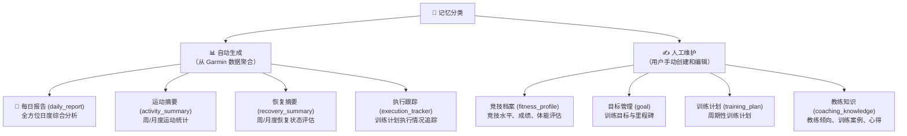

#### 4.5.4 目录结构

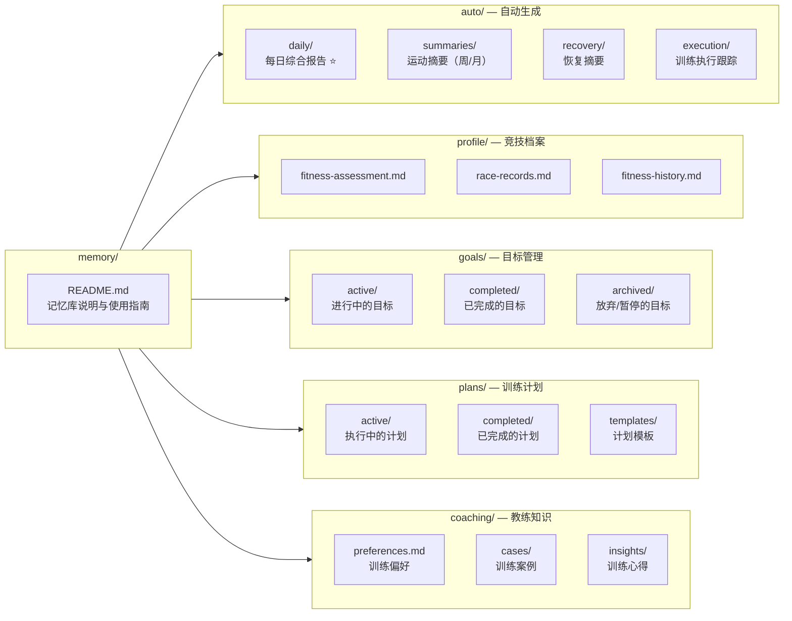

#### 4.5.5 每种记忆的 Front Matter Schema

##### 每日报告 (`auto/daily/`) ⭐

每日报告是本项目最核心的产出——每天早上生成的"训练仪表盘"，也是 AI 对话的默认上下文。

```yaml
---
type: daily_report
date: 2025-06-24
generated: 2025-06-24T08:00:00
version: 1

# ═══════════════════════════════════════
# 一、昨日活动
# ═══════════════════════════════════════
yesterday_activities:
  is_rest_day: false                # 是否为休息日
  is_training_day: true
  sessions:
    - type: running                 # running | cycling | swimming | strength | yoga | other
      name: "轻松跑"
      start_time: "2025-06-23T07:15:00"
      duration_min: 45
      distance_km: 8.5
      avg_pace: "5:18"
      avg_hr: 148
      max_hr: 165
      avg_hr_zone: 2.3              # 平均心率区间
      training_load: 120
      aerobic_te: 3.1               # 有氧训练效果
      anaerobic_te: 0.5             # 无氧训练效果
      calories: 485
      perceived_effort: 3           # RPE 1-10
      notes: "状态不错，后程略感疲劳"
  total_sessions: 1
  total_duration_min: 45
  total_distance_km: 8.5
  total_calories: 485
  total_training_load: 120
  primary_stimulus: aerobic          # aerobic | anaerobic | mixed | recovery
  day_type: easy_run                # easy_run | workout | long_run | race | cross_train | rest

# ═══════════════════════════════════════
# 二、昨夜睡眠
# ═══════════════════════════════════════
last_night_sleep:
  total_hours: 7.3
  deep_sleep_hours: 1.4
  deep_sleep_pct: 19.2
  light_sleep_hours: 3.8
  rem_sleep_hours: 1.6
  rem_sleep_pct: 21.9
  awake_hours: 0.5
  sleep_score: 76
  quality: fair                     # excellent | good | fair | poor
  sleep_start: "2025-06-23T23:15:00"
  sleep_end: "2025-06-24T06:35:00"
  avg_spo2: 96
  avg_respiration: 14.2
  restlessness: 12                  # 辗转次数

# ═══════════════════════════════════════
# 三、今晨状态 (晨起指标)
# ═══════════════════════════════════════
this_morning:
  resting_hr: 51
  resting_hr_vs_baseline: -1        # vs 7日均值
  hrv_ms: 53
  hrv_vs_baseline: 1
  hrv_status: balanced              # balanced | unbalanced | low
  body_battery_morning: 82
  body_battery_charged_pct: 85
  stress_level_morning: 22
  training_readiness_score: 65
  training_readiness_level: moderate # high | moderate | low | recovery

# ═══════════════════════════════════════
# 四、训练负荷与恢复
# ═══════════════════════════════════════
training_load:
  acute_load_7d: 350
  chronic_load_28d: 320
  acwr: 1.09
  acwr_status: optimal              # undertraining | optimal | overreaching | high_risk
  load_trend_7d: stable             # increasing | stable | decreasing
  weekly_volume_km: 38.5
  weekly_volume_vs_target: 64       # 完成目标百分比

recovery:
  overall_score: 70                 # 0-100 综合恢复评分
  level: good                       # excellent | good | fair | poor
  sleep_contribution: 22            # 各维度贡献分 (满分 30)
  hrv_contribution: 20              # (满分 25)
  hr_contribution: 12               # (满分 15)
  stress_contribution: 7            # (满分 10)
  battery_contribution: 7           # (满分 10)
  readiness_contribution: 7         # (满分 10)
  limiting_factor: sleep_duration   # 主要限制因素
  recovery_advice: "睡眠时长略低于 7.5h 目标，今晚争取早睡 30 分钟"

# ═══════════════════════════════════════
# 五、趋势面板 (7 日)
# ═══════════════════════════════════════
trends_7d:
  hrv:
    values: [52, 51, 54, 53, 52, 50, 53]
    slope: 0.1
    direction: stable               # improving | stable | declining
  resting_hr:
    values: [50, 51, 52, 50, 51, 52, 51]
    slope: 0.15
    direction: stable
  sleep_duration:
    values: [7.5, 7.0, 7.8, 6.8, 7.2, 7.1, 7.3]
    slope: -0.05
    direction: slight_decline
  sleep_score:
    values: [80, 75, 82, 72, 78, 74, 76]
    slope: -0.3
    direction: stable
  stress:
    values: [25, 28, 22, 30, 26, 24, 22]
    slope: -0.5
    direction: stable
  body_battery_morning:
    values: [85, 78, 88, 72, 80, 84, 82]
    slope: 0.2
    direction: stable
  training_readiness:
    values: [70, 65, 72, 60, 68, 66, 65]
    slope: -0.4
    direction: stable

# ═══════════════════════════════════════
# 六、异常检测
# ═══════════════════════════════════════
anomalies:
  count: 1
  level: warning                     # normal | warning | critical
  items:
    - type: sleep_duration_low
      severity: warning
      message: "近 7 天睡眠均低于 7.5h 目标，平均 7.2h"
      detail: "睡眠不足可能影响恢复质量，建议今晚 22:30 前入睡"
      related_metric: sleep_duration

# ═══════════════════════════════════════
# 七、今日建议
# ═══════════════════════════════════════
recommendation:
  ready_to_train: true
  training_advice: "适合中等强度训练"
  intensity: moderate                # rest | easy | moderate | hard | very_hard
  suggested_session:
    type: "节奏跑 + 轻松跑"
    description: "热身 2km → 节奏跑 20min (配速 4:40-4:50) → 放松 2km → 轻松跑 20min"
    estimated_duration_min: 55
    estimated_load: 150
    target_hr_zone: [2, 4]          # 心率区间范围
  alternative_session:
    type: "轻松跑"
    description: "如果感觉疲劳，改为 40min 轻松跑 + 核心力量 15min"
    estimated_duration_min: 55
  caution:
    - "睡眠略有不足，注意训练中补水"
    - "今日气温较高 (32°C)，建议清晨或傍晚跑"
  focus_areas: ["技术动作", "核心力量"]
  nutrition_tip: "训练后 30 分钟内补充蛋白质 + 碳水 (比例 1:3)"
  mindset_tip: "今天的目标不是跑快，而是跑得舒服——信任过程"

# ═══════════════════════════════════════
# 八、目标进度
# ═══════════════════════════════════════
goal_progress:
  active_goals:
    - id: 2025-h1-5k-sub20
      name: "5KM 突破 20 分"
      target: "19:30"
      current_best: "20:15"
      gap: "0:45"
      weeks_remaining: 2
      on_track: true
      weekly_volume_target: 60
      weekly_volume_actual: 38.5

# ═══════════════════════════════════════
# 九、近期摘要
# ═══════════════════════════════════════
recent_context:
  last_7_days:
    activities: 5
    total_km: 38.5
    total_duration_min: 210
    avg_recovery_score: 72
    avg_sleep_hours: 7.2
  streak:
    running_days: 3
    current_streak_weeks: 8        # 连续训练周数

tags: [daily, 2025-06-24, running, easy-run]
---
```

日报正文 (Markdown) 结构：

```markdown
# 📰 每日训练报告 — 2025年6月24日 周二

> 生成时间: 08:00 | 数据覆盖: 昨日活动 + 昨夜睡眠 + 今晨状态

## 🏃 昨日训练回顾

**训练**: 轻松跑 8.5km / 45min / 配速 5:18
**评价**: 完成质量好，心率控制在有氧区间，后程略感疲劳属正常范围

## 😴 睡眠恢复

**睡眠时长**: 7h18min | 评分 76 (良好)
**深睡**: 1h24min (19%) | **REM**: 1h36min (22%)
⚠️ 近 7 天均低于 7.5h 目标，建议今晚提前入睡

## 📊 今晨状态

| 指标 | 数值 | 状态 |
|------|------|------|
| 静息心率 | 51 bpm | 🟢 正常 |
| HRV | 53 ms | 🟢 平衡 |
| 身体电量 | 82 | 🟢 充足 |
| 训练准备 | 65 | 🟡 中等 |

## 📈 负荷状态

**ACWR**: 1.09 — 🟢 最优区间 (0.8-1.3)
**趋势**: 负荷稳定，无过度训练风险

## 🎯 今日训练建议

**推荐**: 节奏跑 + 轻松跑 (55min / 预估负荷 150)
- 热身 2km → 节奏跑 20min (配速 4:40-4:50) → 放松 + 轻松跑
- 备选: 如果感觉疲劳 → 40min 轻松跑 + 核心力量

## ⚠️ 注意事项

1. 睡眠略不足，训练中注意补水
2. 今日高温 32°C，建议清晨或傍晚进行

## 🏁 目标进度

**5K 突破 20 分**: 当前 20:15 / 目标 19:30 / 剩余 2 周 — 🟢 进度正常

---

*本报告由 rundown daily 自动生成*
```

##### 运动摘要 (`auto/summaries/`)

```yaml
---
type: activity_summary
period: weekly              # weekly | monthly
start_date: 2025-06-16
end_date: 2025-06-22
week_number: 25
year: 2025
generated: 2025-06-23T08:00:00

# 聚合统计 (自动生成)
stats:
  total_activities: 5
  total_duration_min: 245
  total_distance_km: 52.3
  total_calories: 2850

# 按运动类型分布
by_type:
  running:
    count: 3
    duration_min: 150
    distance_km: 38.5
    avg_pace: "5:12"
    avg_hr: 152
    training_load: 320
  cycling:
    count: 1
    duration_min: 60
    distance_km: 13.8
  strength:
    count: 1
    duration_min: 35

# 训练负荷趋势
training_load:
  total: 450
  acute: 380                      # 近 7 天
  chronic: 340                    # 近 28 天
  ratio: 1.12                     # ACWR
  status: optimal                 # undertraining | optimal | overreaching

# 个人记录 (本周内)
personal_records: []

# 与前一周对比
vs_last_week:
  duration_change_pct: 12.5
  distance_change_pct: 8.3
  load_change_pct: 15.2

tags: [running, cycling, strength]
---
```

##### 恢复摘要 (`auto/recovery/`)

```yaml
---
type: recovery_summary
period: weekly
start_date: 2025-06-16
end_date: 2025-06-22
week_number: 25
generated: 2025-06-23T08:00:00

# 睡眠 (自动聚合)
sleep:
  avg_duration_hours: 7.2
  avg_deep_sleep_pct: 18.5
  avg_rem_sleep_pct: 22.1
  avg_sleep_score: 78
  trend: stable                   # improving | stable | declining

# HRV (自动聚合)
hrv:
  weekly_avg_ms: 52
  last_night_avg_ms: 48
  status: balanced                # balanced | unbalanced | low
  trend: slight_decline

# 静息心率
resting_hr:
  avg_bpm: 52
  trend: stable

# 压力
stress:
  avg_daily: 28
  trend: stable

# 身体电量
body_battery:
  avg_morning: 85
  avg_evening_drain: 62

# 综合恢复评分 (自动计算)
recovery_score:
  overall: 72                     # 0-100
  level: good                     # poor | fair | good | excellent
  limiting_factor: sleep_duration # 主要限制因素

# 训练准备
training_readiness:
  avg_score: 68
  trend: stable

tags: [recovery, sleep-score-78, hrv-balanced]
---
```

##### 执行跟踪 (`auto/execution/`)

```yaml
---
type: execution_tracker
plan_id: 2025-spring-5k-plan      # 关联的训练计划
plan_name: 2025 春季 5K 训练计划
tracking_period:
  start: 2025-03-01
  end: 2025-05-31

# 执行统计 (自动生成)
execution:
  total_sessions_planned: 48
  total_sessions_completed: 42
  completion_rate_pct: 87.5
  missed_sessions: 4
  extra_sessions: 2
  on_time_pct: 78
  avg_session_quality: 7.5        # 1-10 自评

# 各阶段完成情况
phases:
  - name: 基础期
    weeks: [1, 2, 3, 4]
    planned: 16
    completed: 15
    notes: "顺利完成，第 3 周因出差少跑一次"
  - name: 强度期
    weeks: [5, 6, 7, 8]
    planned: 16
    completed: 14
    notes: "第 6 周膝盖不适减量"
  - name:  taper 期
    weeks: [9, 10, 11, 12]
    planned: 16
    completed: 13
    notes: "减量期执行良好"

# 关键指标变化
key_metrics_delta:
  vo2max_estimate: {from: 48, to: 52}
  threshold_pace: {from: "4:45", to: "4:25"}
  resting_hr: {from: 55, to: 50}

# 偏差分析
deviations:
  - date: 2025-03-18
    planned: "间歇跑 8×400m"
    actual: "轻松跑 5km"
    reason: "膝盖不适"
    impact: minor

updated: 2025-06-01
tags: [5k-plan, spring-2025, execution]
---
```

##### 竞技档案 (`profile/`)

```yaml
---
type: fitness_profile
profile_type: assessment           # assessment | race_record | history
updated: 2025-06-15

# 当前竞技水平
current_level:
  vo2max_estimate: 52
  threshold_pace_per_km: "4:25"
  threshold_hr: 172
  max_hr: 192
  resting_hr: 50
  running_economy: good

# 各距离最佳成绩
personal_bests:
  5k: {time: "20:15", date: 2025-04-10, race: "本地公园跑"}
  10k: {time: "42:30", date: 2025-03-22, race: "春季路跑赛"}
  half_marathon: {time: "1:38:00", date: 2024-11-15, race: "城市半马"}
  marathon: {time: null, date: null, race: null}

# 体能评估
fitness_assessment:
  endurance: strong
  speed: moderate
  strength: moderate
  flexibility: weak
  recovery_capacity: moderate

# 优劣势
strengths: [有氧基础扎实, 配速控制稳定, 恢复意识好]
weaknesses: [速度耐力不足, 核心力量偏弱, 柔韧性差]

tags: [fitness-profile, 2025]
---
```

##### 目标 (`goals/`)

```yaml
---
type: goal
goal_type: time_based              # time_based | distance_based | frequency | habit
category: running
status: active                     # active | completed | abandoned
priority: high                     # high | medium | low
created: 2025-01-01
target_date: 2025-06-30
review_cycle: weekly               # daily | weekly | monthly

# 量化目标
metrics:
  target_5k_time: "19:30"
  current_5k_time: "20:15"
  gap: "0:45"

# 过程指标
process_goals:
  - name: 周跑量
    target: 60km
    current: "52km (avg)"
  - name: 每周强度课
    target: 2次
    current: "1.5次 (avg)"
  - name: 每周力量训练
    target: 2次
    current: "1次 (avg)"

# 子目标/里程碑
milestones:
  - date: 2025-02-01
    description: "5K 稳定在 21:00 以内"
    achieved: true
  - date: 2025-04-01
    description: "5K 突破 20:30"
    achieved: true
  - date: 2025-06-01
    description: "达成 19:30"
    achieved: false

# 关联
linked_plan: 2025-spring-5k-plan
linked_cases: [case-peak-performance]

tags: [5k, sub20, spring-2025]
---
```

##### 训练计划 (`plans/`)

```yaml
---
type: training_plan
plan_type: periodized               # periodized | linear | polarized | custom
category: running
status: active
created: 2025-02-15
start_date: 2025-03-01
end_date: 2025-05-31
duration_weeks: 12

# 目标赛事/事件
target_event:
  name: 春季路跑赛 5K
  date: 2025-06-01
  goal_time: "19:30"

# 计划结构
structure:
  phases:
    - name: 基础期
      weeks: 4
      focus: 有氧耐力 + 力量基础
      weekly_volume_km: [45, 48, 50, 50]
    - name: 强度期
      weeks: 4
      focus: 阈值 + VO2max
      weekly_volume_km: [50, 52, 55, 50]
    - name: 竞赛期
      weeks: 3
      focus: 速度耐力 + 比赛节奏
      weekly_volume_km: [48, 45, 40]
    - name: 减量期
      weeks: 1
      focus: 恢复 + 保持状态
      weekly_volume_km: [30]

# 周训练模式
weekly_pattern:
  Monday: 休息或交叉训练
  Tuesday: 间歇/速度课
  Wednesday: 轻松跑 8-10km
  Thursday: 节奏跑/阈值课
  Friday: 休息
  Saturday: 长距离跑
  Sunday: 恢复跑或完全休息

# 教练风格
coaching_style:
  intensity_distribution: polarized  # polarized | pyramidal | threshold
  key_workouts_per_week: 2
  recovery_emphasis: high
  strength_integration: moderate

tags: [5k, spring-2025, periodized, polarized]
---
```

##### 教练知识 — 偏好 (`coaching/preferences.md`)

```yaml
---
type: coaching_preference
updated: 2025-06-15

# 训练偏好
training_preferences:
  preferred_workouts: [间歇跑, 节奏跑, 法特莱克]
  disliked_workouts: [长距离慢跑, 跑步机]
  preferred_time: morning
  preferred_terrain: [公路, 田径场]
  weather_tolerance: moderate        # low | moderate | high

# 教练风格倾向
coaching_style_preference:
  autonomy: high                     # 自主性需求
  data_driven: high                  # 数据驱动程度
  flexibility: high                  # 灵活性需求
  external_motivation: low           # 外部激励需求
  preferred_feedback: data_based     # emotional | data_based | mixed

# 伤病史
injury_history:
  - type: 髂胫束综合征
    period: 2024-06
    recovery_weeks: 4
    trigger: 跑量增加过快
    lessons: 周跑量增幅不超过 10%

# 训练哲学
training_philosophy: |
  相信数据驱动的训练方法。偏好极化训练分布（80% 低强度 + 20% 高强度）。
  重视恢复质量胜过训练量。认为力量训练是预防伤病的关键。

tags: [preferences, coaching-style]
---
```

##### 教练知识 — 案例 (`coaching/cases/`)

```yaml
---
type: case_study
case_id: case-peak-performance
category: peak_performance          # injury_recovery | peak_performance | plateau_break | nutrition | mental
created: 2025-04-20
related_goal: 2025-h1-5k-sub20
related_plan: 2025-spring-5k-plan

# 案例背景
context:
  athlete_level: intermediate
  starting_point: "5K 21:30"
  target: "5K 19:30"
  timeframe: 12周

# 关键做法
key_practices:
  - 极化训练，80% 低强度
  - 每周 2 次力量训练
  - 每 4 周降量周
  - 睡眠优先策略（保证 7.5h+）

# 关键数据变化
data_timeline:
  - week: 0
    vo2max: 48
    threshold_pace: "4:45"
    5k_time: "21:30"
  - week: 4
    vo2max: 49
    threshold_pace: "4:40"
    5k_time: null
  - week: 8
    vo2max: 51
    threshold_pace: "4:30"
    5k_time: "20:30"
  - week: 12
    vo2max: 52
    threshold_pace: "4:25"
    5k_time: "19:45"

# 经验教训
lessons_learned: |
  1. 极化训练对中级跑者非常有效
  2. 力量训练对跑步经济性有显著贡献
  3. 睡眠是恢复质量的基石
  4. 降量周后往往能跑出最佳成绩

# 可复用性
reusability: high
applicable_scenarios: [5K-10K 备赛, 中级跑者突破, 时间有限的高效训练]

tags: [peak-performance, 5k, polarized-training, case-study]
---
```

#### 4.5.6 记忆生成策略

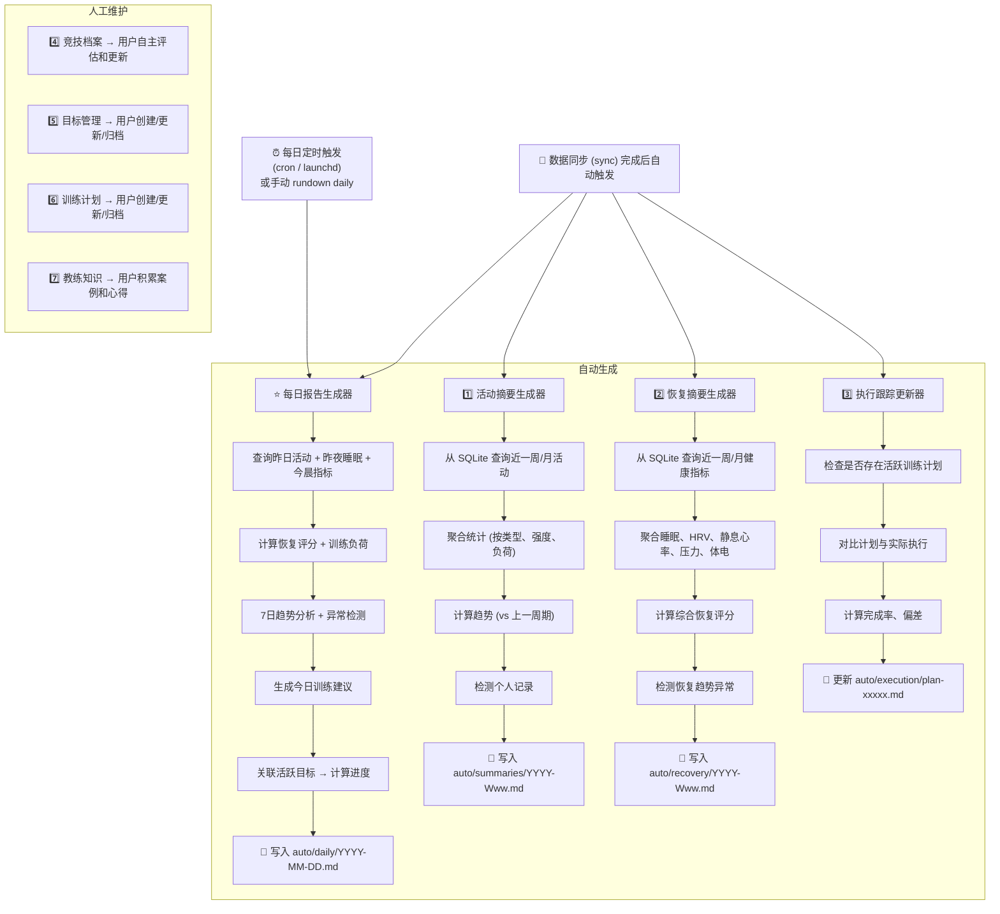

#### 4.5.7 记忆的索引与查询

为了方便程序检索，每个子目录下的 `index.md` 自动维护该目录下所有记忆的索引：

```markdown
---
type: index
category: summaries
updated: 2025-06-23T08:00:00
entries:
  - file: 2025-W25.md
    period: weekly
    start_date: 2025-06-16
    title: "第 25 周运动摘要"
    stats: {activities: 5, duration_min: 245, distance_km: 52.3}
  - file: 2025-W26.md
    period: weekly
    ...
  - file: 2025-06.md
    period: monthly
    ...
---

# 运动摘要索引
...
```

`memory.py` 模块提供以下查询接口：

| 方法 | 说明 |
|------|------|
| `MemoryStore.list_by_type(type, **filters)` | 按类型列出记忆 |
| `MemoryStore.get(id)` | 获取单条记忆 |
| `MemoryStore.get_latest(type)` | 获取最新一条某类型记忆 |
| `MemoryStore.query(tags, date_range)` | 按标签和日期范围查询 |
| `MemoryStore.get_index(category)` | 获取某分类的索引 |
| `MemoryStore.generate_summaries(db_path)` | 从 SQLite 生成摘要记忆（自动） |
| `MemoryStore.create_goal(data)` | 创建新目标（交互式或参数式） |
| `MemoryStore.link(from_id, to_id)` | 建立记忆之间的关联 |

#### 4.5.8 记忆与数据的关系

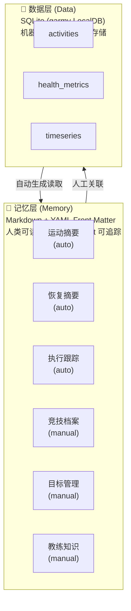

**关键区分**：
- **数据层**存储"事实"（某天跑步 5km，心率 150）
- **记忆层**存储"认知"（本周跑量 35km 比上周增加 10%，恢复评分 72 处于良好区间，按计划执行率 88%）
- 记忆层的自动部分由数据层聚合生成，人工部分由用户维护
- MCP Server 应优先消费记忆层（更紧凑、更有语义），需要细节时再穿透到数据层

#### 4.5.9 MemoryStore 类设计

`memory.py` 模块的核心是 `MemoryStore` 类，它采用**分层架构**组织代码：

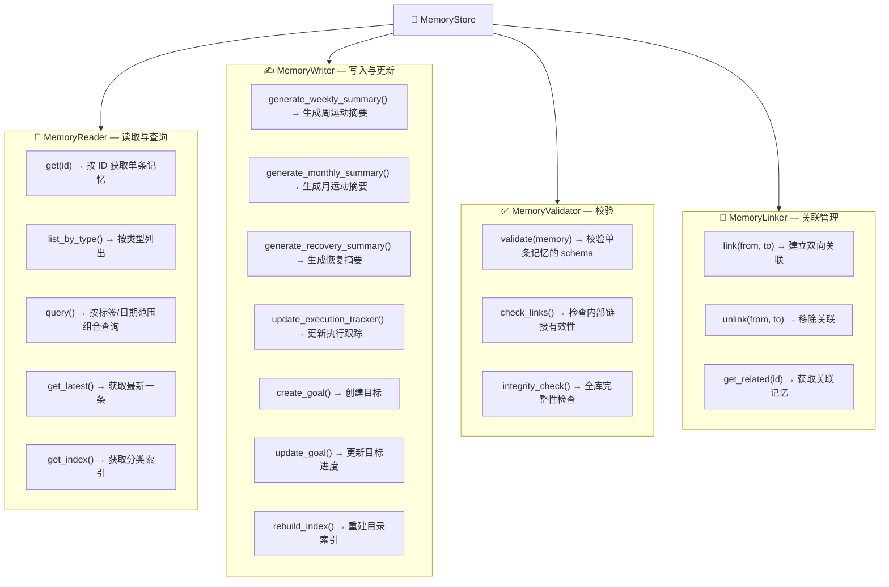

**MemoryStore 核心 API**：

| 分类 | 方法 | 参数 | 返回 |
|------|------|------|------|
| 读取 | `get(id)` | `id: str` | `Memory \| None` |
| 读取 | `list_by_type(type, **filters)` | `type: MemoryType, status, date_range, tags` | `List[Memory]` |
| 读取 | `get_latest(type)` | `type: MemoryType` | `Memory \| None` |
| 读取 | `query(tags, date_range)` | `tags: List[str], date_range: Tuple[date, date]` | `List[Memory]` |
| 读取 | `search(keyword)` | `keyword: str` (搜索正文) | `List[Memory]` |
| 生成 | `generate_summaries(db, period)` | `db: HealthDB, period: weekly\|monthly` | `List[Path]` (生成的文件) |
| 生成 | `generate_recovery(db)` | `db: HealthDB` | `Path` |
| 生成 | `update_execution(db)` | `db: HealthDB` | `List[Path]` |
| 写入 | `create_goal(data)` | `data: dict` | `Memory` |
| 写入 | `update_goal(id, data)` | `id: str, data: dict` | `Memory` |
| 写入 | `archive_goal(id)` | `id: str` | `None` |
| 写入 | `create_case(data)` | `data: dict` | `Memory` |
| 关联 | `link(from_id, to_id)` | `from_id: str, to_id: str` | `None` |
| 关联 | `get_related(id)` | `id: str` | `List[Memory]` |

#### 4.5.10 聚合算法设计

自动生成记忆的核心是将 SQLite 中的原始数据转化为有语义的摘要。以下定义关键聚合算法：

##### 每日报告聚合 ⭐

```
输入: target_date (默认今天), HealthDB, MemoryStore (读取活跃目标)
输出: auto/daily/YYYY-MM-DD.md

算法步骤:
1. 查询昨日活动
   yesterday = target_date - 1day
   activities = db.get_activities(user_id, yesterday, yesterday)
   
   if no activities:
     is_rest_day = true
     活动部分标记为休息日
   else:
     逐条提取: type, duration, distance, avg_hr, max_hr,
              avg_pace, training_load, aerobic_te, anaerobic_te
     汇总: total_duration, total_distance, total_load
     判定: primary_stimulus (有氧/无氧/混合/恢复)
     判定: day_type (轻松跑/强度课/长距离/比赛/交叉训练/休息)

2. 查询昨夜睡眠
   sleep_data = db.get_health_metrics(user_id, target_date) → sleep
   解析: total_hours, deep/light/rem/awake 分布,
         sleep_score, avg_spo2, avg_respiration, restlessness
   判定: quality (excellent >= 85, good >= 70, fair >= 50, poor < 50)

3. 查询今晨状态
   morning_metrics = db.get_health_metrics(user_id, target_date)
   提取: resting_hr, hrv_ms, hrv_status, body_battery,
         stress_level, training_readiness
   对比基线 (7日均值):
     hr_vs_baseline = resting_hr - avg(近7天resting_hr)
     hrv_vs_baseline = hrv - avg(近7天hrv)

4. 计算训练负荷
   acute_load = sum(近7天 training_load)
   chronic_load = sum(近28天 training_load) / 4
   acwr = acute_load / chronic_load
   acwr_status:
     < 0.8  → undertraining
     0.8-1.3 → optimal
     1.3-1.5 → overreaching
     > 1.5  → high_risk
   趋势: compare acute_load vs 7天前

5. 计算综合恢复评分 (同恢复摘要的加权算法)
   recovery_score = weighted_score(sleep, hrv, hr, stress, battery, readiness)
   识别 limiting_factor = argmin(各维度归一化得分)

6. 7日趋势分析
   for each metric in [hrv, resting_hr, sleep_duration, sleep_score,
                        stress, body_battery, training_readiness]:
     查询近 7 天时序
     线性回归计算 slope
     判定方向:
       slope > +threshold_positive → improving
       slope < -threshold_negative → declining
       else → stable
     特别关注: 变化加速 (slope 绝对值增大中)

7. 异常检测
   规则引擎扫描 (详见 4.5.10 恢复趋势异常检测):
     - HRV 持续下降 (7d slope < -2.0)
     - 静息心率持续上升 (7d slope > 3.0)
     - 睡眠不足累积 (7d avg < 6.5h)
     - 身体电量入不敷出
     - 训练准备连续 3 天下降
     - ACWR 进入高风险区间
   
   anomaly_count = count(触发规则)
   判定级别:
     >= 3 条 → critical
     1-2 条 → warning
     0 条   → normal

8. 生成今日训练建议
   输入: recovery_score, acwr_status, anomalies, active_goals,
         user_preferences (从 coaching/preferences.md)
   
   判定 ready_to_train:
     recovery_level >= fair AND acwr_status != high_risk → true
   
   判定 intensity:
     recovery=excellent + acwr=optimal   → hard
     recovery>=good + acwr=optimal       → moderate
     recovery=fair or acwr=overreaching  → easy
     recovery=poor or acwr=high_risk     → rest
   
   生成建议课表:
     根据 intensity 和 user_preferences 的 preferred_workouts
     匹配预设课表模板库
     输出: 主建议 + 备选方案
   
   生成注意事项:
     - 睡眠不足 → 提醒补水 + 降低强度
     - 高温天 → 建议调整训练时间
     - 连续训练日 → 提醒恢复重要性
     - 强度课 → 提醒热身和放松

9. 目标进度追踪
   加载所有 active 状态的目标
   对每个目标:
     - 计算当前最佳 vs 目标差距
     - 计算周跑量完成率
     - 计算剩余时间和所需配速
     - 判定是否 on_track
     如果 off_track: 给出调整建议

10. 渲染 Markdown + YAML Front Matter → 写入 auto/daily/YYYY-MM-DD.md
```

##### 运动摘要聚合

```
输入: date_range (start, end), HealthDB
输出: auto/summaries/YYYY-Www.md 或 YYYY-MM.md

算法步骤:
1. 查询活动数据
   activities = db.get_activities(user_id, start, end)
   
2. 按类型分组统计
   for each activity_type:
     count, total_duration, total_distance, avg_hr, total_load
   
3. 计算训练负荷
   acute_load  = sum(近7天 training_load)
   chronic_load = sum(近28天 training_load) / 4
   acwr = acute_load / chronic_load
   status = classify_acwr(acwr):
     <0.8  → undertraining
     0.8-1.3 → optimal
     1.3-1.5 → overreaching
     >1.5  → high_risk
   
4. 趋势对比
   prev_period = 同长度上一周期
   compute_pct_change(当前, 上一周期) for: duration, distance, load
   
5. 个人记录检测
   for each activity_type:
     if distance > best_distance[activity_type]:
       record new PR
     if pace > best_pace[activity_type]:
       record new PR
   
6. 渲染 Markdown + YAML Front Matter → 写入文件
```

##### 恢复摘要聚合

```
输入: date_range (start, end), HealthDB
输出: auto/recovery/YYYY-Www.md

算法步骤:
1. 查询健康指标
   sleep_data = db.get_health_metrics(user_id, start, end) → sleep 字段
   hrv_data   = db.get_health_metrics(...) → hrv 字段
   hr_data    = db.get_health_metrics(...) → resting_hr 字段
   stress_data = db.get_health_metrics(...) → stress 字段
   battery_data = db.get_timeseries(user_id, BODY_BATTERY, ...)
   readiness_data = db.get_health_metrics(...) → training_readiness 字段
   
2. 各维度聚合
   sleep: avg_duration, avg_deep_pct, avg_rem_pct, avg_score
   hrv: weekly_avg, last_night_avg, status_mode(每周状态众数)
   resting_hr: avg, max, min
   stress: avg_daily_level
   body_battery: avg_morning_level, avg_evening_drain
   readiness: avg_score
   
3. 趋势判定 (对比上一周期)
   for each metric:
     if abs(change) < threshold_small → stable
     elif direction is positive → improving
     else → declining
   
4. 综合恢复评分 (加权计算)
   score = (
     sleep_score_weight * sleep_normalized +
     hrv_weight * hrv_normalized +
     resting_hr_weight * hr_normalized_inverse +
     stress_weight * stress_normalized_inverse +
     body_battery_weight * battery_normalized +
     readiness_weight * readiness_normalized
   ) * 100 / total_weight
   
   各维度权重:
   - 睡眠: 30%
   - HRV: 25%
   - 静息心率: 15%
   - 压力: 10%
   - 身体电量: 10%
   - 训练准备: 10%
   
5. 识别限制因素
   limiting_factor = argmin(各维度归一化得分)
   
6. 渲染 Markdown + YAML Front Matter → 写入文件
```

##### 执行跟踪更新

```
输入: active_plan (训练计划 memory), HealthDB
输出: 更新 auto/execution/plan-{plan_id}.md

算法步骤:
1. 解析训练计划
   plan = load_memory(plan_id)
   structure = plan.front_matter.structure
   
2. 查询对应时期的实际活动
   activities = db.get_activities(user_id, plan.start_date, plan.end_date)
   
3. 按周比对
   for each week in plan.structure.phases:
     planned_sessions = count_sessions(week)
     actual_sessions = filter(activities, week.date_range)
     
     completed = count_matched(planned, actual)
     missed = planned_sessions - completed
     extra = len(actual_sessions) - completed
     
4. 偏差分析
   for each week:
     for each missed_session:
       check if alternative_activity exists → 替代训练
       check if rest_day_reason exists → 主动休息
       otherwise → 缺训
     record deviation with reason if available
   
5. 关键指标变化
   baseline = metrics_at(plan.start_date)
   current = metrics_at(plan.end_date)
   delta = compute_deltas(baseline, current)
   
6. 更新 Front Matter + 追加本周执行记录到正文 → 写回文件
```

##### 恢复趋势异常检测

```
输入: 近 7 天恢复指标序列
输出: 异常标记 + 建议

检测规则:
1. HRV 持续下降
   if hrv_7d_slope < -2.0 and hrv_status == "unbalanced":
     flag "HRV 持续下降，注意恢复"

2. 静息心率持续上升
   if resting_hr_7d_slope > 3.0:
     flag "静息心率上升趋势，可能存在过度训练"

3. 睡眠不足累积
   if sleep_7d_avg < 6.5 and sleep_trend == "declining":
     flag "睡眠不足累积 (均 < 6.5h)，优先补充睡眠"

4. 身体电量入不敷出
   if avg_daily_drain > avg_daily_charge * 0.8:
     flag "身体电量消耗偏高，考虑减量"

5. 综合判定
   anomaly_count = count(flags)
   if anomaly_count >= 3:
     level = "critical"
   elif anomaly_count >= 1:
     level = "warning"
   else:
     level = "normal"
```

#### 4.5.11 记忆生命周期管理

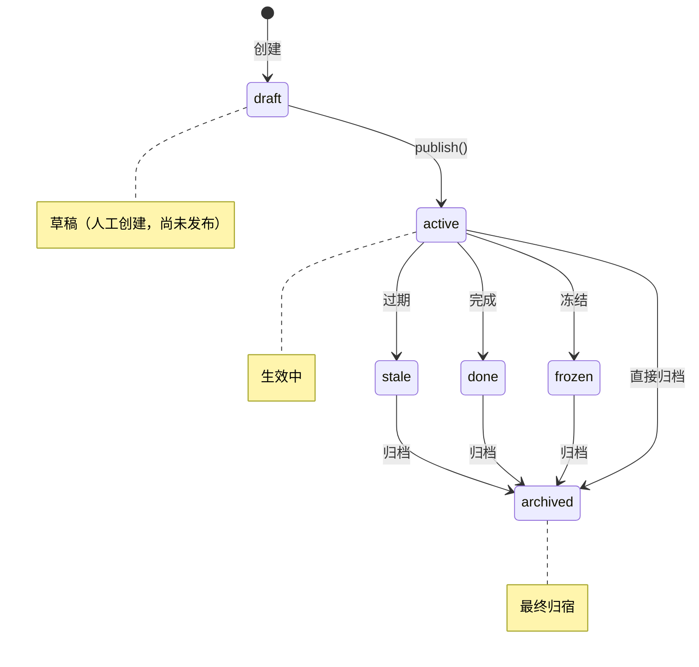

不同记忆类型的状态流转：
- 日报 (daily):     每日生成即 active，保留 30 天，超过 30 天自动 stale，超过 90 天归档
- 目标 (goal):     draft → active → done/archived
- 训练计划 (plan):  draft → active → done/archived
- 案例 (case):     draft → active → archived (一般不删除，长期保留)
- 摘要 (summary):  自动生成即 active，旧周期自动 stale
- 执行跟踪:        关联的计划 active 时自动 active，计划完结时 done
- 档案 (profile):  始终 active（唯一当前版本），旧版自动归档
- 偏好 (preference): 始终 active（唯一当前版本）

自动归档策略：
- 日报 (daily): 保留最近 30 天，31-90 天移至 archive/daily/，90 天后压缩归档
- 摘要 (summary): 保留最近 12 周 + 最近 6 个月，更早的自动移至 archive/
- 执行跟踪: 计划完成后保留 4 周，之后压缩为最终报告
- 完成的目标/计划: 保留在 completed/ 目录，不自动归档

#### 4.5.12 记忆的完整性与一致性保障

```
校验层次:

Level 1 — Schema 校验 (写入时)
  - Front Matter 必填字段检查
  - 字段类型检查 (string/int/date/list)
  - 枚举值检查 (status: active|completed|abandoned)
  - 日期格式检查 (YYYY-MM-DD)
  - 内部链接有效性 (linked_plan, linked_cases 指向的文件是否存在)

Level 2 — 语义一致性校验 (sync 后)
  - 摘要中的 stats 与 SQLite 原始数据交叉校验
  - 目标进度 (current_5k_time) 与最新比赛成绩一致性
  - 执行跟踪完成率与实际活动数一致性
  - 关联的双向性 (A link B → B 的 linked_from 包含 A)

Level 3 — 完整性校验 (定期)
  - 所有 auto/ 目录文件在 index.md 中是否有条目
  - index.md 中的条目是否指向存在的文件
  - active 状态的目标/计划是否有对应的执行跟踪文件
  - 孤立的关联链接 (指向已归档/删除的文件)

校验触发时机:
- 写入时: Level 1
- sync 命令完成后: Level 1 + Level 2
- rundown memory check 命令: Level 1 + Level 2 + Level 3
```

---

### 4.6 CLI 入口模块 (`main.py`)

**职责**: 命令行参数解析，流程编排。

**命令设计**:

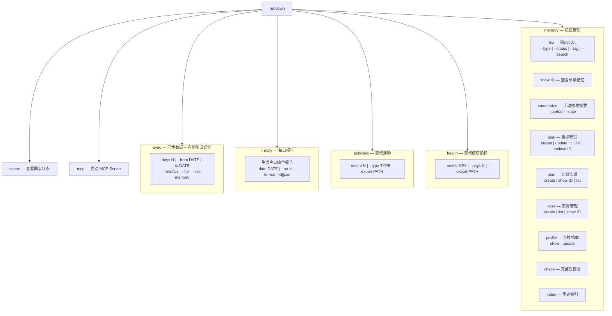

**使用示例**:
```bash
# ═══ 日常使用 ═══

# 每天早上运行：同步数据 + 生成今日日报
rundown sync

# 单独生成/查看今日日报（不拉取新数据）
rundown daily

# 查看指定日期的日报
rundown daily --date 2025-06-23

# 输出 JSON 格式日报（供程序消费）
rundown daily --format json

# 首次同步最近 30 天全部数据（数据 + 自动生成记忆摘要）
rundown sync --full

# 仅同步数据，不生成记忆
rundown sync --no-memory

# ═══ 记忆管理 ═══

# 手动触发本周摘要生成
rundown memory summarize --period weekly

# 查看记忆列表
rundown memory list --type activity_summary
rundown memory list --tag 5k --status active

# 搜索记忆
rundown memory list --search "间歇跑"

# 创建训练目标
rundown memory goal create

# 更新目标进度
rundown memory goal update 2025-h1-5k-sub20

# 查看训练计划及执行情况
rundown memory plan show 2025-spring-5k-plan

# 完整性检查
rundown memory check

# 导出活动数据
rundown activities --recent 50 --type running --export running.csv

# 启动 MCP Server 对接 Claude Desktop
rundown mcp
```

---

## 5. 数据流

### 5.1 整体数据流

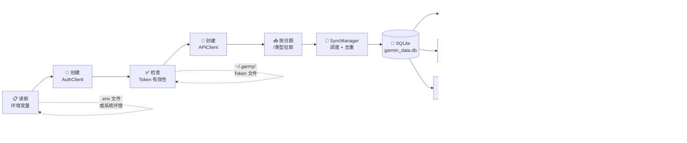

### 5.2 sync 命令执行流程

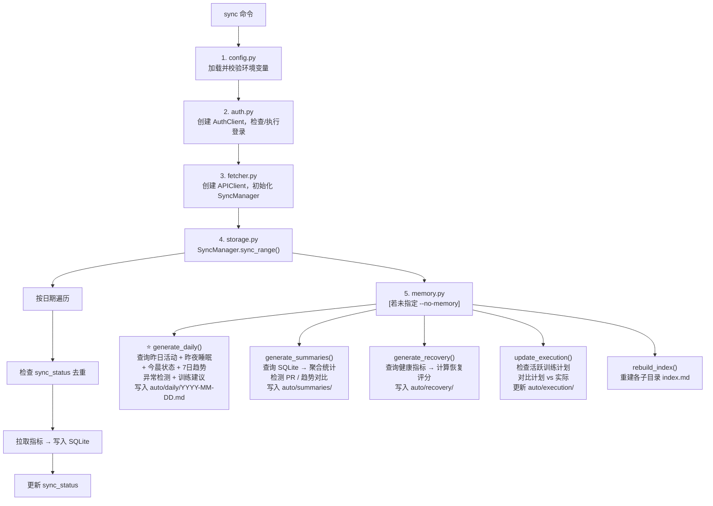

### 5.3 daily 命令执行流程 ⭐

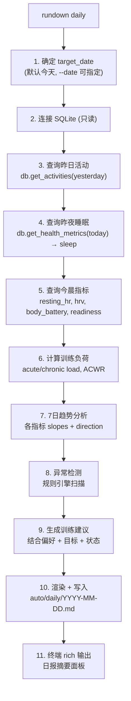

### 5.4 memory 子命令执行流程

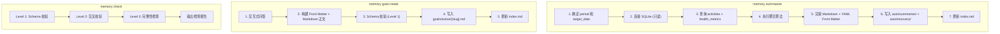

---

## 6. 目录结构

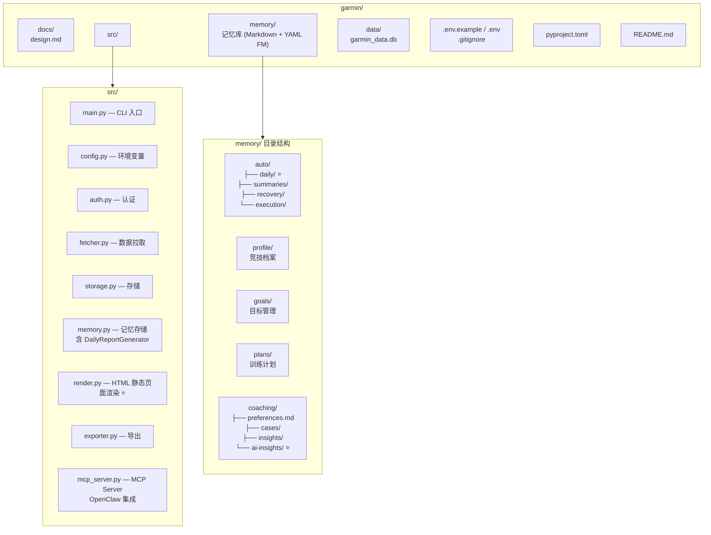

---

## 7. 依赖清单

```toml
[project]
dependencies = [
    "garmy[all]>=1.0.0",       # 核心: Garmin API + LocalDB + MCP
    "python-dotenv>=1.0.0",    # .env 文件加载
    "pyyaml>=6.0",             # YAML Front Matter 解析
    "rich>=13.0.0",            # 终端美化输出（表格、进度条）
]

[project.optional-dependencies]
dev = [
    "pytest>=8.0.0",
    "pytest-mock>=3.12.0",
]
```

**依赖说明**:
| 依赖 | 用途 |
|------|------|
| `garmy[all]` | Garmin API 认证、数据拉取、SQLite 持久化、MCP Server（安装全部可选依赖） |
| `python-dotenv` | 从 `.env` 文件加载环境变量，避免密码出现在命令行历史中 |
| `pyyaml` | 解析和生成记忆文件的 YAML Front Matter |
| `rich` | 终端表格渲染（活动列表、健康指标）、同步进度条、记忆内容美化展示 |

---

## 8. 关键设计决策

### 8.1 安全策略

- **密码不入 Git**: `.env` 加入 `.gitignore`，提供 `.env.example` 模板
- **日志脱敏**: 邮箱地址在日志中做部分遮蔽（`j***@example.com`）
- **Token 本地加密**: 依赖 garmy 的 `~/.garmy/` 文件权限（0600），如需进一步增强可考虑 keyring 集成
- **HTTPS 强制**: garmy 内部所有请求均为 HTTPS

### 8.2 容错设计

- **网络重试**: garmy 内置 3 次重试 + 指数退避（可配置 `GARMY_RETRIES`）
- **部分失败继续**: 某天某指标拉取失败不中断整体同步，记录到 `sync_status` 表
- **API 限流应对**: garmy 对 429 (Too Many Requests) 自动重试
- **优雅降级**: 某个指标 API 不可用时，跳过而非崩溃

### 8.3 扩展性预留

- **中国区切换**: 仅需设置 `GARMIN_DOMAIN=garmin.cn`
- **多用户支持**: 当前单用户设计，但 LocalDB 表结构已包含 `user_id` 字段，天然支持未来多用户
- **MCP Server**: garmy 已内置 MCP Server，启动 `rundown mcp` 即可对接 Claude Desktop
- **自定义指标**: 可继承 garmy `BaseMetric` 注册自定义指标
- **记忆扩展**: 新增记忆类型只需：(1) 定义 YAML Front Matter schema，(2) 创建目录，(3) 注册到 MemoryStore 的 type 枚举
- **多语言记忆**: Front Matter 字段与 Markdown 正文分离，正文可自由使用任何语言
- **记忆同步**: memory/ 目录天然可通过 Git 跨设备同步，也可通过 iCloud/Dropbox 等云盘同步

### 8.4 AI 教练对话：MCP Server + OpenClaw 集成 ⭐

本项目的最终用户界面不是命令行，而是 **AI 对话**。用户每天早上通过 OpenClaw（或 Claude Desktop）打开 AI 教练，AI 自动读取今日日报，展开智能训练对话。

#### 8.4.1 设计理念

```
用户不需要记住 CLI 命令，只需要像和真人教练聊天一样：

用户: "我今天状态怎么样？该跑什么？"
AI:   "早上好！今早 HRV 53ms 很稳定，身体电量 82% 充足。
      昨晚睡了 7.3h 略少但还可以。今天适合中等强度，
      建议跑 55min 节奏跑+轻松跑的组合……"

用户: "最近一周恢复趋势如何？"
AI:   "从日报来看，你的 HRV 近 7 天保持稳定，
      但睡眠时长有轻微下降趋势（7.5→7.1h），需要注意..."

用户: "帮我把今天的训练调到明天，今天改为休息"
AI:   "好的，已更新今天的建议为休息日。明天训练量不变。"
```

#### 8.4.2 AI 对话架构

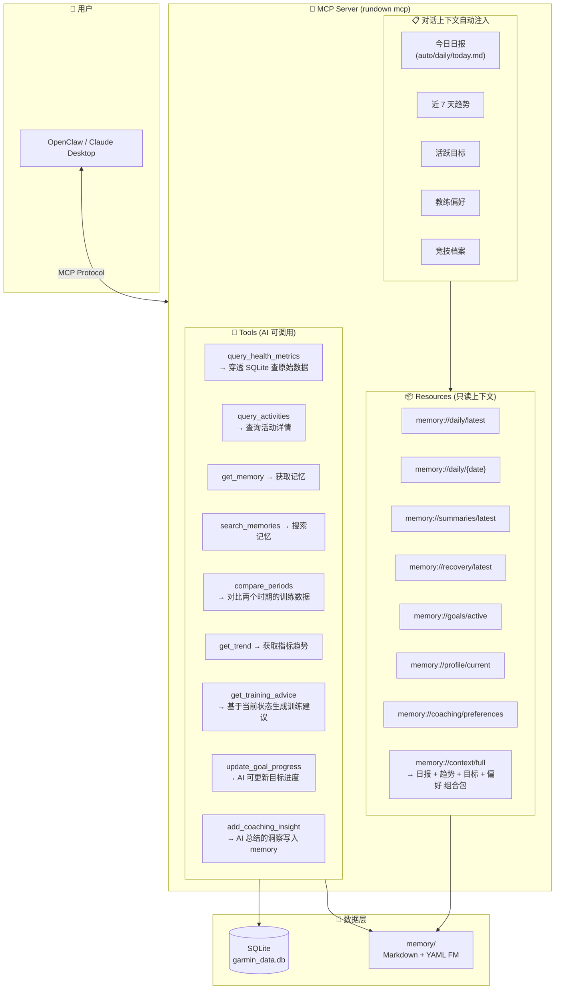

#### 8.4.3 对话上下文注入策略

当用户打开 AI 对话时，MCP Server 自动将以下内容作为 System Prompt 上下文注入：

**第一优先级（必定注入）**：
- 今日日报全文（`auto/daily/YYYY-MM-DD.md`）
- 如果没有今日日报 → 自动触发生成 → 再注入

**第二优先级（根据对话长度选择性注入）**：
- 近 7 天趋势数据（从日报的 trends_7d 提取）
- 活跃目标摘要（仅 YAML Front Matter）
- 教练偏好摘要

**第三优先级（AI 按需通过 Tools 获取）**：
- 历史活动详情（`query_activities`）
- 具体日期的健康指标（`query_health_metrics`）
- 历史对比（`compare_periods`）
- 过往案例（`search_memories --type case_study`）

#### 8.4.4 AI 对话的典型场景

| 场景 | 用户说 | AI 做什么 |
|------|--------|----------|
| **晨间简报** | "早上好" / "今天状态怎么样" | 读取今日日报 → 用自然语言总结状态 → 给出训练建议 |
| **训练规划** | "这周怎么安排训练" | 读取活跃目标 + 训练计划 + 本周已跑 → 建议本周安排 |
| **状态查询** | "最近恢复得怎么样" | 读取近 7 天日报 → 总结恢复趋势 → 指出关注点 |
| **历史回顾** | "上个月跑量多少" | `query_activities` → 聚合统计 → 对比本月 |
| **目标追踪** | "5K 目标能达成吗" | 读取目标 + 最近成绩 → 评估差距 → 给建议 |
| **赛后分析** | "分析一下昨天的比赛" | `query_activities` 比赛详情 → 逐维度分析 → 写入 case |
| **调整计划** | "下周减量，帮我调整" | 更新训练计划 → 重新计算 → 写入 memory |
| **知识积累** | "这次备赛有什么经验" | AI 总结 → `add_coaching_insight` → 写入 coaching/cases/ |

#### 8.4.5 AI 可写入的记忆

AI 对话不仅是消费数据，还会**产生新的记忆**（通过 `add_coaching_insight` 工具）：

```
对话 → AI 分析 → 总结洞察 → 写入 coaching/insights/

示例文件: coaching/insights/2025-06-24-ai-insight.md
---
type: ai_insight
date: 2025-06-24
source: ai_coach
session_topics: [恢复评估, 训练调整]
confidence: high
---

# AI 教练洞察 — 2025-06-24

## 发现
近 7 天睡眠时长呈下降趋势（7.5h → 7.1h），同时 HRV 从 54ms 降至 50ms。
两者相关性显著，建议优先改善睡眠而非调整训练量。

## 建议
1. 本周保持现有训练量，不增加强度
2. 目标入睡时间提前至 22:30
3. 3 天后复评 HRV 趋势
```

这些 AI 洞察会被后续对话引用，形成**持续积累的教练知识**。

#### 8.4.6 OpenClaw 配置

**1. 安装与启动 MCP Server**

```bash
# 启动 MCP Server（默认端口 8765）
rundown mcp

# 指定端口
rundown mcp --port 9876

# 后台运行
rundown mcp --daemon
```

**2. OpenClaw MCP 配置** (`~/.openclaw/mcp.json` 或 OpenClaw Settings)

```json
{
  "mcpServers": {
    "garmin-coach": {
      "command": "rundown",
      "args": ["mcp"],
      "env": {
        "GARMIN_EMAIL": "${GARMIN_EMAIL}",
        "GARMIN_PASSWORD": "${GARMIN_PASSWORD}"
      },
      "description": "Garmin 运动数据 + AI 教练",
      "autoApprove": ["query_health_metrics", "query_activities",
                       "get_memory", "search_memories",
                       "get_trend", "get_training_advice"]
    }
  }
}
```

**3. OpenClaw 自定义 Agent 配置**

在 OpenClaw 中创建一个 "AI 跑步教练" Agent，使用以下 System Prompt 模板：

```markdown
你是一位专业的跑步教练 AI。每天早上用户会和你对话，
你会自动读取他们的 Garmin 数据日报来提供建议。

## 你的能力
- 读取每日训练报告、健康指标、训练负荷
- 分析恢复状态、检测过度训练风险
- 根据用户目标和偏好制定训练计划
- 回答训练相关的问题（配速、心率、营养、伤病预防等）
- 记录训练洞察到用户的知识库

## 对话原则
1. 数据优先：用具体数字说话，不泛泛而谈
2. 个性化：结合用户的竞技水平、偏好和伤病史
3. 安全第一：怀疑过度训练时主动建议降量
4. 鼓励为主：用积极的语言，关注进步而非差距
5. 记录洞察：有价值的发现主动写入 coaching/insights/

## 当前用户画像
（从 memory/profile/ 和 coaching/preferences.md 自动加载）

## 今日数据
（从 memory://daily/latest 自动加载）
```

#### 8.4.7 完整的早晨使用流程

```
07:00  系统 cron 触发: rundown sync
       ↓ 拉取 Garmin 新数据 → 写入 SQLite
       ↓ 自动生成今日日报 → auto/daily/2025-06-24.md
       
08:00  用户起床，打开 OpenClaw，选择 "AI 跑步教练"
       ↓ OpenClaw 连接 rundown MCP Server
       ↓ MCP Server 自动注入今日日报 + 用户画像

08:01  用户: "早上好，今天状态怎么样？"
       AI:  (已读取日报全文)
       "早上好 ☀️ 昨晚睡了 7.3h，评分 76，今早 HRV 53ms 稳定，
        身体电量 82%，状态还不错 👌
        
        ACWR 1.09 在最优区间，恢复评分 70 良好。
        昨天跑了 8.5km 轻松跑，完成质量不错。
        
        今天建议: 节奏跑+轻松跑 55min，强度中等。
        备选方案: 如果感觉疲劳就改为轻松跑+核心力量。
        
        ⚠️ 注意: 睡眠略低于目标，今天高温 32°C 建议晨跑或夜跑。

        5K 目标还有 2 周，当前 20:15 → 目标 19:30，进度正常 ✅
        
        准备好了就开始今天的训练吧！💪"

08:03  用户: "昨天节奏跑感觉右膝有点紧，要不要调一下？"
       AI:  (查阅 coaching/preferences.md 伤病史 → 发现髂胫束史)
       "右膝不适需要注意。你之前有过髂胫束问题 (2024.06)，
        建议今天改为: 轻松跑 30min + 泡沫轴放松 15min + 臀中肌激活训练。
        如果明天膝盖仍有感觉，休息一天。
        我把这个调整记录到你的偏好里。"
       → AI 调用 add_coaching_insight 写入 knee-watch 标记

08:05  用户去训练。AI 已经完成了:
       ✅ 读取今日全部数据
       ✅ 评估状态 + 给出建议
       ✅ 结合伤病史调整计划
       ✅ 记录新的洞察
```

#### 8.4.8 安全与隐私

- MCP Server 仅监听本地 `127.0.0.1`，不暴露到网络
- 密码通过环境变量注入，MCP Server 不存储明文密码
- AI 生成的洞察标记 `source: ai_coach`，与人工内容区分
- OpenClaw 的 `autoApprove` 仅对只读工具开放，写入类工具（如 `add_coaching_insight`）需用户确认

---

## 9. 实现路线图

| 阶段 | 内容 | 优先级 |
|------|------|:---:|
| **Phase 1** | 项目骨架：目录结构、pyproject.toml、.env.example、.gitignore、memory/ 各子目录初始化（含 daily/） | P0 |
| **Phase 2** | 认证模块：config.py + auth.py，实现环境变量登录 | P0 |
| **Phase 3** | 数据拉取：fetcher.py，对接活动列表 + 全部健康指标 | P0 |
| **Phase 4** | 存储模块：storage.py，初始化 LocalDB + SyncManager，封装查询接口 | P0 |
| **Phase 5** | CLI 基础命令：main.py，sync / daily / activities / health / status 命令 | P0 |
| **Phase 6** | 记忆核心：memory.py — MemoryStore 类、MemoryReader、MemoryWriter、MemoryValidator、MemoryLinker | P0 |
| **Phase 7** | 记忆生成器：**日报生成器**、运动摘要聚合、恢复摘要聚合、执行跟踪更新、异常检测 | P0 |
| **Phase 8** | 日报 CLI：`rundown daily` 命令，支持 --date / --format json / --no-ai，rich 美化终端输出 | P0 |
| **Phase 9** | 记忆 CLI：memory 子命令（list / show / summarize / goal / plan / case / profile / check / index） | P0 |
| **Phase 9.5** | HTML 日报渲染：render.py — Markdown + YAML → 静态 HTML，绿黑色风格，output/YYYY-MM-DD.html | P0 |
| **Phase 10** | MCP Server 核心：mcp 子命令，Resources 暴露（daily/latest、context/full）、Tools 暴露（查询+分析） | P0 |
| **Phase 11** | AI 教练对话：对话上下文注入、System Prompt 模板、AI 可写入洞察（add_coaching_insight）、OpenClaw 配置生成 | P0 |
| **Phase 12** | 记忆模板：各类型记忆的 Markdown 模板，`memory goal create` / `memory plan create` 交互式问答 | P1 |
| **Phase 13** | 导出功能：exporter.py，CSV / JSON 导出 | P1 |
| **Phase 14** | 定时任务：cron/launchd 配置模板，每日自动 sync + 生成日报 | P1 |
| **Phase 15** | 测试与文档：单元测试（聚合算法、schema 校验）、README 完善、memory/README.md 使用指南、OpenClaw 配置文档 | P1 |

---

## 10. 风险与注意事项

1. **Garmin API 无官方开放**: 所有第三方库均通过逆向工程实现，Garmin 可能随时修改认证流程或 API 端点。garmy 的维护者需要及时跟进适配。
2. **OAuth Consumer Key 可能失效**: garmy 内置了从 Garmin 移动端应用提取的 OAuth 凭据，若失效可通过 `GARMY_OAUTH_CONSUMER_KEY` / `GARMY_OAUTH_CONSUMER_SECRET` 环境变量覆盖。
3. **请求频率限制**: Garmin 对 API 有非官方的频率限制（约每分钟 30-60 次），全量同步时需要注意控制并发度。garmy 的 `Concurrency.MAX_WORKERS` 默认为 50，实际使用建议调低到 5-10。
4. **数据完整性**: 某些指标需要特定设备支持（如 HRV 需要支持心率变异的设备），无设备则对应 API 返回空数据，属正常现象。
5. **记忆层一致性**: 记忆层的自动部分（摘要、恢复、执行跟踪）依赖于数据层 SQLite 的完整性。若 sync 不完整（如某天拉取失败），生成的摘要可能偏差。建议每次 sync 后自动运行 `memory check` 做交叉校验。
6. **人工与自动的边界**: 自动生成的记忆文件不应手动编辑（会被下次 sync 覆盖），人工维护的文件（goals/plans/coaching/profile）不受 sync 影响。这一边界通过目录结构强制执行（auto/ vs 其他目录）。
7. **AI 幻觉风险**: AI 教练生成的训练建议和洞察可能不准确。所有 AI 生成内容标记 `source: ai_coach`，与人工内容明确区分；训练相关建议仅供参考，实际执行需用户自行判断；AI 洞察需人工审核后才能归档为正式案例。
8. **日报自动化依赖**: 日报生成依赖每日定时触发 sync。若某天未运行 sync，日报数据可能缺失。建议配置 cron/launchd 定时任务确保每日执行。

---

## 11. 实现备忘（garmy 2.0 适配）

实际实现过程中发现的 garmy 2.0 与文档预期的差异，以及对应的解决方案。

### 11.1 API 差异速查

| 模块 | 预期 (v1.0 文档) | 实际 (v2.0) | 影响 |
|------|-----------------|-------------|------|
| `AuthClient.login()` | `mfa_callback=` | `prompt_mfa=` + `return_on_mfa=True` | auth.py |
| `AuthClient.is_authenticated` | 方法 `.is_authenticated()` | property `.is_authenticated` | auth.py |
| `SyncManager.__init__()` | 接受 `HealthDB` 实例 | 接受 `db_path: Path`（路径字符串） | storage.py |
| `SyncManager.sync_range()` | 需先 `initialize()` | 同，`initialize(email, password)` 内部创建 APIClient | storage.py |
| `HealthDB.get_activities()` | `(user_id)` 单参数 | `(user_id, start_date, end_date)` 日期范围 | storage.py, memory.py |
| `HealthDB.get_health_metrics()` | `(user_id, date)` 单日 | `(user_id, start_date, end_date)` 日期范围，返回列表 | storage.py, memory.py |
| `APIClient.__init__()` | `(auth_client=auth)` | 同，支持 `domain, timeout, retries` 可选参数 | fetcher.py |
| `MetricAccessor.list()` | 复杂筛选 | `.list(days=N)` 简化接口 | fetcher.py |
| `user_id` 来源 | 无明确说明 | `APIClient.profile['id']` → int | main.py |

### 11.2 数据库 Schema（实际）

garmy 2.0 `daily_health_metrics` 表为**单行宽表**，每行包含当天全部健康指标：

```
user_id               INTEGER    Garmin 用户 ID
metric_date           DATE       日期
── 活动 ──
total_steps           INTEGER    步数
step_goal             INTEGER    步数目标
total_distance_meters FLOAT      全天移动距离
total_calories        INTEGER    总消耗卡路里
active_calories       INTEGER    活动消耗
bmr_calories          INTEGER    基础代谢
── 心率 ──
resting_heart_rate    INTEGER    静息心率
max_heart_rate        INTEGER    最大心率
min_heart_rate        INTEGER    最低心率
── 压力 ──
avg_stress_level      INTEGER    平均压力
max_stress_level      INTEGER    最大压力
── 身体电量 ──
body_battery_high     INTEGER    最高电量
body_battery_low      INTEGER    最低电量
── 睡眠 ──
sleep_duration_hours  FLOAT      总时长
deep_sleep_hours      FLOAT      深睡时长
light_sleep_hours     FLOAT      浅睡时长
rem_sleep_hours       FLOAT      REM 时长
deep_sleep_percentage FLOAT      深睡占比
rem_sleep_percentage  FLOAT      REM 占比
── HRV ──
hrv_weekly_avg        FLOAT      7 天均值
hrv_last_night_avg    FLOAT      昨晚均值
hrv_status            TEXT       状态 (BALANCED/UNBALANCED/LOW)
── 训练准备 ──
training_readiness_score  INTEGER 评分
training_readiness_level  TEXT    等级 (HIGH/MODERATE/LOW)
```

`activities` 表：

```
user_id            INTEGER
activity_id        VARCHAR      Garmin 活动 ID
activity_date      DATE         活动日期
activity_name      VARCHAR      活动名称（含类型信息如"厦门市 跑步"）
duration_seconds   INTEGER      持续秒数
avg_heart_rate     INTEGER      平均心率
training_load      FLOAT        训练负荷
start_time         VARCHAR      开始时间
```

### 11.3 关键实现决策

1. **`_get_user_id()`**: 通过 `APIClient(auth_client=auth.client).profile['id']` 获取，返回 `int`。该值在所有 storage/memory 查询中使用。
2. **SyncManager 初始化**: `SyncManager(db_path=str(self._db_path))` 传入路径字符串，SyncManager 内部自行管理 HealthDB 连接。
3. **日报数据流**: `generate_daily_report()` 首先将 raw health data 通过 `_summarize_sleep()` / `_summarize_morning()` 转换为标准化字段名，后续计算均使用标准化名称以保证一致性。
4. **字段映射**: memory.py 中所有数据读取方法均支持新旧两种字段名（如 `resting_hr` / `resting_heart_rate`），确保兼容性。
5. **HTML 渲染**: `src/render.py` 为独立模块，不依赖 garmy。输入为日报 Memory 对象，输出为自包含 HTML 文件到 `output/YYYY-MM-DD.html`。
