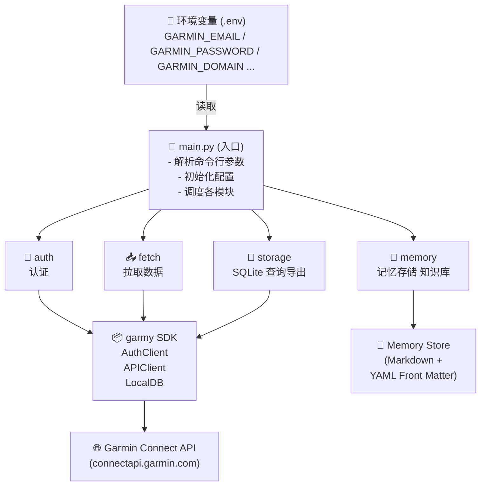

# 设计方案 — 3. 整体架构

> 属于 [设计方案索引](../design.md) · 版本 v3.0 · 2026-06-24

---

## 3. 整体架构

```mermaid
graph TD
    ENV["🔧 环境变量 (.env)<br/>GARMIN_EMAIL / GARMIN_PASSWORD / GARMIN_DOMAIN ..."]
    MAIN["🚀 main.py (入口)<br/>- 解析命令行参数<br/>- 初始化配置<br/>- 调度各模块"]
    AUTH["🔐 auth<br/>认证"]
    FETCH["📥 fetch<br/>拉取数据"]
    STORAGE["💾 storage<br/>SQLite 查询导出"]
    MEMORY["🧠 memory<br/>记忆存储 知识库"]
    GARMY["📦 garmy SDK<br/>AuthClient<br/>APIClient<br/>LocalDB"]
    MEMSTORE["📝 Memory Store<br/>(Markdown +<br/>YAML Front Matter)"]
    API["🌐 Garmin Connect API<br/>(connectapi.garmin.com)"]

    ENV -->|"读取"| MAIN
    MAIN --> AUTH
    MAIN --> FETCH
    MAIN --> STORAGE
    MAIN --> MEMORY
    AUTH --> GARMY
    FETCH --> GARMY
    STORAGE --> GARMY
    MEMORY --> MEMSTORE
    GARMY --> API
```

---
