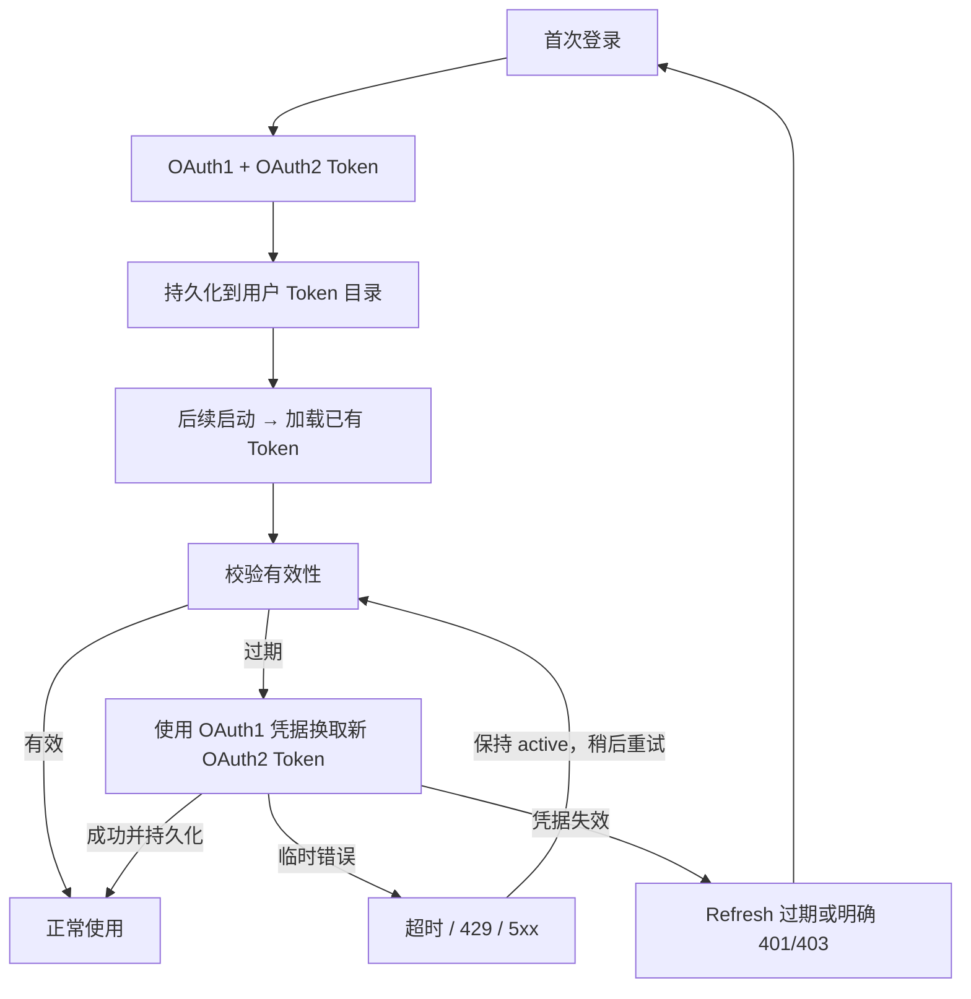
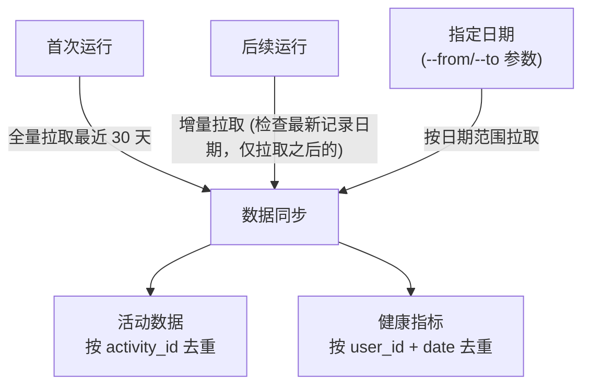

# 设计方案 — 4. 模块设计

> 属于 [设计方案索引](../design.md) · 版本 v3.6 · 2026-07-29

---

## 4. 模块设计

### 4.1 配置模块 (`config.py`)

**职责**: 统一管理所有配置项，从环境变量读取。

**环境变量设计**:

| 变量名 | 必填 | 默认值 | 说明 |
|--------|:---:|--------|------|
| `GARMIN_EMAIL` | ✅ | — | Garmin Connect 国际区登录邮箱 |
| `GARMIN_PASSWORD` | ✅ | — | Garmin Connect 登录密码 |
| `GARMIN_DOMAIN` | ❌ | `garmin.com` | API 域名（国际区默认，中国区用 `garmin.cn`）|
| `GARMIN_TOKEN_DIR` | ❌ | `~/.garmy` | Token 持久化目录 |
| `GARMIN_DB_PATH` | ❌ | `./data/garmin_data.db` | SQLite 数据库路径 |
| `GARMIN_SYNC_DAYS` | ❌ | `30` | 默认同步最近 N 天的数据 |
| `GARMIN_LOG_LEVEL` | ❌ | `INFO` | 日志级别 |
| `NEURUN_MEMORY_DIR` | ❌ | `./memory` | 记忆存储根目录（目标、档案、日报等） |
| `NEURUN_HOME` | ❌ | (当前目录) | 数据工作目录，设后所有相对路径基于此解析 |
| `NEURUN_DATA_DIR` | Web | `./data` | Web 多用户持久化目录 |
| `NEURUN_INVITE_CODES_FILE` | Web | `<data_dir>/invite-codes.json` | 邀请码 JSON 路径；相对 `data_dir` 固定基于项目根解析，不随 cwd 漂移，部署时建议显式设绝对路径 |
| `NEURUN_ENABLE_ADMIN_TOOLS` | 本地 MCP | `false` | 仅 stdio/localhost 启用邀请码管理员 tools；公网 Web 禁止 |
| `NEURUN_SYNC_MAX_CONCURRENCY` | Web | `4` | 单进程同时执行的不同用户同步数 |
| `NEURUN_SYNC_MAX_PENDING` | Web | `100` | 单进程执行中与排队中的不同用户总数 |

**设计要点**:
- 使用 `python-dotenv` 支持 `.env` 文件（方便本地开发）
- 环境变量优先级: 系统环境变量 > 项目 .env > 部署环境文件（ECS `/etc/neurun/neurun.env`）> ~/.neurun/.env > 默认值
- `get_config()` 输出三条 INFO 诊断日志（`配置探测[原始环境]` / `配置探测[部署环境文件]` / `配置探测[解析结果]`），用于排查邀请码等路径解析被哪一层覆盖
- 支持 `NEURUN_HOME` 环境变量（须为实际环境变量，不可写在 .env 中），设后 .env 及所有相对路径（db_path、memory_dir）均基于此目录解析
- 支持 `NEURUN_MEMORY_DIR` 覆盖记忆存储目录，支持多目录共享同一份记忆
- 密码类敏感信息绝不打印到日志
- 启动时校验必填变量，缺失则明确报错退出
- Web 邀请码默认随 `data_dir` 持久化；显式相对路径在 `NEURUN_HOME` 模式下基于该目录解析

---

### 4.2 认证模块 (`auth.py`)

**职责**: 封装 garmy `AuthClient`，处理登录与 Token 生命周期。

**设计要点**:
- 创建 `AuthClient(domain=config.domain, token_dir=config.token_dir)`
- 检查已有 Token 是否有效（garmy 自动从用户专属 Token 目录加载）
- Access Token 到期且 Refresh Token 仍有效时，显式调用 `refresh_tokens()`；刷新成功后由 garmy
  写回 OAuth2 Token 文件，再继续 profile 和同步请求
- 只有 Refresh Token 不可用或刷新明确返回 401/403 时才视为认证失效；超时、429、5xx 和响应
  解析异常向上抛为可重试同步错误，不得回退到空密码 SSO 登录或标记连接 `expired`
- CLI 仅在没有可用 Token 且配置了账号密码时调用 `login(email, password)`；Web 后台不保存密码，
  因此没有可刷新凭据时直接要求用户重新绑定
- 支持 MFA：若账号开启了二次验证，通过回调函数交互式输入
- 提供 `get_auth_headers()` 供 API 调用使用（garmy 内部自动处理）
- 日志中脱敏显示邮箱（如 `ga***@gmail.com`）

**Token 生命周期**（garmy 自动管理）:



#### 4.2.1 Coros 分域自动鉴权

Coros Training Hub 没有 Refresh Token。`CorosReloginCredentialStore` 在用户明确同意后，将
`account`、`region` 和可直接重放的 MD5 密码摘要整体用 Fernet 加密，保存为当前用户
`tokens/coros-relogin.enc`；服务级 `NEURUN_COROS_CREDENTIAL_KEY` 只从部署环境读取。
`CorosAuth.run_with_training_relogin()` 包装活动、每日分析和 HRV 请求：仅当响应明确包含
`result=1019` 或 Access Token 无效时，在按 Token 文件路径隔离的 singleflight 锁内重登；成功后
原子写回 `coros-auth.json` 并只重试原请求一次。临时网络、429 和 5xx 保持 `active` 与密文；
凭据被拒绝或重试后仍失效时删除密文并进入人工重新授权。

`CorosMobileCredentialStore` 将 Coros App 返回的 Mobile 登录重放载荷加密保存为
`tokens/coros-mobile-relogin.enc`。`CorosAuth.run_with_sleep_relogin()` 只在 Mobile 明确返回
`1019` 时从当前用户目录解密并重放，写回 `mobile_access_token` 后重试一次；它不把载荷写入
`coros-auth.json`，也不调用 coros-mcp 的全局认证持久化。两个认证域使用不同锁、密文和删除入口。

---

### 4.3 数据获取模块 (`fetcher.py`)

**职责**: 封装 garmy `APIClient` 的 Metrics 系统，提供统一的数据拉取接口。

#### 4.3.1 运动活动数据

使用 `api_client.metrics.get("activities")` 获取 `ActivitiesAccessor`:

| 方法 | 说明 | 使用场景 |
|------|------|---------|
| `.list(limit, start)` | 分页获取活动列表 | 初次全量同步 |
| `.get_recent(days, limit)` | 获取最近 N 天活动 | 日常增量同步 |
| `.get_by_type(type)` | 按运动类型筛选 | 专项分析（跑步/骑行） |
| `.raw(limit, start)` | 获取原始 JSON | 调试/自定义解析 |

**活动数据字段**（`ActivitySummary` dataclass 提供 50+ 字段）:
- 基础: `activity_id`, `activity_name`, `activity_type_name`, `start_time_local`, `duration`
- 心率: `average_hr`, `max_hr`, `heart_rate_range`
- 训练效果: `aerobic_training_effect`, `anaerobic_training_effect`, `activity_training_load`
- 压力: `avg_stress`, `start_stress`, `end_stress`, `difference_stress`
- 体电: `difference_body_battery`
- 呼吸: `avg_respiration_rate`, `min_respiration_rate`, `max_respiration_rate`
- 其他: `lap_count`, `has_polyline`（GPS 轨迹）, `device_id`, `privacy_type`

#### 4.3.2 日常健康指标

通过 `api_client.metrics[key].get(date)` / `.list(days=N)` 拉取:

| 指标 Key | 数据类型 | 关键字段 |
|----------|---------|---------|
| `sleep` | 睡眠 | 总时长、深睡/浅睡/REM 占比、平均 SpO2、睡眠评分 |
| `heart_rate` | 心率 | 静息心率、最大心率、全天连续读数 |
| `hrv` | HRV | 7天均值、昨晚均值、HRV 状态 |
| `stress` | 压力 | 平均/最大压力水平、全天连续读数 |
| `body_battery` | 身体电量 | 全天充放电曲线、最高/最低值 |
| `steps` | 步数 | 日步数、目标、距离、周统计 |
| `calories` | 卡路里 | 总消耗、活动消耗、BMR、目标 |
| `respiration` | 呼吸 | 日均/夜间呼吸率、全天连续读数 |
| `training_readiness` | 训练准备 | 综合评分、各维度贡献因子 |
| `daily_summary` | 日综合 | 以上指标的综合日摘要 |

#### 4.3.3 数据拉取策略



---

### 4.4 存储模块 (`storage.py`)

**职责**: 管理 SQLite 数据库，提供数据持久化与查询接口。

#### 4.4.1 方案选择

garmy 本身提供了 `LocalDB` 模块（`SyncManager` + `HealthDB`），已实现完整的 SQLite 存储方案。设计上有两个选择:

| 方案 | 优势 | 劣势 |
|------|------|------|
| **A: 复用 garmy LocalDB** | 开箱即用，有 `SyncManager` 自动调度 | 表结构固定，定制受限 |
| **B: 自建存储层** | 灵活定制表结构、索引、导出格式 | 需要自行处理去重、增量逻辑 |

**推荐方案**: **A（复用 garmy LocalDB）** + 补充自定义查询/导出层。

理由:
- garmy LocalDB 已覆盖所有指标类型的存储
- `SyncManager` 已处理去重、增量同步、失败重试
- 自建存储层的收益不足以覆盖开发成本
- 自定义查询直接在 SQLite 上写 SQL 即可
- 初始化 `SyncManager` 时通过 `_ensure_progress_reporter_compat()` 补齐旧版
  `ProgressReporter.warning()`；这样活动分页失败时保留原始警告，不会被兼容性
  `AttributeError` 覆盖

#### 4.4.2 garmy LocalDB 表结构（摘要）

```
health_metrics:    用户日级健康指标（睡眠、心率、HRV、步数等，宽表）
timeseries:        时序数据（身体电量曲线、心率曲线、压力曲线等）
activities:        运动活动记录（类型、时长、心率、训练效果等）
sync_status:       同步状态追踪（user_id, date, metric_type, status）
```

`activities` 补充 `activity_type` 列，持久化统一 Provider 的标准化运动类型（如
`running`、`running_indoor`、`cycling`）。升级前记录该列为空时，同步日历允许以
`activity_name` 中的“跑步”或 `run` 作为跑步记录兼容判断。

#### 4.4.3 补充查询接口

在 garmy LocalDB 之上封装常用查询:

- `get_activities_range(start, end)` — 日期范围活动查询
- `get_activities_by_type(activity_type)` — 按类型统计
- `get_weekly_summary(date)` — 周训练汇总
- `get_health_trend(metric, days)` — 健康指标趋势
- `mark_sync_calendar_range(user_id, start, end, status)` — 在 `sync_status` 中维护 neurun 自有的逐日范围标记
- `get_sync_calendar(user_id, start, end)` — 聚合范围标记、garmy 指标状态及本地活动/健康数据，返回逐日同步日历
- `export_csv(table, path)` — 导出 CSV
- `close()` — 显式关闭 garmy `HealthDB`/`SyncManager` 的 SQLAlchemy engine 与注入的 HTTP 客户端

同步日历复用 `sync_status` 表，使用保留的 `metric_type=neurun_provider_sync` 标识一次
Provider 范围同步对某一天的整体覆盖。它不替代 garmy 的各指标状态；查询时按以下优先级聚合：

1. 晚于今天时固定为 `future`；
2. 当天存在至少一条跑步记录时固定为 `synced`；
3. neurun 范围标记为 `pending`、`failed` 或 `completed`；
4. 旧的 garmy 指标级状态；
5. 已存在的其他活动或日健康数据；
6. 无任何记录时为 `unsynced`。

跑步记录优先级高于整体标记和健康指标状态，因为日历的核心目标是回答“跑步运动记录
是否已同步”。API 同时返回 `activity_count` 和 `running_count`，前端可展示跑步数量，
而健康指标失败仍可在后续详情能力中单独表达，不得覆盖跑步记录已存在这一事实。

对旧数据库，只有本地数据但没有范围完成标记的日期显示为 `partial`，不得把休息日自动
推断为未同步；从本版本开始，成功同步的空数据日也会通过范围标记显示为 `synced`。

---

### 4.5 记忆存储模块 (`memory.py`)

**职责**: 在原始 Garmin 数据之上构建结构化运动知识库，将数据抽象为有语义的"记忆"，支持人工维护与 AI 消费。

#### 4.5.1 设计理念

记忆存储模块解决一个核心问题：**原始数据不等于知识**。Garmin 拉下来的是离散的数值（某天跑了 30 分钟、心率 150），而用户和 AI 需要的是有上下文的认知（"这个月跑量在增加，但恢复质量下降，需要调整强度"）。

记忆模块的核心设计原则：

| 原则 | 说明 |
|------|------|
| **数据升维** | 将原始数值聚合为带语义的摘要和趋势 |
| **人机协同** | 自动生成的部分（摘要、统计）和人工维护的部分（目标、案例）共存 |
| **结构化但可读** | 选用 Markdown + YAML Front Matter，既能被程序解析，也能被人直接阅读和编辑 |
| **时间感知** | 每条记忆带时间戳，支持版本演化和历史追溯 |
| **Git 友好** | 纯文本存储，变更可 diff，可回滚 |
| **AI 原生** | 文件格式天然适合作为 LLM 上下文，也方便 MCP Server 直接读取 |

#### 4.5.2 存储格式选型

| 方案 | 可查询 | 人类可编辑 | Git 友好 | LLM 友好 | 迁移成本 |
|------|:---:|:---:|:---:|:---:|:---:|
| SQLite 新增表 | ✅ | ❌ 需工具 | ❌ 二进制 | ❌ 需转换 | 需 migration |
| JSON 文件 | 部分 | 勉强 | 差（一行一 JSON） | 一般 | 低 |
| **Markdown + YAML Front Matter** | ✅ 按目录+文件名 | ✅ 任意编辑器 | ✅ 纯文本 diff | ✅ 原生格式 | 无 |
| TOML/YAML 纯配置 | ✅ | ✅ | ✅ | 一般 | 低 |

**选定方案: Markdown + YAML Front Matter**

结构示例：
```markdown
---
id: goal-2025-h1
type: goal
category: running
status: active
created: 2025-01-01
target_date: 2025-06-30
metrics:
  target_5k: "19:30"
  target_10k: "41:00"
progress:
  last_review: 2025-03-15
  current_5k: "20:15"
  avg_weekly_km: 52
tags: [5k, speed, spring-season]
---
```

---

### 4.6 Web 应用账号、同步协调与邀请码 (`users.py`, `invitations.py`, `web.py`, `sync_coordinator.py`, `resource_lifecycle.py`)

**职责拆分**：

- `local_files.py`：统一私有目录、文件权限和同目录原子替换，向上返回带路径及 `chown` 建议的错误；
- `InvitationStore`：读取管理员维护的 JSON，校验和核销单次邀请码；
- `UserManager`：创建昵称、规范化邮箱、`scrypt` 密码哈希与随机 `rd_` API Key，提供邮箱密码校验与登录后修改密码；
- `web.py`：注册 `/login`、`/register` 及对应 JSON API，并在数据源绑定前执行应用会话门禁。

账号记录包含 `nickname`、`email`、`password_hash`。其中 `email` 是 neurun 应用登录邮箱，
Platform Account 的账号字段单独存储，两者不得互相覆盖。
第一版 Login Email 只做格式和唯一性校验，创建后不可修改；昵称长度为 2–32 个字符，允许重复并可由用户后续编辑。
第一版不提供账号自助删除；退出登录只撤销当前 Session，不删除 neurun Account 或任何数据。
第一版不提供 Recovery Code、密码找回（忘记密码）、账号换绑、旧账号迁移和多设备会话管理；已提供登录后自助修改密码。

修改密码由 `UserManager.change_password(api_key, current_password, new_password)` 实现：校验当前密码
（错误或账号无密码哈希返回 `None`，不泄露账号是否存在），通过后重新生成带随机盐的 `scrypt` 哈希并原子写回。
Web 路由为 `POST /api/password`（需登录 Cookie 门禁），请求体为 `current_password` / `new_password`；
新密码长度与注册一致（8–128 字符），不允许与当前密码相同。修改密码不撤销现有会话：会话基于 API Key
Cookie，第一版无多设备会话表，因此当前及其他已登录会话保持有效，只影响后续登录校验。
管理员本地重置密码仍通过 `UserManager.update(api_key, password_hash=hash_password(...))` 执行，
见 [操作手册 — ECS 用户数据本地还原](../operations/ecs-user-data-restore.md)。

密码格式为 `scrypt$n$r$p$salt$digest`，每次注册生成 16 字节随机盐，比较使用
`hmac.compare_digest`。服务端不保存注册密码明文，也不把密码或邀请码写入日志。
密码长度保持 8–128 个字符，不要求大小写、数字或特殊符号组合。

Web 数据目录使用私有权限边界：`data_dir`、`users/`、每用户目录、Token、memory 与
backup 目录统一为 `0700`；用户 JSON、邀请码、平台凭证、SQLite、备份和记忆文件统一
为 `0600`。敏感 JSON/文本采用“同目录临时文件 + `os.replace`”原子写入，使服务用户
在父目录可写时能够安全替换早期由 root 创建的普通文件；目录本身不可写时返回包含
实际路径和 `chown` 提示的错误，不静默回退到其他目录。

邀请码 JSON schema：

```json
{
  "codes": [
    {"id": "inv_xxx", "code": "7K9M2Q", "enabled": true, "used_by": null, "used_at": null}
  ]
}
```

新邀请码由系统使用加密安全随机数生成，固定为 6 位，字符集为排除 `0`、`1`、`I`、`O`
的无歧义大写字母与数字；生成时与仓库内全部邀请码判重。读取、验证、核销和 schema 解析不限制
邀请码长度，因此升级前已经发布并写入 JSON 的 `neurun_...` 等长邀请码仍可继续使用，无需迁移。
JSON 保留完整邀请码，便于管理员之后重新查看和分发。
因此文件必须视为敏感凭证并限制为服务账号和管理员可读；文件泄露意味着所有未使用邀请码同时泄露。
起步阶段不设置自动过期时间，邀请码在成功使用或管理员停用前持续有效。

管理员 CLI 提供 `invite create/list/show/revoke`，均支持 `--output json` 且无交互式确认。
`list` 默认掩码，只有服务器本地 `show --reveal` 返回完整邀请码。对应 MCP tools 默认不注册，
显式开启后也只允许 stdio/localhost，且不提供完整邀请码读取；公网 `serve` 模式强制禁用。

验证接口只检查当前可用性，最终注册接口必须再次检查并核销。Web 服务使用单进程锁串行化核销；
账号写入后若核销失败则回滚本次新账号，绝不回退为开放注册。

Web 数据同步与日报生成是两个独立动作：

- `POST /api/sync` 只调用核心数据同步函数，将活动和健康数据写入用户 SQLite；不得创建、更新或覆盖日报文件；
- `_do_data_sync()` 在成功时把 Provider/Storage 所有权交回调用方，在初始化后发生异常时
  必须自行关闭局部资源，避免异常发生在返回前时 Web 层无法回收；
- Web 同步由 `SyncCoordinator` 在受控工作线程中执行，不得阻塞 asyncio 事件循环；
  默认执行上限 4、全局接纳上限 100，并对同用户实施 singleflight；
- `resource_lifecycle.py` 只遍历已经创建的客户端属性，在同步或 MFA 结束时关闭 HTTP Session；
  `Storage.close()` 另行负责 SQLAlchemy engine，关闭失败不得阻断其他资源回收；
- `POST /api/reports` 由已登录用户显式触发，只读取本地 SQLite 并在工作线程生成指定日期日报；
  不得阻塞 Web 事件循环，也不得隐式访问运动平台；
- 日报的结构化指标和固定版式由 `memory.py` 在内存中生成，在线 AI 洞察由 `coach.py` 运行一次
  `review-daily-training` 生成；随后使用最终洞察渲染并落盘一次，使 Front Matter 与正文一致；Dashboard 顶部默认展示完整 CoachInsight 的结构化投影，包括逐次训练特点、训练效果、恢复响应、能力信号、次日约束、证据和缺口；
- `training_service_factory.py` 把训练服务的活动加载器与上下文装配固化为共享实现（Web 草稿/训练页、
  CLI 日报、MCP 报告统一使用），并对外提供 `build_capacity_athlete_context()`：按 `omitted_sections`
  门禁调用训练域只读 `capacity_profile(D)` 并投影 `athlete_context`，供日报正文与 AI 洞察引用；
  Web 的 `training_service()` 委托该工厂构建，避免三入口维护两套加载口径；
- `pace_zones.py`：基于 PB 清洗与 VDOT 校验、Karvonen 心率区间、近期训练反馈校准与环境疲劳补偿
  计算 Z1–Z5 配速/心率区间；结果缓存写入 `fitness-assessment.md` front matter 的 `pace_zones` 字段，
  「我的」页配速区间卡片与训练 `pace_calibration_profile()`（`pace_targets` 回填依据）共用该缓存，
  `refresh_pace_zones_if_stale()` 按 7 天新鲜度惰性刷新，同步完成后由 Web 强制刷新；近期平均配速
  降级与近期反馈校准只采纳距离、时长均为有限正数的有效活动（fallback 另要求距离不少于 3 km），
  力量训练等距离为 `NULL` 的合法缺失活动直接忽略，不得使训练首页或配速刷新失败；PB 时间清洗统一兼容半角与全角冒号，
  无法解析的单条成绩只作无效样本并保留 warning，不得使训练首页失败；
- 未配置在线模型或调用失败时，日报仍可使用 `memory.py` 的本地规则洞察完成生成；结果必须标记 `generation_mode=deterministic_fallback`、`semantic_status=unavailable` 和 `fallback_reason`，不能伪装为在线 AI；
- `session_analyses[].is_running` 表示跑步运动模态，独立于 `primary_type` 课型判定；课型 `unknown` 仍进入跑步教练分析；日报级 ACWR 复用 `training_load` 的统一窗口与计算口径；
- `sync.html`、`dashboard.html`、`reports.html` 和 `profile.html` 共用同一导航合同：320–640px
  使用固定底部三项导航（图标、文字、`aria-current="page"`），容器按 `safe-area-inset-bottom`
  预留内容空间；641px 以上恢复静态顶部横向导航；主题选择是独立工具，不属于主导航；
- 四页普通内容使用 Grid/Flex 文档流，移动端主导航触控目标不小于 54px；
  `min-width:641px` 仅用于增强桌面布局；
- 日报“数据依据”内恢复与健康指标网格使用实际可见卡片数驱动列数：恢复 Hero 为 1–3 列，健康指标
  在 320–640px 最多 2 列、641px 以上最多 4 列；Provider 缺失字段只隐藏对应卡片，剩余卡片须自动
  回填并均分容器，不保留固定网格空位；
- 日报列表卡片在 320px 起保持“日期 / 可收缩摘要 / 固定评分”单行 Grid；训练摘要使用省略号，
  `report-scores` 禁止换行且不得跨到第二行，避免评分被压缩或改变卡片节奏；
- 日报与归档周复盘分享卡由 `web/static/share-card.js` 根据既有报告 JSON 的白名单 ViewModel
  绘制到 Canvas 2D；逻辑宽 375、3 倍像素密度，固定输出 1125px 宽 PNG。支持文件分享时调用
  Web Share API，否则使用 Blob URL 下载；图片数据不回传服务器。生产端不保留 `src/image.py`、
  `src/share_card.py`、Playwright、Chromium 或系统 Chrome 截图职责，CLI/MCP 只输出报告与 HTML。

Web 异步旅程在不改变 CLI/MCP 同步合同的前提下增加 `sync_tasks.py`：按用户在
`sync-tasks.json` 中原子保存任务状态，由
`SyncCoordinator.submit()` 接纳后台任务，Web 立即返回 202 和 `task_id`，再通过
`GET /api/sync/tasks/{task_id}` 查询进度。任务模块只接受结构化阶段和脱敏错误，不接触或保存
Cookie、API Key、账号和平台 Token；完整状态机、响应 Schema、重启中断与保留策略见
[13-sae-deployment.md §6.2.2](13-sae-deployment.md#622-proposed异步任务进度与轮询)。

`storage.py` 的 `GarmySyncProgressReporter` 适配 garmy `ProgressReporter` 的 `start_sync`、
`task_complete`、`task_skipped`、`task_failed` 和 `end_sync` 钩子，将真实已处理项数、总项数、日期、
指标和结果回传给 Web 任务。适配器保留原日志行为，并按日期变化、时间间隔或最终项节流持久化；
CLI/MCP 未传回调时仍使用 garmy 默认 Reporter。顶层 `progress.current/total` 始终表示四个阶段，
阶段内明细存入 `progress.items`，避免前端把数百个指标项误画成数百个阶段块。

Coros 不经过 garmy Reporter。`CorosActivity.fetch_activities()` 接受内部可选回调，在每页活动响应
成功解析后上报已返回记录数和平台总数；`CorosHealth.fetch_health_range()` 在 Mobile 睡眠批量请求
结束后逐日构造标准健康数据，并为每个日期上报 `completed` 或 `skipped`。`main._sync_provider()`
仅在 `provider_name == "coros"` 时注入这些回调，并将它们映射到活动阶段 2/4 和健康阶段 3/4。
回调仍是内部 Python 接口，不改变 CLI 参数或 MCP tool 合同。
