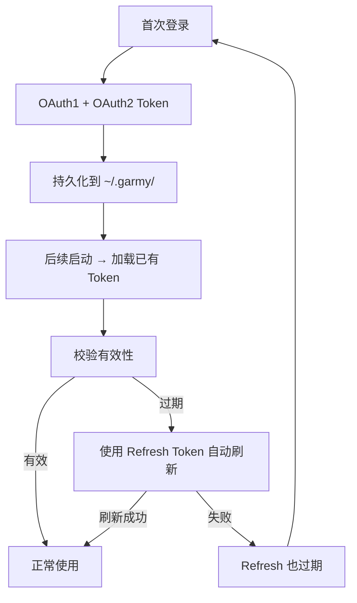
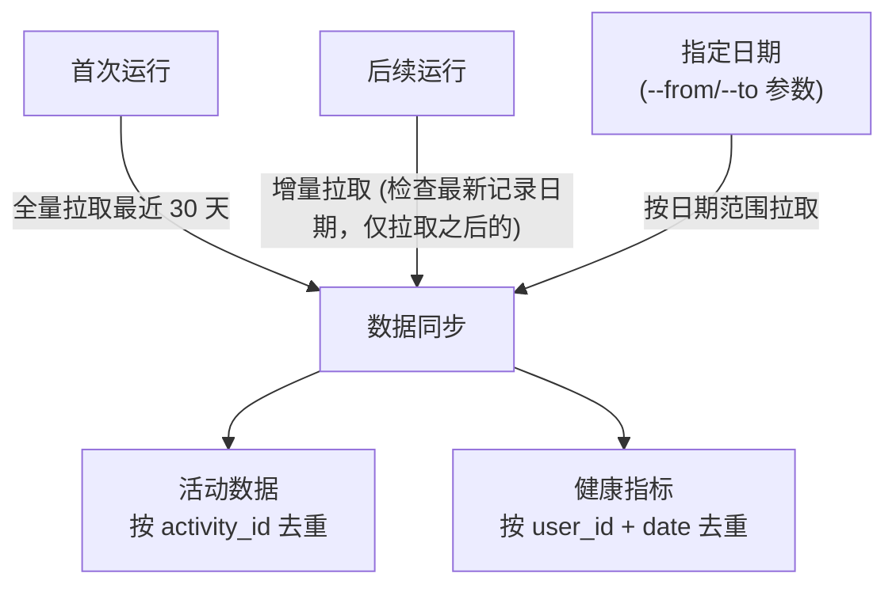

# 设计方案 — 4. 模块设计

> 属于 [设计方案索引](../design.md) · 版本 v3.1 · 2026-07-26

---

## 4. 模块设计

### 4.1 配置模块 (`config.py`)

**职责**: 统一管理所有配置项，从环境变量读取。

**环境变量设计**:

| 变量名 | 必填 | 默认值 | 说明 |
|--------|:---:|--------|------|
| `GARMIN_EMAIL` | ✅ | — | Garmin Connect 国际区登录邮箱 |
| `GARMIN_PASSWORD` | ✅ | — | Garmin Connect 登录密码 |
| `GARMIN_DOMAIN` | ❌ | `garmin.com` | API 域名（国际区默认，中国区用 `garmin.cn`）|
| `GARMIN_TOKEN_DIR` | ❌ | `~/.garmy` | Token 持久化目录 |
| `GARMIN_DB_PATH` | ❌ | `./data/garmin_data.db` | SQLite 数据库路径 |
| `GARMIN_SYNC_DAYS` | ❌ | `30` | 默认同步最近 N 天的数据 |
| `GARMIN_LOG_LEVEL` | ❌ | `INFO` | 日志级别 |
| `NEURUN_MEMORY_DIR` | ❌ | `./memory` | 记忆存储根目录（目标、档案、日报等） |
| `NEURUN_HOME` | ❌ | (当前目录) | 数据工作目录，设后所有相对路径基于此解析 |
| `NEURUN_DATA_DIR` | Web | `./data` | Web 多用户持久化目录 |
| `NEURUN_INVITE_CODES_FILE` | Web | `<data_dir>/invite-codes.json` | 邀请码 JSON 路径 |
| `NEURUN_ENABLE_ADMIN_TOOLS` | 本地 MCP | `false` | 仅 stdio/localhost 启用邀请码管理员 tools；公网 Web 禁止 |

**设计要点**:
- 使用 `python-dotenv` 支持 `.env` 文件（方便本地开发）
- 环境变量优先级: 系统环境变量 > 项目 .env > ~/.neurun/.env > 默认值
- 支持 `NEURUN_HOME` 环境变量（须为实际环境变量，不可写在 .env 中），设后 .env 及所有相对路径（db_path、memory_dir）均基于此目录解析
- 支持 `NEURUN_MEMORY_DIR` 覆盖记忆存储目录，支持多目录共享同一份记忆
- 密码类敏感信息绝不打印到日志
- 启动时校验必填变量，缺失则明确报错退出
- Web 邀请码默认随 `data_dir` 持久化；显式相对路径在 `NEURUN_HOME` 模式下基于该目录解析

---

### 4.2 认证模块 (`auth.py`)

**职责**: 封装 garmy `AuthClient`，处理登录与 Token 生命周期。

**设计要点**:
- 创建 `AuthClient(domain=config.domain, token_dir=config.token_dir)`
- 检查已有 Token 是否有效（garmy 自动从 `~/.garmy/` 加载）
- 无效则调用 `auth_client.login(email, password)`
- 支持 MFA：若账号开启了二次验证，通过回调函数交互式输入
- 提供 `get_auth_headers()` 供 API 调用使用（garmy 内部自动处理）
- 日志中脱敏显示邮箱（如 `ga***@gmail.com`）

**Token 生命周期**（garmy 自动管理）:



---

### 4.3 数据获取模块 (`fetcher.py`)

**职责**: 封装 garmy `APIClient` 的 Metrics 系统，提供统一的数据拉取接口。

#### 4.3.1 运动活动数据

使用 `api_client.metrics.get("activities")` 获取 `ActivitiesAccessor`:

| 方法 | 说明 | 使用场景 |
|------|------|---------|
| `.list(limit, start)` | 分页获取活动列表 | 初次全量同步 |
| `.get_recent(days, limit)` | 获取最近 N 天活动 | 日常增量同步 |
| `.get_by_type(type)` | 按运动类型筛选 | 专项分析（跑步/骑行） |
| `.raw(limit, start)` | 获取原始 JSON | 调试/自定义解析 |

**活动数据字段**（`ActivitySummary` dataclass 提供 50+ 字段）:
- 基础: `activity_id`, `activity_name`, `activity_type_name`, `start_time_local`, `duration`
- 心率: `average_hr`, `max_hr`, `heart_rate_range`
- 训练效果: `aerobic_training_effect`, `anaerobic_training_effect`, `activity_training_load`
- 压力: `avg_stress`, `start_stress`, `end_stress`, `difference_stress`
- 体电: `difference_body_battery`
- 呼吸: `avg_respiration_rate`, `min_respiration_rate`, `max_respiration_rate`
- 其他: `lap_count`, `has_polyline`（GPS 轨迹）, `device_id`, `privacy_type`

#### 4.3.2 日常健康指标

通过 `api_client.metrics[key].get(date)` / `.list(days=N)` 拉取:

| 指标 Key | 数据类型 | 关键字段 |
|----------|---------|---------|
| `sleep` | 睡眠 | 总时长、深睡/浅睡/REM 占比、平均 SpO2、睡眠评分 |
| `heart_rate` | 心率 | 静息心率、最大心率、全天连续读数 |
| `hrv` | HRV | 7天均值、昨晚均值、HRV 状态 |
| `stress` | 压力 | 平均/最大压力水平、全天连续读数 |
| `body_battery` | 身体电量 | 全天充放电曲线、最高/最低值 |
| `steps` | 步数 | 日步数、目标、距离、周统计 |
| `calories` | 卡路里 | 总消耗、活动消耗、BMR、目标 |
| `respiration` | 呼吸 | 日均/夜间呼吸率、全天连续读数 |
| `training_readiness` | 训练准备 | 综合评分、各维度贡献因子 |
| `daily_summary` | 日综合 | 以上指标的综合日摘要 |

#### 4.3.3 数据拉取策略



---

### 4.4 存储模块 (`storage.py`)

**职责**: 管理 SQLite 数据库，提供数据持久化与查询接口。

#### 4.4.1 方案选择

garmy 本身提供了 `LocalDB` 模块（`SyncManager` + `HealthDB`），已实现完整的 SQLite 存储方案。设计上有两个选择:

| 方案 | 优势 | 劣势 |
|------|------|------|
| **A: 复用 garmy LocalDB** | 开箱即用，有 `SyncManager` 自动调度 | 表结构固定，定制受限 |
| **B: 自建存储层** | 灵活定制表结构、索引、导出格式 | 需要自行处理去重、增量逻辑 |

**推荐方案**: **A（复用 garmy LocalDB）** + 补充自定义查询/导出层。

理由:
- garmy LocalDB 已覆盖所有指标类型的存储
- `SyncManager` 已处理去重、增量同步、失败重试
- 自建存储层的收益不足以覆盖开发成本
- 自定义查询直接在 SQLite 上写 SQL 即可
- 初始化 `SyncManager` 时通过 `_ensure_progress_reporter_compat()` 补齐旧版
  `ProgressReporter.warning()`；这样活动分页失败时保留原始警告，不会被兼容性
  `AttributeError` 覆盖

#### 4.4.2 garmy LocalDB 表结构（摘要）

```
health_metrics:    用户日级健康指标（睡眠、心率、HRV、步数等，宽表）
timeseries:        时序数据（身体电量曲线、心率曲线、压力曲线等）
activities:        运动活动记录（类型、时长、心率、训练效果等）
sync_status:       同步状态追踪（user_id, date, metric_type, status）
```

#### 4.4.3 补充查询接口

在 garmy LocalDB 之上封装常用查询:

- `get_activities_range(start, end)` — 日期范围活动查询
- `get_activities_by_type(activity_type)` — 按类型统计
- `get_weekly_summary(date)` — 周训练汇总
- `get_health_trend(metric, days)` — 健康指标趋势
- `export_csv(table, path)` — 导出 CSV

---

### 4.5 记忆存储模块 (`memory.py`)

**职责**: 在原始 Garmin 数据之上构建结构化运动知识库，将数据抽象为有语义的"记忆"，支持人工维护与 AI 消费。

#### 4.5.1 设计理念

记忆存储模块解决一个核心问题：**原始数据不等于知识**。Garmin 拉下来的是离散的数值（某天跑了 30 分钟、心率 150），而用户和 AI 需要的是有上下文的认知（"这个月跑量在增加，但恢复质量下降，需要调整强度"）。

记忆模块的核心设计原则：

| 原则 | 说明 |
|------|------|
| **数据升维** | 将原始数值聚合为带语义的摘要和趋势 |
| **人机协同** | 自动生成的部分（摘要、统计）和人工维护的部分（目标、案例）共存 |
| **结构化但可读** | 选用 Markdown + YAML Front Matter，既能被程序解析，也能被人直接阅读和编辑 |
| **时间感知** | 每条记忆带时间戳，支持版本演化和历史追溯 |
| **Git 友好** | 纯文本存储，变更可 diff，可回滚 |
| **AI 原生** | 文件格式天然适合作为 LLM 上下文，也方便 MCP Server 直接读取 |

#### 4.5.2 存储格式选型

| 方案 | 可查询 | 人类可编辑 | Git 友好 | LLM 友好 | 迁移成本 |
|------|:---:|:---:|:---:|:---:|:---:|
| SQLite 新增表 | ✅ | ❌ 需工具 | ❌ 二进制 | ❌ 需转换 | 需 migration |
| JSON 文件 | 部分 | 勉强 | 差（一行一 JSON） | 一般 | 低 |
| **Markdown + YAML Front Matter** | ✅ 按目录+文件名 | ✅ 任意编辑器 | ✅ 纯文本 diff | ✅ 原生格式 | 无 |
| TOML/YAML 纯配置 | ✅ | ✅ | ✅ | 一般 | 低 |

**选定方案: Markdown + YAML Front Matter**

结构示例：
```markdown
---
id: goal-2025-h1
type: goal
category: running
status: active
created: 2025-01-01
target_date: 2025-06-30
metrics:
  target_5k: "19:30"
  target_10k: "41:00"
  weekly_mileage_km: 60
progress:
  last_review: 2025-03-15
  current_5k: "20:15"
  avg_weekly_km: 52
tags: [5k, speed, spring-season]
---
```

---

### 4.6 Web 应用账号与邀请码 (`users.py`, `invitations.py`, `web.py`)

**职责拆分**：

- `local_files.py`：统一私有目录、文件权限和同目录原子替换，向上返回带路径及 `chown` 建议的错误；
- `InvitationStore`：读取管理员维护的 JSON，校验和核销单次邀请码；
- `UserManager`：创建昵称、规范化邮箱、`scrypt` 密码哈希与随机 `rd_` API Key，提供邮箱密码校验；
- `web.py`：注册 `/login`、`/register` 及对应 JSON API，并在数据源绑定前执行应用会话门禁。

账号记录包含 `nickname`、`email`、`password_hash`。其中 `email` 是 neurun 应用登录邮箱，
Platform Account 的账号字段单独存储，两者不得互相覆盖。
第一版 Login Email 只做格式和唯一性校验，创建后不可修改；昵称长度为 2–32 个字符，允许重复并可由用户后续编辑。
第一版不提供账号自助删除；退出登录只撤销当前 Session，不删除 neurun Account 或任何数据。
第一版不提供 Recovery Code、密码找回/修改、账号换绑、旧账号迁移和多设备会话管理。

密码格式为 `scrypt$n$r$p$salt$digest`，每次注册生成 16 字节随机盐，比较使用
`hmac.compare_digest`。服务端不保存注册密码明文，也不把密码或邀请码写入日志。
密码长度保持 8–128 个字符，不要求大小写、数字或特殊符号组合。

Web 数据目录使用私有权限边界：`data_dir`、`users/`、每用户目录、Token、memory 与
backup 目录统一为 `0700`；用户 JSON、邀请码、平台凭证、SQLite、备份和记忆文件统一
为 `0600`。敏感 JSON/文本采用“同目录临时文件 + `os.replace`”原子写入，使服务用户
在父目录可写时能够安全替换早期由 root 创建的普通文件；目录本身不可写时返回包含
实际路径和 `chown` 提示的错误，不静默回退到其他目录。

邀请码 JSON schema：

```json
{
  "codes": [
    {"id": "inv_xxx", "code": "完整随机邀请码", "enabled": true, "used_by": null, "used_at": null}
  ]
}
```

邀请码由系统使用加密安全随机数生成，JSON 保留完整邀请码，便于管理员之后重新查看和分发。
因此文件必须视为敏感凭证并限制为服务账号和管理员可读；文件泄露意味着所有未使用邀请码同时泄露。
起步阶段不设置自动过期时间，邀请码在成功使用或管理员停用前持续有效。

管理员 CLI 提供 `invite create/list/show/revoke`，均支持 `--output json` 且无交互式确认。
`list` 默认掩码，只有服务器本地 `show --reveal` 返回完整邀请码。对应 MCP tools 默认不注册，
显式开启后也只允许 stdio/localhost，且不提供完整邀请码读取；公网 `serve` 模式强制禁用。

验证接口只检查当前可用性，最终注册接口必须再次检查并核销。Web 服务使用单进程锁串行化核销；
账号写入后若核销失败则回滚本次新账号，绝不回退为开放注册。

Web 数据同步与日报生成是两个独立动作：

- `POST /api/sync` 只调用核心数据同步函数，将活动和健康数据写入用户 SQLite；不得创建、更新或覆盖日报文件；
- `POST /api/reports` 由已登录用户显式触发，只读取本地 SQLite 并生成指定日期日报；不得隐式访问运动平台；
- 日报的结构化指标和固定版式由 `memory.py` 生成，在线 AI 洞察由 `coach.py` 使用
  `prompts/coach.md` 生成；AI 成功后必须重新渲染正文，使 Front Matter 与正文使用同一份洞察；
- 未配置在线模型或调用失败时，日报仍可使用 `memory.py` 的本地规则洞察完成生成。
