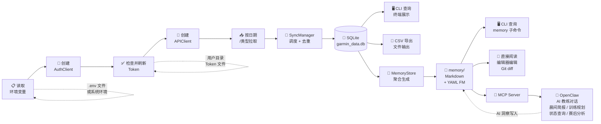
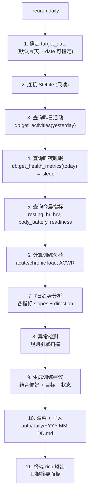
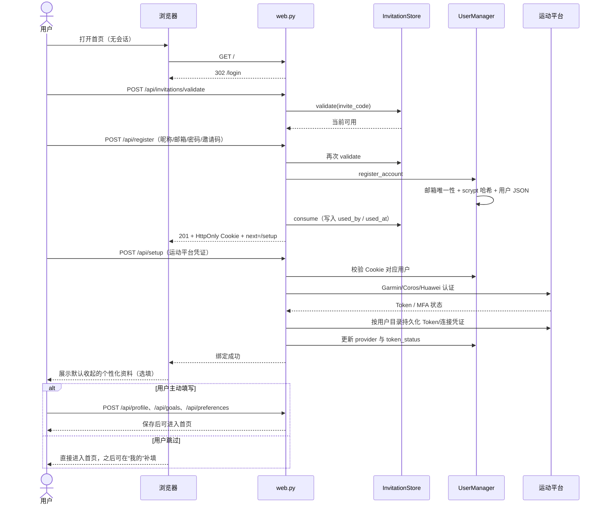
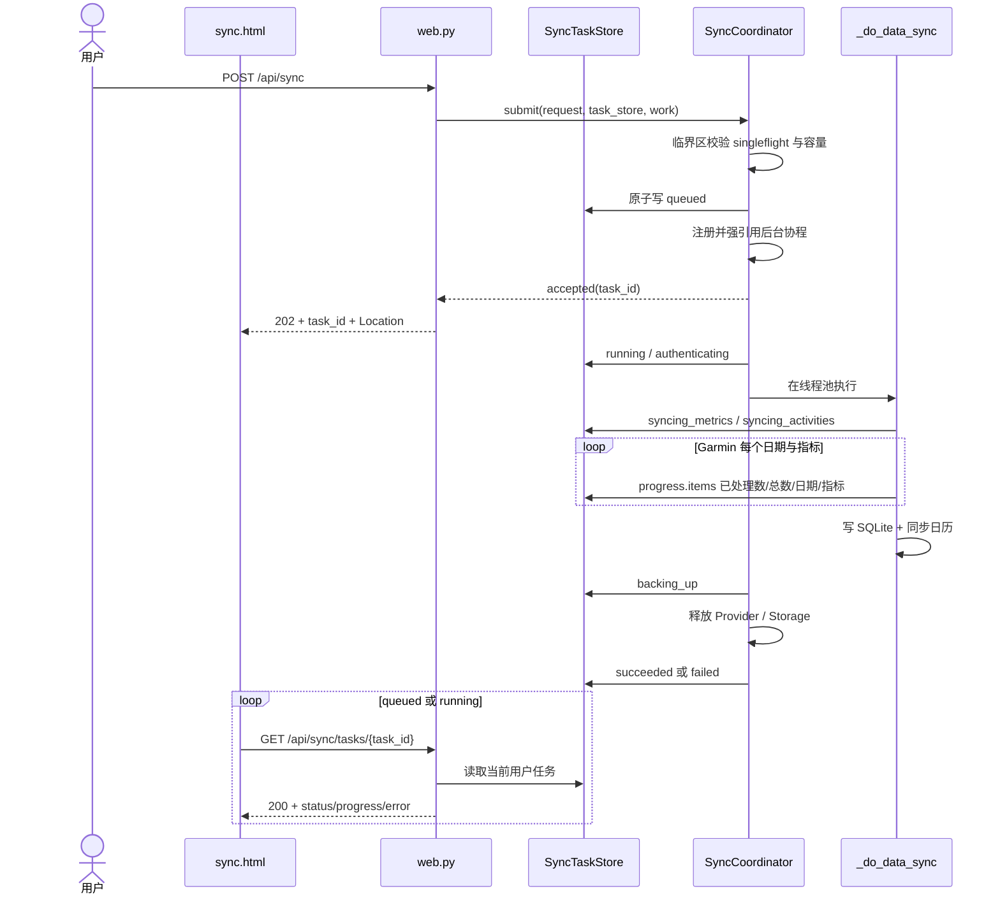
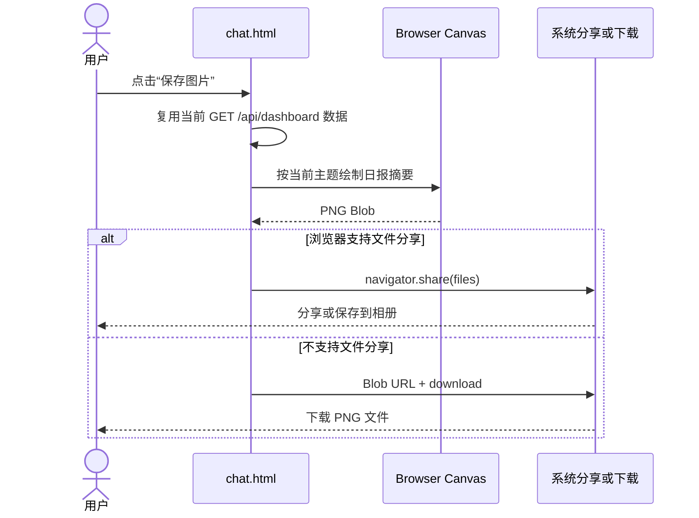

# 设计方案 — 5. 数据流

> 属于 [设计方案索引](../design.md) · 版本 v3.6 · 2026-07-29

---

## 5. 数据流

### 5.1 整体数据流

### 5.2 sync 命令执行流程

### 5.3 daily 命令执行流程 ⭐

### 5.4 memory 子命令执行流程

```mermaid
graph TD
    subgraph SUMMARIZE["memory summarize"]
        MS1["1. 确定 period 和 target_date"]
        MS2["2. 连接 SQLite (只读)"]
        MS3["3. 查询 activities + health_metrics"]
        MS4["4. 执行聚合算法"]
        MS5["5. 渲染 Markdown + YAML Front Matter"]
        MS6["6. 写入 auto/summaries/ + auto/recovery/"]
        MS7["7. 更新 index.md"]
        MS1 --> MS2 --> MS3 --> MS4 --> MS5 --> MS6 --> MS7
    end

    subgraph GOAL_CREATE["memory goal create"]
        GC1["1. 交互式问答"]
        GC2["2. 构建 Front Matter + Markdown 正文"]
        GC3["3. Schema 校验 (Level 1)"]
        GC4["4. 写入 goals/active/{slug}.md"]
        GC5["5. 更新 index.md"]
        GC1 --> GC2 --> GC3 --> GC4 --> GC5
    end

    subgraph CHECK["memory check"]
        CK1["Level 1: Schema 校验"]
        CK2["Level 2: 交叉校验"]
        CK3["Level 3: 完整性检查"]
        CK4["输出检查报告"]
        CK1 --> CK2 --> CK3 --> CK4
    end
```

---

### 5.5 Web 邀请注册与数据源绑定流程

注册认证和运动平台认证是两层独立边界：`/api/setup` 不得为无会话请求自动创建用户；
应用退出只删除 Cookie，不清理运动平台 Token。再次登录后仍使用原 API Key 和用户数据目录。
身体信息、个人最佳、训练目标和偏好不属于账号创建或平台绑定的前置条件；首次设置页面必须默认
收起这些复杂表单并提供显式跳过入口，跳过时不得写入空档案或默认偏好。

同步请求重新创建 Provider 时，必须先从用户目录恢复并执行 `authenticate()`，再读取平台
`user_id`。Garmin Access Token 到期而 Refresh Token 仍有效时，认证阶段调用
`refresh_tokens()` 并持久化新 OAuth2 Token，不进入账号密码 SSO。只有刷新凭据已过期、被撤销
或平台明确返回 401/403 时，才在本地 SQLite 写入之前终止并把连接状态更新为 `expired`；
超时、429、5xx、响应解析或 profile 临时异常保持连接为 `active`，任务以可重试错误结束。
任何失败路径都禁止用 `user_id=0` 或服务级默认凭证继续同步。

Coros Training Hub 没有平台 Refresh Token。服务端支持安全加密时，运动认证页默认开启自动鉴权，Web 将
密码等价重放对象加密保存到当前用户 Token 目录；明文密码和摘要不进入用户 JSON、日志或 API。
活动、每日分析或 HRV 请求明确返回 `result=1019` 时，Provider 在单用户锁中重新读取 Token，避免
并发重复登录；仍是旧 Token 才解密重放对象换取新 Access Token 并重试一次。重登被明确拒绝时
删除密文并让 Web 标记 `expired`；临时上游失败不改变连接状态。Mobile 睡眠认证使用独立表单，
把上游生成的重放载荷加密保存到 `coros-mobile-relogin.enc`；Mobile `1019` 时只更新
`mobile_access_token`，不得复用 Training Hub 重登对象、写入 coros-mcp 全局认证文件，或因
Training Hub 重登成功而伪装为可用。

认证完成且范围确定后，核心同步函数先将范围内每天的 `neurun_provider_sync` 标记为
`pending`。全部 Provider 拉取与 SQLite 写入成功后统一更新为 `completed`；异常退出时
统一更新为 `failed` 并保留截断后的错误信息。Web 日历 API 只聚合这些状态和本地表，
不为展示日历触发 Provider 认证或远程请求。

三平台写入活动时同时保存标准化 `activity_type`。日历聚合先判断当天是否存在跑步记录；
存在时直接输出 `synced`，优先于范围标记和指标级状态。升级前的历史活动没有该字段时，
只在名称包含“跑步”或 `run` 时作兼容识别；非跑步活动和健康数据仍按原状态证据聚合。

Web 异步任务在核心同步外增加一层任务状态流，不改变上述 Provider 与日历写入顺序：

202 必须发生在任务记录写入和后台调度接纳都成功之后。排队阶段不修改同步日历；工作线程开始后
才写 `neurun_provider_sync=pending`。成功终态必须晚于用户 SQLite 备份和资源回收；失败路径也先
释放 Provider、Storage，再写结构化任务错误并释放 singleflight 名额。进程重启后，旧实例的
`queued/running` 进入 `interrupted`，不自动重放第三方请求。

Garmin 指标同步通过 garmy 已有完成/跳过/失败事件推进 `progress.items`；任务文件保存最近一次真实
明细，因此轮询断开或页面刷新只会丢失中间动画，不会丢失已处理计数。适配层不会从运行时间推算
百分比，也不会改变 Provider 写入、日历状态或后续活动补齐的执行顺序。

Coros 活动查询仍按范围分页访问 Training Hub；每一页成功返回后才上报累计记录数。Mobile 睡眠
仍先按范围批量读取并允许失败降级，随后健康聚合循环每完成一个日期才上报逐日进度。慢请求在响应
返回前不会虚增计数；活动、RHR、HRV 与睡眠的既有容错和写入顺序保持不变。

---

### 5.6 Web 日报图片保存流程

此流程不再请求服务端，也不读取页面之外的数据。取消系统分享属于正常可恢复状态；生成或保存失败时，
页面通过 `aria-live` 状态文本反馈原因，并恢复“保存图片”按钮。
