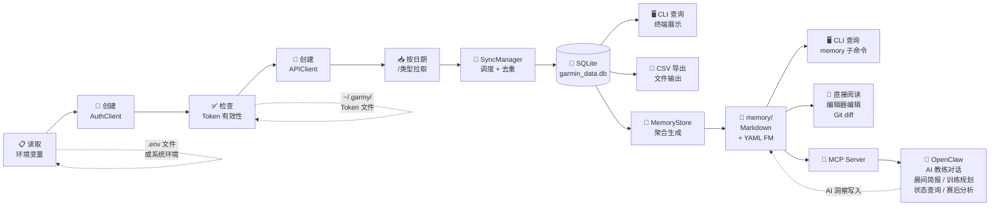
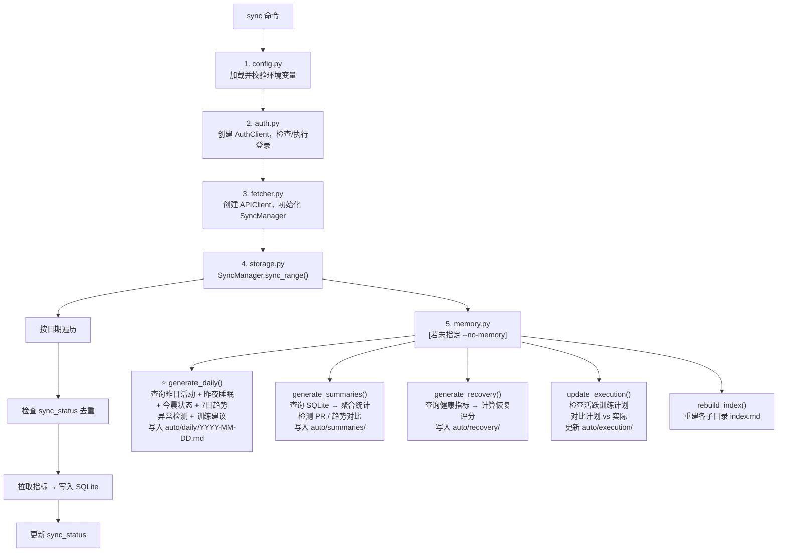
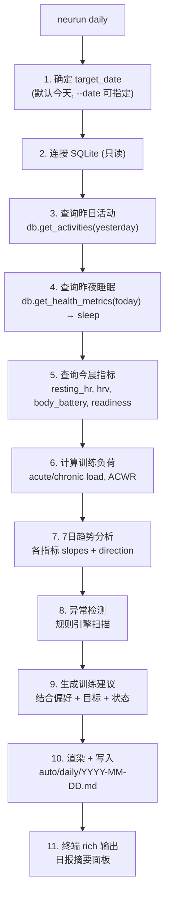
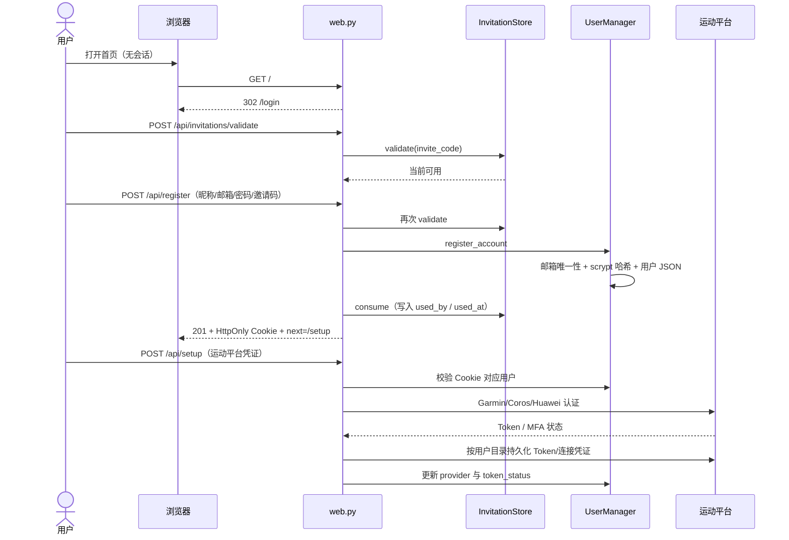

# 设计方案 — 5. 数据流

> 属于 [设计方案索引](../design.md) · 版本 v3.2 · 2026-07-26

---

## 5. 数据流

### 5.1 整体数据流

### 5.2 sync 命令执行流程

### 5.3 daily 命令执行流程 ⭐

### 5.4 memory 子命令执行流程

```mermaid
graph TD
    subgraph SUMMARIZE["memory summarize"]
        MS1["1. 确定 period 和 target_date"]
        MS2["2. 连接 SQLite (只读)"]
        MS3["3. 查询 activities + health_metrics"]
        MS4["4. 执行聚合算法"]
        MS5["5. 渲染 Markdown + YAML Front Matter"]
        MS6["6. 写入 auto/summaries/ + auto/recovery/"]
        MS7["7. 更新 index.md"]
        MS1 --> MS2 --> MS3 --> MS4 --> MS5 --> MS6 --> MS7
    end

    subgraph GOAL_CREATE["memory goal create"]
        GC1["1. 交互式问答"]
        GC2["2. 构建 Front Matter + Markdown 正文"]
        GC3["3. Schema 校验 (Level 1)"]
        GC4["4. 写入 goals/active/{slug}.md"]
        GC5["5. 更新 index.md"]
        GC1 --> GC2 --> GC3 --> GC4 --> GC5
    end

    subgraph CHECK["memory check"]
        CK1["Level 1: Schema 校验"]
        CK2["Level 2: 交叉校验"]
        CK3["Level 3: 完整性检查"]
        CK4["输出检查报告"]
        CK1 --> CK2 --> CK3 --> CK4
    end
```

---

### 5.5 Web 邀请注册与数据源绑定流程

注册认证和运动平台认证是两层独立边界：`/api/setup` 不得为无会话请求自动创建用户；
应用退出只删除 Cookie，不清理运动平台 Token。再次登录后仍使用原 API Key 和用户数据目录。

同步请求重新创建 Provider 时，必须先从用户目录恢复并执行 `authenticate()`，再读取平台
`user_id`。任何平台认证失败都在本地 SQLite 写入之前终止，并把连接状态更新为
`expired`；禁止用 `user_id=0` 或服务级默认凭证继续同步。

认证完成且范围确定后，核心同步函数先将范围内每天的 `neurun_provider_sync` 标记为
`pending`。全部 Provider 拉取与 SQLite 写入成功后统一更新为 `completed`；异常退出时
统一更新为 `failed` 并保留截断后的错误信息。Web 日历 API 只聚合这些状态和本地表，
不为展示日历触发 Provider 认证或远程请求。

三平台写入活动时同时保存标准化 `activity_type`。日历聚合先判断当天是否存在跑步记录；
存在时直接输出 `synced`，优先于范围标记和指标级状态。升级前的历史活动没有该字段时，
只在名称包含“跑步”或 `run` 时作兼容识别；非跑步活动和健康数据仍按原状态证据聚合。
