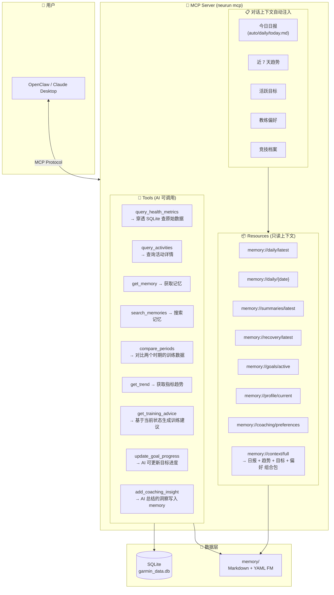

# 设计方案 — 8. 关键设计决策

> 属于 [设计方案索引](../design.md) · 版本 v3.0 · 2026-06-24

---

## 8. 关键设计决策

### 8.0 起步阶段的成本优先原则

- **先实现当前约束**：只实现已确认的单账号、单平台连接和必要安全边界，不提前建设多平台聚合、邮件服务或 Web 管理后台。
- **预留不预建**：未来能力通过清晰领域边界和可替换接口预留，不为尚未发生的需求增加运行依赖或运维流程。
- **邀请码不自动过期**：系统随机生成的一次性邀请码在使用或管理员停用前持续有效，避免引入过期管理成本。
- **例外**：可能导致账号接管、不可控数据删除或高迁移成本的风险不以“低成本”为由省略。

### 8.1 安全策略

- **密码不入 Git**: `.env` 加入 `.gitignore`，提供 `.env.example` 模板
- **日志脱敏**: 邮箱地址在日志中做部分遮蔽（`j***@example.com`）
- **Token 本地加密**: 依赖 garmy 的 `~/.garmy/` 文件权限（0600），如需进一步增强可考虑 keyring 集成
- **HTTPS 强制**: garmy 内部所有请求均为 HTTPS

### 8.2 容错设计

- **网络重试**: garmy 内置 3 次重试 + 指数退避（可配置 `GARMY_RETRIES`）
- **部分失败继续**: 某天某指标拉取失败不中断整体同步，记录到 `sync_status` 表
- **API 限流应对**: garmy 对 429 (Too Many Requests) 自动重试
- **优雅降级**: 某个指标 API 不可用时，跳过而非崩溃

### 8.3 扩展性预留

- **中国区切换**: 仅需设置 `GARMIN_DOMAIN=garmin.cn`
- **多用户支持**: 当前单用户设计，但 LocalDB 表结构已包含 `user_id` 字段，天然支持未来多用户
- **MCP Server**: garmy 已内置 MCP Server，启动 `neurun mcp` 即可对接 Claude Desktop
- **自定义指标**: 可继承 garmy `BaseMetric` 注册自定义指标
- **记忆扩展**: 新增记忆类型只需：(1) 定义 YAML Front Matter schema，(2) 创建目录，(3) 注册到 MemoryStore 的 type 枚举
- **多语言记忆**: Front Matter 字段与 Markdown 正文分离，正文可自由使用任何语言
- **记忆同步**: memory/ 目录天然可通过 Git 跨设备同步，也可通过 iCloud/Dropbox 等云盘同步

### 8.4 AI 教练对话：MCP Server + OpenClaw 集成 ⭐

本项目的最终用户界面不是命令行，而是 **AI 对话**。用户每天早上通过 OpenClaw（或 Claude Desktop）打开 AI 教练，AI 自动读取今日日报，展开智能训练对话。

#### 8.4.1 设计理念

```
用户不需要记住 CLI 命令，只需要像和真人教练聊天一样：

用户: "我今天状态怎么样？该跑什么？"
AI:   "早上好！今早 HRV 53ms 很稳定，身体电量 82% 充足。
      昨晚睡了 7.3h 略少但还可以。今天适合中等强度，
      建议跑 55min 节奏跑+轻松跑的组合……"

用户: "最近一周恢复趋势如何？"
AI:   "从日报来看，你的 HRV 近 7 天保持稳定，
      但睡眠时长有轻微下降趋势（7.5→7.1h），需要注意..."

用户: "帮我把今天的训练调到明天，今天改为休息"
AI:   "好的，已更新今天的建议为休息日。明天训练量不变。"
```

#### 8.4.2 AI 对话架构



#### 8.4.3 对话上下文注入策略

当用户打开 AI 对话时，MCP Server 自动将以下内容作为 System Prompt 上下文注入：

**第一优先级（必定注入）**：
- 今日日报全文（`auto/daily/YYYY-MM-DD.md`）
- 如果没有今日日报 → 自动触发生成 → 再注入

**第二优先级（根据对话长度选择性注入）**：
- 近 7 天趋势数据（从日报的 trends_7d 提取）
- 活跃目标详情（含 body 正文中的配速表、关键节点）⭐
- 运动员档案（个人最佳、身体数据）⭐
- 教练偏好摘要

**第三优先级（AI 按需通过 Tools 获取）**：
- 历史活动详情（`query_activities`）
- 具体日期的健康指标（`query_health_metrics`）
- 历史对比（`compare_periods`）
- 过往案例（`search_memories --type case_study`）

> ⭐ 标注为 v2 增强：`coach.py` 新增 `_collect_profile()`、`_collect_preferences()`、`_collect_goals()` 三个收集器，
> 从 `profile/`、`coaching/`、`goals/` 目录读取完整 body 文本，使 AI 能基于运动员真实竞技水平
> （如全马 PB 2:32:48）和目标（sub-2:30）给出针对性的建议。

#### 8.4.4 AI 对话的典型场景

| 场景 | 用户说 | AI 做什么 |
|------|--------|----------|
| **晨间简报** | "早上好" / "今天状态怎么样" | 读取今日日报 → 用自然语言总结状态 → 给出训练建议 |
| **训练规划** | "这周怎么安排训练" | 读取活跃目标 + 训练计划 + 本周已跑 → 建议本周安排 |
| **状态查询** | "最近恢复得怎么样" | 读取近 7 天日报 → 总结恢复趋势 → 指出关注点 |
| **历史回顾** | "上个月跑量多少" | `query_activities` → 聚合统计 → 对比本月 |
| **目标追踪** | "5K 目标能达成吗" | 读取目标 + 最近成绩 → 评估差距 → 给建议 |
| **赛后分析** | "分析一下昨天的比赛" | `query_activities` 比赛详情 → 逐维度分析 → 写入 case |
| **调整计划** | "下周减量，帮我调整" | 更新训练计划 → 重新计算 → 写入 memory |
| **知识积累** | "这次备赛有什么经验" | AI 总结 → `add_coaching_insight` → 写入 coaching/cases/ |

#### 8.4.5 AI 可写入的记忆

AI 对话不仅是消费数据，还会**产生新的记忆**（通过 `add_coaching_insight` 工具）：

```
对话 → AI 分析 → 总结洞察 → 写入 coaching/insights/

示例文件: coaching/insights/2025-06-24-ai-insight.md
---
type: ai_insight
date: 2025-06-24
source: ai_coach
session_topics: [恢复评估, 训练调整]
confidence: high
---

# AI 教练洞察 — 2025-06-24

## 发现
近 7 天睡眠时长呈下降趋势（7.5h → 7.1h），同时 HRV 从 54ms 降至 50ms。
两者相关性显著，建议优先改善睡眠而非调整训练量。

## 建议
1. 本周保持现有训练量，不增加强度
2. 目标入睡时间提前至 22:30
3. 3 天后复评 HRV 趋势
```

这些 AI 洞察会被后续对话引用，形成**持续积累的教练知识**。
