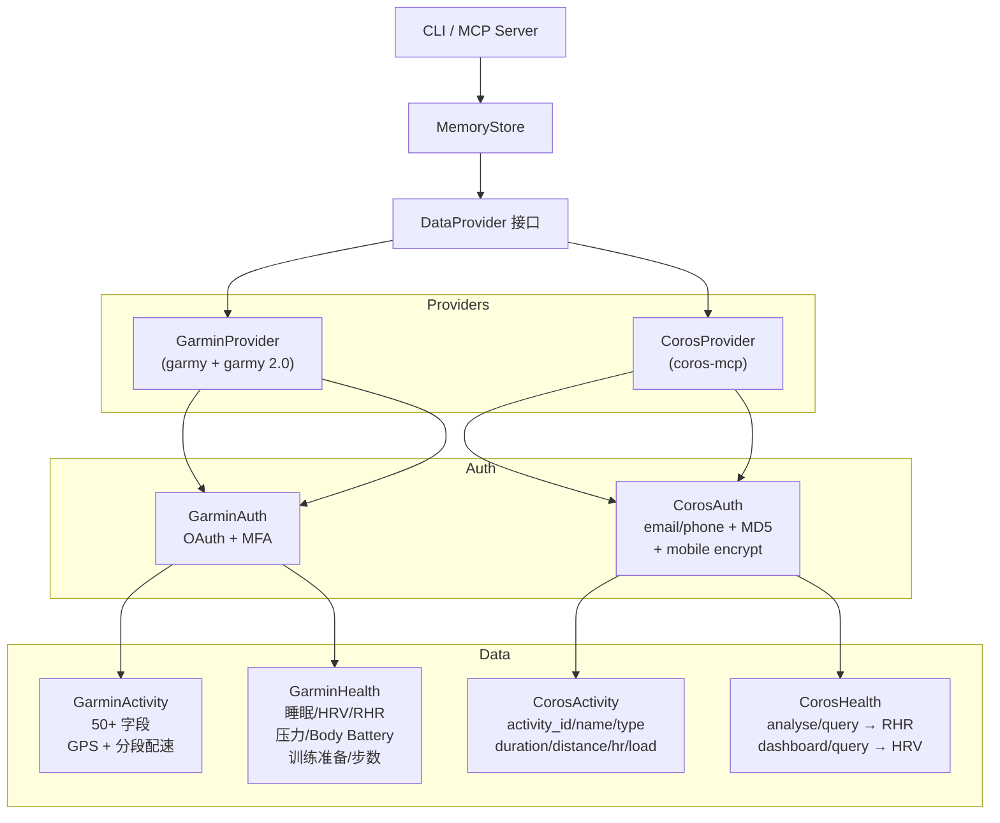

# 设计方案 — 12. 多平台数据源架构

> 属于 [设计方案索引](../design.md) · 版本 v3.0 · 2026-06-24

---

## 12. 多平台数据源架构 ⭐

### 12.1 设计目标

Rundown 支持 Garmin 和 Coros 两种运动平台，通过统一的 `DataProvider` 接口切换。
用户只需在 `.env` 中修改一行即可切换数据源：

```bash
RUNDOWN_PROVIDER=garmin  # 或 coros
```

### 12.2 架构



### 12.3 数据可用性对比

| 指标 | Garmin | Coros | 说明 |
|------|:---:|:---:|------|
| 运动列表 | ✅ 全量 | ✅ | Garmin: 50+ 字段含 GPS/分段/训练效果 |
| 运动详情 | ✅ 分段配速/步频/功率/GCT | ✅ 基础字段 | Garmin 数据更丰富 |
| 睡眠时长 | ✅ | ⚠️ 需 mobile token | Coros web API 不提供 |
| 深睡/REM | ✅ | ⚠️ 需 mobile token | 同上 |
| 静息心率 | ✅ | ✅ | Coros: analyse/query |
| HRV | ✅ | ✅ | Coros: dashboard/query |
| 身体电量 | ✅ | ❌ | Garmin 专有 |
| 训练准备 | ✅ | ❌ | Garmin 专有 |
| 压力 | ✅ | ❌ | Garmin 专有 |
| 步数 | ✅ | ❌ | Coros web API 不提供 |
| 卡路里 | ✅ | ❌ | 同上 |
| VO2max | ✅ | ✅ | 来自 analyse 数据 |
| 训练负荷 | ✅ | ✅ | Coros: analyse/query |

### 12.4 Provider 切换

```bash
# Garmin (默认)
RUNDOWN_PROVIDER=garmin
RUNDOWN_ACCOUNT=user@gmail.com
RUNDOWN_PASSWORD=xxx

# Coros (中国区手机号)
RUNDOWN_PROVIDER=coros
RUNDOWN_ACCOUNT=13812345678
RUNDOWN_PASSWORD=xxx
```

每个 Provider 独立管理自己的数据库和 Token。切换到不同目录 + 不同 `.env` 即可隔离数据。

### 12.5 Coros API 接入细节

基于 `coros-mcp` 库（MIT 协议，GitHub: cygnusb/coros-mcp）：

- **认证**：POST `/account/login`，MD5 密码 + mobile encrypt fallback
- **活动列表**：GET `/activity/query`，日期格式 `YYYYMMDD`（无连字符）
- **HRV 数据**：GET `/dashboard/query`，返回 7 天 HRV
- **每日指标**：GET `/analyse/query`，返回 RHR/距离/时长/负荷/VO2max
- **睡眠**：需要 Mobile API (`apicn.coros.com`)，需额外 mobile token

已知限制：
- `/activity/query` 日期参数必须 `YYYYMMDD` 格式
- 睡眠数据需要 mobile token（coros-mcp 支持自动获取）
- 身体电量/训练准备/压力仅 Garmin 提供

---
