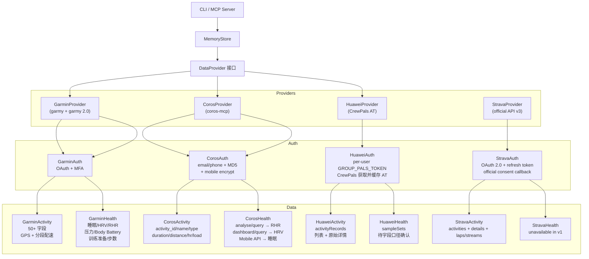

# 设计方案 — 12. 多平台数据源架构

> 属于 [设计方案索引](index.md) · 版本 v3.6 · 2026-08-14
> Coros 双认证、原始活动详情保留、Provider Adapter 单位归一化、Hz 聚合与存量摘要重建已实现；本地真实详情和持久化摘要已验收，线上 Provider/ECS 验收待发布后完成；Strava OAuth 活动同步为 Proposed，尚未实现

---

## 12. 多平台数据源架构 ⭐

### 12.1 设计目标

neurun 支持 Garmin、Coros、Huawei 和 Strava 四种运动平台，通过统一的 `DataProvider` 接口切换。
用户只需在 `.env` 中修改一行即可切换数据源：

```bash
NEURUN_PROVIDER=garmin  # 或 coros / huawei
```

### 12.2 架构



### 12.3 数据可用性对比

以下表格描述的是 **neurun 当前实际接入状态**，不等同于各平台 App 展示的全部能力。

- ✅：已读取并映射到统一字段
- ◐：已接入部分数据或语义为近似映射
- △：平台/API 可能提供，但当前 Provider 未映射
- —：当前数据源无可用映射
- 🚧：Huawei 该类数据尚未实现，最终可用性还取决于 AT 权限

#### 12.3.1 活动数据标准（`ActivityData`）

| 统一字段 | 类型 / 标准单位 | Garmin | Coros | Huawei | Strava (Proposed) | 对齐规则 |
|----------|-----------------|:------:|:-----:|:------:|----------|
| `activity_id` | string | ✅ | ✅ | ✅ | ✅ | 保留平台原始 ID，跨平台唯一键使用 `provider + activity_id` |
| `activity_name` | string | ✅ | ✅ | ✅ | ✅ | 空值使用通用运动名称；只能作为训练内容识别的辅助证据 |
| `activity_type` | enum string | ✅ | ◐ | ◐ | ✅ `sport_type` | Huawei 保留 API 原始类型；原始记录同时放入 `extra` |
| `start_time` | ISO 8601 + 时区 | ◐ | ◐ | ✅ | ✅ | Huawei 毫秒时间戳转换为 UTC ISO 8601 |
| `duration_seconds` | integer, s | ✅ | ✅ | ✅ | ✅ `moving_time` | Coros 优先使用排除暂停的 `workoutTime`，缺失时回退 `totalTime`；Strava `elapsed_time` 保留在 `extra` |
| `distance_meters` | float, m | ✅ | ✅ | ✅ | ✅ | 无距离的运动使用 `0`，未知值不得伪装成实测 `0` |
| `avg_heart_rate` | integer, bpm / null | ✅ | ✅ | ✅ | ✅ | 无样本或无权限时为 `null` |
| `max_heart_rate` | integer, bpm / null | ✅ | ✅ | ✅ | ✅ | Coros 活动列表返回 `maxHr` 时映射；没有样本时保持 `null` |
| `training_load` | float / 平台原值 | ✅ | ✅ | ◐ | △ `suffer_score` | 有返回值时映射；各平台算法不可直接横向比较 |
| `calories` | integer, kcal | ✅ | ✅ | ✅ | ✅ | 统一为活动消耗；不可与全天总消耗混用 |
| `elevation_gain` | float, m | ✅ | ✅ | ✅ | ✅ `total_elevation_gain` | 统一为累计爬升，不使用起终点海拔差替代 |
| `has_gps` | boolean | △ | △ | ◐ | ◐ | Huawei 根据轨迹或定位字段判断，受详情权限影响 |
| 活动详情 | provider raw dict | ✅ 丰富 | ✅ 基础 | ✅ raw | ✅ details/laps/streams | Huawei 通过 `activityRecordId` 查询并保留原始详情 |

#### 12.3.2 每日健康数据标准（`DailyHealth`）

| 统一字段 | 类型 / 标准单位 | Garmin | Coros | Huawei | Strava (Proposed) | 对齐规则 |
|----------|-----------------|:------:|:-----:|:------:|----------|
| `metric_date` | 本地自然日 | ✅ | ✅ | 🚧 | 以用户时区切日，禁止直接按 UTC 日期聚合 |
| `sleep_duration_hours` | float, h | ✅ | ✅ | 🚧 | — | Coros 使用主睡眠 `totalSleepTime`；小睡分钟数保留在 `extra` |
| `deep_sleep_hours` / `deep_sleep_pct` | h / % | ✅ | ✅ | 🚧 | — | Coros `deepTime` 转换为小时，百分比以总睡眠为分母 |
| `rem_sleep_hours` / `rem_sleep_pct` | h / % | ✅ | ✅ | 🚧 | — | Coros `eyeTime` 作为 REM；平台无 REM 分类时保持未知，不推算 |
| `resting_heart_rate` | integer, bpm / null | ✅ | ✅ | 🚧 | — | 使用平台每日静息心率，不用活动最低心率替代 |
| `hrv_last_night_avg` | float, ms / null | ✅ | ✅ | 🚧 | — | 统一表达昨夜平均 HRV；需在 `extra` 标注 RMSSD/SDNN 口径 |
| `hrv_weekly_avg` | float, ms / null | ✅ | ◐ | 🚧 | — | Coros 当前以当日睡眠 HRV 同值填充，不能视为真实 7 日均值 |
| `hrv_status` | enum string | ✅ | ◐ | 🚧 | — | Coros 当前固定为 `balanced`，仅为占位，不参与跨平台判断 |
| `avg_stress_level` | integer / null | ✅ | ◐ | 🚧 | — | Coros 使用 `tiredRate` 近似映射，语义不等同 Garmin stress |
| `body_battery_high/low` | integer / null | ✅ | — | 🚧 | — | Garmin 专有概念，不强行映射其他平台恢复分数 |
| `total_steps` | integer, steps | ✅ | — | 🚧 | — | Coros 当前写入 `0` 表示未提供，不代表真实零步 |
| `total_distance_meters` | float, m | ✅ | ✅ | 🚧 | — | 每日总距离，不与单次活动距离混用 |
| `total_calories` | integer, kcal | ✅ | — | 🚧 | — | 全天总消耗，包含基础与活动消耗 |
| `active_calories` | integer, kcal | ✅ | — | 🚧 | — | 仅活动消耗 |
| `training_readiness_score/level` | score / label | ✅ | — | 🚧 | — | Garmin 专有口径；跨平台恢复判断应使用独立派生模型 |

#### 12.3.3 缺失值与跨平台比较规范

1. **缺失不等于零**：心率、HRV、睡眠、步数等未授权或未提供时应为 `null`；现有数值字段默认 `0` 是兼容性遗留，消费端需结合 Provider 能力表判断。
2. **原始值可追溯**：发生枚举、分数或近似语义映射时，在 `extra` 保存 `provider`、原始字段名、原始值和算法口径。
3. **平台分数不直接比较**：training load、stress、readiness、Body Battery 等均为平台算法结果，只能观察同平台趋势。
4. **统一物理单位**：时间用秒/小时、距离和海拔用米、能量用 kcal、心率用 bpm、HRV 用 ms。
5. **时间必须可定位**：活动时间目标格式为带时区的 ISO 8601；每日健康数据按用户本地时区聚合。
6. **能力与数据质量分离**：Provider 支持某字段，不代表当天一定有值；同步结果应分别记录 `supported`、`authorized`、`available` 状态。

#### 12.3.4 训练内容识别数据合同

> v1 已实现汇总字段持久化、常见 laps/splits 归一化、详情幂等补齐和缺失爬升 `null` 语义；各 Provider 的真实详情形态、逐字段授权原因和大批量同步成本仍需线上验收。

Provider 层只提供可追溯事实，不输出 neurun 的有氧、节奏、间歇或越野最终结论。训练内容识别由 [交互式训练方案系统](training-system.md) 的 `TrainingSessionAnalyzer` 负责。

除 `ActivityData` 汇总字段外，Provider 支持时还应归一化：

- 有顺序的 laps/splits：开始时间、时长、距离、平均/最大心率、配速、功率及原始分段类型；
- 海拔与路线负荷：累计爬升/下降、逐段爬升和可用的坡度或高度序列；
- 数据质量：`complete`、`partial`、`unavailable`，以及 `not_provided`、`not_authorized`、`not_mapped`、`request_failed` 等原因；
- 来源元数据：Provider、原始字段、原始单位和详情获取时间。

Coros 详情采用显式 Provider-normalizer，不能直接复用 Garmin 字段单位：

| Coros 原始字段 | 原始口径 | 统一字段 |
|---|---|---|
| `summary.distance` / `lapItem.distance` | `1/100 m` | 除以 100 → `distance_m` |
| `summary.workoutTime` / `summary.totalTime` | `1/100 s` | 除以 100 → moving / elapsed seconds |
| `summary.calories` / 活动 `calorie` | `1/1000 kcal` | 除以 1000 → kcal；`ActivityData` 按整数 kcal 取整 |
| `lapItem.time` / `lapItem.totalLength` | `1/100 s` | 除以 100 → `duration_s` |
| `lapItem.avgPace` | `sec/km` | 原值 → `pace_sec_per_km` |
| `lapItem.avgHr` | `bpm` | 原值 → `avg_hr` |
| `lapItem.avgCadence` | `spm` | 原值 → `avg_cadence` |
| `lapItem.avgStrideLength` | `cm` | 原值 → `stride_length_cm` |

`lapList[].lapItemList[]` 是首选叶子分段，父 lap 只作分组/校验；父 lap 无有效子项时才回退父 lap。
父子不得同时累计。去重与单位归一化后，分段距离合计 / 活动汇总距离必须处于 `[0.85, 1.15]`，
否则标记 `quantity_unreliable`，禁止输出分段距离、时长和每公里结论。原始 `frequencyList` 保留在
`detail_json` 但尚未经过字段、单位和样本有效性归一化时，只能标记 `hz_unparsed`；不得据此产生 L2。

`0` 只能表达平台确认的真实零值；未知爬升、未知心率和未知分段必须使用空值及原因。活动汇总先到、详情后到时采用幂等补齐，并使对应派生分析失效或重算。不得为跨平台对齐而合成不存在的分段，也不得用起终点海拔差替代累计爬升。

### 12.4 Provider 切换

```bash
# Garmin (默认)
NEURUN_PROVIDER=garmin
NEURUN_ACCOUNT=user@gmail.com
NEURUN_PASSWORD=xxx

# Coros (中国区手机号)
NEURUN_PROVIDER=coros
NEURUN_ACCOUNT=13812345678
NEURUN_PASSWORD=xxx

# Huawei（每用户独立 CrewPals token）
NEURUN_PROVIDER=huawei
GROUP_PALS_TOKEN=xxx
HUAWEI_TOKEN_DIR=./data/user-a/huawei-tokens

# Strava（Proposed；Web OAuth 不读取账号密码）
NEURUN_PROVIDER=strava
NEURUN_STRAVA_CLIENT_ID=12345
NEURUN_STRAVA_CLIENT_SECRET=server-only-secret
NEURUN_STRAVA_REDIRECT_URI=https://example.com/api/strava/callback
NEURUN_STRAVA_WEBHOOK_VERIFY_TOKEN=server-only-random-value
```

每个 Provider 独立管理自己的数据库和 Token。切换到不同目录 + 不同 `.env` 即可隔离数据。

Huawei 使用每用户独立的 `GROUP_PALS_TOKEN`：`neurun auth` 通过 HTTPS GET
`https://api.crewpals.com/api/v1/huawei/access_token` 获取 Huawei AT。请求将原始 JWT
放入 `Authorization` header，不添加 `Bearer` 前缀，
返回的 token 保存到 `HUAWEI_TOKEN_DIR/huawei-oauth.json`，权限为 `0600`。本地 AT 有效时
直接复用，过期或缺失时重新向 CrewPals 获取；不再使用第三方 OAuth 回调流程。
默认 `HUAWEI_TOKEN_DIR` 使用 `GROUP_PALS_TOKEN` 的 SHA-256 摘要前 16 位作为目录键，
在不暴露 token 的前提下隔离不同用户；显式配置路径时由调用方保证用户隔离。
预发布响应使用 `data.accessToken/refreshToken/expiredAt/openId`，Provider 写盘前归一化为
snake_case，同时保留对早期扁平 snake_case 响应的兼容。

Token store 生命周期规则：

- `neurun init` 为当前配置选择并创建独立的 `HUAWEI_TOKEN_DIR`，目录权限为 `0700`。
- `neurun auth` 在认证前执行相同检查，目录缺失时自动创建。
- 已有 `huawei-oauth.json` 必须是包含 `access_token` 的 JSON object，否则立即报告文件路径和原因。
- 已有 token 文件权限自动收紧为 `0600`；空 token 文件不会被预创建。
- Token 兼容 `expired_at` / `expires_at` 和 `open_id` / `openid` 两套命名；若存在数值 `user_id`，优先作为统一用户 ID。
- 用户隔离必须覆盖 token、SQLite、memory 和 output，不能只通过 token 文件名区分用户。
- 显式设置 `NEURUN_HOME` 时不加载全局 `~/.neurun/.env`，避免不同用户的账号和密码互相补入。

Web 多用户模式下，用户在绑定 Huawei 时输入的 `GROUP_PALS_TOKEN` 不写入用户注册
JSON，而是原子写入该用户的 `huawei-tokens/group-pals-token`，目录权限为 `0700`、
文件权限为 `0600`。后续请求和进程重启从该文件恢复，服务级 `GROUP_PALS_TOKEN`
只作为单用户 CLI 或旧部署的兼容回退，不能覆盖已经存在的用户级凭证。

### 12.4.1 四平台认证初始化契约

所有 Provider 必须遵循相同顺序：

1. 从当前用户专属目录恢复 Token；
2. 调用 `provider.authenticate()` 验证或刷新认证；
3. 仅在认证成功后读取 `provider.user_id`；
4. 使用该 `user_id` 初始化同步、SQLite 查询和写入；
5. 只有明确的凭据失效才停止同步并将 Web 用户连接状态标记为 `expired`；网络、限流、平台 5xx
   或响应异常作为可重试失败返回，并保持连接为 `active`。

禁止把 `user_id=0`、服务级凭证或尚未初始化的认证客户端作为同步降级值。Garmin 的
`AuthClient`、Coros 的 `StoredAuth` 和 Huawei 的本地 AT 都必须先通过各自认证检查。

Garmin 的区域是认证与数据请求的共同边界。创建 `garmy.APIClient` 时必须同时传入当前
`UserConfig.domain`（Web）或 `Config.domain`（CLI），不能只传 `AuthClient` 后依赖 garmy
默认的 `garmin.com`。profile、活动、健康同步及记忆补全使用的每个 APIClient 都必须与
创建 Token 的 `AuthClient.domain` 一致；`garmin.cn` Token 不得请求 `connectapi.garmin.com`。
Garmin `provider.authenticate()` 必须先区分 `is_authenticated` 与 `needs_refresh`：前者为真时直接
复用，后者为真时调用 `refresh_tokens()` 并持久化新 OAuth2 Token，不能直接进入账号密码 SSO。
只有 Refresh Token 不可用或刷新明确返回 401/403 才返回认证失败。有效 Token 的 profile 返回
空对象不能直接证明 Token 失效；Provider 应调用可保留原始异常的 profile 请求，401/403 才归类
认证失效，超时、429、5xx 和响应异常均保持可重试。

### 12.5 Strava OAuth、活动和 webhook 设计（Proposed）

#### 12.5.1 边界与配置

Strava v1 只服务 Web 中已经登录 neurun 的个人用户，不接受 Strava 密码、不实现 CLI 交互授权，
也不从 `.env` 读取个人 access token。服务端全局配置为 `NEURUN_STRAVA_CLIENT_ID`、
`NEURUN_STRAVA_CLIENT_SECRET`、`NEURUN_STRAVA_REDIRECT_URI` 与
`NEURUN_STRAVA_WEBHOOK_VERIFY_TOKEN`；后三者只允许由部署环境注入，不能进入仓库、README、
用户 JSON、日志、错误响应或 MCP 输出。`REDIRECT_URI` 必须属于 Strava App 已登记的 callback
domain；生产 webhook callback 必须是可被 Strava 访问的 HTTPS 地址。

新增 `StravaProvider`，实现现有 `DataProvider`、`ActivityProvider` 与 `HealthProvider`：

- `StravaAuth` 从 `data/<api_key>/tokens/strava-auth.json` 读取 access token、refresh token、
  `expires_at`、athlete ID 与实际 grants，目录 `0700`、文件 `0600`；`authenticate()` 在过期或
  一小时内过期时通过官方 token 端点刷新，并用原子写替换响应中的 **全部** token 字段。
- `StravaActivities.fetch_activities(start, end)` 调用 athlete activities 分页接口，按 `after/before`
  拉取并在空页停止；`fetch_activity_detail(id)` 获取详情、laps 和所需 streams。详情请求受限流预算
  控制，单条失败不会把已成功的汇总变成失败。
- `StravaHealth` 明确返回不支持，而不是创建零值 `DailyHealth`。readiness 层以能力矩阵得到
  `unavailable`，避免报告将 Strava 用户误判成健康同步缺失或已经恢复。

`UserRecord` 增加非敏感 `strava_athlete_id`（字符串）与 `strava_scope`（规范化 scope 列表），仅用于
事件路由和连接状态展示；token 不放入用户记录。已存在的用户 JSON 缺字段时按空值兼容，不做强制
迁移。同步持久化仍以 `provider + activity_id` 为唯一来源键，禁止用 athlete ID 代替当前 neurun
用户目录边界。

#### 12.5.2 Web OAuth 合同

| 路由 | 认证与输入 | 成功行为 | 失败与安全边界 |
|---|---|---|---|
| `GET /api/strava/authorize` | 必须是未绑定或同平台重新绑定的 neurun 会话 | 创建 10 分钟有效、一次性随机 state 并 302 到 Strava `oauth/authorize`，请求 `activity:read_all` | 不透露 client secret；其他已绑定 Provider 返回 409 |
| `GET /api/strava/callback` | `code`、`scope`、`state` 和原 neurun 会话均须有效 | 交换 token，核对实际 scope 与 athlete ID，原子写 `strava-auth.json`，更新 `UserRecord(provider=strava, token_status=active)` 后 303 到同步页 | 任一校验失败消费 state、删除临时状态且返回设置页；不保留 authorization code |
| `GET /api/strava/webhook` | Strava 验证 query 的 mode、verify token、challenge | verify token 相等时回显 `hub.challenge` | 不匹配返回 403，不读取用户数据 |
| `POST /api/strava/webhook` | 仅接受本应用 subscription ID 与合法最小事件字段 | 在两秒内持久化幂等事件并返回 200；后台消费 | 不在请求内访问 Strava、写 SQLite 或调用 AI；未知 athlete / 重复事件安全忽略并审计 |
| `POST /api/strava/disconnect` | 当前 active Strava 用户的 neurun 会话 | 调用官方 revoke、删除 OAuth 文件、置 `expired`，让用户选择保留或删除本地活动 | 远端已撤销/网络错误不得让 token 继续可用；删除活动必须显式确认且仅限当前用户 |

state 存在 `data/<api_key>/tokens/strava-oauth-state.json`，只保存随机值、API key、创建/过期时间与
回跳目的地，使用私有权限和原子“读取后删除”。callback 必须同时核验 state 所属 api_key 与 Cookie
会话；state 不可复用、不可跨用户、不可作为 URL 中的用户身份。Token 交换后必须以返回 athlete ID
为实际身份，刷新时 athlete ID 发生变化则拒绝并进入 `expired`，不覆盖既有用户凭据。

#### 12.5.3 Webhook、隐私和限流状态机

一个 Strava 应用只建立一个全局 webhook subscription，订阅创建/验证由受控部署命令完成，而不是每个
用户绑定时创建。事件处理按 `(subscription_id, object_type, object_id, aspect_type, event_time)` 去重：

1. athlete `authorized=false`：原子删除 OAuth 文件并将该 athlete 对应用户置为 `expired`；不访问
   Strava。用户数据是否删除由断开流程的显式选择决定。
2. activity `create` / `update`：向现有 `SyncCoordinator` 提交只处理该 `object_id` 的任务；任务读取
   当前 token 后补齐详情。隐私变化时按当前 scope 和详情响应决定保留、更新或删除本地活动。
3. activity `delete`：仅按 `provider=strava + activity_id + 当前 api_key` 删除或标为不可用，绝不以
   webhook 的活动 ID 做跨用户删除。
4. 429、超时和 5xx：保持 `active` 并记录可重试任务；从 `X-RateLimit-*` 与
   `X-ReadRateLimit-*` 计算退避与全量回填预算。401 或刷新 token 明确失败才转 `expired`。

事件端点只确认接收；持久化队列消费、Provider 获取和 SQLite 写入全部复用现有同步资源生命周期，确保
慢上游不会阻塞健康检查。由于 webhook 可以重复或乱序，活动写入、删除和 token 删除均须幂等，并在
每次执行前再次确认当前 `UserRecord.strava_athlete_id` 与 token 文件身份一致。

#### 12.5.4 测试与上线验收

- Provider 单测：Token 未过期复用、临界过期刷新、refresh token 轮换的原子替换、401 与 429/5xx
  分类、分页边界、`moving_time`/`elapsed_time`、详情/laps/streams 映射以及健康不支持语义。
- Web 单测：OAuth state 生成、过期/重放/跨用户 callback 拒绝、scope 不足不绑定、token 不进入用户
  JSON 或响应、重绑边界、webhook verify、两秒 ACK、重复/乱序/未知 athlete 和解除授权。
- 集成验收：Strava sandbox/真实个人账号完成同意、刷新、全量回填、Webhook create/update/delete/
  deauthorize、限流退避、断开；检查官方品牌资产和“View on Strava”归因。通过本地 pytest 不等于
  Strava App 审核、真实 webhook 可达性或生产部署验收。

### 12.6 Huawei 数据 API 接入细节

通过 Huawei 云端接口的真实参数校验确认：

- Base URL：`https://health-api.cloud.huawei.com/healthkit/v2`
- 活动列表：GET `/activityRecords`，参数为毫秒 `startTime/endTime`；该接口带 `limit` 时要求私有游标式 `order`，因此当前按日期窗口获取完整列表
- 活动详情：GET `/activityRecords?activityRecordId=<id>`；服务仍可能返回集合，Provider 按原始 ID 精确筛选；`/activityRecords/<id>` 对 GET 返回 405
- 指标样本：GET `/sampleSets`，同样使用毫秒时间戳和 `order=startTime`，尚未写入每日健康模型
- 健康记录：GET `/healthRecords`，数据类型参数名为 `dataType`；当前 AT 对 sleep record 返回权限不足

Huawei API 返回字段存在嵌套差异，Provider 对 ID、名称、类型、起止时间、距离、心率、
卡路里和爬升使用兼容映射，并将完整原始记录保存在 `ActivityData.extra.raw`。

### 12.7 Coros API 接入细节

基于 `coros-mcp` 库（MIT 协议，GitHub: cygnusb/coros-mcp）：

- **运行依赖**：Coros 是 Web 注册后可直接选择的数据源，`coros-mcp` 必须随默认安装和
  Docker 镜像一起安装，不得仅放在可选 extras 中；缺失时绑定接口返回可操作的部署错误
- **认证域**：Training Hub 运动数据使用 POST `/account/login`；Mobile 睡眠使用独立的
  `/coros/user/login`。两者不得在一个 Web 表单或一次 `/api/setup` 提交中串行执行
- **Web Token 隔离**：绑定成功后将 `StoredAuth` 保存到
  `data/<api_key>/tokens/coros-auth.json`；目录权限为 `0700`，文件权限为 `0600`。
  后续同步不保存或重用明文密码，而是从当前用户目录恢复 Training Hub token、
  Mobile token；两域可重放凭据分别从独立 Fernet 密文恢复，不留在 Token JSON
- **旧 Token 迁移**：用户目录尚无 token 且系统中只有一个 active Coros 用户时，
  `/api/sync` 可将 coros-mcp 旧版全局 token 一次性迁入该用户目录；多个 Coros
  用户时跳过自动迁移，避免错误共享凭证
- **活动列表**：GET `/activity/query`，日期格式 `YYYYMMDD`（无连字符）；Rundown
  直接保留原始 `workoutTime` 和 `totalTime`，因为 coros-mcp 的 `ActivitySummary`
  当前只暴露 `totalTime`
- **活动时长**：统一 `duration_seconds` 使用 `workoutTime`（排除暂停）；仅当该字段
  缺失、为零或大于 `totalTime` 时回退 `totalTime`。`extra` 同时记录
  `workout_time_seconds`、`total_time_seconds` 和派生的 `paused_seconds`
- **已有活动修正**：非 Garmin 同步遇到已存在的 `activity_id` 时会比较并更新
  `duration_seconds`，因此重新同步即可修正旧数据，无需删除数据库
- **HRV 数据**：GET `/dashboard/query`，返回 7 天 HRV
- **每日指标**：GET `/analyse/query`，返回 RHR/距离/时长/负荷/VO2max
- **活动详情**：POST `/activity/detail/query`，完整 `data` 原样保存在 `detail_json`，包含
  `lapList`、`frequencyList`、`graphList` 与 `gpsLightDuration`。原样保存是可回放边界，不是
  分析完成边界；`frequencyList` 只有经 Provider-normalizer 产出标准秒、米、sec/km、bpm、spm
  样本并通过质量门禁后才能进入 L2 聚合。
- **运动认证入口**：`/setup?rebind=coros&scope=training` 只显示 Training Hub 账号、密码和区域。
  账号允许邮箱或手机号；区域使用 `cn/eu/us/asia`，首次默认 `cn`，用户显式选择其他区域时按其
  选择提交，重新授权从现有 Token 预填。不得再通过账号是否为纯数字推断
- **睡眠认证入口**：`/setup?rebind=coros&scope=sleep` 只显示 Coros App 登录邮箱和密码，并说明
  不是 neurun 登录邮箱、不能以手机号替代；区域继承现有 Training Hub Token，若尚无运动授权则
  要求用户显式选择。该入口只申请 Mobile token，不重做或覆盖 Training Hub 登录
- **睡眠数据**：通过 Mobile API `POST /coros/data/statistic/daily` 批量读取日期范围，
  映射总睡眠、深睡、REM 及百分比；睡眠评分、清醒分钟和小睡分钟保留在
  `DailyHealth.extra`
- **存量用户升级**：“我的”分别提供“授权/重新授权运动数据”和“授权/重新授权睡眠数据”；
  两个链接携带不同 `scope`，页面初始化以 `provider=coros + scope` 为真相源，不开放换绑。
  睡眠授权后执行普通批量同步即可合并补齐历史健康记录，无需强制覆盖或删除活动
- **API 拆分**：新增 `POST /api/coros/auth/training` 与 `POST /api/coros/auth/sleep`，请求都包含
  `account`、`password`、`region`、`auto_refresh`；前者更新 Training Hub token 和运动账号展示，
  后者只更新 Mobile token。旧 `/api/setup` 仅保留首次平台选择和向新端点过渡的兼容逻辑
- **区域默认值**：运动认证页面的 `<select>` 默认选中 `cn`；兼容 `/api/setup` 与
  `/api/coros/auth/training` 在 `region` 缺失或为空时也归一化为 `cn`。显式传入合法区域不被覆盖；
  睡眠认证继续继承已有 Training Hub 区域，不独立猜测区域
- **Mobile 授权结果**：不要使用上游组合登录中“捕获并静默忽略 Mobile 异常”的结果作为
  睡眠授权成功依据。睡眠端点只执行 Mobile 登录并单独捕获业务错误码；仅当 Mobile token 与
  可刷新登录载荷都已安全持久化时返回成功。Mobile 失败返回 `coros_mobile_auth_failed`，前端
  停留在当前页显示脱敏原因，既有 Training Hub token 不变
- **睡眠降级**：缺少 Mobile token 或睡眠接口失败时记录可操作日志，并继续同步活动、
  RHR 与 HRV；重同步不会以默认零值清空此前已保存的睡眠

已知限制：
- Web 同步必须将 `UserRecord.provider` 注入 `UserConfig.provider`，用户级 provider
  优先于服务级 `NEURUN_PROVIDER`，避免 Coros 用户误入 Garmin 同步链路
- Coros 虽然会在构造时恢复 `StoredAuth`，仍必须先执行统一的 `authenticate()` 契约，
  不得在 Token 缺失时以 `user_id=0` 继续初始化本地同步
- `/activity/query` 日期参数必须 `YYYYMMDD` 格式
- Coros token 失效或活动接口返回非 `0000` 时禁止把空活动列表误报为同步成功；
  `result=1019` 在用户已启用自动续期时先执行一次 singleflight 重登并重试。没有可用重登凭据、
  高驰明确拒绝或重试后仍失效时，才把 `UserRecord.token_status` 更新为 `expired`，使 `/setup`
  可以在原用户目录中重新完成绑定
- Mobile 睡眠接口来自 `coros-mcp` 对 Coros App 协议的适配，不属于稳定的公开 Web API；
  必须保持独立降级，不能让接口变化阻断活动同步
- Mobile 请求需要携带访问 token；应用日志和反向代理不得记录完整查询参数或凭据
- 身体电量和训练准备仅 Garmin 已映射；Coros `tiredRate` 只近似放入压力字段
- Coros 真实详情存在与 Garmin 不同的百分之一米/百分之一秒字段和父子 lap 重叠；在 normalizer
  和存量重算完成前，已有 Coros `activity_splits`/`activity_summary_facts` 可能是 L1 形态但量值
  不可信，消费端必须按 gap 降级，不能用 granularity 标签替代字段质量检查

### 12.8 Coros 双认证与自动鉴权

#### 12.8.1 当前缺口与边界

`coros-mcp.StoredAuth` 同时承载 Training Hub 与 Mobile 字段，但两个认证域使用不同端点、Token 和
重放材料。Training Hub 没有 Refresh Token，只能在 `result=1019` 后重放登录；Mobile 可以重放
`mobile_login_payload` 换取新 token。共享模型不得导致共享授权入口或共享失败状态。

两个认证域都只处理明确的认证失效，不按 Token 年龄猜测，不把超时、429、5xx 或响应格式异常
转换为重新登录。自动鉴权选项在安全存储可用时默认开启，但仍由用户在对应表单提交时确认。

#### 12.8.2 凭据模型与密钥边界

- 两个新认证端点都接受 `auto_refresh: boolean`，前端在服务端报告
  `coros_secure_credential_storage=true` 时默认传 `true`；用户可在提交前取消。存量账号不静默生成
  缺失凭据，需在对应表单重新授权一次。
- `GET /api/setup/capabilities` 是绑定前只读能力接口，只校验 neurun 应用会话，不要求
  `UserRecord.token_status=active`。响应仅包含 `coros_secure_credential_storage` 等非敏感布尔能力；
  首次绑定与重新授权页面统一通过该接口初始化复选框，不再借用 `/api/profile`。未登录返回 401，
  已登录但尚未绑定运动平台的用户仍返回 200。
- 设置页使用专用 `.check-row input[type=checkbox]` 规则重置通用 `.form-group input` 的内边距，
  固定可点击尺寸和勾选色，使 HTML `checked` 与能力响应写入的 `checked=true` 均能被明确显示。
  重新授权分支只调整标题与说明，Provider 统一由页面末尾初始化一次，避免重复能力请求产生竞态。
- Training Hub 重放对象包含 `account`、按账号类型确定的 `accountType`、`pwd=MD5(password)` 和
  `region`；Mobile 重放对象使用上游生成的 AES 登录载荷。两者都是可直接重放的密码等价物，必须
  分域整体加密，不得出现在 `UserRecord`、`coros-auth.json`、日志、异常或 API 响应中。
- 使用 `cryptography.fernet.Fernet` 对重放对象做带完整性校验的加密，Training Hub 与 Mobile
  密文分别保存为 `coros-relogin.enc` 和 `coros-mobile-relogin.enc`，目录 `0700`、文件 `0600`，
  并使用既有原子写入工具。
- 服务级 `NEURUN_COROS_CREDENTIAL_KEY` 提供 URL-safe 32-byte Fernet key，只能由部署环境注入；
  ECS 放入 `/etc/neurun/neurun.env` 并限制服务用户读取，不写入仓库、用户数据目录、备份或日志。
  服务启动不得自动生成替代密钥，否则重启或多实例会使既有密文不可解。
- 密钥缺失或密文不可解时，普通 Coros 绑定和现有 Token 复用仍可工作，但自动续期保持关闭并返回
  脱敏警告；不得回退为明文落盘。丢失密钥后的恢复方式是用户重新授权并生成新密文。
- Training Hub 继续使用 `coros-relogin.enc`；Mobile 新增 `coros-mobile-relogin.enc`。迁移时从
  既有 `coros-auth.json.mobile_login_payload` 读取后加密写入新文件，并从 Token JSON 移除可重放
  载荷。若部署缺少密钥或旧载荷无法安全迁移，保留当前 Mobile Access Token，但删除明文重放载荷
  并要求用户在睡眠认证页重新确认，不能继续把密码等价物留在 Token JSON。
- “我的”分别展示 `training_auto_refresh_enabled` 与 `sleep_auto_refresh_enabled`。幂等删除接口为
  `DELETE /api/coros/auth/{scope}/refresh-credential`；只删除对应密文，不删除当前 Access Token。

#### 12.8.3 自动重登状态机

1. Training Hub 请求使用 `StoredAuth.access_token`；Mobile 睡眠请求使用
   `StoredAuth.mobile_access_token`，两者分别分类错误。
2. 只有对应响应明确表示 `result=1019` 或等价 Access Token 无效时，进入当前用户、当前认证域的
   singleflight；
   HTTP 超时、429、5xx 和非认证业务错误原样作为可重试失败返回。
3. 获得锁后再次比较 Token 版本；若另一请求已写入新 Token，直接复用并跳过登录。
4. 否则解密该域重放对象并请求同区域登录接口。Training Hub 成功后校验 `user_id` 与原账号一致，
   只更新 `access_token`；Mobile 成功后只更新 `mobile_access_token`。均原子写回
   `coros-auth.json`。
5. 原业务请求最多重试一次。重试仍返回认证失效时停止，删除该域重登凭据并更新该域状态；
   Training Hub 进入 `expired`，Mobile 进入 `sleep_auth_status=expired`，不得循环登录或继续写入
   对应域数据。
6. 登录接口明确拒绝账号凭据时执行同样的分域删除与状态更新；登录超时、429 或 5xx 保留该域
   密文和既有状态，本次同步以可重试错误结束。

Training Hub 重登与 Mobile 睡眠刷新保持两条独立状态机、锁和凭据文件。Training Hub 成功不得
改变 `has_sleep_access()`；Mobile 失败也不得删除可用的 Training Hub 重登凭据或把运动连接标记
为失效。

#### 12.8.4 实现与测试影响

- `CorosReloginCredentialStore` 保存 Training Hub 重放对象，`CorosMobileCredentialStore` 保存
  Mobile 重放对象；`CorosAuth` 只在对应刷新调用中取得一次性内存对象。
- Coros Training Hub 活动、每日分析和 HRV 请求统一经过认证失效分类与一次重试包装；当前吞掉
  健康接口异常的路径必须让明确的 `1019` 进入重登流程，其他健康数据失败仍可按既有规则降级。
- `UserRecord` 不新增密码或密文字段；启用状态由两个凭据文件分别推导。状态接口返回
  `training_auth_status`、`sleep_auth_status`、`training_auto_refresh_enabled`、
  `sleep_auto_refresh_enabled` 和 `coros_secure_credential_storage`。
- Web 测试覆盖绑定前能力门禁：未绑定用户在密钥存在时读取到 `true`，密钥缺失时读取到 `false`，
  未登录请求返回 401；模板只调用 `/api/setup/capabilities` 初始化自动鉴权，不依赖 `/api/profile`。
- 已新增 `cryptography` 运行依赖，并同步更新 `pyproject.toml`、部署文档和 README 的环境变量说明；
  项目当前没有依赖锁文件。Web API 变化不新增 CLI 参数，因此本期不新增 MCP tool；如果后续增加
  CLI 开关，必须同步 MCP inputSchema。
- 单元测试已覆盖：两个按钮和 scope 不重复、表单账号说明、显式区域与区域继承、支持安全存储时
  默认开启、密钥缺失时禁用、两域加密文件和权限、旧 Mobile payload 原子迁移、两域 `1019`
  刷新、分域并发去重、重试上限、独立关闭，以及 Training Hub/Mobile 状态互不污染。

---
# Provider Adapter 边界

第三方平台只在 `src/providers/normalization.py` 注册原始详情到 canonical activity detail
的转换。每个平台负责字段别名、单位、分段层级和高频采样归一化；存储后的分段、
session-summary、日报、周报和训练草稿只消费 canonical 字段，不得按 Provider 再适配。
