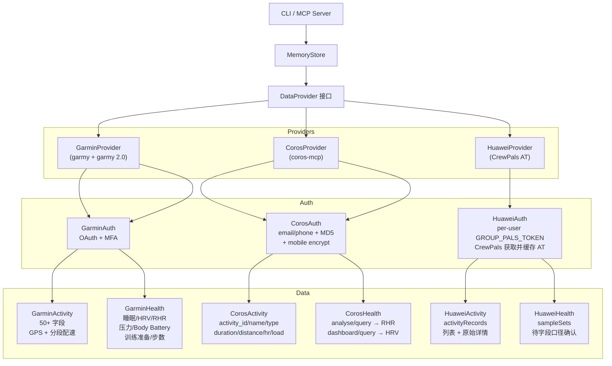

# 设计方案 — 12. 多平台数据源架构

> 属于 [设计方案索引](../design.md) · 版本 v3.1 · 2026-07-26

---

## 12. 多平台数据源架构 ⭐

### 12.1 设计目标

neurun 支持 Garmin、Coros 和 Huawei 三种运动平台，通过统一的 `DataProvider` 接口切换。
用户只需在 `.env` 中修改一行即可切换数据源：

```bash
NEURUN_PROVIDER=garmin  # 或 coros / huawei
```

### 12.2 架构



### 12.3 数据可用性对比

以下表格描述的是 **neurun 当前实际接入状态**，不等同于各平台 App 展示的全部能力。

- ✅：已读取并映射到统一字段
- ◐：已接入部分数据或语义为近似映射
- △：平台/API 可能提供，但当前 Provider 未映射
- —：当前数据源无可用映射
- 🚧：Huawei 该类数据尚未实现，最终可用性还取决于 AT 权限

#### 12.3.1 活动数据标准（`ActivityData`）

| 统一字段 | 类型 / 标准单位 | Garmin | Coros | Huawei | 对齐规则 |
|----------|-----------------|:------:|:-----:|:------:|----------|
| `activity_id` | string | ✅ | ✅ | ✅ | 保留平台原始 ID，跨平台唯一键使用 `provider + activity_id` |
| `activity_name` | string | ✅ | ✅ | ✅ | 空值使用通用运动名称，不用于类型判断 |
| `activity_type` | enum string | ✅ | ◐ | ◐ | Huawei 保留 API 原始类型；原始记录同时放入 `extra` |
| `start_time` | ISO 8601 + 时区 | ◐ | ◐ | ✅ | Huawei 毫秒时间戳转换为 UTC ISO 8601 |
| `duration_seconds` | integer, s | ✅ | ✅ | ✅ | Coros 优先使用排除暂停的 `workoutTime`，缺失时回退 `totalTime`；Huawei 无 duration 时以结束减开始计算 |
| `distance_meters` | float, m | ✅ | ✅ | ✅ | 无距离的运动使用 `0`，未知值不得伪装成实测 `0` |
| `avg_heart_rate` | integer, bpm / null | ✅ | ✅ | ✅ | 无样本或无权限时为 `null` |
| `max_heart_rate` | integer, bpm / null | ✅ | △ | ✅ | Coros 当前 summary 未映射，可能存在于详情数据 |
| `training_load` | float / 平台原值 | ✅ | ✅ | ◐ | 有返回值时映射；各平台算法不可直接横向比较 |
| `calories` | integer, kcal | ✅ | ✅ | ✅ | 统一为活动消耗；不可与全天总消耗混用 |
| `elevation_gain` | float, m | ✅ | ✅ | ✅ | 统一为累计爬升，不使用起终点海拔差替代 |
| `has_gps` | boolean | △ | △ | ◐ | Huawei 根据轨迹或定位字段判断，受详情权限影响 |
| 活动详情 | provider raw dict | ✅ 丰富 | ✅ 基础 | ✅ raw | Huawei 通过 `activityRecordId` 查询并保留原始详情 |

#### 12.3.2 每日健康数据标准（`DailyHealth`）

| 统一字段 | 类型 / 标准单位 | Garmin | Coros | Huawei | 对齐规则 |
|----------|-----------------|:------:|:-----:|:------:|----------|
| `metric_date` | 本地自然日 | ✅ | ✅ | 🚧 | 以用户时区切日，禁止直接按 UTC 日期聚合 |
| `sleep_duration_hours` | float, h | ✅ | — | 🚧 | 只计主睡眠；小睡未来放入 `extra` |
| `deep_sleep_hours` / `deep_sleep_pct` | h / % | ✅ | — | 🚧 | 百分比以总睡眠为分母 |
| `rem_sleep_hours` / `rem_sleep_pct` | h / % | ✅ | — | 🚧 | 平台无 REM 分类时保持未知，不推算 |
| `resting_heart_rate` | integer, bpm / null | ✅ | ✅ | 🚧 | 使用平台每日静息心率，不用活动最低心率替代 |
| `hrv_last_night_avg` | float, ms / null | ✅ | ✅ | 🚧 | 统一表达昨夜平均 HRV；需在 `extra` 标注 RMSSD/SDNN 口径 |
| `hrv_weekly_avg` | float, ms / null | ✅ | ◐ | 🚧 | Coros 当前以当日睡眠 HRV 同值填充，不能视为真实 7 日均值 |
| `hrv_status` | enum string | ✅ | ◐ | 🚧 | Coros 当前固定为 `balanced`，仅为占位，不参与跨平台判断 |
| `avg_stress_level` | integer / null | ✅ | ◐ | 🚧 | Coros 使用 `tiredRate` 近似映射，语义不等同 Garmin stress |
| `body_battery_high/low` | integer / null | ✅ | — | 🚧 | Garmin 专有概念，不强行映射其他平台恢复分数 |
| `total_steps` | integer, steps | ✅ | — | 🚧 | Coros 当前写入 `0` 表示未提供，不代表真实零步 |
| `total_distance_meters` | float, m | ✅ | ✅ | 🚧 | 每日总距离，不与单次活动距离混用 |
| `total_calories` | integer, kcal | ✅ | — | 🚧 | 全天总消耗，包含基础与活动消耗 |
| `active_calories` | integer, kcal | ✅ | — | 🚧 | 仅活动消耗 |
| `training_readiness_score/level` | score / label | ✅ | — | 🚧 | Garmin 专有口径；跨平台恢复判断应使用独立派生模型 |

#### 12.3.3 缺失值与跨平台比较规范

1. **缺失不等于零**：心率、HRV、睡眠、步数等未授权或未提供时应为 `null`；现有数值字段默认 `0` 是兼容性遗留，消费端需结合 Provider 能力表判断。
2. **原始值可追溯**：发生枚举、分数或近似语义映射时，在 `extra` 保存 `provider`、原始字段名、原始值和算法口径。
3. **平台分数不直接比较**：training load、stress、readiness、Body Battery 等均为平台算法结果，只能观察同平台趋势。
4. **统一物理单位**：时间用秒/小时、距离和海拔用米、能量用 kcal、心率用 bpm、HRV 用 ms。
5. **时间必须可定位**：活动时间目标格式为带时区的 ISO 8601；每日健康数据按用户本地时区聚合。
6. **能力与数据质量分离**：Provider 支持某字段，不代表当天一定有值；同步结果应分别记录 `supported`、`authorized`、`available` 状态。

### 12.4 Provider 切换

```bash
# Garmin (默认)
NEURUN_PROVIDER=garmin
NEURUN_ACCOUNT=user@gmail.com
NEURUN_PASSWORD=xxx

# Coros (中国区手机号)
NEURUN_PROVIDER=coros
NEURUN_ACCOUNT=13812345678
NEURUN_PASSWORD=xxx

# Huawei（每用户独立 CrewPals token）
NEURUN_PROVIDER=huawei
GROUP_PALS_TOKEN=xxx
HUAWEI_TOKEN_DIR=./data/user-a/huawei-tokens
```

每个 Provider 独立管理自己的数据库和 Token。切换到不同目录 + 不同 `.env` 即可隔离数据。

Huawei 使用每用户独立的 `GROUP_PALS_TOKEN`：`neurun auth` 通过 HTTPS GET
`https://api.crewpals.com/api/v1/huawei/access_token` 获取 Huawei AT。请求将原始 JWT
放入 `Authorization` header，不添加 `Bearer` 前缀，
返回的 token 保存到 `HUAWEI_TOKEN_DIR/huawei-oauth.json`，权限为 `0600`。本地 AT 有效时
直接复用，过期或缺失时重新向 CrewPals 获取；不再使用第三方 OAuth 回调流程。
默认 `HUAWEI_TOKEN_DIR` 使用 `GROUP_PALS_TOKEN` 的 SHA-256 摘要前 16 位作为目录键，
在不暴露 token 的前提下隔离不同用户；显式配置路径时由调用方保证用户隔离。
预发布响应使用 `data.accessToken/refreshToken/expiredAt/openId`，Provider 写盘前归一化为
snake_case，同时保留对早期扁平 snake_case 响应的兼容。

Token store 生命周期规则：

- `neurun init` 为当前配置选择并创建独立的 `HUAWEI_TOKEN_DIR`，目录权限为 `0700`。
- `neurun auth` 在认证前执行相同检查，目录缺失时自动创建。
- 已有 `huawei-oauth.json` 必须是包含 `access_token` 的 JSON object，否则立即报告文件路径和原因。
- 已有 token 文件权限自动收紧为 `0600`；空 token 文件不会被预创建。
- Token 兼容 `expired_at` / `expires_at` 和 `open_id` / `openid` 两套命名；若存在数值 `user_id`，优先作为统一用户 ID。
- 用户隔离必须覆盖 token、SQLite、memory 和 output，不能只通过 token 文件名区分用户。
- 显式设置 `NEURUN_HOME` 时不加载全局 `~/.neurun/.env`，避免不同用户的账号和密码互相补入。

Web 多用户模式下，用户在绑定 Huawei 时输入的 `GROUP_PALS_TOKEN` 不写入用户注册
JSON，而是原子写入该用户的 `huawei-tokens/group-pals-token`，目录权限为 `0700`、
文件权限为 `0600`。后续请求和进程重启从该文件恢复，服务级 `GROUP_PALS_TOKEN`
只作为单用户 CLI 或旧部署的兼容回退，不能覆盖已经存在的用户级凭证。

### 12.4.1 三平台认证初始化契约

所有 Provider 必须遵循相同顺序：

1. 从当前用户专属目录恢复 Token；
2. 调用 `provider.authenticate()` 验证或刷新认证；
3. 仅在认证成功后读取 `provider.user_id`；
4. 使用该 `user_id` 初始化同步、SQLite 查询和写入；
5. 认证失败时停止同步，将 Web 用户连接状态标记为 `expired`，并返回 HTTP 401 的重新绑定提示。

禁止把 `user_id=0`、服务级凭证或尚未初始化的认证客户端作为同步降级值。Garmin 的
`AuthClient`、Coros 的 `StoredAuth` 和 Huawei 的本地 AT 都必须先通过各自认证检查。

### 12.5 Huawei 数据 API 接入细节

通过 Huawei 云端接口的真实参数校验确认：

- Base URL：`https://health-api.cloud.huawei.com/healthkit/v2`
- 活动列表：GET `/activityRecords`，参数为毫秒 `startTime/endTime`；该接口带 `limit` 时要求私有游标式 `order`，因此当前按日期窗口获取完整列表
- 活动详情：GET `/activityRecords?activityRecordId=<id>`；服务仍可能返回集合，Provider 按原始 ID 精确筛选；`/activityRecords/<id>` 对 GET 返回 405
- 指标样本：GET `/sampleSets`，同样使用毫秒时间戳和 `order=startTime`，尚未写入每日健康模型
- 健康记录：GET `/healthRecords`，数据类型参数名为 `dataType`；当前 AT 对 sleep record 返回权限不足

Huawei API 返回字段存在嵌套差异，Provider 对 ID、名称、类型、起止时间、距离、心率、
卡路里和爬升使用兼容映射，并将完整原始记录保存在 `ActivityData.extra.raw`。

### 12.6 Coros API 接入细节

基于 `coros-mcp` 库（MIT 协议，GitHub: cygnusb/coros-mcp）：

- **认证**：POST `/account/login`，MD5 密码 + mobile encrypt fallback
- **Web Token 隔离**：绑定成功后将 `StoredAuth` 保存到
  `data/<api_key>/tokens/coros-auth.json`；目录权限为 `0700`，文件权限为 `0600`。
  后续同步不保存或重用明文密码，而是从当前用户目录恢复 token
- **旧 Token 迁移**：用户目录尚无 token 且系统中只有一个 active Coros 用户时，
  `/api/sync` 可将 coros-mcp 旧版全局 token 一次性迁入该用户目录；多个 Coros
  用户时跳过自动迁移，避免错误共享凭证
- **活动列表**：GET `/activity/query`，日期格式 `YYYYMMDD`（无连字符）；Rundown
  直接保留原始 `workoutTime` 和 `totalTime`，因为 coros-mcp 的 `ActivitySummary`
  当前只暴露 `totalTime`
- **活动时长**：统一 `duration_seconds` 使用 `workoutTime`（排除暂停）；仅当该字段
  缺失、为零或大于 `totalTime` 时回退 `totalTime`。`extra` 同时记录
  `workout_time_seconds`、`total_time_seconds` 和派生的 `paused_seconds`
- **已有活动修正**：非 Garmin 同步遇到已存在的 `activity_id` 时会比较并更新
  `duration_seconds`，因此重新同步即可修正旧数据，无需删除数据库
- **HRV 数据**：GET `/dashboard/query`，返回 7 天 HRV
- **每日指标**：GET `/analyse/query`，返回 RHR/距离/时长/负荷/VO2max
- **睡眠**：依赖库可访问 Mobile API，但当前 `CorosHealth` 尚未映射到 `DailyHealth`

已知限制：
- Web 同步必须将 `UserRecord.provider` 注入 `UserConfig.provider`，用户级 provider
  优先于服务级 `NEURUN_PROVIDER`，避免 Coros 用户误入 Garmin 同步链路
- Coros 虽然会在构造时恢复 `StoredAuth`，仍必须先执行统一的 `authenticate()` 契约，
  不得在 Token 缺失时以 `user_id=0` 继续初始化本地同步
- `/activity/query` 日期参数必须 `YYYYMMDD` 格式
- Coros token 失效或活动接口返回非 `0000` 时同步必须失败并提示重新绑定，禁止把
  空活动列表误报为同步成功；`result=1019` 会把 `UserRecord.token_status` 更新为
  `expired`，使 `/setup` 可以在原用户目录中重新完成绑定
- 睡眠数据即使已取得 mobile token，当前 neurun 仍不会写入统一健康模型
- 身体电量和训练准备仅 Garmin 已映射；Coros `tiredRate` 只近似放入压力字段

---
