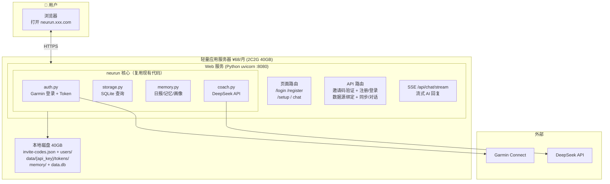
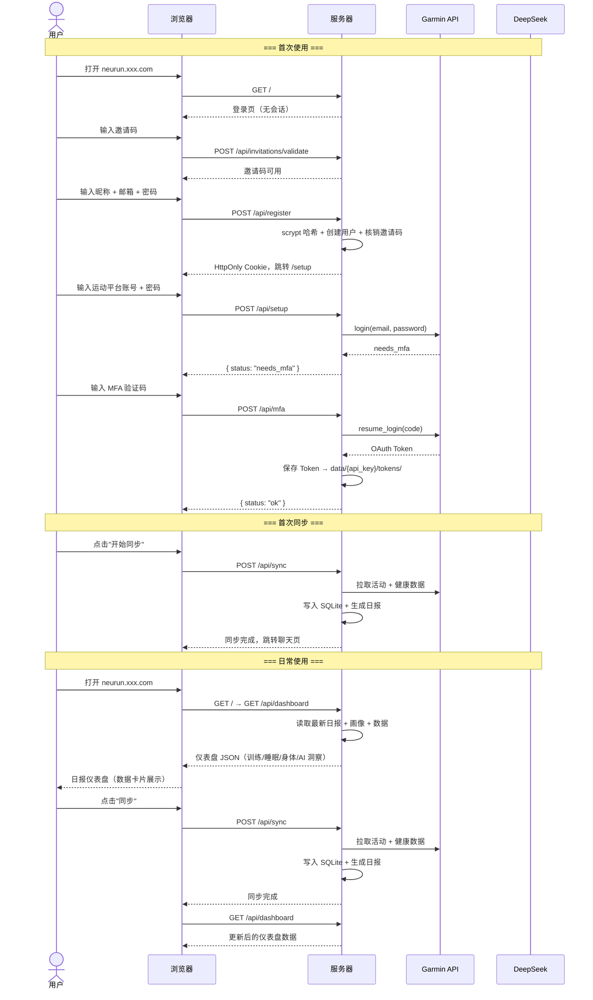

# 设计方案 — 13. Web Chat 部署方案（多用户）

> 版本: v2.1 · 更新日期: 2026-07-21 · 状态: 已实现

---

## 1. 背景与目标

将 neurun 部署到阿里云轻量应用服务器（或同等廉价 VPS），通过 **Web Chat 页面**直接面向普通用户，
不需要任何 AI 客户端（Claude Desktop / OpenClaw）。用户打开浏览器 → 邀请注册/登录 →
绑定运动平台 → 直接和 AI 教练对话。

**初期约束**：低成本（月费 < ¥100）、不引入中间件、零前端框架依赖。

---

## 2. 整体架构



---

## 3. 用户流程



---

## 4. 数据隔离

```
服务器本地磁盘 /app/data/
├── invite-codes.json         ← 管理员维护，成功注册后记录 used_by/used_at
├── users/
│   ├── rd_abc.json           ← 昵称、登录邮箱、密码哈希、平台状态
│   └── rd_xyz.json
├── rd_abc/
│   ├── tokens/
│   │   ├── oauth1_token.json
│   │   ├── oauth2_token.json
│   │   └── coros-auth.json       # Coros 用户绑定 token（0600）
│   ├── memory/
│   │   ├── auto/daily/...
│   │   ├── profile/...
│   │   └── goals/...
│   └── data.db              ← SQLite
├── rd_xyz/
│   ├── tokens/...
│   ├── memory/...
│   └── data.db
└── backup/                   ← 灾备（同步到 OSS，可选）
    ├── rd_abc.db
    └── rd_xyz.db
```

VPS 磁盘是持久化的，容器重启不丢。OSS 仅作为灾备，初期可跳过。

---

## 5. 源码改动

### 5.1 新增文件

| 文件 | 说明 |
|------|------|
| `src/users.py` | 用户管理器 |
| `src/invitations.py` | 邀请码 JSON 校验与原子核销 |
| `src/web.py` | Web 页面 + API 路由 |
| `web/templates/auth.html` | 登录 + 两步邀请注册页面 |
| `web/templates/chat.html` | 日报仪表盘页面（纯 HTML + CSS + JS） |
| `web/templates/setup.html` | 多步初始化向导（数据源绑定 + 个人资料 + 目标） |
| `Dockerfile` | 容器镜像 |
| `docker-compose.yml` | 一键部署 |

### 5.2 修改文件

| 文件 | 改动 |
|------|------|
| `src/config.py` | + `non_interactive` + `UserConfig` 多用户路径 + 邀请码文件配置 |
| `src/auth.py` | `start_login()` / `complete_mfa()` 两步拆分 |
| `src/storage.py` | + `backup_to()` / `restore_from()` |
| `src/providers/garmin.py` | `non_interactive` 参数传递 |
| `src/main.py` | + `cmd_serve` Web 服务入口 |

### 5.3 不改的文件

`src/mcp_server.py`、`src/memory.py`、`src/coach.py`、`src/render.py`、`src/image.py`、`src/activity.py`

---

## 6. 核心模块

### 6.1 `src/users.py`

```python
class UserManager:
    def __init__(self, data_dir: str):
        """data_dir: /app/data/"""

    def register_account(self, nickname: str, email: str, password: str) -> UserRecord:
        """创建带 scrypt 密码哈希的应用账号。"""

    def authenticate(self, email: str, password: str) -> UserRecord | None:
        """校验应用账号。"""

    def get(self, key: str) -> UserRecord | None:
        """通过 API key 查找用户。"""

    def get_token_dir(self, key: str) -> str: ...
    def get_memory_dir(self, key: str) -> str: ...
    def get_db_path(self, key: str) -> str: ...
```

用户标识：服务端生成 `rd_xxxx` 格式的 API key，写入 HttpOnly Cookie。不依赖微信 openid。
登录邮箱和运动平台邮箱分别存储，应用账号密码只保留 `scrypt` 哈希。

### 6.2 `src/web.py` — HTTP 层

复用你现有的 `render.py` 风格——手写 HTML + 内嵌 CSS，不引入前端框架。

```python
# 页面路由（服务端渲染 HTML）
@server.custom_route("/", methods=["GET"])
async def index(request): ...
    # 已绑定用户 → 日报仪表盘（chat.html）
    # 无会话 → /login；已登录但未绑定 → /setup

@server.custom_route("/login", methods=["GET"])
@server.custom_route("/register", methods=["GET"])

@server.custom_route("/setup", methods=["GET"])
async def setup_page(request): ...

# API 路由（JSON）
@server.custom_route("/api/invitations/validate", methods=["POST"])
@server.custom_route("/api/register", methods=["POST"])
@server.custom_route("/api/login", methods=["POST"])

@server.custom_route("/api/setup", methods=["POST"])
async def api_setup(request): ...
    # 先校验应用会话，再绑定 Garmin / Coros / Huawei；不得隐式注册

@server.custom_route("/api/mfa", methods=["POST"])
async def api_mfa(request): ...

@server.custom_route("/api/dashboard", methods=["GET"])
async def api_dashboard(request): ...
    # 返回日报仪表盘 JSON（训练/睡眠/身体状态/AI 洞察）

@server.custom_route("/api/profile", methods=["POST"])
async def api_profile(request): ...
    # 保存个人资料 + 最佳成绩

@server.custom_route("/api/goals", methods=["POST"])
async def api_goals(request): ...
    # 保存训练目标

@server.custom_route("/api/preferences", methods=["POST"])
async def api_preferences(request): ...
    # 保存训练偏好

@server.custom_route("/api/sync", methods=["POST"])
async def api_sync(request): ...
    # 从用户注册表注入 provider；不得回退成服务级默认 provider
    # 单一 Coros 用户升级时，可安全迁移旧版全局 token；多用户时禁止猜测归属
    # mode=single: date → 精确单日，内部 sync_days=0
    # mode=batch: from_date/to_date → 包含首尾日期的精确范围
    # 未提供 mode 时兼容旧版 date/sync_days/full/skip_sync

@server.custom_route("/api/status", methods=["GET"])
async def api_status(request): ...

@server.custom_route("/api/logout", methods=["POST"])
async def api_logout(request): ...
```

**为什么不用 Flask/FastAPI？** FastMCP 内置的 uvicorn + Starlette 完全够用，
`custom_route` 注册路由。零额外依赖。

### 6.3 `src/auth.py` — MFA 两步

```python
class AuthManager:
    def start_login(self, email, password, token_dir) -> str:
        """返回 "ok" 或 "needs_mfa"。"""

    def complete_mfa(self, mfa_code: str) -> None:
        """完成登录，Token 落盘。"""
```

MFA 中间状态存内存 dict（5 分钟过期），容器重启丢失，用户重新发起即可。

### 6.4 `src/coach.py` — 流式对话

现有 `coach.py` 是一次性返回 JSON。新增流式版本：

```python
async def chat_stream(messages: list[dict], context: str) -> AsyncIterator[str]:
    """流式 AI 对话，SSE 逐块输出。"""
    # 调用 DeepSeek API stream=true
    # 每次 yield 一个 token
```

---

## 7. 日报仪表盘页面

一个自包含的 HTML 文件，全部内嵌——零构建、零依赖、零 CDN：

```
web/templates/chat.html    (~300行)
├── CSS: 移动端优先，暗色主题（跑步场景护眼）
├── HTML: 训练概览卡片 + 身体指标 + 睡眠 + AI 洞察
├── JS:  GET /api/dashboard 加载数据 → 渲染卡片
└── 交互: 同步按钮 → POST /api/sync
```

首页不再是聊天界面，而是**日报仪表盘**——展示昨日训练、睡眠评分、
身体状态（RHR/HRV/电量/训练准备）、训练负荷与恢复、AI 教练洞察。
用户看到的是结构化的数据卡片，而非对话消息列表。

同步管理页 `web/templates/sync.html` 提供两个明确入口：

| 模式 | 请求字段 | 后端标准化 | 报告日期 |
|------|----------|------------|----------|
| 单日同步 | `mode=single`, `date` | `start=end=date`, `sync_days=0` | `date` |
| 批量同步 | `mode=batch`, `from_date`, `to_date` | `sync_days=(to-from).days`，范围包含首尾，并逐日调用 `MemoryStore.generate_daily_report` | 范围内每一天 |

日期缺失、格式错误、开始日期晚于结束日期或范围超过 3 年时，API 返回 HTTP 400 和
可操作的 JSON 错误信息。两种模式都允许 `force=true` 强制覆盖相应范围的数据。
批量模式的主流程先为 `to_date` 生成报告并调用在线 AI 教练，再由
`_generate_batch_reports()` 补建其余历史日期；历史报告只使用 `MemoryWriter` 的本地
规则洞察，避免 N 天范围产生 N 次外部 AI 调用。响应以 `reports_generated` 返回实际
逐日报告数量，`/api/reports` 因而能展示整个批量范围。

风格参考你现有的 `render.py` 设计品味——简洁、大气、运动感。

---

## 8. 部署

### Docker Compose 一键启动

```yaml
# docker-compose.yml
version: "3"
services:
  neurun:
    build: .
    ports:
      - "8080:8080"
    volumes:
      - ./data:/app/data          # 持久化
    environment:
      - NEURUN_DATA_DIR=/app/data
      - NEURUN_INVITE_CODES_FILE=/app/data/invite-codes.json
      - DEEPSEEK_API_KEY=${DEEPSEEK_API_KEY}
    restart: unless-stopped
```

```bash
# 启动服务后，通过本地 CLI 创建首个邀请码
git clone <repo>
cd neurun
echo "DEEPSEEK_API_KEY=sk-xxx" > .env
docker compose up -d
docker compose exec neurun neurun invite create --output json
```

### 加 HTTPS

```bash
# Caddy 反向代理，自动申请 Let's Encrypt 证书
# Caddyfile:
# neurun.xxx.com {
#     reverse_proxy localhost:8080
# }
```

---

## 9. 成本

| 项目 | 方案 | 月费 |
|------|------|------|
| 服务器 | 阿里云轻量应用服务器 2C2G 40GB | ¥68 |
| 域名 | `.com` / `.cn` | ~¥5 |
| 备份 | OSS（可选，灾备用） | ~¥5 |
| **合计** | | **~¥78/月** |

---

## 10. 为什么不用框架 / 中间件

| 传统方案 | 本方案 | 省了什么 |
|----------|--------|---------|
| Flask/FastAPI | FastMCP 内置 uvicorn | 额外 Web 框架 |
| React/Vue 前端 | 一个 HTML 文件 | 前端构建工具链 |
| MySQL/PostgreSQL | SQLite 每用户一个文件 | 数据库服务 |
| Redis Session | Cookie + 服务端 dict | 缓存中间件 |
| Nginx | Caddy 自动 HTTPS | 反向代理配置 |
| 微信小程序 | Web Chat 响应式 | 审核 + 双端开发 |

---

## 11. 验证计划

```bash
# 本地
docker compose up -d
curl -I http://localhost:8080/  # → 302 /login
# 浏览器完成邀请码注册、数据源绑定与对话

# 多用户
# 两个浏览器（或无痕窗口）用不同邀请码注册并绑定不同运动平台账号
# 验证数据隔离 + AI 回复互不干扰

pytest  # 零失败
```

---

> **关联文档**：[index.md](index.md) · [03-architecture.md](03-architecture.md) · [04-modules.md](04-modules.md) · [memory-system.md](memory-system.md) · [ai-coaching.md](ai-coaching.md)
