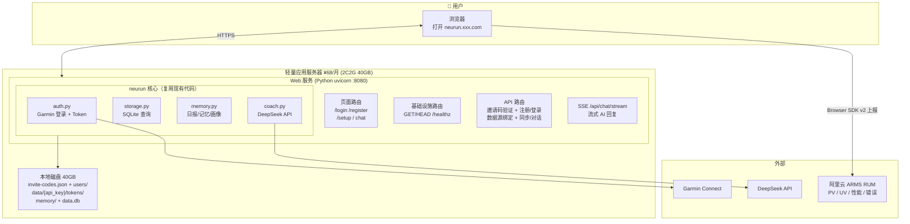
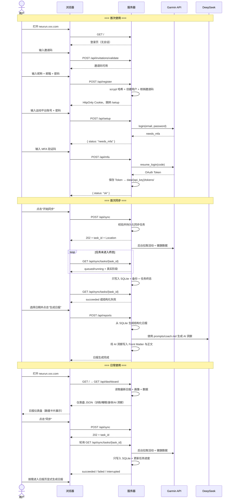
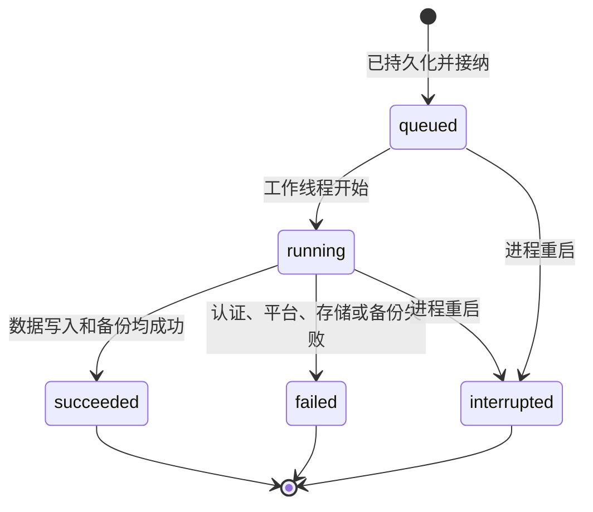

# 设计方案 — 13. Web Chat 部署方案（多用户）

> 版本: v3.2 · 更新日期: 2026-07-29 · 状态: 代码已实现并通过本地验证；ECS 验收待完成

---

## 1. 背景与目标

将 neurun 部署到阿里云轻量应用服务器（或同等廉价 VPS），通过 **Web Chat 页面**直接面向普通用户，
不需要任何 AI 客户端（Claude Desktop / OpenClaw）。用户打开浏览器 → 邀请注册/登录 →
绑定运动平台 → 直接和 AI 教练对话。

**初期约束**：低成本（月费 < ¥100）、不引入中间件、零前端框架依赖。

---

## 2. 整体架构



---

## 3. 用户流程

以下绑定、日报和日常流程均已在代码中实现；异步同步片段仍需发布后完成 ECS 真实数据源验收。



---

## 4. 数据隔离

```
服务器本地磁盘 /app/data/
├── invite-codes.json         ← 管理员维护，成功注册后记录 used_by/used_at
├── users/
│   ├── rd_abc.json           ← 昵称、登录邮箱、密码哈希、平台状态
│   └── rd_xyz.json
├── rd_abc/
│   ├── tokens/
│   │   ├── oauth1_token.json
│   │   ├── oauth2_token.json
│   │   └── coros-auth.json       # Coros 用户绑定 token（0600）
│   ├── huawei-tokens/
│   │   ├── group-pals-token      # Huawei 每用户 CrewPals 凭证（0600）
│   │   └── huawei-oauth.json     # Huawei AT（0600）
│   ├── memory/
│   │   ├── auto/daily/...
│   │   ├── profile/...
│   │   └── goals/...
│   ├── sync-tasks.json      ← 最近同步任务与进度（0600）
│   └── data.db              ← SQLite
├── rd_xyz/
│   ├── tokens/...
│   ├── memory/...
│   └── data.db
└── backup/                   ← 灾备（同步到 OSS，可选）
    ├── rd_abc.db
    └── rd_xyz.db
```

VPS 磁盘是持久化的，容器重启不丢。OSS 仅作为灾备，初期可跳过。
`data/` 下的目录统一为 `0700`，敏感文件统一为 `0600`，Web 服务、邀请码 CLI 和
部署脚本必须使用同一个低权限运行用户；不得用 root 在另一工作目录生成第二套数据。

---

## 5. 源码改动

### 5.1 新增文件

| 文件 | 说明 |
|------|------|
| `src/users.py` | 用户管理器 |
| `src/invitations.py` | 邀请码 JSON 校验与原子核销 |
| `src/web.py` | Web 页面 + API 路由 |
| `web/templates/auth.html` | 登录 + 两步邀请注册页面 |
| `web/templates/chat.html` | 日报仪表盘页面（纯 HTML + CSS + JS） |
| `web/templates/setup.html` | 多步初始化向导（数据源绑定 + 个人资料 + 目标） |
| `Dockerfile` | 容器镜像 |
| `docker-compose.yml` | 一键部署 |

### 5.2 修改文件

| 文件 | 改动 |
|------|------|
| `src/config.py` | + `non_interactive` + `UserConfig` 多用户路径 + 邀请码文件配置 |
| `src/auth.py` | `start_login()` / `complete_mfa()` 两步拆分 |
| `src/storage.py` | + `backup_to()` / `restore_from()`；从用户 SQLite 解析唯一平台用户 ID |
| `src/providers/garmin.py` | `non_interactive` 参数传递 |
| `src/main.py` | + `cmd_serve` Web 服务入口；拆分纯同步与日报生成核心流程 |
| `src/memory.py` | 日报生成接口透传在线 AI 洞察，以同一洞察重新渲染正文 |
| `src/web.py` | 分离 `POST /api/sync` 与 `POST /api/reports` 的职责；统一向 HTML 页面注入 ARMS RUM |

### 5.3 不改的文件

`src/mcp_server.py`、`src/coach.py`、`src/render.py`、`src/image.py`、`src/activity.py`

### 5.4 异步同步任务改动

| 文件 | 改动 |
|------|----------|
| `src/sync_tasks.py` | 新增用户隔离的任务模型、原子 JSON 持久化、终态和重启中断恢复 |
| `src/sync_coordinator.py` | 从等待式 `run()` 扩展为接纳后返回的 `submit()`，持有后台任务强引用并继续执行 4/100 与 singleflight |
| `src/web.py` | `POST /api/sync` 返回 202；新增任务查询路由并映射 409/503/404 |
| `src/main.py` | 为认证、指标、活动和备份边界增加可选进度回调，不改变 CLI 默认同步行为 |
| `web/templates/sync.html` | 保存活动任务 ID、轮询状态、刷新恢复并区分排队/运行/成功/失败/中断 |
| `tests/test_sync_tasks.py`、`tests/test_sync_coordinator.py`、`tests/test_web.py` | 覆盖持久化、状态机、隔离、重启、轮询合同和资源回收 |

本期不修改 CLI 命令或参数，因此无需改变现有 MCP tool 合同；CLI 与 MCP 继续等待同步完成并返回
最终结果。若后续也要提供异步 CLI，必须单独设计可脚本化的 `submit/status` 命令及对应 MCP tools。

---

## 6. 核心模块

### 6.1 `src/users.py`

```python
class UserManager:
    def __init__(self, data_dir: str):
        """data_dir: /app/data/"""

    def register_account(self, nickname: str, email: str, password: str) -> UserRecord:
        """创建带 scrypt 密码哈希的应用账号。"""

    def authenticate(self, email: str, password: str) -> UserRecord | None:
        """校验应用账号。"""

    def get(self, key: str) -> UserRecord | None:
        """通过 API key 查找用户。"""

    def get_token_dir(self, key: str) -> str: ...
    def get_memory_dir(self, key: str) -> str: ...
    def get_db_path(self, key: str) -> str: ...
```

用户标识：服务端生成 `rd_xxxx` 格式的 API key，写入 HttpOnly Cookie。不依赖微信 openid。
登录邮箱和运动平台邮箱分别存储，应用账号密码只保留 `scrypt` 哈希。

### 6.2 `src/web.py` — HTTP 层

复用你现有的 `render.py` 风格——手写 HTML + 内嵌 CSS，不引入前端框架。

```python
# 基础设施路由（无会话、用户数据或外部服务依赖）
@server.custom_route("/healthz", methods=["GET", "HEAD"])
async def healthz(request): ...
    # GET → 200 {"status": "ok"}
    # HEAD → 200，无响应体

# 页面路由（服务端渲染 HTML）
@server.custom_route("/", methods=["GET"])
async def index(request): ...
    # 已绑定用户 → 日报仪表盘（chat.html）
    # 无会话 → /login；已登录但未绑定 → /setup

@server.custom_route("/login", methods=["GET"])
@server.custom_route("/register", methods=["GET"])

@server.custom_route("/setup", methods=["GET"])
async def setup_page(request): ...

# API 路由（JSON）
@server.custom_route("/api/invitations/validate", methods=["POST"])
@server.custom_route("/api/register", methods=["POST"])
@server.custom_route("/api/login", methods=["POST"])

@server.custom_route("/api/setup", methods=["POST"])
async def api_setup(request): ...
    # 先校验应用会话，再绑定 Garmin / Coros / Huawei；不得隐式注册

@server.custom_route("/api/mfa", methods=["POST"])
async def api_mfa(request): ...

@server.custom_route("/api/dashboard", methods=["GET"])
async def api_dashboard(request): ...
    # 返回日报仪表盘 JSON（训练/睡眠/身体状态/AI 洞察）

@server.custom_route("/api/profile", methods=["POST"])
async def api_profile(request): ...
    # 保存个人资料 + 最佳成绩

@server.custom_route("/api/goals", methods=["POST"])
async def api_goals(request): ...
    # 保存训练目标

@server.custom_route("/api/preferences", methods=["POST"])
async def api_preferences(request): ...
    # 保存训练偏好

# /setup 首次设置仅强制绑定运动平台；个人资料、目标和偏好默认收起且可跳过，
# 用户之后可从 /profile（“我的”）调用同一组 API 补填

@server.custom_route("/api/sync", methods=["POST"])
async def api_sync(request): ...
    # 从用户注册表注入 provider；不得回退成服务级默认 provider
    # 单一 Coros 用户升级时，可安全迁移旧版全局 token；多用户时禁止猜测归属
    # mode=single: date → 精确单日，内部 sync_days=0
    # mode=batch: from_date/to_date → 包含首尾日期的精确范围
    # 只同步和持久化数据，不生成或覆盖日报
    # 未提供 mode 时兼容旧版 date/sync_days/full
    # 阻塞式平台请求与 SQLite 写入通过 SyncCoordinator 移出事件循环
    # 默认最多 4 个不同用户执行、100 个不同用户执行或排队
    # 持久化并接纳后返回 202 + task_id + Location，不等待同步完成
    # 同用户重复请求返回 409 + 现有 task_id；全局容量超限返回 503

@server.custom_route("/api/sync/tasks/{task_id}", methods=["GET"])
async def api_sync_task(request): ...
    # 只允许当前登录用户读取自己的任务；跨用户或未知任务统一返回 404
    # queued/running 返回 Retry-After: 1；所有响应 Cache-Control: no-store

@server.custom_route("/api/reports", methods=["POST"])
async def api_report_generate(request): ...
    # 用户显式选择 date，只读取本地 SQLite，不触发平台同步
    # 结构化日报生成后，用 prompts/coach.md 生成在线 AI 洞察
    # AI 成功时重新渲染正文；未配置或调用失败时保留本地规则兜底

@server.custom_route("/api/status", methods=["GET"])
async def api_status(request): ...

@server.custom_route("/api/logout", methods=["POST"])
async def api_logout(request): ...
```

**为什么不用 Flask/FastAPI？** FastMCP 内置的 uvicorn + Starlette 完全够用，
`custom_route` 注册路由。零额外依赖。

`/healthz` 是进程存活检查，不是业务就绪检查：它不得读取 Cookie、用户注册表、SQLite，
也不得调用 Garmin、Coros、Huawei 或 DeepSeek。负载均衡只用它判断 Web 进程能否响应 HTTP；
业务依赖故障应由各 API 自身的错误和监控暴露。所有同步中的阻塞式网络和磁盘工作
必须在受控工作线程中执行，不得占用运行 `/healthz` 的 asyncio 事件循环。

#### 6.2.1 Web 同步调度与容量

`SyncCoordinator` 是单 Web 进程内的同步准入与执行边界：

- `NEURUN_SYNC_MAX_CONCURRENCY` 默认为 `4`，控制同时在工作线程执行的不同用户同步；
- `NEURUN_SYNC_MAX_PENDING` 默认为 `100`，控制执行中与等待中的不同用户总数；
- `NEURUN_COROS_CREDENTIAL_KEY` 为可选但启用 Coros Training Hub 与 Mobile 自动鉴权所必需的 Fernet key；
  ECS 通过 `/etc/neurun/neurun.env` 注入，文件权限 `0600`，不得放入 `/var/lib/neurun`、源码、
  release 或数据备份。部署不得自动生成或轮换该值；密钥丢失时只能由用户重新授权生成新密文；
- 用户从准入开始到请求结束始终占用一个 singleflight 名额，重复请求不进入工作线程；
- 容量不足时快速失败，不在事件循环中忙等待；
- 工作函数在 `finally` 中关闭 Provider HTTP Session、`Storage` 及 SQLAlchemy engine，
  成功时在关闭前完成 SQLite 备份。

当前队列是单进程内边界。以下 6.2.2 在保留单进程、单 ECS 和现有 4/100 容量边界的前提下，
提供轻量任务持久化与轮询合同；它不扩展为多实例协调系统。

#### 6.2.2 异步任务、进度与轮询

##### 接口合同

`POST /api/sync` 在完成会话、参数、singleflight、容量和任务记录持久化后返回：

```http
HTTP/1.1 202 Accepted
Location: /api/sync/tasks/st_01...
Cache-Control: no-store
```

```json
{
  "status": "queued",
  "task_id": "st_01...",
  "mode": "batch",
  "from_date": "2026-06-29",
  "to_date": "2026-07-29",
  "links": {"self": "/api/sync/tasks/st_01..."}
}
```

HTTP 202 只证明任务已持久化并被当前进程接纳。参数错误仍返回 400，连接已失效返回 401，
同用户已有任务返回 409，容量超限返回 503。409 响应增加现有 `task_id` 和 `links.self`，前端
据此恢复轮询；409/503 均不得新建任务文件或后台协程。

`GET /api/sync/tasks/{task_id}` 成功查询统一返回 200。任务失败是成功读取到的业务终态，不用
HTTP 500 表达：

```json
{
  "task_id": "st_01...",
  "status": "running",
  "stage": "syncing_metrics",
  "progress": {
    "kind": "stage",
    "current": 2,
    "total": 4,
    "label": "正在同步健康指标",
    "items": {
      "current": 286,
      "total": 660,
      "date": "2026-04-26",
      "metric": "stress",
      "outcome": "completed"
    }
  },
  "mode": "batch",
  "from_date": "2026-06-29",
  "to_date": "2026-07-29",
  "created_at": "2026-07-29T08:00:00Z",
  "started_at": "2026-07-29T08:00:01Z",
  "updated_at": "2026-07-29T08:00:08Z",
  "finished_at": null,
  "result": null,
  "error": null
}
```

终态 `failed` / `interrupted` 的 `error` 固定包含 `code`、脱敏 `message`、`retryable` 和
`action`；`succeeded` 的 `result` 包含实际同步范围和日历刷新月份。未知任务或其他用户的任务
统一返回 404，防止通过 task ID 探测账号。所有响应使用 `Cache-Control: no-store`；
`queued/running` 响应增加 `Retry-After: 1`。

##### 状态机与真实进度



`status` 只使用 `queued`、`running`、`succeeded`、`failed`、`interrupted`。`stage` 使用
`queued`、`authenticating`、`syncing_metrics`、`syncing_activities`、`backing_up`、`done`。
`progress.current/total` 表示已经跨过的四个真实阶段，不把阶段比例描述为数据量或剩余时间。
Garmin 指标阶段通过 garmy Reporter 钩子在 `progress.items` 返回真实的已处理项数、总项数、最近日期、
指标和结果；已处理包含完成、跳过和失败事件。该嵌套结构不改变顶层阶段总数，前端用独立细进度条
呈现。Coros 活动阶段的 `items` 表示平台分页已返回的记录数，健康阶段表示已聚合的日期数；
`metric` 分别为 `activities` 和 `daily_health`。不得使用运行秒数推算百分比。

核心同步函数接受可选的同步进度回调；CLI/MCP 不传回调时行为不变。阶段回调写入任务记录；garmy
适配器按日期变化、至少一秒间隔或最终项上报逐项快照，避免每个快速跳过项都执行 `fsync`。
Coros 回调在 Provider 内部按页或按日产生，在主流程按首次、至少一秒间隔和最终项节流；
回调不传递凭证、邮箱或第三方原始响应，也不能因进度持久化失败掩盖主同步错误。

##### 持久化与执行模型

- 每个用户目录保存权限为 `0600` 的 `sync-tasks.json`，通过现有同目录原子替换工具写入；任务
  ID 使用足够随机的 `st_` 前缀标识，文件只保留最近 50 条或 7 天内任务。
- 任务记录包含范围、force、状态、阶段、结构化错误、时间戳和本次 `runner_instance_id`，不保存
  API Key、Cookie、账号、平台 Token 或原始响应。
- `SyncCoordinator.submit()` 在同一临界区完成 singleflight/容量占位和任务注册，再创建受控后台
  协程；只有两步都成功才返回 202。后台协程必须由 coordinator 集合持有强引用并消费异常。
- 阻塞同步继续在线程池执行。终态顺序为：Provider 写入/SQLite 备份完成或抛错 → `finally`
  释放 Provider 与 Storage 资源 → 写 `succeeded` 或 `failed` → 释放 singleflight 名额。任务查询
  不得在备份或资源回收完成前看到成功。
- 单 ECS 启动时生成新的 `runner_instance_id`；读取或启动扫描发现旧实例遗留的
  `queued/running` 任务时原子改为 `interrupted`。本期不自动恢复，避免重复调用第三方平台。
- 同步日历的 `pending/completed/failed` 仍表达日期覆盖状态；任务排队时不提前把日期标成
  `pending`，开始执行后才由核心同步更新。任务面板负责展示 `queued`。

##### 前端轮询与恢复

- 收到 202 后把 `task_id` 保存到当前浏览器的同步页状态并立即渲染“已排队”，1 秒后开始轮询；
- `queued/running` 按 `Retry-After` 继续查询；临时网络失败采用 1、2、4、5 秒上限退避，不能重新
  POST；页面重新可见时立即补一次查询；
- 页面刷新后先恢复保存的 `task_id`。查询 404 时清理本地记录；终态时停止轮询、清理活动 ID，
  成功时刷新相关月份日历，失败或中断时展示重试按钮；
- `progress.items` 存在时，阶段条仍固定为四段，另显示已处理项百分比、日期和指标；刷新后直接使用
  轮询响应中的持久化快照恢复，不从本地计时器重建；
- 轮询只更新任务卡和进度，不触发日报生成。用户关闭页面不会取消后台任务。

##### 测试与发布验证

- API 合同测试覆盖 202/Location、200 轮询、409 携带已有任务、503 不创建任务、跨用户 404；
- 状态机测试覆盖合法转换、原子写入失败、后台异常消费、备份失败不得标成功和终态资源释放；
- 重启测试用新的 `runner_instance_id` 验证旧 `queued/running` 变成 `interrupted`；
- 前端合同测试覆盖刷新恢复、轮询退避、终态停轮询和一次 POST；
- 进度适配测试覆盖 Garmin 完成/跳过/失败及 Coros 分页/逐日事件、节流和最终项；轮询合同验证嵌套
  `progress.items` 可持久化；
- 本地完整 `pytest` 通过后仍需做 ECS 验收：POST 快速返回、真实 Garmin 国际区任务持续运行、
  轮询可见阶段、`/healthz` 及时响应、任务结束后 FD 回落；验收前不得宣称线上已发布。

### 6.3 `src/auth.py` — MFA 两步

```python
class AuthManager:
    def start_login(self, email, password, token_dir) -> str:
        """返回 "ok" 或 "needs_mfa"。"""

    def complete_mfa(self, mfa_code: str) -> None:
        """完成登录，Token 落盘。"""
```

MFA 中间状态存内存 dict（5 分钟过期），容器重启丢失，用户重新发起即可。
每次发起新登录前清理过期状态并关闭其 HTTP Session；完成、失败或主动清理的登录也必须显式释放客户端资源。

### 6.4 `src/coach.py` — 流式对话

现有 `coach.py` 是一次性返回 JSON。新增流式版本：

```python
async def chat_stream(messages: list[dict], context: str) -> AsyncIterator[str]:
    """流式 AI 对话，SSE 逐块输出。"""
    # 调用 DeepSeek API stream=true
    # 每次 yield 一个 token
```

---

## 7. 日报仪表盘页面

业务页面保持自包含——零构建、无前端框架；仅可观测性通过阿里云官方 CDN 加载 Browser SDK：

```
web/templates/chat.html
├── CSS: 移动端基础布局 + min-width 桌面增强 + 三主题
├── HTML: 训练概览卡片 + 身体指标 + 睡眠 + AI 洞察 + 图片保存操作
├── JS:  GET /api/dashboard 加载数据 → 渲染卡片
└── 导出: 当前日报 JSON → Canvas → Web Share API / PNG 下载

web/templates/reports.html
├── CSS: 移动端单行列表摘要 + 桌面三列摘要增强
└── 交互: 选择日期 → POST /api/reports → 进入日报详情
```

首页不再是聊天界面，而是**日报仪表盘**——展示昨日训练、睡眠评分、
身体状态（RHR/HRV/电量/训练准备）、训练负荷与恢复、AI 教练洞察。
用户看到的是结构化的数据卡片，而非对话消息列表。

`sync.html`、`chat.html`、`reports.html`、`profile.html` 使用同一份导航结构和类名合同。
320–640px 下主导航固定在视口底部，由同步、日报、我的三个“图标 + 文字”入口组成；每项至少
54px 高，当前项使用 `aria-current="page"` 和主题强调色共同表达。内容容器必须预留导航高度及
`safe-area-inset-bottom`，避免遮住最后一个操作。主题选择留在右上角工具区，不得再混入主导航。

641px 以上主导航恢复静态顶部横向布局，图标与文字仍保留，四页的顺序、尺寸和当前态规则不变。
日报计划条在手机上使用 2×2 Grid，核心恢复指标先于 AI 长文本展示。日报列表卡片使用“日期 /
可收缩摘要 / 固定评分”三列 Grid；训练标题和洞察使用省略号，评分区保持单行且不跨列，避免
320px 窄屏下评分被压缩到第二行。桌面端再增强为四列指标、横向训练详情和更紧凑的工具栏。
hover 反馈只在支持 hover 的设备上启用，所有布局均不得产生横向滚动。

“保存图片”不调用服务端截图能力。`chat.html` 复用当前 `GET /api/dashboard` JSON，按当前主题
在浏览器 Canvas 中生成 2 倍像素密度 PNG。支持 `navigator.canShare({files})` 时进入系统分享，
否则通过 Blob URL 下载；整个过程无 CDN、无额外前端依赖，训练数据不离开当前浏览器。

### 7.1 ARMS RUM 的 PV、UV 与账户归因

所有返回 HTML 的页面路由必须经 `src/web.py::_html_response()`，在 `</body>` 前统一注入阿里云
ARMS Browser SDK v2；`/healthz` 和 `/api/*` JSON/SSE 响应不得注入。SDK 使用生产环境 endpoint，
`env=prod`、`spaMode=history`，开启页面性能、Web Vitals、API、静态资源、JS/Console 错误和用户
行为采集，链路追踪保持关闭。SDK CDN 或上报失败不得阻塞页面主体与 neurun API。

PV 由 SDK 按页面加载和 pathname 自动上报。UV 必须保留 SDK 在浏览器存储中生成的 `user.id`
（`_arms_uid`），服务端不得用账号 ID 覆盖，否则会改变 ARMS 原生 UV 口径。登录前页面不设置业务
用户；登录后在 RUM `user.name` 中附加 `account_<digest>`，其中 `digest` 是服务端对随机 API Key
执行 SHA-256 后截取的 24 位十六进制摘要。页面和上报配置不得包含原始 API Key、Cookie、邮箱、
昵称或运动平台账号。

因此两个指标需明确区分：ARMS 原生 UV 表示浏览器访客，同一浏览器登录前后保持连续；跨设备的
同一账号可能对应多个原生 UV，但会具有相同的匿名化 `user.name`，可按该字段归因或去重为业务
账户数。PV 仍按页面访问累计，不按账户去重。

同步管理页 `web/templates/sync.html` 提供两个明确入口：

| 模式 | 请求字段 | 后端标准化 | 日报副作用 |
|------|----------|------------|------------|
| 单日同步 | `mode=single`, `date` | `start=end=date`, `sync_days=0` | 无 |
| 批量同步 | `mode=batch`, `from_date`, `to_date` | `sync_days=(to-from).days`，范围包含首尾 | 无 |

同步表单上方提供月份日历。页面通过只读接口
`GET /api/sync/calendar?month=YYYY-MM` 获取该月首日至末日的逐日聚合状态：

- `synced`：当天存在跑步记录，或 neurun 逐日范围标记完成且没有残留失败/待处理指标；
- `partial`：存在本地数据或部分完成指标，但缺少完整完成标记；
- `failed`：范围标记或指标状态失败；
- `syncing`：范围同步正在执行；
- `unsynced`：今天或历史日期没有任何同步证据；
- `future`：未来日期，不允许点击同步。

响应同时包含 `activity_count`、`running_count`、`has_health`、`synced_at` 和月份摘要。日历采用七列 CSS
Grid，日期按钮保持在文档流中；窄屏减小 gap 和卡片内边距，不产生横向滚动。状态不仅
依赖颜色，还必须有文本图例、状态标题或 `aria-label`。点击非未来日期只负责回填单日
同步日期，不自动发起网络写操作；同步成功后重新加载当前月份。

当天日期不使用向下延伸的文字下划线，避免与第二行“部分完成”等状态文案重叠；使用
由 `--accent` 与 `--accent-glow` 生成的主题强调色柔和外环，并设置 `aria-current="date"`
表达今天。外环不得使用黑色/灰色硬边框，也不得挤占格内文本空间。

日期缺失、格式错误、开始日期晚于结束日期或范围超过 3 年时，API 返回 HTTP 400 和
可操作的 JSON 错误信息。两种模式都允许 `force=true` 强制覆盖相应范围的数据。
同步完成后只返回标准化的数据范围，不调用 `MemoryStore.generate_daily_report()`，也不调用在线 AI。
同用户重复同步返回 HTTP 409、`code=sync_in_progress`；全局已达接纳上限时返回
HTTP 503、`code=sync_capacity_exceeded`。这两类错误不改变用户的 `token_status`。

日报页通过 `POST /api/reports` 提供独立的用户触发入口。后端先调用
`MemoryStore.generate_daily_report()` 汇总本地 SQLite，再将其 Front Matter 交给
`coach.get_coach_insight()`；该调用的 system prompt 必须来自 `prompts/coach.md`。
AI 调用成功后以返回洞察重新生成日报，确保 YAML Front Matter、Markdown 正文和 Web 仪表盘一致；
未配置 `DEEPSEEK_API_KEY` 或在线调用失败时，初次生成的本地规则洞察保留为可用降级结果。

风格参考你现有的 `render.py` 设计品味——简洁、大气、运动感。

---

## 8. 部署

### Docker Compose 一键启动

```yaml
# docker-compose.yml
version: "3"
services:
  neurun:
    build: .
    ports:
      - "8080:8080"
    volumes:
      - ./data:/app/data          # 持久化
    environment:
      - NEURUN_DATA_DIR=/app/data
      - NEURUN_INVITE_CODES_FILE=/app/data/invite-codes.json
      - DEEPSEEK_API_KEY=${DEEPSEEK_API_KEY}
    restart: unless-stopped
```

```bash
# 启动服务后，通过本地 CLI 创建首个邀请码
git clone <repo>
cd neurun
echo "DEEPSEEK_API_KEY=sk-xxx" > .env
docker compose up -d
docker compose exec neurun neurun invite create --output json
```

### 加 HTTPS

```bash
# Caddy 反向代理，自动申请 Let's Encrypt 证书
# Caddyfile:
# neurun.xxx.com {
#     reverse_proxy localhost:8080
# }
```

### ECS + CLB 原生部署

阿里云部署任务会把 Git 仓库下载到工作目录的 `code_deploy_application/`，该目录只是
本次发布的暂存区，不得直接作为 systemd 的 `WorkingDirectory` 或可编辑安装目录。原生发布
统一使用 `scripts/deploy-ecs.sh`，目录职责为：

```text
/opt/neurun-deploy/code_deploy_application/  # 平台下载暂存区，不是在线版本
/opt/neurun-releases/<release-id>/           # 不可变发布副本，内含独立 .venv
/opt/neurun-current -> <release-id>/          # systemd 使用的当前版本软链接
/var/lib/neurun/                              # 跨版本持久化的用户数据
```

发布必须先确认暂存区存在 `pyproject.toml`，将源码复制到新 release，在该 release 的独立
虚拟环境中完成依赖安装和导入检查，然后才允许切换 `neurun-current` 并重启服务。Git 下载
失败、暂存区不完整、Python 版本不合格或依赖安装失败时，脚本必须在修改当前软链接和
调用 `systemctl restart` 之前退出，不删除、停止或覆盖旧应用。新版本重启后若未通过
`/healthz` 检查，有旧 release 时必须恢复软链接并重启旧版本。
控制台的启动脚本只需从当前工作目录定位
`code_deploy_application/scripts/deploy-ecs.sh`；文件不存在时直接返回非零，不得尝试
`systemctl stop/restart` 或清理任何 release。完整入口示例见 README。
控制台入口不得先执行 `cd ./code_deploy_application`，因为 Git 下载失败时该目录可能根本
不存在；应先用绝对路径验证 `pyproject.toml` 和发布脚本，再 `exec` 发布脚本。发布脚本
不得复用指向暂存区的共享 `/opt/neurun-venv`，也不得删除旧 release。只有候选 release 的
独立虚拟环境安装和入口导入检查全部成功后，才允许原子切换当前软链接并重启 systemd。

CLB 通过 ECS 私网地址访问后端，因此 Web 服务必须监听所有网卡，而不是仅监听回环地址：

```ini
Environment=MCP_HOST=0.0.0.0
Environment=MCP_PORT=8080
EnvironmentFile=-/etc/neurun/neurun.env
Restart=on-failure
RestartSec=5
TimeoutStopSec=30
LimitNOFILE=8192
```

ECS 原生部署由 systemd 直接守护 Python 进程，不要求 Docker。`Restart=on-failure`
负责异常退出后的自动拉起，`LimitNOFILE=8192` 为服务级文件描述符兜底；应用仍必须主动
关闭每次请求创建的 HTTP Session 与 SQLite engine，不能把提高 FD 上限当作泄漏修复。

部署后先分别验证回环地址和 ECS 私网地址；两者都必须返回 200：

```bash
curl -fsS http://127.0.0.1:8080/healthz
curl -fsS http://<ECS_PRIVATE_IP>:8080/healthz
```

CLB 后端服务器端口配置为 `8080`，HTTP 健康检查使用：

| 配置项 | 值 |
|--------|----|
| 方法 | `GET`（也兼容 `HEAD`） |
| 路径 | `/healthz` |
| 正常状态码 | `2xx` |
| 域名 | 留空 |

若私网地址请求出现 `Connection refused`，说明连接尚未进入 HTTP 路由，应检查
`MCP_HOST`、systemd 实际环境、8080 监听地址和主机防火墙，而不是放宽登录鉴权。

---

## 9. 成本

| 项目 | 方案 | 月费 |
|------|------|------|
| 服务器 | 阿里云轻量应用服务器 2C2G 40GB | ¥68 |
| 域名 | `.com` / `.cn` | ~¥5 |
| 备份 | OSS（可选，灾备用） | ~¥5 |
| **合计** | | **~¥78/月** |

---

## 10. 为什么不用框架 / 中间件

| 传统方案 | 本方案 | 省了什么 |
|----------|--------|---------|
| Flask/FastAPI | FastMCP 内置 uvicorn | 额外 Web 框架 |
| React/Vue 前端 | 一个 HTML 文件 | 前端构建工具链 |
| MySQL/PostgreSQL | SQLite 每用户一个文件 | 数据库服务 |
| Redis Session | Cookie + 服务端 dict | 缓存中间件 |
| Nginx | Caddy 自动 HTTPS | 反向代理配置 |
| 微信小程序 | Web Chat 响应式 | 审核 + 双端开发 |

---

## 11. 验证计划

```bash
# 本地
docker compose up -d
curl -fsS http://localhost:8080/healthz  # → {"status":"ok"}
curl -I http://localhost:8080/healthz    # → HTTP 200
# 浏览器完成邀请码注册、数据源绑定与对话

# 多用户
# 两个浏览器（或无痕窗口）用不同邀请码注册并绑定不同运动平台账号
# 验证数据隔离 + AI 回复互不干扰

# 同步容量
# 100 个不同用户同时请求；执行并发不超过 4，全部成功且 /healthz 可响应
# 第 101 个不同用户快速返回 503；同用户重复请求返回 409
# 测试结束后确认 FD 回落，无 SQLite 串库

pytest  # 零失败
```

---

> **关联文档**：[index.md](index.md) · [03-architecture.md](03-architecture.md) · [04-modules.md](04-modules.md) · [memory-system.md](memory-system.md) · [ai-coaching.md](ai-coaching.md)
