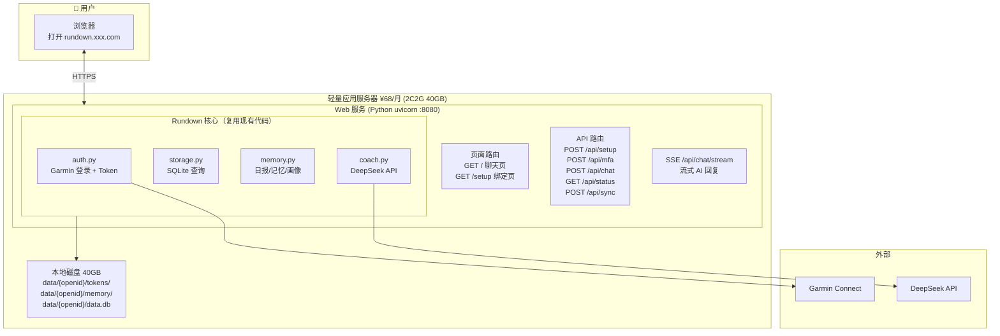
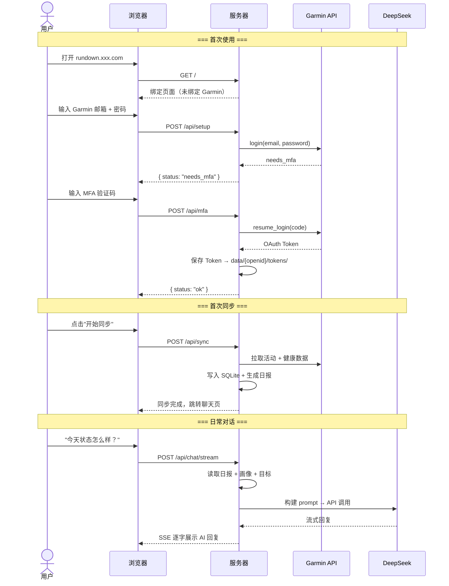

# 设计方案 — 13. Web Chat 部署方案（多用户）

> 版本: v2.0 · 日期: 2026-07-09 · 状态: 设计阶段

---

## 1. 背景与目标

将 Rundown 部署到阿里云轻量应用服务器（或同等廉价 VPS），通过 **Web Chat 页面**直接面向普通用户，
不需要任何 AI 客户端（Claude Desktop / OpenClaw）。用户打开浏览器 → 绑定 Garmin → 直接和 AI 教练对话。

**初期约束**：低成本（月费 < ¥100）、不引入中间件、零前端框架依赖。

---

## 2. 整体架构



---

## 3. 用户流程



---

## 4. 数据隔离

```
服务器本地磁盘 /app/data/
├── users.json                ← 用户注册表（openid → 元数据）
├── oABC123/
│   ├── tokens/
│   │   ├── oauth1_token.json
│   │   └── oauth2_token.json
│   ├── memory/
│   │   ├── auto/daily/...
│   │   ├── profile/...
│   │   └── goals/...
│   └── data.db              ← SQLite
├── oXYZ789/
│   ├── tokens/...
│   ├── memory/...
│   └── data.db
└── backup/                   ← 灾备（同步到 OSS，可选）
    ├── oABC123.db
    └── oXYZ789.db
```

VPS 磁盘是持久化的，容器重启不丢。OSS 仅作为灾备，初期可跳过。

---

## 5. 源码改动

### 5.1 新增文件

| 文件 | 说明 |
|------|------|
| `src/users.py` | 用户管理器 |
| `src/web.py` | Web 页面 + API 路由 |
| `web/templates/chat.html` | 聊天页面（纯 HTML + CSS + JS） |
| `web/templates/setup.html` | Garmin 绑定页面 |
| `Dockerfile` | 容器镜像 |
| `docker-compose.yml` | 一键部署 |

### 5.2 修改文件

| 文件 | 改动 |
|------|------|
| `src/config.py` | + `non_interactive` + `UserConfig` 多用户路径 |
| `src/auth.py` | `start_login()` / `complete_mfa()` 两步拆分 |
| `src/storage.py` | + `backup_to()` / `restore_from()` |
| `src/providers/garmin.py` | `non_interactive` 参数传递 |
| `src/main.py` | + `cmd_serve` Web 服务入口 |

### 5.3 不改的文件

`src/mcp_server.py`、`src/memory.py`、`src/coach.py`、`src/render.py`、`src/image.py`、`src/activity.py`

---

## 6. 核心模块

### 6.1 `src/users.py`

```python
class UserManager:
    def __init__(self, data_dir: str):
        """data_dir: /app/data/"""

    def register(self, openid: str) -> str:
        """新用户注册，返回 API key。"""

    def get(self, key: str) -> UserRecord | None:
        """通过 API key 查找用户。"""

    def get_token_dir(self, key: str) -> str: ...
    def get_memory_dir(self, key: str) -> str: ...
    def get_db_path(self, key: str) -> str: ...
```

用户标识：服务端生成 `rd_xxxx` 格式的 API key，写入 cookie。不依赖微信 openid，纯 Web 自闭环。

### 6.2 `src/web.py` — HTTP 层

复用你现有的 `render.py` 风格——手写 HTML + 内嵌 CSS，不引入前端框架。

```python
# 页面路由（服务端渲染 HTML）
@server.custom_route("/", methods=["GET"])
async def index(request): ...

@server.custom_route("/setup", methods=["GET"])
async def setup_page(request): ...

# API 路由（JSON）
@server.custom_route("/api/setup", methods=["POST"])
async def api_setup(request): ...

@server.custom_route("/api/mfa", methods=["POST"])
async def api_mfa(request): ...

@server.custom_route("/api/sync", methods=["POST"])
async def api_sync(request): ...

@server.custom_route("/api/chat/stream", methods=["POST"])
async def api_chat_stream(request): ...
    # SSE 流式输出 AI 回复，逐字展示
```

**为什么不用 Flask/FastAPI？** FastMCP 内置的 uvicorn + Starlette 完全够用，
`custom_route` 注册路由，`StreamingResponse` 做 SSE。零额外依赖。

### 6.3 `src/auth.py` — MFA 两步

```python
class AuthManager:
    def start_login(self, email, password, token_dir) -> str:
        """返回 "ok" 或 "needs_mfa"。"""

    def complete_mfa(self, mfa_code: str) -> None:
        """完成登录，Token 落盘。"""
```

MFA 中间状态存内存 dict（5 分钟过期），容器重启丢失，用户重新发起即可。

### 6.4 `src/coach.py` — 流式对话

现有 `coach.py` 是一次性返回 JSON。新增流式版本：

```python
async def chat_stream(messages: list[dict], context: str) -> AsyncIterator[str]:
    """流式 AI 对话，SSE 逐块输出。"""
    # 调用 DeepSeek API stream=true
    # 每次 yield 一个 token
```

---

## 7. 聊天页面

一个自包含的 HTML 文件，全部内嵌——零构建、零依赖、零 CDN：

```
web/templates/chat.html    (~300行)
├── CSS: 移动端优先，暗色主题（跑步场景护眼）
├── HTML: 消息列表 + 输入框 + 同步状态栏
└── JS:  SSE 接收流式回复 + 渲染 Markdown
```

风格参考你现有的 `render.py` 设计品味——简洁、大气、运动感。

---

## 8. 部署

### Docker Compose 一键启动

```yaml
# docker-compose.yml
version: "3"
services:
  rundown:
    build: .
    ports:
      - "8080:8080"
    volumes:
      - ./data:/app/data          # 持久化
    environment:
      - RUNDOWN_DATA_DIR=/app/data
      - DEEPSEEK_API_KEY=${DEEPSEEK_API_KEY}
    restart: unless-stopped
```

```bash
# 部署只需三步
git clone <repo>
cd rundown
echo "DEEPSEEK_API_KEY=sk-xxx" > .env
docker compose up -d
```

### 加 HTTPS

```bash
# Caddy 反向代理，自动申请 Let's Encrypt 证书
# Caddyfile:
# rundown.xxx.com {
#     reverse_proxy localhost:8080
# }
```

---

## 9. 成本

| 项目 | 方案 | 月费 |
|------|------|------|
| 服务器 | 阿里云轻量应用服务器 2C2G 40GB | ¥68 |
| 域名 | `.com` / `.cn` | ~¥5 |
| 备份 | OSS（可选，灾备用） | ~¥5 |
| **合计** | | **~¥78/月** |

---

## 10. 为什么不用框架 / 中间件

| 传统方案 | 本方案 | 省了什么 |
|----------|--------|---------|
| Flask/FastAPI | FastMCP 内置 uvicorn | 额外 Web 框架 |
| React/Vue 前端 | 一个 HTML 文件 | 前端构建工具链 |
| MySQL/PostgreSQL | SQLite 每用户一个文件 | 数据库服务 |
| Redis Session | Cookie + 服务端 dict | 缓存中间件 |
| Nginx | Caddy 自动 HTTPS | 反向代理配置 |
| 微信小程序 | Web Chat 响应式 | 审核 + 双端开发 |

---

## 11. 验证计划

```bash
# 本地
docker compose up -d
curl http://localhost:8080/     # → 绑定页面
# 浏览器完成 Garmin 绑定 + 对话

# 多用户
# 两个浏览器（或无痕窗口）各自绑定不同 Garmin 账号
# 验证数据隔离 + AI 回复互不干扰

pytest  # 零失败
```

---

> **关联文档**：[index.md](index.md) · [03-architecture.md](03-architecture.md) · [04-modules.md](04-modules.md) · [memory-system.md](memory-system.md) · [ai-coaching.md](ai-coaching.md)
