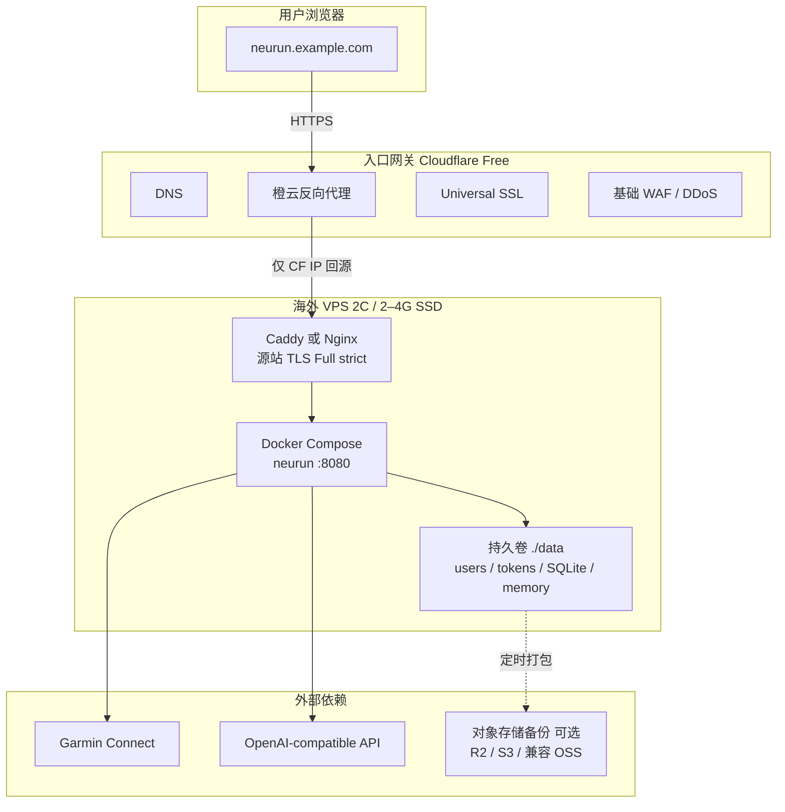

# 设计方案 — 14. 海外部署渠道与架构

> 版本: v1.0 · 更新日期: 2026-08-03 · 状态: **调研与设计已确认；生产落地未实施**
>
> 本文是 [13-sae-deployment.md](13-sae-deployment.md) 的海外区域附录：应用架构、数据隔离、Web
> API 与 Docker 运行时不变，只替换机房、域名与入口网关。未完成生产验收前，不得写入 README
> 作为已上线能力。

---

## 1. 背景与目标

国内默认路径是阿里云轻量 / ECS +（可选）CLB，见 [13-sae-deployment.md](13-sae-deployment.md)。
当需要：

- 服务主要在海外或亚太的用户；
- 降低对单一国内云的依赖；
- 源站更靠近 Garmin / OpenAI-compatible AI 等境外 API；

时，采用 **海外 VPS（ECS 等价物）+ 国际域名注册商 + Cloudflare 入口网关**。

### 1.1 约束（与国内方案对齐）

| 约束 | 要求 |
|------|------|
| 成本 | 初期目标 **月费 ≲ $15**（约合原「¥100 内」） |
| 形态 | 单机、无中间件、本地磁盘持久化 |
| 运行时 | 优先 **Docker Compose**（与仓库 `docker-compose.yml` 一致）；也可裸机 systemd |
| 入口 | HTTPS、隐藏源站 IP、基础 DDoS/WAF |
| 应用 | 不改多用户隔离、`/healthz`、异步同步和结构化报告合同；无通用 Chat 路由 |

### 1.2 非目标

- 多区域主动-主动、自动故障转移（单机有状态 SQLite，本期不做）
- 国内专线 / 合规备案替代方案
- 把「优化线路」类来路不明 VPS 作为正式产品底座

---

## 2. 目标架构



与国内方案的差异仅在虚线框外的 **机房、域名、入口**；`src/web.py` 进程内行为不变。

---

## 3. 渠道选型结论

### 3.1 推荐组合

| 层级 | 默认推荐 | 稳妥备选 | 说明 |
|------|----------|----------|------|
| **VPS** | [Hetzner Cloud](https://www.hetzner.com/cloud)（新加坡或美国） | [DigitalOcean](https://www.digitalocean.com/pricing/droplets) 新加坡 | 性价比 vs 文档/运维体验 |
| **域名** | [Cloudflare Registrar](https://www.cloudflare.com/products/registrar/) 或 [Porkbun](https://porkbun.com/products/domains) | Namecheap | 近成本价 / 低价含隐私 |
| **网关** | [Cloudflare](https://www.cloudflare.com) Free 橙云 | 源站 Caddy 直连 Let’s Encrypt | Free 含 DNS、CDN、SSL、基础防护 |

**默认落地栈（方案 A）：**

```text
Porkbun 或 Cloudflare Registrar 注册域名
  → 域名 NS / DNS 由 Cloudflare 托管
  → Hetzner 新加坡（或美东/美西）2 vCPU / 4GB 级
  → Docker Compose 启动 neurun
  → 源站 Caddy/Nginx + Cloudflare SSL 模式 Full (strict)
```

**少折腾栈（方案 B）：** DigitalOcean 新加坡 Droplet（约 $12–18/月）+ 同上 Cloudflare。

**已在 AWS（方案 C）：** [Lightsail](https://aws.amazon.com/lightsail/pricing/) 新加坡 + Cloudflare（仍建议用 CF 做免费网关，而不是只靠 Lightsail DNS）。

### 3.2 VPS 对比（neurun 画像）

评估维度：约 2C2G、Docker、本地盘、出站 Garmin + AI、入站 Web、月费可控。

| 厂商 | 入门价位（量级） | 亚太相关机房 | 优势 | 风险 / 注意 |
|------|------------------|--------------|------|-------------|
| **Hetzner Cloud** | 常约 €3–8 / 月（2C4G 级视型号） | 新加坡、美国 | 极强性价比、流量大方、一键/CLI 友好 | 国际支付；控制台英文 |
| **DigitalOcean** | 2GB **$12**；2vCPU/2GB **$18**；4GB **$24** | 新加坡等 | 文档好、Droplet 稳、1-Click Docker | 同规格贵于 Hetzner |
| **Vultr** | 常见 **$4–12** | 新加坡、东京等 | 机房多、按小时灵活 | 同价位口碑不如上两者整齐 |
| **AWS Lightsail** | Linux 约 **$5–12** | 新加坡、悉尼、雅加达、香港等 | 静态 IP、进 AWS 生态简单 | 流量规则与纯 VPS 不同；长期同规格常贵于 Hetzner |
| **Linode / Akamai** | Nanode 约 **$5** 起 | 东京等 | 全球网络 | 中档选择 |
| **OVH / Contabo** | 往往更便宜、盘更大 | 偏欧 | 大盘备份机 | 正式业务网络/支持体验需自测；Contabo 不优先作主站 |

**规格建议：**

| 级别 | 规格 | 适用 |
|------|------|------|
| 最低 | 1–2 vCPU / **2GB** / ≥40GB SSD | 验证、极少用户 |
| **推荐** | 2 vCPU / **4GB** / ≥40GB SSD | 同步线程 + AI 调用更稳 |
| 磁盘 | 本地 SSD + `data/` volume | 与国内一致；必须备份 |

**区域建议：**

| 用户与依赖 | 优先机房 |
|------------|----------|
| 亚太用户、要连境外 API | **新加坡**（Hetzner / DO / Vultr / Lightsail） |
| 北美用户 | Hetzner 美东/美西、DO NYC/SFO |
| 主要服务中国大陆且源站在海外 | 仍选新加坡/东京 + Cloudflare；**不要**只放欧洲再指望体验 |

### 3.3 域名注册商

| 注册商 | 模式 | 要点 |
|--------|------|------|
| **Cloudflare Registrar** | 近 registry + ICANN 成本价 | 与 DNS/CDN 一体；免费 WHOIS 脱敏；续费不加价 |
| **Porkbun** | 零售低价（.com 约 **$11.08**/年量级，含隐私等） | 可再把 NS 指到 Cloudflare |
| **Namecheap** | 促销首年低、续费中等 | TLD 全；看清续费与隐私附加项 |

**TLD：** `.com` / `.io` / `.app` 均可；`.app` 强制 HTTPS，与 Cloudflare 兼容良好。

### 3.4 网关与 CDN

#### Cloudflare Free（默认入口）

| 能力 | 用途 |
|------|------|
| DNS | 主机记录指 VPS |
| 橙云代理 | 隐藏源站 IP、HTTPS 终止于边缘 |
| Universal SSL | 浏览器 ↔ Cloudflare |
| 基础 DDoS / WAF | 扫库与滥用的第一道门 |
| 缓存 | **默认关闭动态 API 缓存** |

**与 neurun 相关的强制配置：**

| 路径 / 场景 | 配置 |
|-------------|------|
| `/api/sync`、`/api/sync/tasks/*` | `Cache-Control: no-store`（应用已尽量保证）；边缘勿缓存 |
| `/api/reports`、`/api/ai/tasks/*` | `Cache-Control: no-store`；AI 任务状态和报告生成响应不得由边缘缓存 |
| `/healthz` | 可供外部探测；**不要**依赖 Cloudflare 缓存当存活证明；源站监控仍直打或灰云 |
| SSL/TLS 模式 | **Full (strict)**；源站用 Origin CA 或 Let’s Encrypt |
| 源站防火墙 | 仅放行 [Cloudflare IP](https://www.cloudflare.com/ips/) 的 80/443 + 管理 SSH（限运维 IP） |

#### 源站反代

| 组件 | 何时用 |
|------|--------|
| **Caddy** | 自动证书、配置最少（推荐） |
| **Nginx / Nginx Proxy Manager** | 已有 Nginx 习惯或需要 UI |
| **Traefik** | 多容器路由标签 |

可不在公网暴露 `8080`：只让 Caddy 听 443，容器只绑定 `127.0.0.1:8080`。

#### 一般不必上的

| 产品 | 说明 |
|------|------|
| 云厂商 ALB / 高价 CDN | 单机初期成本与复杂度不值 |
| Cloudflare Tunnel | 不想暴露任何入站端口时可选；增加运维概念 |
| 来路不明「CN2/优化」VPS | 合规与账号风险，正式产品不采用 |

---

## 4. 与现有部署的关系

| 主题 | 国内（文档 13） | 海外（本文） |
|------|-----------------|--------------|
| 应用与数据模型 | 不变 | 不变 |
| 发布脚本 `scripts/deploy-ecs.sh` | 阿里云 CodeDeploy/ECS 路径 | **不复用**；海外默认 Docker 或自建 systemd unit |
| 健康检查 | CLB → `/healthz` | Cloudflare/外部监控 → 源站或灰云 `/healthz` |
| 可观测 | 阿里云 ARMS RUM（可选） | 可保留 ARMS，或换 Cloudflare Web Analytics / 自建；**不阻塞上线** |
| 密钥 | `/etc/neurun/neurun.env` | Docker：`.env` 或 host 上 `0600` env 文件注入；**同样禁止进 Git / 进 data 备份包若含密钥需隔离** |
| 备份 | 可选 OSS | 可选 **Cloudflare R2 / S3 / Backblaze B2** 等；逻辑仍是打包 `data/` |

有状态单机：**禁止**在未引入共享存储与会话方案前，对同一 `data/` 做多实例负载均衡。

---

## 5. 推荐落地步骤（方案 A）

### 5.1 域名

1. 在 Cloudflare Registrar 或 Porkbun 注册域名。
2. 若在 Porkbun/Namecheap：把 NS 改为 Cloudflare 分配的 NS。
3. 在 Cloudflare DNS 添加：
   - `A` / `AAAA`：`neurun` 或 `@` → VPS IP（**先灰云**完成源站验证，再改橙云）。
4. SSL/TLS → **Full (strict)**（源站证书就绪后）。

### 5.2 VPS

1. 创建 Hetzner（或 DO）实例：Ubuntu 24.04 LTS，新加坡，2C4G 级。
2. 安全组/防火墙：
   - `22/tcp`：仅运维 IP
   - `80/443`：仅 Cloudflare IP（橙云后）或临时 `0.0.0.0/0`（灰云调试）
   - **不**对公网开放 `8080`
3. 安装 Docker 与 Compose 插件；创建部署用户与 `data/` 目录，`0700`。

### 5.3 应用

```bash
git clone <repo> /opt/neurun
cd /opt/neurun
cp .env.example .env
# 配置 NEURUN_AI_* 、NEURUN_COROS_CREDENTIAL_KEY 等
# 数据目录映射保持 docker-compose.yml：./data:/app/data
docker compose up -d --build
docker compose exec neurun neurun invite create --output json
curl -fsS http://127.0.0.1:8080/healthz
```

环境变量与国内一致（见 README / `.env.example`），不因海外更换供应商专用变量名。

### 5.4 源站 HTTPS 示例（Caddy）

```caddyfile
neurun.example.com {
    reverse_proxy 127.0.0.1:8080
}
```

若仅 Cloudflare Origin Certificate：安装源证书后仍用 Full (strict)；也可让 Caddy 自行申请公开证书（灰云或 80 挑战可达时）。

### 5.5 Cloudflare 上线检查

1. 灰云：浏览器直连源站 HTTPS 正常。
2. 橙云：全站可打开登录/注册。
3. 验证日报与周复盘 AI 任务状态轮询，且响应不被边缘缓存。
4. 验证异步同步轮询、`/healthz`、邀请码注册与数据隔离。
5. 防火墙只允许 CF IP。

### 5.6 备份

```text
# 示意：停写或应用可接受的一致窗口下打包
tar -C /opt/neurun -czf "neurun-data-$(date -u +%Y%m%dT%H%M%SZ).tar.gz" data
# 上传至 R2/S3；保留轮转与恢复演练记录
```

密钥文件（如宿主机 env）**不要**与用户 `data/` 无差别打进同一对外分发包，或确保包加密与 ACL。

---

## 6. 成本粗估（2026-08 量级，非报价单）

| 项目 | 方案 A（Hetzner + CF） | 方案 B（DO + CF） |
|------|------------------------|-------------------|
| VPS | 约 €4–8 / 月 | 约 $12–18 / 月 |
| 域名 | 约 $10–12 / 年（摊销 ~$1/月） | 同左 |
| Cloudflare | Free | Free |
| 备份对象存储 | 可选数美元级 | 可选 |
| **合计** | 常可落在 **~$6–12/月** | 常 **~$13–20/月** |

价格以各厂商定价页为准；亚太部分 Lightsail 流量配额可能减半，选型时核对。

**厂商定价入口：**

- Hetzner Cloud：https://www.hetzner.com/cloud  
- DigitalOcean Droplets：https://www.digitalocean.com/pricing/droplets  
- Vultr：https://www.vultr.com/pricing/  
- AWS Lightsail：https://aws.amazon.com/lightsail/pricing/  
- Cloudflare Registrar：https://www.cloudflare.com/products/registrar/  
- Porkbun：https://porkbun.com/products/domains  

---

## 7. 风险与缓解

| 风险 | 影响 | 缓解 |
|------|------|------|
| AI 任务状态被边缘缓存 | 页面长期显示旧状态 | 对报告与 AI task API 强制 `no-store`，检查 Cloudflare 缓存规则 |
| 有状态盘损坏/误删 | 用户与 token 全丢 | 自动打包 + 异地存储；恢复演练 |
| 源站 IP 泄露 | 绕过 CF 直打 | 仅 CF IP 入站；安全组默认拒绝 |
| 出站 API 被拒/延迟 | 同步或教练失败 | 选新加坡等机房；失败信息保持可操作 |
| 支付与账号 | 无法续费停机 | 国际卡/PayPal；到期监控 |
| 把调研当已上线 | README 误导 | 本文状态保持「未实施」直至验收；README 仅在真实可部署后更新 |
| 复用 `deploy-ecs.sh` 到海外 | 路径与平台假设错误 | 海外用 Compose 或独立 unit，不硬套阿里云脚本 |

---

## 8. 验收标准（海外实例）

生产标记为「已支持海外部署」前，须全部满足：

1. `curl -fsS https://<域名>/healthz` 返回 200 且 JSON 含 `status`。
2. 邀请码注册 → 绑定数据源 → 同步任务 202 轮询 → 显式生成日报，全流程成功。
3. 日报和周复盘的 AI 任务状态可正常轮询，且 Web 不暴露通用 Chat 路由。
4. 两用户数据互不可见。
5. 源站防火墙在橙云下拒绝非 CF 的 443 直连（或等价安全组）。
6. 至少一次：备份打包 → 新目录/新机恢复 → 登录与数据仍在。
7. `pytest` 与应用回归不因部署文档变更而失败（文档-only 变更无代码测试要求）。

---

## 9. 文档与实现边界

| 动作 | 是否允许 |
|------|----------|
| 更新本文与 design index、CHANGELOG（Added 设计） | 是 |
| 在 README 写「已支持 Hetzner/Cloudflare 一键海外」 | **否**，直至 §8 验收完成 |
| 修改产品用户旅程文档 | 不需要（用户路径与国内 Web 相同） |
| 为海外单独改 MCP/CLI 合同 | 不需要 |
| 后续若增加 `scripts/deploy-overseas.sh` | 须同步本文、README、CHANGELOG，并保持可脚本化、非交互 |

---

## 10. 决策摘要（ADR 风格）

| 决策 | 选择 | 原因 |
|------|------|------|
| 计算 | 单机海外 VPS，非 K8s | 与文档 13 成本与复杂度一致 |
| 默认云 | Hetzner，备选 DO | 性价比 / 运维体验平衡 |
| 区域 | 优先新加坡 | 亚太延迟与境外 API |
| 域名 | CF Registrar 或 Porkbun | 低续费摩擦 |
| 入口 | Cloudflare Free 橙云 | 免费 SSL/CDN/防护 |
| 运行时 | Docker Compose 优先 | 与仓库现有产物一致 |
| 发布 | 不复用阿里云 ECS 脚本 | 平台假设不同 |
| 多活 | 不做 | SQLite 每用户本地文件 |

---

> **关联文档**  
> - 国内 Web 部署：[13-sae-deployment.md](13-sae-deployment.md)  
> - 架构总览：[03-architecture.md](03-architecture.md)  
> - 模块与配置：[04-modules.md](04-modules.md)  
> - 索引：[index.md](index.md)  
> - 产品侧用户旅程仍见 [docs/product/](../product/index.md)（部署区域不改变旅程本身）
