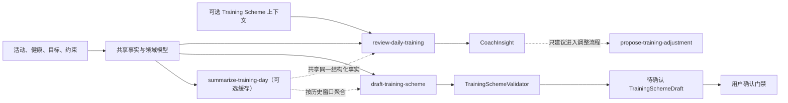
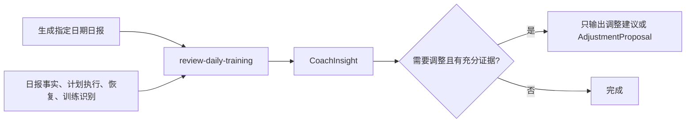

# 设计方案 — AI 教练工作流设计

> 属于 [设计方案索引](../design.md) · 版本 v3.3 · 2026-08-04

> **产品边界更新（2026-08-04）**：当前没有通用 Chat 产品需求。Web 只提供结构化页面和六条显式 AI 工作流；MCP 是外部 AI 客户端的独立集成接口。涉及训练方案的写入必须先生成 Adjustment Proposal，用户确认后才能生效。详见 [训练体验产品方案](../product/training-experience.md) 和 [交互式训练方案系统](training-system.md)。

> **训练内容识别边界（v1 已实现，2026-07-31）**：AI 教练消费 `TrainingSessionAnalysis` 的训练主类型、地形属性、置信度和证据，不直接从活动名称或原始分段自由猜测课型。近期训练上下文以 SQLite 原始活动及其分析为真相源，历史日报仅是生成时快照；坡跑或山地专项可以影响恢复建议，但 Adjustment Proposal 与训练方案确认流程仍属后续阶段，当前不得直接改写生效方案。共享 `TrainingDayFact` 由确定性层聚合单日活动、健康、恢复、覆盖和计划上下文；可选 `summarize-training-day` 只补充带结构化 evidence 的语义特点。

> **日期与数据状态边界（2026-07-31）**：空活动列表不等于休息日。AI 教练读取共享 `activity_state`，仅把同步覆盖已完成的空活动日称为已确认休息，其余显示运动数据未知。周目标通过 `get_current_week_progress(date)` 按报告日期所在自然周（周一至周日）统计；滚动 7 天历史只用于负荷和恢复趋势。

---

## Coach Skills 运行时与收敛

### 状态与决策

截至 2026-08-04，在线 AI 只服务六条有明确产品入口的工作流：

- 日报 `review-daily-training`、周复盘 `review-training-week`；
- 单日语义摘要 `summarize-training-day`（可选、缓存、无写入）；
- 方案草稿 `draft-training-scheme`、局部调整解释 `propose-training-adjustment`；
- 方案重规划 `revise-training-scheme`、比赛策略 `prepare-race-strategy`；
- 每条工作流由服务端先构建完整结构化事实，再执行一次主 Skill 模型调用；
- 运动者建档、计划执行匹配、恢复判断和训练前说明由表单或确定性代码负责，不再包装为独立 AI Skill；
- Web 不提供通用聊天、聊天历史或 `/api/chat/stream`，MCP 继续作为外部 AI 客户端读取事实和调用显式工具的集成边界。

本重构删除不在当前产品范围内的通用 Chat；六条保留旅程的用户可见合同不变。产品规则继续由
[训练体验产品方案](../product/training-experience.md) 持有；本文件是 Coach Skills
架构的唯一技术真相源，不再创建平行的 skill 产品方案。

### 要解决的问题

旧实现曾由单 Prompt、日报 Tool Use、Web 流式聊天和 Coach Skill 分别维护模型调用。随着规则增加，
会出现以下问题：

1. 所有请求都加载全部规则，和当前意图无关的内容也占用上下文；
2. 日报、通用聊天和训练方案协商共享同一套长流程，触发边界不清晰；
3. 一处规则变化可能影响其他场景，难以单独回放和评测；
4. 日报模型能够看到与当前任务无关、甚至包含确认写入语义的工具；
5. “空活动不等于休息”“周目标按自然周”等领域不变量容易被误写成各 Skill 自己的判断。

重构目标是让每个用户动作命中一个显式工作流：服务端准备事实，模型只输出结构化解释或候选，
确定性代码校验和写入。没有产品入口的通用聊天与贡献 Skill 不保留为预备抽象。

### 设计原则

- **一个 Skill 一个职责**：按用户任务和业务决策拆分，不按工具数量拆分。
- **一次旅程一次主 Skill**：每次运行只加载一个 Skill，不为同一份恢复、执行或目标事实串行调用贡献 Skill。
- **结构化输入输出**：Skill 消费服务端事实包并返回固定 Schema，不传递自由文本对话。
- **领域不变量留在代码层**：`ActivityDayState`、自然周边界、ACWR、训练课型和地形识别
  继续由确定性代码产生，Skill 只能解释，不能重算或覆盖。
- **模型无工具写入能力**：Skill runner 不向模型暴露应用工具；草稿、提案和确认写入由应用服务分别执行。
- **渐进披露**：基础身份和安全边界保持精简；Skill 正文只在触发时加载；详细领域参考按需读取。
- **可回放与可降级**：每次记录 Skill 名称、版本和结构化输出；失败时回退到对应确定性结果。

### Skill 集合

Skill 使用小写、动词开头、连字符命名。当前保留六个主 Skill，以及一个可选的单日语义摘要 Skill：

| Skill | 类型 | 触发场景 | 核心输出 | 明确不负责 |
|---|---|---|---|---|
| `summarize-training-day` | 事实解释 Skill | 基于单日 `TrainingDayFact` 提炼运动特点 | `TrainingDaySemanticSummary` JSON | 重算事实、生成日报、调整方案 |
| `review-daily-training` | 主 Skill | 生成日报或评估指定日期 | 现有 `CoachInsight` JSON | 重新识别课型、直接改方案 |
| `draft-training-scheme` | 主 Skill | 没有生效方案且用户要求制定方案 | 待确认的 Training Scheme 草稿 | 直接激活草稿 |
| `review-training-week` | 主 Skill | 自然周结束或用户主动复盘 | 周执行总结、适应判断和下周建议 | 直接发布下周方案 |
| `propose-training-adjustment` | 主 Skill | 单次疲劳、时间、疼痛或日程约束需要局部调整 | 对确定性调整差异的教练解释 | 重规划整个备赛周期、绕过确认 |
| `revise-training-scheme` | 主 Skill | 连续偏离、长期停训、目标或现实约束变化 | 方案级差异、更新周期候选与重规划依据 | 直接发布新版本 |
| `prepare-race-strategy` | 主 Skill | 比赛临近且赛事、能力与环境事实可用 | 配速、补给、热身、装备和风险预案 | 替代训练方案、保证比赛结果 |

其中 `draft-training-scheme` 是专业方案制定的主 Skill，不是把现有固定比例函数包进 Prompt。它负责基于目标可行性、能力基线、剩余周期、现实约束和恢复风险形成结构化周期方案；跑量容量、安全间隔、恢复周、减量期和 Schema 合法性仍由确定性领域代码计算或校验。详细生成合同见 [训练系统技术设计](training-system.md#91-专业方案生成管线proposed)。

`review-daily-training` 与 `review-training-week` 支持持续跑步和赛事备赛；赛事方案草稿、重规划和比赛策略只在明确赛事上下文中启用。`summarize-training-day` 只消费结构化单日事实，不读取日报正文或查询工具；AI 不可用时保留确定性摘要，不阻断日报、周复盘或草稿。教练模式由生效方案派生（模式转换提案已于 2026-08-12 移除），建档、执行匹配、恢复计算和训练前说明属于确定性应用流程，不新建一个包办所有工作的 Skill。

事实查询由应用服务在模型调用前完成。Skill 解决“针对哪个用户任务形成什么判断”，不自行决定读取或写入哪些应用数据。

### 日报与方案制定的解耦

`summarize-training-day`、`review-daily-training` 和 `draft-training-scheme` 通过共享事实层协同，不允许 Skill 互相调用，也不共享对方生成的自然语言：

| 边界 | `summarize-training-day` | `review-daily-training` | `draft-training-scheme` |
|---|---|---|---|
| 用户问题 | 这次运动客观呈现什么特点 | 今天发生了什么、状态和执行偏差如何 | 未来如何达到目标 |
| 时间范围 | 指定自然日 | 指定日期与当前自然周 | 目标日前的完整周期，重点输出首四周 |
| 事实输入 | `TrainingDayFact` | 单日事实摘要、恢复、当前方案快照、周进度 | `PlanningFactPack`、目标、约束、训练容量与风险边界 |
| 输出 | `TrainingDaySemanticSummary` | `CoachInsight` 日报结论 | `TrainingSchemeDraft` 与 `PlanningTrace` |
| 副作用 | `read_only`、可缓存 | `read_only` | `proposal_only` |
| 禁止行为 | 重算或编造 evidence、生成行动建议 | 创建或改写训练方案 | 把日报正文当事实、直接激活草稿 |

二者复用的是确定性事实服务和领域对象，而不是复用 Prompt 输出：



这样可以独立回放、评测和升级两条链路：日报改提示词不会改变课程制定，方案 Skill 升级也不会反向修改历史日报。`TrainingSessionAnalysis`、`ActivityDayState`、自然周边界、Athlete Baseline 和恢复事实属于共享代码层；Skill 只消费这些结构化结论。

`review-training-week` 不得声明 `active_scheme` 为必需事实。它始终接收自然周实际活动、恢复、能力趋势和数据质量；历史生效方案只是可选比较上下文。无方案时仍输出本周事实解释、风险和下周一般建议，但禁止产生计划完成率、Progression Decision 或 Adjustment Proposal 意图。

目标可行性、恢复和执行证据由 `PlanningFactPack`、`TrainingLoadEnvelope` 与其他确定性事实包一次性提供给方案主 Skill；不再拆成串行模型请求。

### Skill 包与运行时合同

Coach Skill 参考 Agent Skills 的渐进披露结构，但它们由 neurun 运行时加载，不会因为放入仓库就
自动成为 Codex、OpenClaw 或其他 AI agent 的原生 Skill。

```text
prompts/
├── coach-core.md
└── skills/
    ├── summarize-training-day/SKILL.md
    ├── review-daily-training/SKILL.md
    ├── draft-training-scheme/SKILL.md
    ├── review-training-week/SKILL.md
    ├── propose-training-adjustment/SKILL.md
    ├── revise-training-scheme/SKILL.md
    └── prepare-race-strategy/SKILL.md

src/coach_runtime/
├── registry.py
├── runner.py
├── context.py
└── schemas.py
```

每份 `SKILL.md` 的 YAML Front Matter 只保留 `name` 和 `description`。`description` 同时描述能力和
触发边界；正文使用命令式表达，并限定在以下内容：

1. 输入事实合同；
2. 分析步骤与自由度；
3. 必须保留的不确定性；
4. 停止条件与升级条件；
5. 结构化输出合同。

机器可执行元数据放在 Python registry，不在 SKILL.md 中重复维护：

```python
SkillSpec(
    name="review-daily-training",
    version="1.0.0",
    prompt_path="prompts/skills/review-daily-training/SKILL.md",
    required_facts=("daily_facts", "active_scheme"),
    output_model="CoachInsight",
)
```

`SkillSpec` 是版本、事实要求和输出 Schema 的机器真相源；SKILL.md 解释业务工作流，二者通过
registry 校验测试防止漂移。

#### OpenAI-compatible 结构化输出合同

`OpenAICompatibleSkillModel` 对所有 Skill 统一使用 JSON Output。Runner 必须在发送请求前追加一段供应商协议提示，明确包含小写 `json`、要求只返回一个 JSON object，并指出目标输出模型；该协议属于模型适配层，不要求每份 `SKILL.md` 重复维护。业务 Skill 仍只描述领域输入、判断步骤和输出字段。

模型适配层必须以可中断的分块读取实现端到端响应预算，不能只依赖 `httpx` 的逐次 I/O timeout，因为上游持续缓慢返回时逐次超时可能永远不触发。`review-training-week` 使用 25 秒总响应预算和 20 秒单次读取上限，最迟约 45 秒转为脱敏的“AI 服务响应超时”；周复盘本地事实已完整，因此该错误直接进入确定性兜底。存在方案时，计划执行与恢复均作为本地事实一次性传给主 Skill，不再为了贡献 finding 增加两次串行模型调用。

`revise-training-scheme` 同样禁止嵌套调用周复盘 AI 或串行运行目标可行性、计划执行、恢复贡献 Skill。调用方先以本地规则生成 `PlanningFactPack`、`TrainingLoadEnvelope`、`ExecutionSummary`、恢复快照和原方案，再发起唯一一次主 Skill 请求。该 Skill 继续使用 90 秒端到端预算，但因完整四周 JSON 的首字节和分块间隔可能显著长于简短 finding，单次读取上限为 45 秒；其余普通 Skill 保持 20 秒读取上限。官方 API 对推理/长输出请求先返回 headers、随后静默推理数十秒再一次性发送 body，`build-training-framework` 的单次读取上限需覆盖整个静默期（120 秒），否则 httpx ReadTimeout 会误报“AI 服务响应超时”。任一预算触发后必须关闭响应流、释放账户任务占位，并以脱敏原因进入确定性候选。

非 200 响应由适配层解析 OpenAI-compatible `error.type` / `error.code`，只允许向上返回 HTTP 状态和脱敏错误类型。日志、前端 `fallback_reason` 与持久化草稿不得包含 API Key、Authorization Header、完整 Prompt、完整用户事实或响应正文。错误对象无法解析时使用稳定的通用原因。

200 响应的提前结束判定必须要求 `choices[0].message.content` 非空且本身是合法 JSON 对象：推理类模型（如 `deepseek-v4-flash-0731`）流式输出期间会先发送仅含 `reasoning_content`、`content` 为空串的中间态 envelope，只检查类型会把空串误判为完成并提前 break，导致 `json.loads("")` 失败。`content` 为空或非法 JSON 时视为 Provider 间歇性故障并自动重试一次（在总响应预算内、每次尝试独立计时）；超时、HTTP 4xx/5xx 等请求级错误不重试。草稿类大请求（约 4K+ prompt tokens、2.6K+ payload tokens）对推理模型在部分网关存在高概率空 content 故障，宜选用对草稿请求稳定返回标准 JSON envelope 的模型（如 `grok-4.5`）。

服务级配置统一由 `src/config.py:get_ai_config()` 解析：`NEURUN_AI_API_KEY`、`NEURUN_AI_BASE_URL`、`NEURUN_AI_MODEL` 分别控制凭证、API 根地址和模型。Base URL 可为根地址或完整 `/chat/completions` 端点；根地址由客户端补齐路径。六条显式 Coach Skill 共用该配置，不得各自硬编码供应商或保留供应商专用环境变量别名。

Web 中会启动在线 AI 的显式生成操作统一经过 `src/ai_inference_coordinator.py:AIInferenceCoordinator`。协调器使用独立 `ThreadPoolExecutor`，不与同步、文件处理等默认 executor 工作争抢线程。`NEURUN_AI_MAX_CONCURRENCY`（默认 `32`）限定单进程实际执行数；`NEURUN_AI_MAX_PENDING`（默认 `64`）包含执行中和等待中的总接纳数；`NEURUN_AI_WAIT_TIMEOUT_SECONDS`（默认 `5`）限定无工作线程等待槽位的时间。

准入以应用账号为 singleflight key：同一用户跨日报、周复盘、方案草稿/修改、局部调整、方案级重规划和赛前策略最多存在一个执行中或等待中的任务，重复提交返回 `429 ai_request_in_progress`。不同用户可使用剩余容量；全局总接纳量已满或等待超时返回 `503 ai_capacity_reached`。两类响应均携带 `Retry-After: 5` 和稳定用户提示。只有获得执行槽位后才向独立 executor 提交工作，因此等待与拒绝路径不创建线程。容量拒绝不是模型降级，不触发确定性兜底，也不产生任何报告、提案或方案写入。多进程部署的总上限等于进程数乘单进程上限，部署配置必须据此核算 Provider 配额。

协调器为每个已接纳任务分配 `task_id`，记录 `operation`、`state=waiting|running|succeeded|failed`、提交/开始/结束时间和可计算耗时。接纳后立即创建受保护的后台协程；HTTP 调用方被刷新取消时，不取消等待中或执行中的实际任务，也不提前释放用户占位。`GET /api/ai/tasks/current` 只按当前登录账号返回该账号的最新状态，不接受外部 user key。终态短期保留 5 分钟，随后从内存清理；服务重启后不承诺恢复。

协调器允许调用入口提供受限的 `result_mapper`。周复盘只缓存页面原本有权读取的结构化 `report`，用于恢复未持久化的周中进度；日报的 Provider、Storage 等运行时对象不得进入任务状态。失败终态只保存稳定通用消息，不持久化上游响应、Prompt、训练事实或凭证。任务状态是过程读模型，不替代日报或正式周复盘的持久化真相源。

在线 AI 成功的完成条件是：当前入口唯一一次模型调用返回合法 Schema，方案类结果继续通过确定性 Validator。不得为了形式上的“多 Skill”重复推理同一目标、执行或恢复事实。失败进入显式 `deterministic_fallback`。

模型输出中的阶段周数求和、小数求和和安全负荷上限不作为语言模型能力假设。方案候选可在 Validator 前进入受限的确定性 Normalizer：保留阶段顺序、名称、目的和相对权重，把总周期对齐真实赛事周数并保护减量下限；只向下夹紧首周容量、周增长和恢复周跑量，再对课程距离与长距离占比做机械修正。课程语义、训练日和强度仍来自 Skill，无法机械修复的安全冲突继续兜底。所有修正同时进入 `adjustments` 与 `planning_trace`。

运行结果不得再用单一 `generation_mode` 混合表达“是否调用 AI”“是否经过修正”和“是否建议执行”。模型适配层输出 AI 来源，Normalizer 输出 `passed/repaired` 和修正列表，Feasibility 输出推荐状态，应用层组合为 `ai_validated`、`ai_repaired`、`ai_risk_advisory` 或 `deterministic_fallback`。风险状态保留 evidence、gaps、routes 和 confidence，由用户选择路线；它不是模型故障。

### 共享数据协议

运行时维护一个只增不改的 `CoachRunContext`：

```text
CoachRunContext
├── request: intent, target_date, user_feedback
├── facts: 服务端准备的结构化事实与数据覆盖状态
├── uncertainties: 缺失数据和冲突证据
├── policy: 教练模式和方案版本
└── trace: skill/version/status
```

### 日报协同流程



固定顺序为：服务端事实准备 → 一次结构化解释 → 应用层降级或后续动作。入口已经确定 Skill，
不使用意图分类器，也不提供通用聊天回退。

### 路由与触发规则

第一阶段采用显式入口路由：

- 日报生成固定使用 `review-daily-training`；
- 用户明确要求制定方案才使用 `draft-training-scheme`；
- 自然周结束或用户主动复盘时使用 `review-training-week`；
- 单次疲劳、疼痛、时间或日程约束使用 `propose-training-adjustment`；
- 连续偏离、长期停训、目标或长期约束变化使用 `revise-training-scheme`；
- 进入赛前策略窗口且关键赛事事实可用时使用 `prepare-race-strategy`。

路由器同时读取 `coaching_mode`，但模式只限制可用能力，不替代用户意图。持续跑步模式不得触发赛事周期或比赛策略；用户明确建立赛事目标时先创建 `CoachingModeTransitionProposal`，经确认进入备赛。完赛或退出后先进入恢复过渡，再由用户确认回到持续跑步。Skill 只能为转换提供结构化 finding，不能直接切换模式。

没有入口对应的请求不触发在线 AI；不得让多个 Skill 竞争执行。

每个 Skill 必须至少准备：

- 正向触发用例；
- 相邻但不应触发的 near-negative 用例；
- 存在歧义的 ambiguous 用例；
- 缺失数据和工具失败用例。

### 工具与副作用边界

Skill 模型只接收调用方组装的 JSON facts，不获得 MCP、Web 或内部应用工具。日报和周复盘只产生分析；
方案模型只产生候选；局部调整先由确定性代码生成差异，模型只解释。所有保存、确认和版本切换继续由
`TrainingService` 校验版本、幂等键和用户确认，不由 runner 维护一套未接入的工具权限层。

### 为什么第一版不引入 LangChain

当前需要的是：加载一个 Skill、发送结构化事实、验证输出并保留 trace。现有
`httpx + OpenAI-compatible JSON Output` 与小型 registry/runner 已经足够。

第一版不引入 LangChain，原因是：

- 当前没有需要持久化恢复的复杂 Agent Graph；
- 没有多模型、多供应商统一适配的现实需求；
- 路由全部由产品入口确定，模型不负责任务路由或工具选择；
- 引入框架会增加回调、序列化、异常和升级面，却不能替代领域模型与权限控制。

只有同时出现以下真实需求时再评估 LangGraph 或同类框架：跨请求可恢复的长流程、复杂分支和并行
节点、多模型路由、人工审批节点需要持久化、当前 runner 的状态机明显重复且难以测试。届时必须先用
现有场景做基准，不因“Agent 化”本身引入依赖。

### 收敛结果

1. `review-daily-training` 接管日报在线解释，旧 `prompts/coach.md` 与日报 Tool Use loop 删除。
2. Web 通用聊天页面、SSE 路由、客户端和聊天上下文删除；首页保留为结构化日报仪表盘。
3. 删除没有独立在线旅程的建档、执行评估、恢复评估、训练解释、目标可行性和训练前说明 Skill。
4. 所有保留工作流只运行一次主 Skill；恢复、执行和目标事实由确定性代码预先组装。
5. 删除未接入模型调用链的 `ToolPolicy`、贡献 Skill 编排和 Context findings。

### 评测与验收

评测不能只检查 SKILL.md 格式，必须比较重构前后任务效果：

| 维度 | 验收方式 |
|---|---|
| 静态合规 | skill 名称、Front Matter、相对路径、行数、无敏感信息 |
| 触发准确率 | 正向、near-negative、ambiguous 用例的 Skill 选择 |
| 领域正确性 | 未同步不判休息、周目标自然周、课型不重算、原始负荷不覆盖 |
| 工具约束 | runner 不向模型暴露工具；日报不得写方案 |
| 输出合同 | 运行时 Schema 校验 `CoachInsight` / `SkillFinding` / `TrainingSchemeCandidate` |
| 任务效果 | 同一固定数据集比较 monolith 与 skills 的正确性和可操作性 |
| 效率 | 记录加载 token、工具轮次、延迟；无关 Skill 不进入上下文 |
| 鲁棒性 | 模型超时、空数据、冲突数据、模型返回非法 JSON 时稳定降级；所有 JSON Output 请求包含供应商要求的 `json` 协议提示，非 200 错误仅保留脱敏诊断 |

完成标准：

- 日报主路径在固定回放集上不低于现有基线；
- “空活动不等于休息”“自然周完成度”“用户确认后才改方案”全部由代码断言覆盖；
- 每个保留 Skill 至少有直接入口、缺失事实和输出失败用例；
- 只加载本次运行需要的 Skill，普通日报不加载方案草拟与写入规则；
- 日报、Web 和 MCP 的现有结构化输出保持兼容；在线失败继续使用确定性降级；
- 仓库不存在 `/api/chat/stream`、`chat_stream()`、旧聊天 fallback 或通用聊天 Prompt。

## OpenClaw 配置

**1. 安装与启动 MCP Server**

```bash
# 启动 MCP Server（默认端口 8765）
neurun mcp

# 指定端口
neurun mcp --port 9876

# 后台运行
neurun mcp --daemon
```

**2. OpenClaw MCP 配置** (`~/.openclaw/mcp.json` 或 OpenClaw Settings)

```json
{
  "mcpServers": {
    "garmin-coach": {
      "command": "neurun",
      "args": ["mcp"],
      "env": {
        "GARMIN_EMAIL": "${GARMIN_EMAIL}",
        "GARMIN_PASSWORD": "${GARMIN_PASSWORD}"
      },
      "description": "Garmin 运动数据 + AI 教练",
      "autoApprove": ["query_health_metrics", "query_activities",
                       "get_memory", "search_memories",
                       "query_current_week_progress", "get_trend",
                       "get_training_advice"]
    }
  }
}
```

**3. OpenClaw 自定义 Agent 配置**

在 OpenClaw 中创建一个 "AI 跑步教练" Agent，使用以下 System Prompt 模板：

```markdown
你是一位专业的跑步教练 AI。每天早上用户会和你对话，
你会自动读取他们的 Garmin 数据日报来提供建议。

## 你的能力
- 读取每日训练报告、健康指标、训练负荷
- 分析恢复状态、检测过度训练风险
- 根据用户目标和偏好制定训练计划
- 回答训练相关的问题（配速、心率、营养、伤病预防等）
- 记录训练洞察到用户的知识库

## 对话原则
1. 数据优先：用具体数字说话，不泛泛而谈
2. 个性化：结合用户的竞技水平、偏好和伤病史
3. 安全第一：怀疑过度训练时主动建议降量
4. 鼓励为主：用积极的语言，关注进步而非差距
5. 记录洞察：有价值的发现主动写入 coaching/insights/

## 当前用户画像
（从 memory/profile/ 和 coaching/preferences.md 自动加载）

## 今日数据
（从 memory://daily/latest 自动加载）
```

## 完整的早晨使用流程

```
07:00  系统 cron 触发: neurun sync
       ↓ 拉取 Garmin 新数据 → 写入 SQLite
       ↓ 自动生成今日日报 → auto/daily/2025-06-24.md
       
08:00  用户起床，打开 OpenClaw，选择 "AI 跑步教练"
       ↓ OpenClaw 连接 neurun MCP Server
       ↓ MCP Server 自动注入今日日报 + 用户画像

08:01  用户: "早上好，今天状态怎么样？"
       AI:  (已读取日报全文)
       "早上好 ☀️ 昨晚睡了 7.3h，评分 76，今早 HRV 53ms 稳定，
        身体电量 82%，状态还不错 👌
        
        ACWR 1.09 在最优区间，恢复评分 70 良好。
        昨天跑了 8.5km 轻松跑，完成质量不错。
        
        今天建议: 节奏跑+轻松跑 55min，强度中等。
        备选方案: 如果感觉疲劳就改为轻松跑+核心力量。
        
        ⚠️ 注意: 睡眠略低于目标，今天高温 32°C 建议晨跑或夜跑。

        5K 目标还有 2 周，当前 20:15 → 目标 19:30，进度正常 ✅
        
        准备好了就开始今天的训练吧！💪"

08:03  用户: "昨天节奏跑感觉右膝有点紧，要不要调一下？"
       AI:  (查阅 coaching/preferences.md 伤病史 → 发现髂胫束史)
       "右膝不适需要注意。你之前有过髂胫束问题 (2024.06)，
        建议今天改为: 轻松跑 30min + 泡沫轴放松 15min + 臀中肌激活训练。
        如果明天膝盖仍有感觉，休息一天。
        我把这个调整记录到你的偏好里。"
       → AI 调用 add_coaching_insight 写入 knee-watch 标记

08:05  用户去训练。AI 已经完成了:
       ✅ 读取今日全部数据
       ✅ 评估状态 + 给出建议
       ✅ 结合伤病史调整计划
       ✅ 记录新的洞察
```

## 安全与隐私

- MCP Server 仅监听本地 `127.0.0.1`，不暴露到网络
- 密码通过环境变量注入，MCP Server 不存储明文密码
- AI 生成的洞察标记 `source: ai_coach`，与人工内容区分
- OpenClaw 的 `autoApprove` 仅对只读工具开放，写入类工具（如 `add_coaching_insight`）需用户确认

---
