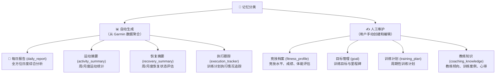
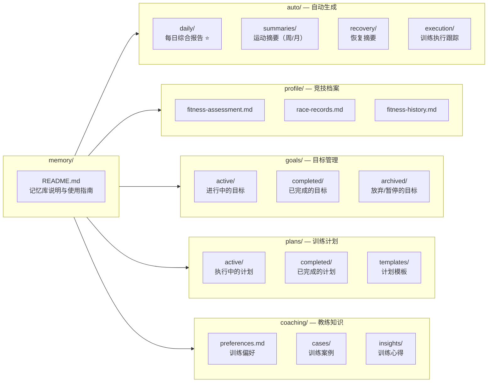
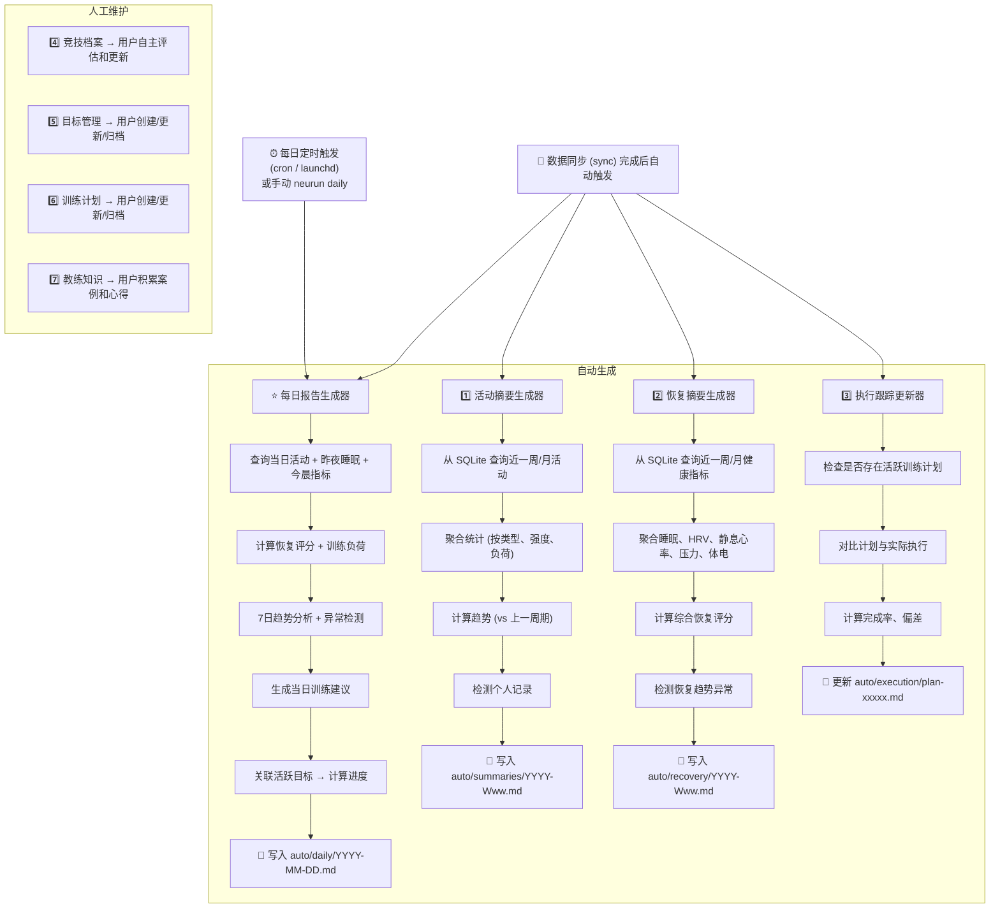
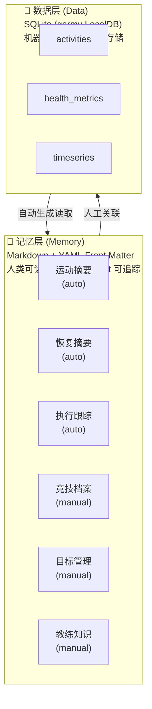
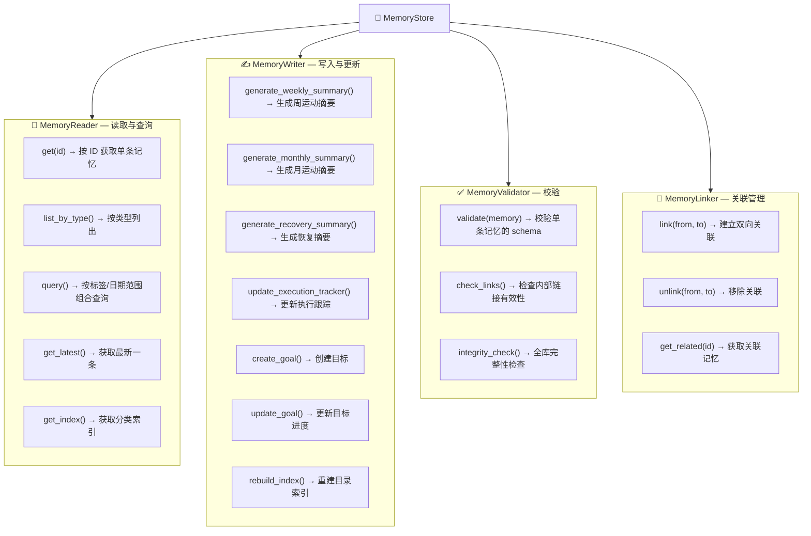
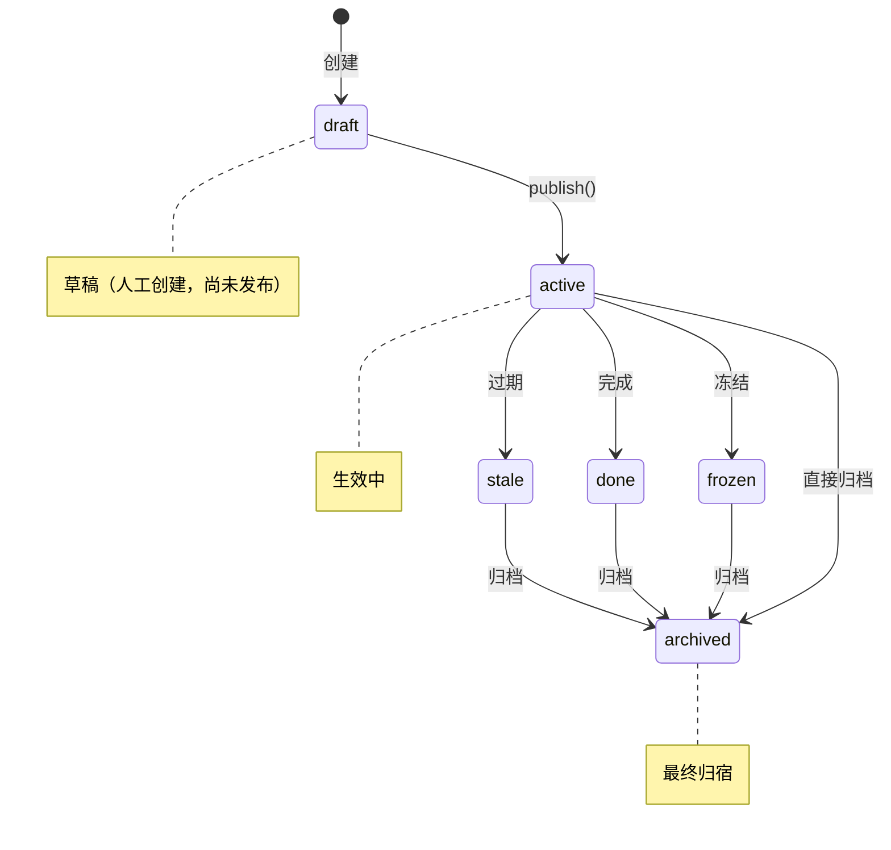
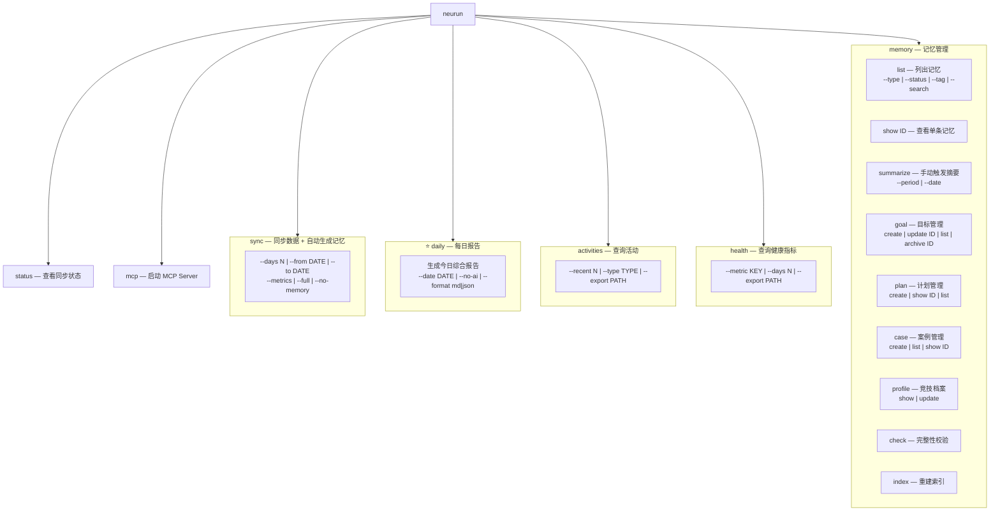

# 设计方案 — 记忆系统设计

> 属于 [设计方案索引](../design.md) · 版本 v3.1 · 2026-07-28

---

# 2025 上半年目标：5KM 突破 20 分

## 背景
...

## 计划
...

## 里程碑
...
```

#### 4.5.3 记忆分类与组织结构

记忆按照语义分为**两大类、八小类**（新增日报）：



#### 4.5.4 目录结构



#### 4.5.5 每种记忆的 Front Matter Schema

##### 每日报告 (`auto/daily/`) ⭐

每日报告是本项目最核心的产出——每天早上生成的“训练仪表盘”，也是日报 AI 工作流的结构化输入。

```yaml
---
type: daily_report
date: 2025-06-24
generated: 2025-06-24T08:00:00
version: 1

# ═══════════════════════════════════════
# 一、当日活动
# ═══════════════════════════════════════
daily_activities:
  is_rest_day: false                # 是否为休息日
  is_training_day: true
  sessions:
    - type: running                 # running | cycling | swimming | strength | yoga | other
      name: "轻松跑"
      start_time: "2025-06-23T07:15:00"
      duration_min: 45
      distance_km: 8.5
      avg_pace: "5:18"
      avg_hr: 148
      max_hr: 165
      avg_hr_zone: 2.3              # 平均心率区间
      training_load: 120
      aerobic_te: 3.1               # 有氧训练效果
      anaerobic_te: 0.5             # 无氧训练效果
      calories: 485
      perceived_effort: 3           # RPE 1-10
      notes: "状态不错，后程略感疲劳"
  total_sessions: 1
  total_duration_min: 45
  total_distance_km: 8.5
  total_calories: 485
  total_training_load: 120
  primary_stimulus: aerobic          # aerobic | anaerobic | mixed | recovery
  day_type: easy_run                # easy_run | workout | long_run | race | cross_train | rest

# ═══════════════════════════════════════
# 二、昨夜睡眠
# ═══════════════════════════════════════
last_night_sleep:
  total_hours: 7.3
  deep_sleep_hours: 1.4
  deep_sleep_pct: 19.2
  light_sleep_hours: 3.8
  rem_sleep_hours: 1.6
  rem_sleep_pct: 21.9
  awake_hours: 0.5
  sleep_score: 76
  quality: fair                     # excellent | good | fair | poor
  sleep_start: "2025-06-23T23:15:00"
  sleep_end: "2025-06-24T06:35:00"
  avg_spo2: 96
  avg_respiration: 14.2
  restlessness: 12                  # 辗转次数

# ═══════════════════════════════════════
# 三、今晨状态 (晨起指标)
# ═══════════════════════════════════════
this_morning:
  resting_hr: 51
  resting_hr_vs_baseline: -1        # vs 7日均值
  hrv_ms: 53
  hrv_vs_baseline: 1
  hrv_status: balanced              # balanced | unbalanced | low
  body_battery_morning: 82
  body_battery_charged_pct: 85
  stress_level_morning: 22
  training_readiness_score: 65
  training_readiness_level: moderate # high | moderate | low | recovery

# ═══════════════════════════════════════
# 四、训练负荷与恢复
# ═══════════════════════════════════════
training_load:
  acute_load_7d: 350
  chronic_load_28d: 320
  acwr: 1.09
  acwr_status: optimal              # undertraining | optimal | overreaching | high_risk
  load_trend_7d: stable             # increasing | stable | decreasing
  weekly_volume_km: 38.5
  weekly_volume_vs_target: 64       # 完成目标百分比

recovery:
  overall_score: 70                 # 0-100 综合恢复评分
  level: good                       # excellent | good | fair | poor
  sleep_contribution: 22            # 各维度贡献分 (满分 30)
  hrv_contribution: 20              # (满分 25)
  hr_contribution: 12               # (满分 15)
  stress_contribution: 7            # (满分 10)
  battery_contribution: 7           # (满分 10)
  readiness_contribution: 7         # (满分 10)
  limiting_factor: sleep_duration   # 主要限制因素
  recovery_advice: "睡眠时长略低于 7.5h 目标，今晚争取早睡 30 分钟"

# ═══════════════════════════════════════
# 五、趋势面板 (7 日)
# ═══════════════════════════════════════
trends_7d:
  hrv:
    values: [52, 51, 54, 53, 52, 50, 53]
    slope: 0.1
    direction: stable               # improving | stable | declining
  resting_hr:
    values: [50, 51, 52, 50, 51, 52, 51]
    slope: 0.15
    direction: stable
  sleep_duration:
    values: [7.5, 7.0, 7.8, 6.8, 7.2, 7.1, 7.3]
    slope: -0.05
    direction: slight_decline
  sleep_score:
    values: [80, 75, 82, 72, 78, 74, 76]
    slope: -0.3
    direction: stable
  stress:
    values: [25, 28, 22, 30, 26, 24, 22]
    slope: -0.5
    direction: stable
  body_battery_morning:
    values: [85, 78, 88, 72, 80, 84, 82]
    slope: 0.2
    direction: stable
  training_readiness:
    values: [70, 65, 72, 60, 68, 66, 65]
    slope: -0.4
    direction: stable

# ═══════════════════════════════════════
# 六、异常检测
# ═══════════════════════════════════════
anomalies:
  count: 1
  level: warning                     # normal | warning | critical
  items:
    - type: sleep_duration_low
      severity: warning
      message: "近 7 天睡眠均低于 7.5h 目标，平均 7.2h"
      detail: "睡眠不足可能影响恢复质量，建议今晚 22:30 前入睡"
      related_metric: sleep_duration

# ═══════════════════════════════════════
# 七、当日建议
# ═══════════════════════════════════════
recommendation:
  ready_to_train: true
  training_advice: "适合中等强度训练"
  intensity: moderate                # rest | easy | moderate | hard | very_hard
  suggested_session:
    type: "节奏跑 + 轻松跑"
    description: "热身 2km → 节奏跑 20min (配速 4:40-4:50) → 放松 2km → 轻松跑 20min"
    estimated_duration_min: 55
    estimated_load: 150
    target_hr_zone: [2, 4]          # 心率区间范围
  alternative_session:
    type: "轻松跑"
    description: "如果感觉疲劳，改为 40min 轻松跑 + 核心力量 15min"
    estimated_duration_min: 55
  caution:
    - "睡眠略有不足，注意训练中补水"
    - "今日气温较高 (32°C)，建议清晨或傍晚跑"
  focus_areas: ["技术动作", "核心力量"]
  nutrition_tip: "训练后 30 分钟内补充蛋白质 + 碳水 (比例 1:3)"
  mindset_tip: "今天的目标不是跑快，而是跑得舒服——信任过程"

# ═══════════════════════════════════════
# 八、目标进度
# ═══════════════════════════════════════
goal_progress:
  active_goals:
    - id: 2025-h1-5k-sub20
      name: "5KM 突破 20 分"
      target: "19:30"
      current_best: "20:15"
      gap: "0:45"
      weeks_remaining: 2
      on_track: true
      weekly_volume_target: 60
      weekly_volume_actual: 38.5

# ═══════════════════════════════════════
# 九、近期摘要
# ═══════════════════════════════════════
recent_context:
  last_7_days:
    activities: 5
    total_km: 38.5
    total_duration_min: 210
    avg_recovery_score: 72
    avg_sleep_hours: 7.2
  streak:
    running_days: 3
    current_streak_weeks: 8        # 连续训练周数

tags: [daily, 2025-06-24, running, easy-run]
---
```

日报正文 (Markdown) 结构：

```markdown
# 📰 每日训练报告 — 2025年6月24日 周二

> 生成时间: 08:00 | 数据覆盖: 当日活动 + 昨夜睡眠 + 今晨状态

## 🏃 当日训练回顾

**训练**: 轻松跑 8.5km / 45min / 配速 5:18
**评价**: 完成质量好，心率控制在有氧区间，后程略感疲劳属正常范围

## 😴 睡眠恢复

**睡眠时长**: 7h18min | 评分 76 (良好)
**深睡**: 1h24min (19%) | **REM**: 1h36min (22%)
⚠️ 近 7 天均低于 7.5h 目标，建议今晚提前入睡

## 📊 今晨状态

| 指标 | 数值 | 状态 |
|------|------|------|
| 静息心率 | 51 bpm | 🟢 正常 |
| HRV | 53 ms | 🟢 平衡 |
| 身体电量 | 82 | 🟢 充足 |
| 训练准备 | 65 | 🟡 中等 |

## 📈 负荷状态

**ACWR**: 1.09 — 🟢 最优区间 (0.8-1.3)
**趋势**: 负荷稳定，无过度训练风险

## 🎯 当日训练建议

**推荐**: 节奏跑 + 轻松跑 (55min / 预估负荷 150)
- 热身 2km → 节奏跑 20min (配速 4:40-4:50) → 放松 + 轻松跑
- 备选: 如果感觉疲劳 → 40min 轻松跑 + 核心力量

## ⚠️ 注意事项

1. 睡眠略不足，训练中注意补水
2. 今日高温 32°C，建议清晨或傍晚进行

## 🏁 目标进度

**5K 突破 20 分**: 当前 20:15 / 目标 19:30 / 剩余 2 周 — 🟢 进度正常

---

*本报告由 neurun daily 自动生成*
```

##### 运动摘要 (`auto/summaries/`)

```yaml
---
type: activity_summary
period: weekly              # weekly | monthly
start_date: 2025-06-16
end_date: 2025-06-22
week_number: 25
year: 2025
generated: 2025-06-23T08:00:00

# 聚合统计 (自动生成)
stats:
  total_activities: 5
  total_duration_min: 245
  total_distance_km: 52.3
  total_calories: 2850

# 按运动类型分布
by_type:
  running:
    count: 3
    duration_min: 150
    distance_km: 38.5
    avg_pace: "5:12"
    avg_hr: 152
    training_load: 320
  cycling:
    count: 1
    duration_min: 60
    distance_km: 13.8
  strength:
    count: 1
    duration_min: 35

# 训练负荷趋势
training_load:
  total: 450
  acute: 380                      # 近 7 天
  chronic: 340                    # 近 28 天
  ratio: 1.12                     # ACWR
  status: optimal                 # undertraining | optimal | overreaching

# 个人记录 (本周内)
personal_records: []

# 与前一周对比
vs_last_week:
  duration_change_pct: 12.5
  distance_change_pct: 8.3
  load_change_pct: 15.2

tags: [running, cycling, strength]
---
```

##### 恢复摘要 (`auto/recovery/`)

```yaml
---
type: recovery_summary
period: weekly
start_date: 2025-06-16
end_date: 2025-06-22
week_number: 25
generated: 2025-06-23T08:00:00

# 睡眠 (自动聚合)
sleep:
  avg_duration_hours: 7.2
  avg_deep_sleep_pct: 18.5
  avg_rem_sleep_pct: 22.1
  avg_sleep_score: 78
  trend: stable                   # improving | stable | declining

# HRV (自动聚合)
hrv:
  weekly_avg_ms: 52
  last_night_avg_ms: 48
  status: balanced                # balanced | unbalanced | low
  trend: slight_decline

# 静息心率
resting_hr:
  avg_bpm: 52
  trend: stable

# 压力
stress:
  avg_daily: 28
  trend: stable

# 身体电量
body_battery:
  avg_morning: 85
  avg_evening_drain: 62

# 综合恢复评分 (自动计算)
recovery_score:
  overall: 72                     # 0-100
  level: good                     # poor | fair | good | excellent
  limiting_factor: sleep_duration # 主要限制因素

# 训练准备
training_readiness:
  avg_score: 68
  trend: stable

tags: [recovery, sleep-score-78, hrv-balanced]
---
```

##### 执行跟踪 (`auto/execution/`)

```yaml
---
type: execution_tracker
plan_id: 2025-spring-5k-plan      # 关联的训练计划
plan_name: 2025 春季 5K 训练计划
tracking_period:
  start: 2025-03-01
  end: 2025-05-31

# 执行统计 (自动生成)
execution:
  total_sessions_planned: 48
  total_sessions_completed: 42
  completion_rate_pct: 87.5
  missed_sessions: 4
  extra_sessions: 2
  on_time_pct: 78
  avg_session_quality: 7.5        # 1-10 自评

# 各阶段完成情况
phases:
  - name: 基础期
    weeks: [1, 2, 3, 4]
    planned: 16
    completed: 15
    notes: "顺利完成，第 3 周因出差少跑一次"
  - name: 强度期
    weeks: [5, 6, 7, 8]
    planned: 16
    completed: 14
    notes: "第 6 周膝盖不适减量"
  - name:  taper 期
    weeks: [9, 10, 11, 12]
    planned: 16
    completed: 13
    notes: "减量期执行良好"

# 关键指标变化
key_metrics_delta:
  vo2max_estimate: {from: 48, to: 52}
  threshold_pace: {from: "4:45", to: "4:25"}
  resting_hr: {from: 55, to: 50}

# 偏差分析
deviations:
  - date: 2025-03-18
    planned: "间歇跑 8×400m"
    actual: "轻松跑 5km"
    reason: "膝盖不适"
    impact: minor

updated: 2025-06-01
tags: [5k-plan, spring-2025, execution]
---
```

##### 竞技档案 (`profile/`)

```yaml
---
type: fitness_profile
profile_type: assessment           # assessment | race_record | history
updated: 2025-06-15

# 当前竞技水平
current_level:
  vo2max_estimate: 52
  threshold_pace_per_km: "4:25"
  threshold_hr: 172
  max_hr: 192
  resting_hr: 50
  running_economy: good

# 各距离最佳成绩
personal_bests:
  5k: {time: "20:15", date: 2025-04-10, race: "本地公园跑"}
  10k: {time: "42:30", date: 2025-03-22, race: "春季路跑赛"}
  half_marathon: {time: "1:38:00", date: 2024-11-15, race: "城市半马"}
  marathon: {time: null, date: null, race: null}

# 体能评估
fitness_assessment:
  endurance: strong
  speed: moderate
  strength: moderate
  flexibility: weak
  recovery_capacity: moderate

# 优劣势
strengths: [有氧基础扎实, 配速控制稳定, 恢复意识好]
weaknesses: [速度耐力不足, 核心力量偏弱, 柔韧性差]

tags: [fitness-profile, 2025]
---
```

##### 目标 (`goals/`)

```yaml
---
type: goal
goal_type: time_based              # time_based | distance_based | frequency | habit
category: running
status: active                     # active | completed | abandoned
priority: high                     # high | medium | low
created: 2025-01-01
target_date: 2025-06-30
review_cycle: weekly               # daily | weekly | monthly

# 量化目标
metrics:
  target_5k_time: "19:30"
  current_5k_time: "20:15"
  gap: "0:45"

# 过程指标
process_goals:
  - name: 周跑量
    target: 60km
    current: "52km (avg)"
  - name: 每周强度课
    target: 2次
    current: "1.5次 (avg)"
  - name: 每周力量训练
    target: 2次
    current: "1次 (avg)"

# 子目标/里程碑
milestones:
  - date: 2025-02-01
    description: "5K 稳定在 21:00 以内"
    achieved: true
  - date: 2025-04-01
    description: "5K 突破 20:30"
    achieved: true
  - date: 2025-06-01
    description: "达成 19:30"
    achieved: false

# 关联
linked_plan: 2025-spring-5k-plan
linked_cases: [case-peak-performance]

tags: [5k, sub20, spring-2025]
---
```

##### 训练计划 (`plans/`)

> 本节记录现行训练计划记忆格式。训练主界面、周计划、反馈、调整提案、版本和活动匹配的目标模型由 [交互式训练方案系统](training-system.md) 维护；实现迁移完成前不得将目标模型描述为当前运行行为。

```yaml
---
type: training_plan
plan_type: periodized               # periodized | linear | polarized | custom
category: running
status: active
created: 2025-02-15
start_date: 2025-03-01
end_date: 2025-05-31
duration_weeks: 12

# 目标赛事/事件
target_event:
  name: 春季路跑赛 5K
  date: 2025-06-01
  goal_time: "19:30"

# 计划结构
structure:
  phases:
    - name: 基础期
      weeks: 4
      focus: 有氧耐力 + 力量基础
      weekly_volume_km: [45, 48, 50, 50]
    - name: 强度期
      weeks: 4
      focus: 阈值 + VO2max
      weekly_volume_km: [50, 52, 55, 50]
    - name: 竞赛期
      weeks: 3
      focus: 速度耐力 + 比赛节奏
      weekly_volume_km: [48, 45, 40]
    - name: 减量期
      weeks: 1
      focus: 恢复 + 保持状态
      weekly_volume_km: [30]

# 周训练模式
weekly_pattern:
  Monday: 休息或交叉训练
  Tuesday: 间歇/速度课
  Wednesday: 轻松跑 8-10km
  Thursday: 节奏跑/阈值课
  Friday: 休息
  Saturday: 长距离跑
  Sunday: 恢复跑或完全休息

# 教练风格
coaching_style:
  intensity_distribution: polarized  # polarized | pyramidal | threshold
  key_workouts_per_week: 2
  recovery_emphasis: high
  strength_integration: moderate

tags: [5k, spring-2025, periodized, polarized]
---
```

##### 教练知识 — 偏好 (`coaching/preferences.md`)

```yaml
---
type: coaching_preference
updated: 2025-06-15

# 训练偏好
training_preferences:
  preferred_workouts: [间歇跑, 节奏跑, 法特莱克]
  disliked_workouts: [长距离慢跑, 跑步机]
  preferred_time: morning
  preferred_terrain: [公路, 田径场]
  weather_tolerance: moderate        # low | moderate | high

# 教练风格倾向
coaching_style_preference:
  autonomy: high                     # 自主性需求
  data_driven: high                  # 数据驱动程度
  flexibility: high                  # 灵活性需求
  external_motivation: low           # 外部激励需求
  preferred_feedback: data_based     # emotional | data_based | mixed

# 伤病史
injury_history:
  - type: 髂胫束综合征
    period: 2024-06
    recovery_weeks: 4
    trigger: 跑量增加过快
    lessons: 周跑量增幅不超过 10%

# 训练哲学
training_philosophy: |
  相信数据驱动的训练方法。偏好极化训练分布（80% 低强度 + 20% 高强度）。
  重视恢复质量胜过训练量。认为力量训练是预防伤病的关键。

tags: [preferences, coaching-style]
---
```

##### 教练知识 — 案例 (`coaching/cases/`)

```yaml
---
type: case_study
case_id: case-peak-performance
category: peak_performance          # injury_recovery | peak_performance | plateau_break | nutrition | mental
created: 2025-04-20
related_goal: 2025-h1-5k-sub20
related_plan: 2025-spring-5k-plan

# 案例背景
context:
  athlete_level: intermediate
  starting_point: "5K 21:30"
  target: "5K 19:30"
  timeframe: 12周

# 关键做法
key_practices:
  - 极化训练，80% 低强度
  - 每周 2 次力量训练
  - 每 4 周降量周
  - 睡眠优先策略（保证 7.5h+）

# 关键数据变化
data_timeline:
  - week: 0
    vo2max: 48
    threshold_pace: "4:45"
    5k_time: "21:30"
  - week: 4
    vo2max: 49
    threshold_pace: "4:40"
    5k_time: null
  - week: 8
    vo2max: 51
    threshold_pace: "4:30"
    5k_time: "20:30"
  - week: 12
    vo2max: 52
    threshold_pace: "4:25"
    5k_time: "19:45"

# 经验教训
lessons_learned: |
  1. 极化训练对中级跑者非常有效
  2. 力量训练对跑步经济性有显著贡献
  3. 睡眠是恢复质量的基石
  4. 降量周后往往能跑出最佳成绩

# 可复用性
reusability: high
applicable_scenarios: [5K-10K 备赛, 中级跑者突破, 时间有限的高效训练]

tags: [peak-performance, 5k, polarized-training, case-study]
---
```

#### 4.5.6 记忆生成策略



#### 4.5.7 记忆的索引与查询

为了方便程序检索，每个子目录下的 `index.md` 自动维护该目录下所有记忆的索引：

```markdown
---
type: index
category: summaries
updated: 2025-06-23T08:00:00
entries:
  - file: 2025-W25.md
    period: weekly
    start_date: 2025-06-16
    title: "第 25 周运动摘要"
    stats: {activities: 5, duration_min: 245, distance_km: 52.3}
  - file: 2025-W26.md
    period: weekly
    ...
  - file: 2025-06.md
    period: monthly
    ...
---

# 运动摘要索引
...
```

`memory.py` 模块提供以下查询接口：

| 方法 | 说明 |
|------|------|
| `MemoryStore.list_by_type(type, **filters)` | 按类型列出记忆 |
| `MemoryStore.get(id)` | 获取单条记忆 |
| `MemoryStore.get_latest(type)` | 获取最新一条某类型记忆 |
| `MemoryStore.query(tags, date_range)` | 按标签和日期范围查询 |
| `MemoryStore.get_index(category)` | 获取某分类的索引 |
| `MemoryStore.generate_summaries(db_path)` | 从 SQLite 生成摘要记忆（自动） |
| `MemoryStore.create_goal(data)` | 创建新目标（交互式或参数式） |
| `MemoryStore.link(from_id, to_id)` | 建立记忆之间的关联 |

#### 4.5.8 记忆与数据的关系



**关键区分**：
- **数据层**存储"事实"（某天跑步 5km，心率 150）
- **记忆层**存储"认知"（本周跑量 35km 比上周增加 10%，恢复评分 72 处于良好区间，按计划执行率 88%）
- 记忆层的自动部分由数据层聚合生成，人工部分由用户维护
- MCP Server 应优先消费记忆层（更紧凑、更有语义），需要细节时再穿透到数据层

#### 4.5.9 MemoryStore 类设计

`memory.py` 模块的核心是 `MemoryStore` 类，它采用**分层架构**组织代码：



**MemoryStore 核心 API**：

| 分类 | 方法 | 参数 | 返回 |
|------|------|------|------|
| 读取 | `get(id)` | `id: str` | `Memory \| None` |
| 读取 | `list_by_type(type, **filters)` | `type: MemoryType, status, date_range, tags` | `List[Memory]` |
| 读取 | `get_latest(type)` | `type: MemoryType` | `Memory \| None` |
| 读取 | `query(tags, date_range)` | `tags: List[str], date_range: Tuple[date, date]` | `List[Memory]` |
| 读取 | `search(keyword)` | `keyword: str` (搜索正文) | `List[Memory]` |
| 生成 | `generate_summaries(db, period)` | `db: HealthDB, period: weekly\|monthly` | `List[Path]` (生成的文件) |
| 生成 | `generate_recovery(db)` | `db: HealthDB` | `Path` |
| 生成 | `update_execution(db)` | `db: HealthDB` | `List[Path]` |
| 写入 | `create_goal(data)` | `data: dict` | `Memory` |
| 写入 | `update_goal(id, data)` | `id: str, data: dict` | `Memory` |
| 写入 | `archive_goal(id)` | `id: str` | `None` |
| 写入 | `create_case(data)` | `data: dict` | `Memory` |
| 关联 | `link(from_id, to_id)` | `from_id: str, to_id: str` | `None` |
| 关联 | `get_related(id)` | `id: str` | `List[Memory]` |

#### 4.5.10 聚合算法设计

自动生成记忆的核心是将 SQLite 中的原始数据转化为有语义的摘要。以下定义关键聚合算法：

##### 每日报告聚合 ⭐

> **训练内容识别扩展（v1 已实现，2026-07-31）**：日报对目标日期活动的类型解释消费版本化 `TrainingSessionAnalysis`。个人基线和历史训练上下文直接查询 SQLite 中完整的原始活动及分析，不以是否存在历史日报为前提；日报仍是生成时的解释快照。分类、地形、数据质量和证据合同见 [交互式训练方案系统](training-system.md#12-训练内容识别)。

###### 日报生成前数据完整性门禁（已实现）

产品规则由 [日报生成与数据完整性](../product/daily-report.md) 维护。实现不得只在 Web 路由中增加
条件判断；Web、CLI、MCP 和 HTML 补生成入口必须共同调用一个无副作用的
`DailyReportReadinessService`，并在真正写文件前再次校验。

```python
@dataclass(frozen=True)
class CoverageDimension:
    status: Literal[
        "complete",
        "unsupported",
        "missing",
        "syncing",
        "failed",
        "insufficient_history",
    ]
    observed_days: int
    expected_days: int
    last_synced_at: datetime | None
    reason: str | None
    action: str | None

@dataclass(frozen=True)
class DailyReportReadiness:
    status: Literal["ready", "limited", "blocked"]
    finality: Literal["provisional", "final"]
    data_as_of: datetime | None
    dimensions: dict[str, CoverageDimension]
    blockers: tuple[str, ...]
    omitted_sections: tuple[str, ...]
    suggested_actions: tuple[str, ...]
```

覆盖检查读取 `neurun_provider_sync` 的逐日、逐指标证据和当前 Provider 能力，不复用同步日历的单一
汇总状态作为全部事实。同步日历为了活动可见性可以在存在跑步时显示“已同步”，但该状态不能证明
睡眠、RHR、HRV 或训练准备度完整。记录缺失也不能单独证明未同步，因为完成覆盖后的空活动日是
合法休息日，Provider 不支持的指标也是合法的 `unsupported`。

检查顺序：

1. 校验日期、用户、绑定 Provider 和授权能力。
2. 检查报告日活动覆盖；未知、同步中或失败直接返回 `blocked`。
3. 按 Provider 能力检查报告日睡眠和恢复指标；支持但缺失时返回 `limited`，不支持时不降级。
4. 分别检查近 7 天健康趋势和近 28 天活动负荷覆盖；不足时把依赖章节加入
   `omitted_sections`，不得用零值补齐。
5. 今天返回 `finality=provisional`，`data_as_of` 取参与生成的最近成功同步时间；已结束日期在必需
   覆盖完成后返回 `final`。

Web 新增只读预检接口：

```http
GET /api/reports/readiness?date=2026-08-03
```

`POST /api/reports` 请求增加机器可读的生成模式：

```json
{"date":"2026-08-03","mode":"complete"}
```

- `mode=complete` 只接受 `ready`；`limited` 或 `blocked` 返回 HTTP 409、
  `code=report_data_incomplete` 和完整 readiness，不产生文件或 AI 请求。
- `mode=limited` 只允许 `limited`，表示调用方已对本次生成明确确认；服务端仍拒绝 `blocked`。
- 省略 `mode` 时按 `complete` 处理，旧客户端不会静默绕过门禁。

CLI 的 `--skip-sync` 只表示“不访问 Provider”，不能绕过 readiness；若本地证据不足则以非零退出码
和 JSON 可读错误结束。后续若提供受限版参数，应使用显式的 `--report-mode limited`，并同步 MCP
input schema。MCP `generate_report` 同样接受 `mode`，失败时返回建议调用的同步范围。

通过门禁后，日报 Front Matter 追加：

```yaml
data_readiness: complete  # complete | limited | unknown(旧报告)
report_finality: provisional  # provisional | final
data_as_of: 2026-08-03T08:32:10+08:00
data_coverage:
  activity: complete
  sleep: complete
  recovery: unsupported
  load_7d: complete
  load_28d: insufficient_history
omitted_sections: [acwr]
```

`MemoryWriter.generate_daily_report()` 不得自行猜测 readiness。生成编排层在二次校验后将不可变的
readiness 快照传入写入器；写入器按 `omitted_sections` 把对应维度标记为 `status=unavailable` 的
确定性指标，并把 `omitted_sections` 与 unavailable 标记透传给 AI 洞察（在线 Skill 与确定性兜底均
按省略维度保留未知、只解释可用事实，不因辅助维度缺失整块跳过洞察）。旧日报缺少这些字段时读取为
`data_readiness=unknown`，不回填伪造状态。

###### 日报能力与近期负荷背景引用（已实现）

日报从训练域只读能力画像投影 `athlete_context` 作为当日/近期负荷的解释背景，与方案草稿
同口径，报告域不重复计算能力画像。构造入口是 `training_service_factory` 提供的
`build_capacity_athlete_context(config, target, *, omitted_sections)`：它构建与 Web 草稿流程
相同的 `TrainingService`（`activity_loader` + `setup_context_loader` 固化为共享实现），调用
`capacity_profile(target=D)` 并投影稳定字段；Web/CLI/MCP 三条日报入口共用同一构造与门禁。

```yaml
athlete_context:
  status: available | unavailable
  reason: null | training_load_omitted | capacity_load_error | not_loaded
  source: training_domain_capacity_profile
  facts_cutoff: 2026-08-02T23:59:00+08:00
  capacity_profile:
    as_of: 2026-08-03
    sync_coverage: sufficient
    confidence: high | medium | low
    current_sustainable_capacity: {weekly_km, long_run_km, recent_running_pace_sec_per_km, ...}
    historical_proven_capacity: {weekly_km, long_run_km, interruption_context}
    entry_load_envelope: {minimum_weekly_km, maximum_weekly_km}
    current_readiness: {recovery_score, status}
```

门禁与语义：

- `training_load` 被 `omitted_sections` 省略时，编排层不读取训练域，写入
  `status=unavailable, reason=training_load_omitted`；写入器对传入值再做一次防御性校验。
- 训练域读取异常或 `config` 缺少 `memory_dir/db_path` 时写入 `capacity_load_error` /
  `not_loaded`，不得阻断日报生成。
- 快照语义：报告固化生成时点的画像与 `facts_cutoff`，之后重算不反写历史日报；重新生成
  历史日期按 `capacity_profile(D)` 口径读取，不引用 `D` 之后活动。
- 能力画像只用于日报正文与 `review-daily-training` 的只读解释，不写回训练域、不参与方案计算。

正文渲染（`_render_daily_body` 的“负荷状态”章节）与 HTML 负荷卡片只显示一行紧凑背景
（可持续周跑量参考、长距离、参考配速 + 数据截至时间），缺失或不可用时省略，不占位猜测。

日期语义以报告的 `date=D` 为唯一锚点。活动查询窗口固定为 `[D, D]`，规范 Front Matter 字段为
`daily_activities`；过渡期新报告同时写入内容相同的 `yesterday_activities` 兼容别名，读取器优先取
`daily_activities`，只在缺失时回退旧字段。兼容字段名不得泄漏到用户可见文案：Web、CLI、MCP、
AI 上下文、Markdown、HTML 和 PNG 统一称为“当日训练”或直接显示 `D`。`last_night_sleep` 保持不变，
表示进入 `D` 日清晨前结束的睡眠周期。

在线模型 Prompt 必须显式声明报告日期锚点；模型返回后还要递归规范化文本值，将“今天/今日”转换为
“当日”，将“昨天/昨日”和“明天/明日”分别转换为 `D-1`、`D+1` 的 ISO 日期。字段名和结构化
键不参与替换，避免 `plan_execution.today_actual` 等 API 合同漂移。

回归测试必须为 `D-1` 和 `D` 插入不同活动，断言 `D` 日报仅包含 `D` 活动，同时检查确定性 AI 洞察、
聊天上下文、Web 详情及图片导出不再出现“昨日训练”或“昨天完成”。历史文件不做启动时批量改写；
用户重新生成某日时按新合同覆盖该日文件。

日报的 `plan_context` 不再通过通用 `MemoryStore.get("active-plan")` 解析；`training_scheme` 不是通用
`MemoryType`，吞掉解析异常会让结构化快照永久显示为不存在。写入器必须调用
`TrainingService.resolve_plan_context(D)`，以报告日期而非生成日期读取方案历史。`no_effective_plan`、
`draft_available` 与 `scheduled_plan` 都写入目标日期和状态，AI 输入明确把计划执行评价标记为不适用；
`effective` 时固化方案 ID、版本、生效区间、
周计划和当日课次。Coach 的日期工具必须消费这份同源解析结果，不能另行读取当前 `active-plan.md`。

### 报告中心边界与 UI 路由（已实现）

报告中心以 `Report` 为产品主线概念，但存储仍按时间尺度拆分：现有 `daily_report` 是按自然日的解释快照；
`weekly_report` 始终固化自然周实际活动、表现、恢复与数据质量，有生效训练方案时才附加计划执行与
Progression Decision。报告可以提出下一周或阶段建议，但 Training 域独立保存提案和已确认版本，
报告域不复制调整记录。报告页可以根据报告日期/周 ID 深链训练页，但不能从报告生成路径调用
方案确认、启用或推进写入。

Weekly Report 文件使用 `reports/weekly/<ISO-week>.md`，以 Markdown Front Matter 保存 `week_id`、`week_start`、
`week_end`、`data_as_of`、`actual_summary`、`trend_summary`、`review_sections` 和 `data_quality`。
`actual_summary` 包含运动/跑步天数、最长单次与类型结构；`trend_summary` 保存最多四个活动覆盖完整自然周的
参照样本与差异；`review_sections` 固化概览、趋势、恢复/风险和下周动作，确保在线 AI 失败后仍可完整渲染。
`plan_context`、`plan_id`、`plan_version`、
`plan_execution_summary`、兼容字段 `execution_summary`、`adaptation_signal` 与 `progression_decision` 均为
可空方案关联；无方案时保持 `null`，不得用空完成率或 `insufficient_data` 代替。读取或渲染 Weekly Report
不得重算并写入决策；只有显式报告生成请求可以替换同周快照。

显式生成周复盘时，Front Matter 还必须固化 `training_day_summary`、`daily_prerequisites` 与
`quality_sessions`。`daily_prerequisites` 是 `weekly-prerequisite-manifest-v1` 的封口快照，用于证明周级解释
之前哪些逐日事实和确定性分析已经就绪；它不等于七份日报，也不触发逐日 AI。`review_sections.quality_sessions`
保存可直接渲染的确定性标题、类型计数、合计量、逐课事实与证据不足候选。没有质量课时保留一句明确结论，
页面不得渲染无文字卡片。

报告页所有带 `hidden` 的状态元素必须退出布局；组件级 `display` 规则不得覆盖该语义。关闭的原生
`details.weekly-review-details` 只保留 summary，正文和子区块必须 `display:none`，避免归档列表产生空白高度。

`/reports` 是报告中心入口而不是三个资源的纵向仪表盘。前端使用查询参数 `tab=daily|weekly|adjustments` 选择
唯一可见的二级页，缺省为 `daily`；`date=YYYY-MM-DD` 只预填日报范围，`week` 或 `date` 只预填周复盘范围。
三个只读 API 可以并行读取，但渲染层不得同时显示三个域的生成控件、空状态和归档列表。日报详情继续通过既有
`/?date=D` 兼容入口读取快照；报告中心只负责打开详情或显式生成。

日报二级页先用 `GET /api/reports/readiness?date=D` 取得状态，再渲染唯一状态卡：`existing`、`ready`、`limited`
或 `blocked`。完整性维度、受限版选择与同步深链只属于状态卡，不应常驻在已有报告的列表上。同步深链写为
`/sync?date=D&from=reports&return_to=/reports?tab=daily%26date=D#single-sync`，返回时恢复日报页上下文但不写日报。

日报与周复盘各自的日期输入都以同一字段为唯一真相源：日报的 `#genDate` 驱动日期摘要、已有报告/完整性提示、
前后一天与昨天/今天；周复盘的 `#weekDate` 驱动自然周摘要、前后一天与上一周/本周。两个字段使用用户本地
`todayStr` 作为最大值，摘要和精确日期字段均可见，不能用无样式的裸日期输入或透明覆盖层表达当前范围。

周复盘读模型必须区分 `in_progress` 与 `completed` 自然周。前者可以展示但不得写入
`weekly_checkpoint`；有方案时 `progression_decision` 只能是 `not_final`，无方案时保持 `null`，两者均不得
产生 `advance / hold / deload`。后者才允许生成不可变 `weekly_report`；只有存在方案关联时才形成正式决策。
Training Proposal 的待确认与历史状态只在训练页读取，
从不包含报告入口或确认写入接口。

### 日报计划执行读模型

`daily_report` Front Matter 额外保存 `plan_execution_summary`，由报告日方案快照、截至报告日的本地自然周活动和
Activity Data Coverage 确定性生成。它包含 `comparison_status`、当日计划/实际概览、周目标与已记录跑量、当前
阶段、目标名称/日期和 `next_action`。此字段是解释快照：不得依赖在线 AI，不能把未知覆盖视为缺席，也不得
写入 Training Scheme 或 Proposal。Web 仅展示面向用户的摘要并将 `next_action.training_url` 深链到训练页。

```
输入: target_date (默认今天), HealthDB, MemoryStore (读取活跃目标)
输出: auto/daily/YYYY-MM-DD.md

算法步骤:
1. 查询报告日期活动与活动同步覆盖
   activities = db.get_activities(user_id, target_date, target_date)
   coverage = sync_status(user_id, target_date, neurun_provider_sync)
   
   if no activities:
     if coverage == completed:
       activity_state = confirmed_rest
       is_rest_day = true
     else:
       activity_state = unknown
       is_rest_day = false
       活动部分标记为运动数据未同步/状态未知
   else:
     activity_state = training
     逐条提取: type, duration, distance, avg_hr, max_hr,
              avg_pace, training_load, aerobic_te, anaerobic_te
     汇总: total_duration, total_distance, total_load
     判定: primary_stimulus (有氧/无氧/混合/恢复)
     判定: day_type (轻松跑/强度课/长距离/比赛/交叉训练/休息)

2. 查询昨夜睡眠
   sleep_data = db.get_health_metrics(user_id, target_date) → sleep
   解析: total_hours, deep/light/rem/awake 分布,
         sleep_score, avg_spo2, avg_respiration, restlessness
   判定: quality (excellent >= 85, good >= 70, fair >= 50, poor < 50)

3. 查询今晨状态
   morning_metrics = db.get_health_metrics(user_id, target_date)
   提取: resting_hr, hrv_ms, hrv_status, body_battery,
         stress_level, training_readiness
   对比基线 (7日均值):
     hr_vs_baseline = resting_hr - avg(近7天resting_hr)
     hrv_vs_baseline = hrv - avg(近7天hrv)

4. 计算训练负荷
   acute_load = sum(近7天 training_load)
   chronic_load = sum(近28天 training_load) / 4
   acwr = acute_load / chronic_load
   acwr_status:
     < 0.8  → undertraining
     0.8-1.3 → optimal
     1.3-1.5 → overreaching
     > 1.5  → high_risk
   趋势: compare acute_load vs 7天前

5. 计算综合恢复评分 (同恢复摘要的加权算法)
   recovery_score = weighted_score(sleep, hrv, hr, stress, battery, readiness)
   识别 limiting_factor = argmin(各维度归一化得分)

6. 7日趋势分析
   for each metric in [hrv, resting_hr, sleep_duration, sleep_score,
                        stress, body_battery, training_readiness]:
     查询近 7 天时序
     线性回归计算 slope
     判定方向:
       slope > +threshold_positive → improving
       slope < -threshold_negative → declining
       else → stable
     特别关注: 变化加速 (slope 绝对值增大中)

7. 异常检测
   规则引擎扫描 (详见 4.5.10 恢复趋势异常检测):
     - HRV 持续下降 (7d slope < -2.0)
     - 静息心率持续上升 (7d slope > 3.0)
     - 睡眠不足累积 (7d avg < 6.5h)
     - 身体电量入不敷出
     - 训练准备连续 3 天下降
     - ACWR 进入高风险区间
   
   anomaly_count = count(触发规则)
   判定级别:
     >= 3 条 → critical
     1-2 条 → warning
     0 条   → normal

8. 生成当日训练建议
   输入: recovery_score, acwr_status, anomalies, active_goals,
         user_preferences (从 coaching/preferences.md)
   
   判定 ready_to_train:
     recovery_level >= fair AND acwr_status != high_risk → true
   
   判定 intensity:
     recovery=excellent + acwr=optimal   → hard
     recovery>=good + acwr=optimal       → moderate
     recovery=fair or acwr=overreaching  → easy
     recovery=poor or acwr=high_risk     → rest
   
   生成建议课表:
     根据 intensity 和 user_preferences 的 preferred_workouts
     匹配预设课表模板库
     输出: 主建议 + 备选方案
   
   生成注意事项:
     - 睡眠不足 → 提醒补水 + 降低强度
     - 高温天 → 建议调整训练时间
     - 连续训练日 → 提醒恢复重要性
     - 强度课 → 提醒热身和放松

9. 目标进度追踪
   加载所有 active 状态的目标
   对每个目标:
     - 计算当前最佳 vs 目标差距
     - 计算周跑量完成率
     - 计算剩余时间和所需配速
     - 判定是否 on_track
     如果 off_track: 给出调整建议

10. 渲染 Markdown + YAML Front Matter → 写入 auto/daily/YYYY-MM-DD.md
```

##### 运动摘要聚合

```
输入: date_range (start, end), HealthDB
输出: auto/summaries/YYYY-Www.md 或 YYYY-MM.md

算法步骤:
1. 查询活动数据
   activities = db.get_activities(user_id, start, end)
   
2. 按类型分组统计
   for each activity_type:
     count, total_duration, total_distance, avg_hr, total_load
   
3. 计算训练负荷
   acute_load  = sum(近7天 training_load)
   chronic_load = sum(近28天 training_load) / 4
   acwr = acute_load / chronic_load
   status = classify_acwr(acwr):
     <0.8  → undertraining
     0.8-1.3 → optimal
     1.3-1.5 → overreaching
     >1.5  → high_risk
   
4. 趋势对比
   prev_period = 同长度上一周期
   compute_pct_change(当前, 上一周期) for: duration, distance, load
   
5. 个人记录检测
   for each activity_type:
     if distance > best_distance[activity_type]:
       record new PR
     if pace > best_pace[activity_type]:
       record new PR
   
6. 渲染 Markdown + YAML Front Matter → 写入文件
```

##### 恢复摘要聚合

```
输入: date_range (start, end), HealthDB
输出: auto/recovery/YYYY-Www.md

算法步骤:
1. 查询健康指标
   sleep_data = db.get_health_metrics(user_id, start, end) → sleep 字段
   hrv_data   = db.get_health_metrics(...) → hrv 字段
   hr_data    = db.get_health_metrics(...) → resting_hr 字段
   stress_data = db.get_health_metrics(...) → stress 字段
   battery_data = db.get_timeseries(user_id, BODY_BATTERY, ...)
   readiness_data = db.get_health_metrics(...) → training_readiness 字段
   
2. 各维度聚合
   sleep: avg_duration, avg_deep_pct, avg_rem_pct, avg_score
   hrv: weekly_avg, last_night_avg, status_mode(每周状态众数)
   resting_hr: avg, max, min
   stress: avg_daily_level
   body_battery: avg_morning_level, avg_evening_drain
   readiness: avg_score
   
3. 趋势判定 (对比上一周期)
   for each metric:
     if abs(change) < threshold_small → stable
     elif direction is positive → improving
     else → declining
   
4. 综合恢复评分 (加权计算)
   score = (
     sleep_score_weight * sleep_normalized +
     hrv_weight * hrv_normalized +
     resting_hr_weight * hr_normalized_inverse +
     stress_weight * stress_normalized_inverse +
     body_battery_weight * battery_normalized +
     readiness_weight * readiness_normalized
   ) * 100 / total_weight
   
   各维度权重:
   - 睡眠: 30%
   - HRV: 25%
   - 静息心率: 15%
   - 压力: 10%
   - 身体电量: 10%
   - 训练准备: 10%
   
5. 识别限制因素
   limiting_factor = argmin(各维度归一化得分)
   
6. 渲染 Markdown + YAML Front Matter → 写入文件
```

##### 执行跟踪更新

```
输入: active_plan (训练计划 memory), HealthDB
输出: 更新 auto/execution/plan-{plan_id}.md

算法步骤:
1. 解析训练计划
   plan = load_memory(plan_id)
   structure = plan.front_matter.structure
   
2. 查询对应时期的实际活动
   activities = db.get_activities(user_id, plan.start_date, plan.end_date)
   
3. 按周比对
   for each week in plan.structure.phases:
     planned_sessions = count_sessions(week)
     actual_sessions = filter(activities, week.date_range)
     
     completed = count_matched(planned, actual)
     missed = planned_sessions - completed
     extra = len(actual_sessions) - completed
     
4. 偏差分析
   for each week:
     for each missed_session:
       check if alternative_activity exists → 替代训练
       check if rest_day_reason exists → 主动休息
       otherwise → 缺训
     record deviation with reason if available
   
5. 关键指标变化
   baseline = metrics_at(plan.start_date)
   current = metrics_at(plan.end_date)
   delta = compute_deltas(baseline, current)
   
6. 更新 Front Matter + 追加本周执行记录到正文 → 写回文件
```

##### 恢复趋势异常检测

```
输入: 近 7 天恢复指标序列
输出: 异常标记 + 建议

检测规则:
1. HRV 持续下降
   if hrv_7d_slope < -2.0 and hrv_status == "unbalanced":
     flag "HRV 持续下降，注意恢复"

2. 静息心率持续上升
   if resting_hr_7d_slope > 3.0:
     flag "静息心率上升趋势，可能存在过度训练"

3. 睡眠不足累积
   if sleep_7d_avg < 6.5 and sleep_trend == "declining":
     flag "睡眠不足累积 (均 < 6.5h)，优先补充睡眠"

4. 身体电量入不敷出
   if avg_daily_drain > avg_daily_charge * 0.8:
     flag "身体电量消耗偏高，考虑减量"

5. 综合判定
   anomaly_count = count(flags)
   if anomaly_count >= 3:
     level = "critical"
   elif anomaly_count >= 1:
     level = "warning"
   else:
     level = "normal"
```

#### 4.5.11 记忆生命周期管理



不同记忆类型的状态流转：
- 日报 (daily):     每日生成即 active，保留 30 天，超过 30 天自动 stale，超过 90 天归档
- 目标 (goal):     draft → active → done/archived
- 训练计划 (plan):  现行 `draft → active → done/archived`；交互式训练方案目标状态及迁移见 [training-system.md](training-system.md)
- 案例 (case):     draft → active → archived (一般不删除，长期保留)
- 摘要 (summary):  自动生成即 active，旧周期自动 stale
- 执行跟踪:        关联的计划 active 时自动 active，计划完结时 done
- 档案 (profile):  始终 active（唯一当前版本），旧版自动归档
- 偏好 (preference): 始终 active（唯一当前版本）

自动归档策略：
- 日报 (daily): 保留最近 30 天，31-90 天移至 archive/daily/，90 天后压缩归档
- 摘要 (summary): 保留最近 12 周 + 最近 6 个月，更早的自动移至 archive/
- 执行跟踪: 计划完成后保留 4 周，之后压缩为最终报告
- 完成的目标/计划: 保留在 completed/ 目录，不自动归档

#### 4.5.12 记忆的完整性与一致性保障

```
校验层次:

Level 1 — Schema 校验 (写入时)
  - Front Matter 必填字段检查
  - 字段类型检查 (string/int/date/list)
  - 枚举值检查 (status: active|completed|abandoned)
  - 日期格式检查 (YYYY-MM-DD)
  - 内部链接有效性 (linked_plan, linked_cases 指向的文件是否存在)

Level 2 — 语义一致性校验 (sync 后)
  - 摘要中的 stats 与 SQLite 原始数据交叉校验
  - 目标进度 (current_5k_time) 与最新比赛成绩一致性
  - 执行跟踪完成率与实际活动数一致性
  - 关联的双向性 (A link B → B 的 linked_from 包含 A)

Level 3 — 完整性校验 (定期)
  - 所有 auto/ 目录文件在 index.md 中是否有条目
  - index.md 中的条目是否指向存在的文件
  - active 状态的目标/计划是否有对应的执行跟踪文件
  - 孤立的关联链接 (指向已归档/删除的文件)

校验触发时机:
- 写入时: Level 1
- sync 命令完成后: Level 1 + Level 2
- neurun memory check 命令: Level 1 + Level 2 + Level 3
```

---

### 4.6 CLI 入口模块 (`main.py`)

**职责**: 命令行参数解析，流程编排。

**命令设计**:



**使用示例**:
```bash
# ═══ 日常使用 ═══

# 每天早上运行：同步数据 + 生成今日日报
neurun sync

# 单独生成/查看今日日报（不拉取新数据）
neurun daily

# 查看指定日期的日报
neurun daily --date 2025-06-23

# 输出 JSON 格式日报（供程序消费）
neurun daily --format json

# 首次同步最近 30 天全部数据（数据 + 自动生成记忆摘要）
neurun sync --full

# 仅同步数据，不生成记忆
neurun sync --no-memory

# ═══ 记忆管理 ═══

# 手动触发本周摘要生成
neurun memory summarize --period weekly

# 查看记忆列表
neurun memory list --type activity_summary
neurun memory list --tag 5k --status active

# 搜索记忆
neurun memory list --search "间歇跑"

# 创建训练目标
neurun memory goal create

# 更新目标进度
neurun memory goal update 2025-h1-5k-sub20

# 查看训练计划及执行情况
neurun memory plan show 2025-spring-5k-plan

# 完整性检查
neurun memory check

# 导出活动数据
neurun activities --recent 50 --type running --export running.csv

# 启动 MCP Server 对接 Claude Desktop
neurun mcp
```

---

### 4.7 日报 AI 工作流 (`coach.py`)

日报在线解释使用与其他 Coach Skill 相同的 OpenAI-compatible 客户端，但调用边界保持最小：

- `memory.py` 先完成数据完整性门禁、SQLite 查询、训练识别、趋势、恢复、方案版本和执行摘要计算；
- `coach.py` 只挑选这些结构化字段，运行一次 `review-daily-training`；
- 模型不读取 Memory、SQLite 或应用 tools，也不负责写文件；
- `CoachInsight` Schema 固定计划执行、结论、观察、建议和风险字段，并强制 `plan_adjusted=false`；
- `observations`（教练观察）按四块组织自然语言解读：运动概要 → 强度分布解释与分析（配速带/心率带、分位数、步频/步幅）→ 恢复分析（睡眠/HRV/身体电量/恢复评分）→ 近 7 天负荷与恢复分析（ACWR 急性/慢性对比 + 近一周睡眠/HRV 趋势）；同一事实只出现一次，不与结论/建议/警告重复；
- 未配置模型、超时、上游失败或输出无效时，保留 `memory.py` 的本地规则洞察。

调用链：

```text
MemoryStore.generate_daily_report(..., persist=False)
  → 构建完整 Front Matter 和本地降级洞察
  → coach.get_coach_insight(fm, target_date)
    → review-daily-training（单次 JSON 请求）
    → CoachInsight Schema 校验
  → MemoryStore.finalize_daily_report(memory)
    → 用最终洞察渲染正文并落盘一次
```

AI 服务统一使用 `NEURUN_AI_API_KEY`、`NEURUN_AI_BASE_URL` 和 `NEURUN_AI_MODEL`；接口为
OpenAI-compatible `/chat/completions` 且要求 `response_format=json_object`。协议路径中的
`chat/completions` 只是供应商 API 名称，不代表 neurun 提供通用 Chat 产品或消息历史。

---
