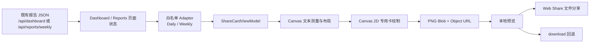
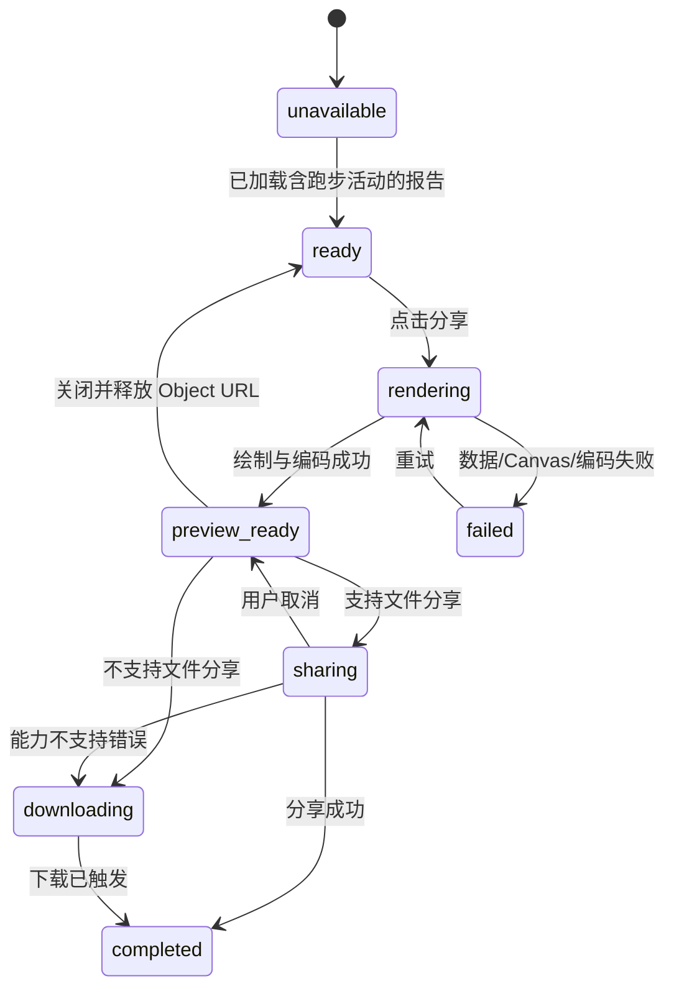

# 技术设计 — 分享卡浏览器 Canvas 生成

> 版本: v1.3 · 日期: 2026-08-24
> 状态: 结构化 AI 分享摘要已实现，待真实浏览器 E2E 验收
> 产品真相源: [产品方案 — 分享卡](../product/share-card.md)

## 1. 设计目标与约束

### 1.1 目标

- 日报和周复盘分享卡全部在登录用户的浏览器内通过 Canvas 2D 生成 `image/png`。
- 生产环境不调用 Playwright、Chromium、系统 Chrome、服务端 HTML 截图或 DOM 截图库；Web Canvas 是唯一 PNG 生成链路。
- `GET /api/dashboard` 与 `GET /api/reports/weekly` 的 URL、鉴权、状态码和既有 JSON 合同保持不变。
- Web UI 不再调用服务端分享卡图片路由。
- 旧分享卡图片路由保留为过渡入口，对已鉴权调用方返回明确的 `410 Gone` JSON。
- 删除 MCP `generate_share_card` 和 `generate_image` 注册；CLI/MCP 只保留报告数据与 HTML，不再承诺 PNG 输出，后续无需同步 Web 分享卡视觉能力。

### 1.2 非目标

- 不改变 CLI/MCP 的报告事实、Markdown 或 HTML 输出合同。
- 不把整个报告对象直接交给 Canvas 绘制层。
- 不截取可见 DOM、隐藏 DOM 或页面截图。
- 不引入 `html2canvas`、远程字体、远程图片或前端构建工具。

### 1.3 依赖边界

分享卡运行链路只依赖浏览器原生能力：Canvas 2D、`Blob`、`URL.createObjectURL`、`HTMLAnchorElement.download`，以及可选的 Web Share API。生产部署必须移除 Playwright、Chromium、系统 Chrome 和仅为截图存在的系统依赖；浏览器 E2E 可以继续把 Playwright 作为测试依赖，但不得进入生产 extra、镜像或启动环境。

CLI `daily` 和 MCP 当前的 `generate_image` PNG 输出属于本次经确认的下线范围。迁移后 CLI/MCP 只保留报告数据、Markdown 和 HTML；CLI help、输出摘要、MCP tool schema 与 README 必须同步，不得在运行时尝试 PNG 后静默警告，也不得保留不可达的生产截图模块。

## 2. 架构与职责



### 2.1 前端模块

建议新增共享静态模块 `web/static/share-card.js`，由 `dashboard.html` 和 `reports.html` 引用。模块职责固定如下：

| 组件 | 输入 | 输出 | 职责 |
|---|---|---|---|
| `buildDailyShareCardData` | `/api/dashboard` 已加载 JSON、主题 | `DailyShareCardData` 或结构化错误 | 只提取允许字段，筛选并排序跑步活动 |
| `buildWeeklyShareCardData` | `/api/reports/weekly` 中选定归档、主题 | `WeeklyShareCardData` 或结构化错误 | 只提取跑步汇总、趋势、质量课和结论 |
| `measureShareCard` | ViewModel、Canvas context | 区块坐标与逻辑高度 | 在绘制前完成文本测量、换行和高度计算 |
| `drawShareCard` | ViewModel、布局、主题 palette | Canvas | 按确定性顺序绘制专用卡，不读取 DOM 样式或节点 |
| `encodeShareCard` | Canvas | `Promise<Blob>` | 以 `image/png` 编码，空 Blob 视为失败 |
| `presentShareCard` | Blob、文件名 | 预览句柄 | 创建并管理 Object URL |
| `shareOrDownload` | Blob、文件名 | 终态 | 优先文件分享，能力不支持时下载，用户取消不下载 |

Canvas 卡片是独立视觉产物。实现不得使用 `drawImage(document...)`、DOM 序列化、页面截图或把整页 HTML 交给截图引擎。主题颜色由分享卡模块内的三套明确 palette 映射提供；可与全站 token 保持相同值，但不依赖浏览器解析完整页面 CSS 后再截图。

视觉实现采用“跑步日志页”结构：页眉为品牌、报告周期和日期，主距离居中并配一条固定几何的低饱和虚线路线；统计指标为三栏，以分隔线而非嵌套卡片区分，数值和标签均以各栏中心线对齐；Canvas palette 使用 `tokens.css` 的 `bg`、`bg-card`、`bg-subtle`、`text`、`text-secondary`、`text-muted`、`border-subtle`、`accent` 和 `performance` 值，字体使用同一系统字体栈。训练观察使用 10 px 标签和 12 px 正文，教练结论在细分隔线后使用 10 px 标签和 15 px 加粗正文；教练区圆角使用整站 `radius-sm` 的 10 px。训练列表使用序号、终点圆点和细规则线。路线只由 Canvas path 绘制，不承载位置或轨迹数据，也不引入地图、外部图片或网络请求。

### 2.2 后端模块

- `src/web.py` 继续提供两个既有报告读取接口，不为 Canvas 增加专用数据接口或字段。
- `src/web.py` 中两个旧分享卡路由保留，但删除报告查询、临时文件、图片生成及 `FileResponse` 分支。
- `src/share_card.py` 的服务端 HTML 和图片渲染职责在 Web UI 完成切换后删除；不得保留未注册的平行渲染实现。
- `src/mcp_server.py` 删除 `generate_share_card` 工具注册及其对 `src.share_card` 的导入。
- CLI `daily` 删除自动 PNG 生成和 PNG 输出提示，但保留报告事实、Markdown 与 HTML；README/MCP 工具清单同步删除 `generate_image` 与分享卡工具声明。

## 3. 数据合同与隐私边界

### 3.1 报告接口稳定合同

| 接口 | 稳定要求 | 分享卡读取字段 |
|---|---|---|
| `GET /api/dashboard?date=YYYY-MM-DD` | URL、GET 方法、Cookie 鉴权、未绑定时 `401`、成功 JSON 的既有字段名和类型不变；本变更不得删除、重命名或改型字段 | `has_data`、`report_date`、`daily_activities`/兼容的 `yesterday_activities`、`session_analyses`、`ai_insight.conclusion` |
| `GET /api/reports/weekly` | URL、GET 方法、Cookie 鉴权、未绑定时 `401`、非分页 `{status,reports}` 与既有分页合同不变；本变更不得删除、重命名或改型字段 | 选定 report 的 `week_id`、`week_start`、`week_end`、`actual_summary`、`trend_summary`、`quality_sessions`、`finding.conclusion` |

“保持稳定”不包含旧图片路由。旧图片路由的成功响应从 `image/png` 下线是一次明确的废弃迁移，必须返回 `410`，不能伪装成稳定 PNG 合同。

### 3.2 旧图片路由过渡合同

两个路由保留 `GET` 方法：

- `/api/reports/share-card/daily`
- `/api/reports/share-card/weekly`

处理顺序与响应：

1. 先执行当前 Cookie 和数据源绑定门禁；失败保持 `401` 与现有 JSON：`{"status":"error","message":"请先绑定数据源"}`。
2. 已鉴权请求不再解析 `date`、`theme`，也不查询报告是否存在；固定返回 HTTP `410 Gone`。
3. `410` 响应 `Content-Type` 为 `application/json`，`Cache-Control` 为 `no-store`，响应体固定为：

```json
{
  "status": "error",
  "code": "share_card_client_rendering_required",
  "message": "分享卡已改为浏览器内生成，请在日报或报告页面使用分享入口。"
}
```

不得返回重定向、HTML、空 body、`image/png`、本地文件路径或服务端降级图片。该过渡路由至少保留一个发布版本；最终删除需另行记录破坏性 API 决策。

### 3.3 最小化 ViewModel

Adapter 必须创建新对象，禁止把原报告对象透传给布局或绘制函数。允许字段如下：

- 日报：日期、跑步活动标签、距离、时长、平均配速、平均步频、结构化 AI 分享摘要（headline、逐次 session 摘要、takeaway、conclusion）、旧日报兼容观察、安全 AI 结论、主题。
- 周复盘：周 ID/范围、跑量、最长单次、平均配速、跑步天数、跑量趋势、质量课事实、三类安全 AI 观察（概览、质量课、近期变化）、安全 AI 结论、主题。

禁止进入 ViewModel 的字段：睡眠、HRV、静息心率、身体电量、恢复评分、训练准备度、ACWR、风险标记、异常提醒、训练建议、方案执行状态、用户昵称、邮箱、Provider 账号和 API Key。

Adapter 必须优先读取日报 `ai_insight.share_card`，不得把完整报告对象或 `observations` 原文透传给 Canvas。模型生成的 `share_card.sessions` 最多 4 条，每条包含正整数、唯一且对应真实跑步 session 的 `session_index`，以及最多 70 个字符的 AI 精简摘要；headline、takeaway、conclusion 各最多 90 个字符。合规摘要按 Canvas 实测宽度完整换行；前端仅对绕过 Schema 的异常或历史字段保留防御性长度上限。所有文本仍执行禁止词过滤，包含“睡眠”“恢复”“HRV”“ACWR”“风险”“警告”“异常”或“建议”的整条文本整体丢弃，大小写不影响英文缩写判断。`warnings`、`recommendations`、`recovery_and_risk` 和 `next_week` 不得读取。旧日报缺少 `share_card` 时，Adapter 才按兼容规则识别 `第N次跑步` 后的安全观察。无安全摘要且无安全结论时，Canvas 不绘制 AI 教练区块。

PNG 不包含 metadata 扩展，不上传或写入服务端。Object URL 在预览关闭、被替换和页面卸载时调用 `URL.revokeObjectURL()`；Canvas 不引用跨域图片或字体，避免 tainted canvas 和隐式第三方请求。

## 4. 布局、输出与状态机

### 4.1 输出约束

- 逻辑宽度固定为 375 px；物理像素缩放固定为 3，导出宽度为 1125 px。
- 先按逻辑像素测量全部区块，再一次性设置 Canvas 宽高并绘制；不得边绘制边扩容，因为修改尺寸会清空画布。
- 逻辑高度由内容决定，上限为 2048 px；超出时返回 `content_too_tall`，不得截断或输出部分图片。
- 教练分析文字使用 `measureText()` 按实际宽度完整换行，不添加省略号；活动名最多 1 行，超出部分才使用 `measureText()` 截断并添加省略号。
- 日报文件名为 `neurun-daily-YYYY-MM-DD.png`；周复盘文件名为 `neurun-weekly-YYYY-Www.png`。
- 导出前校验 Canvas 宽高、2D context 和 Blob；任何一项失败均不得进入预览就绪状态。

### 4.2 状态机



同一页面只允许一个 `rendering` 任务。重复点击不创建并发 Canvas 或 Blob。`AbortError` 代表用户取消，保持预览；浏览器能力不支持错误触发下载；其他分享错误保留预览并显示错误，不销毁 Blob。

## 5. 迁移顺序

1. 新增共享 Canvas 模块和 Adapter 单元测试，确保能从现有两类响应构造白名单 ViewModel。
2. Dashboard 与 Reports 页面改用当前内存中的报告 JSON 生成预览；删除对 `/api/reports/share-card/*` 的图片加载和下载调用。
3. 增加浏览器 E2E，确认分享操作期间没有旧图片路由网络请求，Canvas 非空且 PNG 宽度为 1125 px。
4. 将两个旧路由改为鉴权后固定 `410` JSON，并增加 Web API 合同测试。
5. 删除 `src/share_card.py` 及 `src/web.py` 的生成函数导入、临时文件和 `FileResponse` 图片分支。
6. 删除 MCP `generate_share_card` 和 `generate_image` 注册；CLI `daily` 停止生成 PNG，只保留数据、Markdown 与 HTML。
7. 删除生产 `[image]` extra、`src/image.py` 及其他只为生产截图存在的代码，移除部署脚本的浏览器/系统库安装、`PLAYWRIGHT_BROWSERS_PATH` 和 Chromium 冒烟检查；保留 E2E 测试浏览器时必须放在开发/CI 依赖边界。
8. 更新 README、`docs/CHANGELOG.md` 和必要的过程记录；全量测试通过后再发布。

迁移期间前端切换与服务端下线必须在同一发布中完成。不得先把旧路由改成 `410` 而仍让当前 Web UI 加载该 URL。

## 6. 测试与验收

### 6.1 单元和合同测试

- Daily Adapter：多活动排序、非跑步过滤、L0/L1、省略步频、结构化 share_card 多 session 全量保留、摘要长度与禁止字段过滤、旧日报前缀回退、AI 结论有无、禁止字段不进入 ViewModel。
- Weekly Adapter：跑量字段、趋势有无、质量课逐项、零质量课文案、AI 结论有无、禁止字段不进入 ViewModel。
- 布局：长教练文本完整换行且不含省略号、长活动名保持单行省略、2048 px 边界、超过上限整体失败。
- 编码：Blob MIME 为 `image/png`，物理宽度 1125 px，空 Blob 失败。
- 状态：重复点击 singleflight、分享成功、能力不支持下载、用户取消不下载、Object URL 全路径释放。
- API：两个报告数据接口的现有合同回归；旧路由未鉴权 `401`、已鉴权 `410`、固定错误码、JSON Content-Type、`no-store`。
- MCP/CLI：工具列表不含 `generate_share_card` 或 `generate_image`；CLI help 与执行输出不再声明或生成 PNG，报告数据、Markdown 与 HTML 回归通过。

### 6.2 浏览器 E2E

至少覆盖最新版 Chromium 和 WebKit 的桌面 1280×800 与移动端 390×844：

1. 日报与周复盘各生成一张正常卡，截图确认预览非空、无内容重叠、底部水印完整。
2. 对导出 PNG 解码，断言宽度严格等于 1125 px、高度大于 0 且不超过 6144 px。
3. 监听网络请求，点击分享后断言 `/api/reports/share-card/daily` 和 `/api/reports/share-card/weekly` 请求数均为 0。
4. 注入包含全部禁止字段的 fixture，断言 Adapter 输出不含对应键和原始值。
5. 覆盖无跑步活动、Canvas context 返回 `null`、`toBlob` 返回 `null`、Web Share 不支持和用户取消。
6. 三主题各生成一次，断言同一主题输出稳定且三主题关键 palette 像素不同。

### 6.3 验证命令

实现阶段至少执行：

```bash
pytest
```

并执行项目最终采用的真实浏览器 E2E 命令；若仓库新增专用命令，应在实现提交的 README 和 handoff 中给出，不得以模板字符串断言替代 Canvas 像素与网络行为验证。

## 7. 风险与控制

| 风险 | 控制 |
|---|---|
| 前端误把整个报告对象交给绘制层导致隐私泄漏 | Adapter 只创建白名单对象；测试注入唯一隐私值并验证 ViewModel 不含原值 |
| Canvas 文本测量与最终字体不一致造成截断 | 不加载远程字体；设置明确系统字体栈后再测量，测量与绘制复用同一 context 字体配置 |
| 超长内容耗尽移动端内存 | 逻辑高度硬上限 2048 px；超限整体失败，不输出半张图 |
| Web Share API 浏览器差异 | 先检查文件分享能力；不支持时下载，取消时保留预览 |
| Object URL/Canvas 长期占用内存 | 替换、关闭、卸载均释放 URL；完成后清空大 Canvas 引用 |
| 报告接口为分享卡改型导致其他页面回归 | 不新增专用字段；保留现有 API 合同测试 |
| 旧 PNG URL 调用方收到错误媒体类型 | 明确 `410` JSON 和稳定错误码，至少保留一个发布版本 |
| CLI/MCP 调用方仍期待 PNG | CLI help、MCP tool schema、README 与发布说明在同一版本明确下线；保留报告数据、Markdown 和 HTML 替代路径，不提供伪成功或空图片 |
