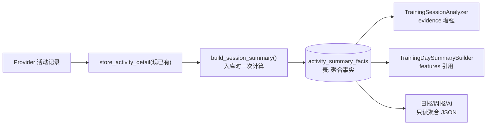
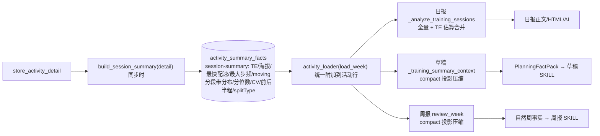

# 设计方案 — 运动摘要提炼（Summary Extraction）

> 属于 [设计方案索引](../design.md) · 专题设计 · 版本 v5（Coros 归一化与三入口字段合同）· 2026-08-14
> 当前状态: Garmin L1 已有真实样本；Coros 原始详情、lapList 与 Hz 数组保留、Provider Adapter 单位归一化、frequencyList L2 聚合和存量错误摘要重建已实现，本地真实详情与持久化结果已验收
> 关联模块: `src/training_analysis.py`、`src/training_day_summary.py`、`src/activity.py`、`src/memory.py`、`src/render.py`、`src/training.py`、`src/training_service_factory.py`
> 关联文档: [memory-system.md](memory-system.md)、[training-system.md](training-system.md)、[日报产品方案](../product/daily-report.md#332-训练深度分析分段粒度已确认)、[CONTEXT.md](../../CONTEXT.md)

---

## 1. 背景、目标与边界

从 Provider 活动记录提炼**可追溯的摘要事实**（`SessionSummaryFacts`），供训练内容识别、日报/周报与 AI 教练消费。

- **输入** = Provider 活动记录（`activities` + `activity_splits` + `detail_json` 中可选 1Hz 指标）
- **不支持本地 FIT 文件**：FIT 相关内容整体剥离，数据源就是同步下来的运动记录
- 只做确定性归一化与聚合；AI 只读聚合结果，不接触原始明细（落实 CONTEXT.md：`Training Session Analysis` _Avoid_ raw activity / AI prose）
- 不生成训练方案，不把自然语言报告当作事实来源

**性能目标（已实测达标）**: 单活动摘要生成 ≤ 20ms、90 活动批量 ≤ 0.5s（纯 Python，无新依赖）。见 §6。

---

## 2. 现状盘点

| 已有且走通 | 位置 |
|------------|------|
| 明细入库（`detail_json` 全量 + `_extract_splits` 分段） | `src/activity.py::store_activity_detail` |
| 分段表（pace/hr/cadence/power/NP/GCT/stride/VO/elevation） | `activity_splits` 表 |
| 训练内容识别（type/terrain/confidence/evidence，`session-analyzer-v1`） | `src/training_analysis.py` |
| 单日摘要（feature 带 code/label/confidence/evidence，`training-day-summary-v1`） | `src/training_day_summary.py` |
| 日报链（splits → Baseline → analyze → 日报） | `src/memory.py::_analyze_training_sessions` |

**三个缺口**:
1. `detail_json` 内 1Hz 指标存而不用；尤其 Coros `frequencyList` 已保留但尚未进入标准 Hz
   normalizer，不能据其存在标记 L2
2. `activity_splits` 的效率字段（GCT/步幅/VO/功率）只存不用
3. L0 字段映射有洞（示例周报时长/距离全零、类型 unknown）

---

## 3. 核心设计（收拢版）：一个函数、粒度自适应

Provider 原始字段先通过 `src/providers/normalization.py` 的 Adapter 注册表转换为
canonical activity detail。新增平台只注册一次 matcher + normalizer；
`activity.py`、`summary_extraction.py` 以及日报、周报、草稿不得出现新的 Provider
字段判断。原始详情仍原样持久化，canonical 副本只用于确定性派生。

**不做多级提炼器**。实现为单一纯函数，`granularity` 是输出属性而非实现分支：

```python
# src/summary_extraction.py
# 无版本号：单一统一 schema，演进直接并入，重算以 detail_hash 为准

def build_session_summary(detail: dict) -> SessionSummaryFacts:
    """一次遍历, 产出全部摘要事实。

    granularity 自适应:
      - 有 splitSummaries            → "L1"（结构/效率/地形）
      - 且有 activity_detail_metrics → "L2"（强度分布, 用 1Hz 精确）
      - 只有 activities 摘要         → "L0"（仅量）
    心率缺失时 intensity.basis = "pace" 并显式声明。
    """
```

```python
@dataclass(frozen=True)
class SessionSummaryFacts:
    granularity: str                  # "L0"|"L1"|"L2" —— 驱动下游置信度
    volume: VolumeFacts               # 时长/距离/负荷/热量
    structure: StructureFacts | None  # 组数/正负分段/CV/效率均值(L1)
    intensity: IntensityFacts | None  # 配速/心率带占比 + basis(L2精确/L1分段加权近似)
    terrain: TerrainFacts | None      # 爬升/每公里(L1)，坡度剖面(L2)
    data_quality: dict[str, str]      # 缺失清单 + 代理声明
```

**设计要点**:
- 一次 `json.loads` + 一次遍历完成全部维度（实测 16.9ms/活动，见 §6）
- `intensity.basis` 是唯一代理机制：缺心率用配速带，确定性声明，不做运行时 AI 判断
- 可选维度 `None` 表示该粒度不可得，与 `data_quality` 配套
- 阈值/分箱全部命名化（`SummaryPolicy`，对齐 `AnalyzerPolicy`），可回放

---

## 4. 数据流与接入



- **计算时机**: 入库时一次，幂等；失败不阻断入库。报告与 AI 全程只读聚合事实。
- **缓存键**: `activity_summary_facts.detail_hash`（detail 规范化 SHA-256）；detail 变化只重算受影响活动。
- **evidence 接入**: `TrainingSessionAnalyzer.analyze` 追加记录级条目（不改接口）："52% 时间处于 3:20–3:50 配速带（basis=pace）"、"前后半程差 +128s"、"总爬升 1066m"。置信度结合 `granularity` 校准。

---

## 5. 摘要事实维度

### 5.1 v1 输入与持久化契约

v1 对 Provider 字段采用兼容别名，但统一为 SI/秒口径：`duration`/`durationSeconds` →
`duration_s`，`distance`/`distanceMeters` → `distance_m`，`averageHR` → bpm，分段
`duration` 与 `distance` 在缺少 `pace` 时确定性计算 `sec/km`。摘要优先读取
`summaryDTO`，分段按 `splitSummaries`、`splits`、`laps`、`lapList` 顺序探测（Coros
`lapList` 的 `lapItemList` 子项优先展开为逐段序列，无子项时退回 lap 汇总），1Hz 指标按
`activity_detail_metrics`、`activityDetailMetrics`、`detailMetrics`、`metrics` 探测。
字段缺失写入 `data_quality.missing_fields`，不猜测或让 AI 补值。

Coros 必须先经过独立 normalizer，再进入上述 Provider-neutral aliases：

- `summary.distance`、`lapItem.distance`: `raw / 100` → 米；
- `summary.workoutTime`、`summary.totalTime`、`lapItem.time`、`lapItem.totalLength`:
  `raw / 100` → 秒；活动训练时长优先 `workoutTime`，总历时保留 `totalTime`；
- `summary.calories`、活动列表 `calorie`: `raw / 1000` → kcal；
- `lapItem.avgPace` → `pace_sec_per_km`，单位 `sec/km`；
- `lapItem.avgHr` → `avg_hr`，单位 `bpm`；
- `lapItem.avgCadence` → `avg_cadence`，单位 `spm`；
- `lapItem.avgStrideLength` → `stride_length_cm`，单位 `cm`。

每个转换后的 evidence 同时保留原始字段、原始值、转换因子、标准值和单位。未经真实响应夹具确认的
运动类型/协议版本不得套用上述转换，写 `unit_unverified` 并降级。

Coros 分段权威层级固定为：有效 `lapList[].lapItemList[]` 叶子项 > 无有效子项的父 lap > 无分段。
父 lap 与子项不能同时计量；活动 summary 永远只作为总量校验。按 `lapIndex`、起止时间和累计距离
去重后计算 `normalized_segment_distance / summary_distance`，比值在 `[0.85, 1.15]` 才设置
`quantity_reliable=true`。门禁失败时保留可独立验证的配速/心率/步频/步幅模式，但分段距离、时长、
每公里结论均不可用。只有 Provider 明确标为公里 lap，或标准距离在 `1000 +/- 20 m` 且门禁通过，
才把该序列命名为“每公里分段”。

L2 的判定还必须满足：原始 Hz 数组已映射为带标准相对秒、米、`sec/km`、`bpm`、`spm` 的有效点，
无效/暂停点处理规则已记录，且确定性聚合成功。仅保存 `frequencyList`、`graphList` 或
`gpsLightDuration` 时写 `hz_unparsed`，granularity 最高为 L1。

`activity_summary_facts` 以 `activity_id` 为唯一键，保存 `summary_json`、
`summary_version`、`detail_hash` 和 `user_id`。入库与活动详情同一事务幂等 upsert；提炼
失败只记录 warning，不阻断原始详情/分段入库。`detail_hash` 为规范化 JSON 的 SHA-256，
与 `summary_version` 一起作为重算判断依据。下游只能读取该表的聚合 JSON，不得读取
`activity_details.detail_json`。

v1 的固定分箱为配速 `<240`、`240–300`、`300–360`、`360–420`、`≥420 sec/km`，
心率 `<130`、`130–145`、`145–160`、`160–175`、`≥175 bpm`；L1 以分段时长加权，
L2 以 1Hz 指标时长加权。缺少心率时 `basis=pace`，缺少可用配速/心率时不生成
`intensity`，但仍保留 `data_quality`。

| 维度 | 粒度 | 输出（示例） | evidence 示例 |
|------|------|--------------|---------------|
| volume 量 | L0 | duration_s / distance_m / calories / load | "来源: activities.duration_seconds" |
| structure 结构 | L1 | n_splits / half_diff_s / cv_pct | "3 组快块×1km@4:00，恢复 400m@6:00" |
| intensity 强度 | L2精确 / L1近似 | pace_bands_pct / hr_bands_pct / basis | "52% 时间处于阈值配速带（basis=pace）" |
| efficiency 效率 | L1 | avg_cadence / avg_stride / avg_gct / avg_vo | "平均步频 184spm，步幅 1.1m" |
| terrain 地形 | L1/L2 | ascent_m / gain_per_km / grade_profile | "总爬升 1066m，6.5% 时间坡度 >5%" |
| data_quality 质量 | L0–L2 | missing_fields / intensity_basis | "heart_rate unavailable → basis=pace" |

---

## 6. 性能实测（2026-08-10，纯 Python，无 numpy）

模拟 Garmin 明细结构（`activity_detail_metrics` 1Hz 数组 + `splitSummaries`）实测：

| 场景 | 载荷 | json.loads | loads+聚合 | 事实序列化 |
|------|------|-----------|-----------|-----------|
| 马拉松级 9000s/43段（含1Hz） | 621KB | 15.7ms | **16.9ms** | 1.4ms |
| 同场景仅 splits | 621KB | 15.4ms | **15.8ms** | 0.05ms |
| 节奏跑 1800s | 123KB | 3.0ms | **3.3ms** | 0.3ms |
| 间歇课 2400s/12段 | 166KB | 4.0ms | **4.5ms** | 0.4ms |
| 批量 90 活动（含合成） | — | — | **422ms** | — |

**结论**: 摘要生成毫秒级，不是性能瓶颈。真实耗时在两端——Provider 网络拉取（秒级/活动）与报告 AI 调用（秒~十秒级，由 `ai_inference_coordinator` 限流）。**无需引入 numpy、并行化或缓存优化**；仅保留 schema 版本化重算机制即可。

**token**: 日报/周报/AI 输入从"明细"降为"聚合事实"（KB 级），输入量降一个数量级。

---

## 7. 落地顺序（4 步）

1. **探针 + 修 L0 地基（1 天）**: `neurun inspect-detail <id>` 打印真实 `detail_json` 顶层 keys（确认 1Hz 是否存在）；同时修复 activities → volume 字段名映射（周报零值问题）
2. **单函数提炼**: `src/summary_extraction.py::build_session_summary()`，一次遍历产出全维度；`store_activity_detail` 内调用并落 `activity_summary_facts` 表
3. **证据接入**: `TrainingSessionAnalyzer` evidence 追加记录级条目；`TrainingDaySummaryBuilder` features 引用 structure/intensity
4. **回归 + ADR**: 真实 `detail_json` 脱敏快照入 `tests/fixtures/` 锁住 L1 输出；schema 版本化与重算策略走 ADR

> L2 不是独立阶段：探针确认 1Hz 后，只是该函数内多读一个分支，其余不变。

---

## 8. 风险与验收

| 风险 | 对策 |
|------|------|
| 1Hz 在部分 Provider 缺失 | 函数自动降级 L1（分段加权近似），`granularity` 如实标记 |
| Provider 字段名漂移 | 探针 + 回归夹具 + `data_quality.missing_fields` 显式告警 |
| schema 演进 | 无版本号：字段演进直接并入（默认值兼容旧记录）；破坏性变更才评估迁移 |

**验收标准**:
- [ ] 每条摘要事实可追溯到 evidence
- [ ] 心率缺失时 `intensity.basis=pace` 全链路可见
- [ ] 报告/AI 输入不含 1Hz 原始数组或完整 `detail_json`
- [ ] 同一活动重复入库幂等
- [ ] 单活动生成 ≤ 20ms（CI 可加性能断言）
- [ ] 回归夹具覆盖 L1 关键输出
- [ ] Coros 8.14126 km / 2582.45 s 真实夹具归一化为约 8141.26 m / 2582.45 s
- [ ] Coros 父子 lap 不重复累计，距离比例门禁通过后才输出每公里量结论
- [ ] Coros raw Hz 未解析时为 `hz_unparsed` 且不得标 L2；标准化 Hz 聚合成功后才标 L2
- [ ] 六项运动事实（距离、平均配速、可靠分段、心率、步频、步幅）逐字段有值或显式 gap

---

## 9. 统一收拢：训练深度分析并入单一 session-summary（2026-08-12 已确认）

### 9.1 架构原则（用户确认）

**不设计 v1/v2 并行版本**。session-summary 是单一统一 schema：训练深度分析字段（效果/海拔/配速画像/复合结构）
直接并入本结构，旧记录缺失字段按 dataclass 默认值兼容读取。

- **唯一来源**：`activity_summary_facts` 表，同步时一次写入；
- **统一流向**：`activity_loader`（`training_service_factory.load_week`）把 session-summary 附加到活动行，
  草稿、周报、训练首页与日报从同一来源消费（此前只有日报附加，草稿/周报读不到）；
- **消费侧压缩**：周报和草稿都从同一 session-summary 投影，减小载荷但不产生第二套解析；
  日报保持完整聚合摘要。周报保留自然周判断需要的六项聚合/结构事实。草稿保留上一完整自然周的
  聚合基线，并对最近两个已结束自然日保留距离、平均配速、可靠分段、心率、步频、步幅中的可用值
  或字段级 gap；不得在后续 `PlanningFactPack` 压缩中再次静默删除。

```python
# 无版本号：单一统一 schema，演进直接并入；重算以 detail_hash 为准

def compact_session_summary_for_planning(summary: dict) -> dict:
    # 投影：granularity + volume(时长/距离) + effect(TE/估算标记)
    #       + avg pace + reliable segment sequence + HR/cadence/stride
    #       + intensity.basis + structure_profile + field-level gaps
    # 不包含 detail_json、raw Hz points、重复 evidence 或仅展示用完整分位数组
```

### 9.2 session-summary 统一 schema 增量（全部可选默认 None，兼容存量旧记录）

```python
# 无版本号：单一统一 schema，演进直接并入，重算以 detail_hash 为准

@dataclass(frozen=True)
class EffectFacts:                      # 训练效果
    aerobic_training_effect: float | None   # Provider 原始 TE（0-5）
    anaerobic_training_effect: float | None
    label: str | None                       # 如 AEROBIC_BASE
    message: str | None
    moderate_intensity_minutes: float | None
    vigorous_intensity_minutes: float | None
    estimated: bool = False                 # True = 本地估算，非设备测量
    estimate_method: str | None = None      # 估算时: "zone_minutes_weighted"
    estimate_basis: str | None = None       # 估算时: "heart_rate" | "pace"
    evidence: tuple[dict, ...] = ()

@dataclass(frozen=True)
class ElevationProfileFacts:            # 地形全貌
    ascent_m: float | None
    descent_m: float | None
    max_elevation_m: float | None
    min_elevation_m: float | None
    gain_per_km: float | None
    evidence: tuple[dict, ...] = ()

@dataclass(frozen=True)
class PaceProfileFacts:                 # 配速画像（分段粒度）
    avg_pace_sec_per_km: float | None
    fastest_pace_sec_per_km: float | None
    p5 / p25 / p50 / p75 / p95: float | None
    cv_pct: float | None
    half_pace_diff_s: float | None          # 后半-前半段时长加权平均配速差（>0 后程慢=正分段）
    positive_split: bool | None
    split_count: int = 0
    basis: str = "split"                    # split | second
    evidence: tuple[dict, ...] = ()

@dataclass(frozen=True)
class StructureProfileFacts:            # 复合训练结构
    split_types: tuple[str, ...] = ()       # warmup/recovery/main/interval...
    work_blocks: int = 0
    recovery_blocks: int = 0
    composite_type: str | None = None       # interval | tempo | fartlek | tempo_interval | steady | unknown
    evidence: tuple[dict, ...] = ()
```

`SessionSummaryFacts` 新增字段：`effect`、`elevation_profile`、`pace_profile`、
`structure_profile`（structure 保持 v1 字段不动）。

### 9.3 数据流：原始 TE 入库、估算在分析层、三流程同源



- **同步层**（`build_session_summary`）只解析 Provider 原始字段，不做估算（此时无个人阈值）。
- **分析层**（`estimate_training_effect`，放 `summary_extraction.py`）需要
  `AthleteBaseline.threshold_heart_rate` / `threshold_pace_sec_per_km`，由
  `memory._analyze_training_sessions` 在日报生成时注入并把估算结果合并进
  `session_analyses` 的展示副本；`activity_summary_facts` 表保持只存原始。
- **草稿/周报**经 `load_week` 获得同一份 session-summary，在
  `TrainingDaySummaryBuilder.build` 透传后由 `training._compact_day_session_summaries`
  投影压缩（`compact_session_summary_for_planning`），携带规划概要 + `segment_sequence`
  （逐段序列）；并在分析时用 AthleteBaseline 对每课做与日报同口径的结构判定
  （`structure_classification`），供草稿/周报 SKILL 引用训练结构。
- 草稿后续压缩只可把更早历史收敛为周级聚合；最近两个已结束自然日的六项运动事实必须继续存在。
  若源摘要不可用或字段未映射，投影输出 `gaps[{field, reason, affects}]`，不能把缺失转换为零值，
  也不能以 `projection_omitted` 静默隐藏会改变课程衔接、近期表现或强度判断的事实。

### 9.4 TE 估算方法（确定性、可回放）

- 输入：逐分段心率 + 个人阈值心率（优先）；无心率时逐分段配速 + 个人阈值配速（`basis=pace`）。
- **个人阈值只来自档案/平台，不猜测**：`AthleteBaselineBuilder` 优先级为
  ① 档案显式阈值（`threshold_heart_rate` / `threshold_pace_sec_per_km`）→
  ② 平台自算乳酸阈值（Coros `lthr`/`ltsp`，同步入 `daily_health_metrics`，取目标日及之前最近一条）→
  ③ 档案最大心率 + 静息心率（Karvonen：阈值 ≈ 静息 + 0.88 × (最大 − 静息)）→
  ④ 档案最大心率 × 0.88 → ⑤ 档案 `personal_bests` 推导阈值配速（半马最接近阈值，10K/5K 按
  经验差折算，来源标记 `personal_bests`）→ ⑥ 无档案：`threshold_* = None`（不得用近期训练
  平均心率/配速分位充当，近期训练构成会拉低基准导致强度虚高）。
- 分段强度比值 `r = 段值 / 阈值`（配速方向取反：`r = 阈值 / 实际配速`），zone 权重：
  `r<0.75 → 0.3`、`0.75–0.88 → 0.6`、`0.88–1.0 → 1.0`、`1.0–1.1 → 1.6`、`>1.1 → 2.2`。
- 刺激分 = Σ(段时长分钟 × 权重)；`estimated_te = clamp(1.0 + 刺激分 / 40, 1.0, 5.0)` 保留 1 位小数
  （校准：40min 恢复课 ≈1.3，60min Z3 ≈2.5，60min Z4 ≈3.4）。
- 输出带 `estimated=true`、`estimate_method="zone_minutes_weighted"`、
  `estimate_basis="heart_rate"|“pace”`；展示用“≈”与“估算，依据心率/配速”字样。
- 阈值与心率、配速都不可用时返回 `None`（“不可得”），不伪造。

### 9.5 复合训练识别

- 按 `splitSummaries[].splitType` 序列统计：warmup/cooldown/walk/stand 段不计入工作段；
  recovery 段优先匹配后不再计入 work；其余按 work 关键词（interval/work/main/speed/repeat/stride/sprint）计数。
- work/recovery 检测：前缀标注缺失时退化为相邻段配速交替检测（快段 ≤0.88×前段且后段 ≥1.15×快段）。
- `composite_type`（结构性课型）：≥2 组 work 且 ≥1 组 recovery → `interval`；名称含
  fartlek/变速 → `fartlek`；有 splitType 标注但不足间歇 → `structured`；其他 → `steady`。
  强度课型（tempo/aerobic 等）由 `TrainingSessionAnalyzer` 的 `primary_type` 提供，两者并存展示。

### 9.6 展示

- `render.py::_detail` 从字符串解析重写为 **dict 结构三块卡片**（整体水平 / 强度分布 / 配速节奏），
  修复与 `session_analyses` dict 结构脱节的既有问题。
- Markdown 正文同步三块；L0 只展示整体水平并注明"强度分布/配速节奏不可得（无分段数据）"。
- 训练效果显示规则：原始 TE → 估算（≈ + 估算）→ "不可得"。
- 教练观察（`CoachInsight.observations`，AI 与本地降级同形态）消费本摘要的 `intensity`（配速带/心率带、`basis`）、`pace_profile`（分位数/CV/前后半程）与 `structure`（`avg_cadence`/`avg_stride`）产出四块自然语言观察：运动概要、强度分布解释与分析（含步频/步幅）、恢复分析、近 7 天负荷与恢复分析（ACWR + 近一周睡眠/HRV 趋势）；无步频/步幅或心率时如实声明缺失，不补造（见 [日报产品方案 §3.3.4](../product/daily-report.md#334-教练观察内容规范已确认)）。

---

## 10. 确定性特征提取与训练结构判定（阶段 1，2026-08-12 已确认）

### 10.1 架构：同步层存客观特征，分析层做加权判定

- **同步层**（`build_session_summary`，无个人阈值）：只提取**客观特征**——
  逐段序列 `segment_sequence`（配速/心率/步频/步幅，比值抵消后真实）+ `quantity_gate`
  （段距合计 vs summary 比值 → 量可信/不可信）。
- **分析层**（`classify_training_structure`，有个人阈值）：六类加权判定，
  与 `estimate_training_effect` 同模式——需要 baseline，不入库固化，日报/草稿/周报分析时算。

```python
# 同步层新增（统一 schema，演进并入）
segment_sequence: [{
    "pace_sec_per_km": float | None,    # 真实（×2 抵消后）
    "avg_hr": float | None,
    "avg_cadence": float | None,        # 步频
    "stride_length_cm": float | None,   # 步幅
    "split_type": str | None,
}, ...]
quantity_gate: {"ratio": float, "quantity_reliable": bool}  # ratio ∈ [0.85, 1.15]
```

### 10.2 加权证据模型

| 证据 | 权重 | 用途 |
|---|---|---|
| 配速 | 0.40 | 快慢交替/强度带/正负分段（主） |
| 心率 | 0.35 | 强度确认/漂移/回落（主） |
| 步频 | 0.15 | 快段响应/一致性（辅） |
| 步幅 | 0.10 | 快段响应/后半程疲劳（辅） |

- 四维度独立降级：秒级 → 段级 → summary → 缺失（缺失只降置信与成分精度）。
- `confidence = Σ(采用证据权重)`；无配速且无心率 → `unknown` + 原因。

### 10.3 六类判定规则（确定性）

1. 快段：配速快 ≥12%（相对主体）+ 心率抬升 ≥8% 确认；步频/步幅响应修正置信。
2. 交替组数 ≥2 → 变速/间歇：快段规律（时长/距离近似）且强度 ≥ 阈值带 → 间歇，否则变速。
3. 无交替 → 强度带分档：Z3（0.88–1.0×阈值）连续 → 节奏；Z2（0.75–0.88）→ 有氧。
4. ≥2 成分 → 混合（成分分布）。
5. 主证据不足 → unknown。

### 10.4 数据源：Garmin lapDTOs 与 Coros 原始详情状态

- **Garmin**：同步时对跑步活动额外拉取 `/activity-service/activity/{id}/splits` → `lapDTOs`，
  注入 `detail["lapDTOs"]` 入库；`lapDTOs` 是**可信分段**（0811 验证 25 段，距离/时长合计
  与 summary 比值 1.0000，四维度齐全 + `intensityType`）。`build_session_summary` 与
  `activity_splits` 写入均优先 `lapDTOs`，`splitSummaries`（×2 异常）退为兜底。
- **Coros**：真实响应已确认 `frequencyList` 为 1Hz 原始序列，`lapList.lapItemList` 含公里 lap，
  但字段单位和父子 lap 结构不同于 Garmin。当前只完成原始 `detail_json` 保留；必须按 §5.1 的
  Coros normalizer、去重和距离比例门禁生成新摘要，并重算存量错误记录后，才能宣称 L1 量值可靠。
  `frequencyList` 完成标准点解析与聚合前不得标 L2。
- **其他运动**：Garmin 当前只对跑步拉取官方 splits；Huawei 详情仍按可用字段降级。
- **术语**：快段达阈值 + 结构规律 → "间歇结构（N 组快慢交替）"；无规律交替 → 变速（fartlek）。
- **存量数据**：已同步旧活动无 `lapDTOs` → 仍走 `splitSummaries`，由 `quantity_gate`
  （×2 → unreliable → 仅强度模式）兜底；重新同步可修复。

### 10.5 数据门禁与降级

- `quantity_reliable=false`（×2 等）→ 只输出强度模式（序列特征），不输出段距离/时长。
- 0811 真实案例：lapDTOs 注入后 quantity_gate ratio=1.0 reliable，
  识别"间歇（4 组快慢交替）· 置信 100% · 成分 fast 16%/slow 16%/body 68%"；
  ×2 兜底路径仍可靠识别强度模式（不误判为变速）。
- **存量活动兜底**（`memory._segment_sequence_fallback`，2026-08-12 已实现）：旧 schema summary
  无 `segment_sequence`/`quantity_gate` 时，日报分析层从 `activity_splits` 表重建分段特征序列
  （pace/avg_hr/cadence/stride/duration/split_type），并按分段距离合计 vs summary 距离重算
  `quantity_reliable`（比值 ∈ [0.85, 1.15] 才可信）。真实案例：08-11 单次跑步融合分段变速
  （INTERVAL_ACTIVE 229s/km + RECOVERY 310s/km 1 组交替）→ 识别"混合 · 置信 100% ·
  ×2 异常标记仅强度模式"，不误判为间歇或 unknown；新 schema 数据仍优先用 summary 的
  `segment_sequence`，不重复重建。

## 11. 统一日分析与质量课投影

`SessionSummaryFacts` 不直接按 Provider 投影到日报、周报或方案草稿，而是先进入
`TrainingDayFact -> TrainingDayAnalysis`。三个消费入口引用相同日事实版本和分析版本；消费侧可以压缩证据，
但不能重新分类课型、把可用字段静默丢成 Provider 缺失，或读取 raw `detail_json` / 1Hz 点。

质量课判定只消费统一字段：结构类型、结构置信度、配速/心率主证据、数量门禁与快慢组。阈值为
`confidence >= 0.60`；支持 `interval / tempo / fartlek`，`mixed` 仅在 `work_recovery_groups` 非空时进入。
活动标题和 Provider 名称不参与判定。距离、时长、平均配速、心率、步频、步幅、可靠分段、快慢组与训练效果
逐项输出 Value-or-Gap；`quantity_reliable=false` 时可靠分段为 `quantity_unreliable` gap，不生成每公里量结论。
