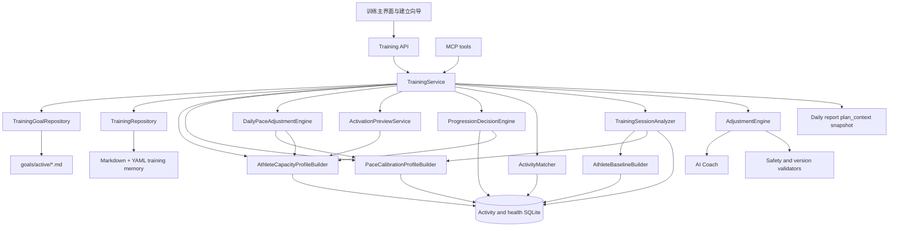

# 技术设计 — 交互式训练方案系统

> 版本: v0.61 · 日期: 2026-08-14
> 状态: 训练方案主线与本轮精简规则已完成核心运行时收敛：生效/草稿方案门禁新目标、同日单活动高置信度匹配、执行状态移除 substituted、疼痛安全指引只读覆盖、长期可训练日反馈生成同一 plan_id 的下周 Scheme Version、排期取消退回草稿、目标改期预览/确认、AI 候选失败不产生半份版本已实现；Provider 真实验收、严格 journal 级跨文件原子恢复、完整阶段状态机和进程决策自动生成方案级提案仍待完成。未引入伤病管理、Safety Hold 生命周期、暂停态、课程编辑器、新设置页或规则版完整方案。
> 产品真相源: [training-experience.md](../product/training-experience.md)

## 1. 设计范围

本设计描述训练主界面、跨时间能力档案、训练方案、启用预览、本周剩余安排、周计划、今日训练、训练内容分析、执行反馈、自适应进程决策、调整提案和方案版本的目标架构。当前 `TrainingService` 已成为 Web、MCP 和 Coach 训练工具的共同领域入口；日报 `plan_context` 继续只承担历史快照职责。

## 2. 当前状态与缺口

- `src/training.py` 已实现 `TrainingRepository`、`TrainingService`、保守 `ActivityMatcher`、旧方案迁移、反馈和提案状态流转。
- `/training` 直接读取实时方案、当前自然周和活动状态，不依赖日报 `plan_context`。
- 每个非休息计划训练在读取时补全 `training_prescription`；旧方案兼容保留原有 `type`，但 UI 以训练块、完成目标和通俗强度为主。方案 Skill 未提供可靠个人强度事实时，确定性层显式标记配速与心率不可用。
- `src/training_pace.py` 已按可信 Training Session Analysis 构建版本化 Z1–Z5 配速校准档案，并在训练首页读取时生成不改写方案的当天执行区间；场景天气校准、基础配速上调提案和日报历史快照尚未接入。
- `coach.py` 和 MCP 已移除直接覆盖式 `save_training_plan`，改用 submit/propose/approve/reject 两阶段写入。
- 活动内容识别 v1 已读取完整 SQLite 活动并向训练周视图提供识别名称和置信度。
- 当前活动匹配只处理同日去重活动，目标运行时继续收敛为同日单活动高置信度自动匹配；独立 Execution Record 尚未完成，拆分训练、跨日替代和人工纠正不再列入第一版待办。
- 局部调整由确定性规则产生安全差异，并由 `propose-training-adjustment` 提供可选解释；周复盘输出确定性 `AdaptationSignal`，方案级变化由 `revise-training-scheme` 形成完整候选并继续经过 Validator。
- 无方案页面当前已引用 `goals/active/*.md` 中的 Training Goal，但仍按目标、当前基础、现实约束、草稿和确认五步建立；目标合同收敛为目标赛事、现实约束、方案预览与开始确认三步，运行时待改。
- ~~`continuous_running | race_preparation | recovery_transition`、`coaching-context.md` 和模式转换接口~~（2026-08-12 已移除）：`coaching_mode` 现由生效方案派生（有赛事备赛方案 → `race_preparation`，否则 `continuous_running`），不再有模式转换提案/待确认 UI。目标架构只保留有目标赛事的单一 Training Scheme，无目标时不创建方案。
- `AthleteBaselineBuilder` 以活动发生前 28–42 天数据统计样本量，但个人阈值（心率/配速）只来自档案：
  显式阈值优先，其次由档案最大心率推导（Karvonen，LT2≈88% 心率储备）；档案缺失时阈值为空，
  不再用近期训练平均心率/配速分位充当（训练构成会拉低基准导致强度虚高）。尚没有同时表达当前
  可持续能力、历史已证明能力、中断背景和数据置信度的跨时间能力档案。
- `activate()` 当前把服务器当天日期直接写为 `effective_from` 并立即生成所在自然周，尚无启用预览、自选开始日期或不计阶段周的 Bridge Week。
- `review_week()` 当前主要按课次与跑量完成比例输出 `keep`、`local_adjustment`、`scheme_revision` 或 `insufficient_data`，尚不能识别原计划低估、加速推进、保持观察或恢复降载。

## 3. 目标架构



训练 Web、CLI 和 MCP 共用同一业务服务，避免各入口分别实现状态迁移和写入规则。

## 4. 模块职责

| 组件 | 职责 |
|---|---|
| `TrainingService` | 聚合训练首页、创建草稿、接收反馈、审批提案和关闭周计划 |
| `TrainingGoalRepository` | 统一读取和写入活跃 Training Goal，供训练建立向导、方案重规划和方案服务共享 |
| `TrainingRepository` | 读取和原子写入方案、周计划、提案、反馈、版本与执行记录 |
| `AthleteCapacityProfileBuilder` | 基于多时间窗口活动、比赛表现、可验证历史事实与自动推断的中断背景形成版本化跨时间能力画像 |
| `PaceCalibrationProfileBuilder` | 从个人阈值/临界速度、近期比赛和同类课程主体段建立版本化 Z1–Z5 配速证据与可用区间；整体均速只作安全参照 |
| `DailyPaceAdjustmentEngine` | 按能力/表现、目标推进、恢复和 ACWR 的固定顺序生成只读当天执行区间；目标推进仅限规则边界内的小幅覆盖，不改写方案 |
| `ActivationPreviewService` | 在启用前重验草稿事实，生成唯一推荐开始日期、系统确定的起始负荷、本周剩余安排与首个完整训练周，并形成待确认 Activation Schedule |
| `ProgressionDecisionEngine` | 综合周执行、能力、恢复、反馈和数据质量输出加速、推进、保持、降载、重规划或等待数据 |
| `AdjustmentEngine` | 根据用户反馈、当前方案、训练数据和恢复状态生成结构化提案 |
| `TrainingValidator` | 校验版本、状态迁移、安全边界、历史日期和用户归属 |
| `ActivityMatcher` | 按同日和高置信度证据自动关联最多一条实际活动；无法确定时保留未匹配，不提供人工关联 |
| `ActivityFactsNormalizer` | 将 Provider 活动汇总、详情与分段转换为保留来源和缺失语义的统一事实 |
| `AthleteBaselineBuilder` | 仅使用分析时点之前的近期原始活动、身体状态和有效档案建立个人能力参照 |
| `TrainingSessionAnalyzer` | 以确定性、版本化规则输出训练主类型、地形属性、置信度、证据和训练影响 |
| `TrainingPresenter` | 生成 Web、CLI 和 MCP 共用的结构化读模型；统一拆分默认可见的推荐结果/安全动作与按需展开的推荐理由 |

名称为目标职责，不要求实现时机械拆成同名文件；最终模块边界应结合现有 `memory.py`、`coach.py`、`storage.py` 和 `web.py` 决定。

### 4.1 报告主线与训练写入边界

报告中心是产品层面的观察与决策建议主线，训练系统是建议落地的处方与执行域。报告服务基于 `Actual Activity`、`Execution Record`、`Training Session Analysis`、`Athlete Capacity Profile`、`Athlete Habit Profile`、恢复事实和 `Training Goal` 生成日报、周复盘或阶段建议；训练服务消费报告固化的结构化事实和 `Progression Decision`，生成 `Adjustment Proposal`、`Training Scheme Draft` 或下一版本候选。

两域之间只通过带 `report_id`/`week_id`/`facts_cutoff` 的结构化引用传递建议。报告不得调用方案确认、启用或推进写入接口；训练不得从报告自然语言正文重新推断事实。训练页完成版本校验、安全校验、差异展示和用户确认后，才写入 `Local Schedule Adjustment` 或 `Scheme Version`。这样报告可以成为产品主线，同时避免报告与训练互相静默写入或重复维护历史结论。

`Progression Decision` 是报告向训练传递的审计对象，不等于已经生效的方案修改。日报只给出当日下一步，周复盘给出下一周建议，阶段复盘才可给出下一阶段建议；没有生效方案时仍可生成基础复盘和一般行动建议，但不得伪造方案执行结论。

训练服务提供报告衔接入口：`POST /api/training/proposals/from-report`，请求至少包含已归档周复盘的 `week_id`，可选 `effective_from`。服务读取用户隔离的 `weekly_report`，校验 `plan_id + plan_version` 仍与当前方案一致，并且进程决策属于 `accelerate`、`deload` 或 `replan`，或适应信号明确要求 `scheme_revision`；通过后调用方案重规划器，生成带 `source_report_id`、`source_week_id` 和 `trigger=review_recommendation` 的 `pending` `Adjustment Proposal`。默认生效日为报告所在周之后的下一个周一。确认仍复用现有 `POST /api/training/proposals/{proposal_id}/approve`，版本冲突或报告建议已不需要调整时返回结构化 `409`，不写入部分方案。

MCP 同步提供 `propose_training_adjustment_from_report(week_id, effective_from?)`，只生成待确认提案；报告页的训练深链携带 `report_id` 和 `week_id`，训练页读取后展示提案，不绕过用户确认。

## 5. 领域数据

### 5.1 Training Goal 与 Training Scheme

Training Goal 是目标信息的唯一真相源。新流程同一账户最多一个 `status=active` 的目标；completed/archived 目标只进入历史索引，不参与自动选择：

```yaml
type: training_goal
goal_id: goal-10k-sub45
status: active # active | completed | archived
name: 10K 跑进 45 分钟
distance: 10k
goal_intent: performance # completion | performance
target_time: 00:45:00
target_date: 2026-10-18
created_at: 2026-08-05T10:00:00+08:00
updated_at: 2026-08-05T10:00:00+08:00
closure:
  closed_at: null
  reason: null # race_activity_matched | target_date_reached | user_ended
```

创建 active goal 使用账户级 compare-and-set；已有 active goal 时返回 `409 current_training_goal_exists`，客户端继续编辑原目标或进入现有方案，不允许堆积多个待选目标。训练方案是服务账户当前唯一目标的长期策略，保存 `goal_id` 引用和确认草稿时的只读快照；快照只用于方案展示与历史解释，不能作为独立目标被编辑。至少包含：

```yaml
type: training_scheme
plan_id: 10k-sub45-2026
version: 4
status: active # draft | scheduled | active | completed | archived | superseded
created_at: 2026-07-28T10:00:00+08:00
updated_at: 2026-07-28T10:30:00+08:00
activated_at: 2026-07-28T10:30:00+08:00
confirmed_at: 2026-07-28T10:30:00+08:00
effective_from: 2026-07-28
effective_to: null
first_full_week_start: 2026-08-03
activation_strategy: normal_entry
capacity_snapshot_id: capacity-20260728-a1b2
goal_id: goal-10k-sub45
goal_snapshot:
  goal_id: goal-10k-sub45
  name: 10K 跑进 45 分钟
  distance: 10k
  goal_intent: performance
  target_time: 00:45:00
  target_date: 2026-10-18
constraints:
  available_days: [Tuesday, Wednesday, Thursday, Saturday, Sunday]
  max_session_minutes: 120
phases: []
weekly_pattern: {}
safety_guardrails: {}
progression_policy:
  minimum_taper_weeks: 2
  major_change_requires_confirmation: true
closure:
  closed_at: null
  reason: null # race_activity_matched | target_date_reached | cancelled | user_ended
```

新建草稿接口只接受 `goal_id` 和方案约束，不再接受可独立保存的 `goal_name`、`target_time` 或 `target_date`。服务从 `TrainingGoalRepository` 读取目标并生成快照。旧目标文件中的 `metrics.weekly_mileage_km` 仅兼容保留，读取时不再进入目标 DTO、草稿依据或负荷计算；新写入不再产生该字段。按用户决定，本次不提供存量方案或旧目标的数据迁移脚本；未关联旧方案继续按原结构只读兼容，新建流程使用新结构。

用户确认未来开始日期时把当前唯一草稿转换为不可变 `status=scheduled` Scheme Version；它在 `effective_from` 前不是当日执行依据，到期后同一版本进入 `active-plan.md` 并把 schedule 标记 `effective`。账户级不变量为：`draft | scheduled | active` 合计最多一份 Current Training Scheme。任一当前状态存在时不得创建第二个 Training Goal、草稿或 schedule；只有明确放弃草稿、完成、归档或 supersede 后才释放该锁。取消尚未生效的 schedule 只回到同一方案 draft，不释放锁。目标模型没有 `paused`、resume 或无限期 hold 状态。

目标改期不使用“active + scheduled successor”交接模型。服务先根据用户提出的新日期生成 Goal Rescheduling Preview；预览存储候选目标与替代草稿，但不进入 Current Training Scheme 索引、不更新 Training Goal，也不提供课次。用户确认仍有效的预览时，服务才原子更新同一 Training Goal、把当前 Scheme Version 标记为 `superseded`、写入截止日期与历史快照、移除旧当前读模型，并把预览中的替代草稿提交为唯一 `draft`。旧方案历史、Execution Record、报告和活动事实继续保留；替代草稿必须重新经过 Activation Preview 与用户确认，不能在改期确认时自动生效。

Goal Rescheduling Preview 是独立的短期读模型：

```yaml
type: goal_rescheduling_preview
preview_id: reschedule-preview-uuid
current_plan_id: 10k-sub45-2026
current_scheme_version: 4
current_goal_fingerprint: sha256:old-goal
proposed_goal:
  target_date: 2026-12-06
candidate_draft: {}
facts_cutoff: 2026-08-05T12:00:00+08:00
input_fingerprint: sha256:inputs
generated_at: 2026-08-05T12:01:00+08:00
expires_at: 2026-08-06T00:00:00+08:00
```

预览文件保存到独立 `plans/rescheduling-previews/`，不得写入 `plans/drafts/`、`active-plan.md` 或 Training Goal 当前文件。确认时在账户级锁内 compare-and-set 校验 `current_plan_id + current_scheme_version + current_goal_fingerprint + input_fingerprint`；当前方案、目标、相关事实或预览有效期任一变化都返回 `409 goal_rescheduling_preview_stale`，不执行部分写入。文件型存储不能用连续 rename 冒充跨文件原子事务：实现必须使用带恢复标记的 repository transaction/journal，先暂存新目标快照、旧方案历史与替代草稿，最后以单一 current-index 原子替换作为可见提交点；崩溃恢复按 journal 完成或回退，不允许读模型观察到“目标已改但旧方案仍 active”或“旧方案已废弃但没有 draft”。

Target Date Closure 是 Current Training Scheme 的确定性终止规则。按账户时区，目标日期 `D` 内仍允许读取比赛日处方和策略；从 `D+1 00:00` 起，所有训练读写入口在账户级锁内先执行幂等 `close_expired_current_scheme(now)`：

1. 已存在覆盖目标赛事的匹配 Actual Activity 时，状态转为 `completed`，`closure.reason=race_activity_matched`；
2. 否则状态转为 `archived`，`closure.reason=target_date_reached`，不得推断用户完赛；
3. 两条路径都同步把 Training Goal 转为同名 completed/archived 终态，把 `effective_to` 固定为 `D`、保存终止快照、移除 current goal/scheme index 并释放唯一主线，不生成 `D+1` 之后的 Weekly Plan；
4. 后续同步到迟到的赛事活动可以补充 Race Outcome 和赛后报告，但不重新打开旧方案，也不反向生成训练；
5. 若 scheduled 方案因服务停机等原因直到 `D+1` 才首次被读取，直接按同一规则 archived，不先激活或生成历史课次。

该规则不依赖后台任务；后台清理只能调用同一幂等服务。current-index 释放与终止历史写入使用与 Goal Rescheduling 相同的 repository transaction/journal，可见提交失败时仍保持旧索引并在下一次访问重试，不能出现“读模型已无方案但历史未记录结束原因”。Activation Preview 必须拒绝 `effective_from > target_date`，并在剩余时间无法满足最小方案边界时返回目标调整建议。

Training Journey Abandonment 使用同一事务边界。`abandon_current_training_journey(expected_goal_id, expected_plan_id?, idempotency_key)` 在账户级锁内校验 active goal 与可空 current scheme：草稿/预览入口展示“放弃目标与方案”，active 入口展示“结束备赛”，两者确认后都把 goal 与 scheme 写为 `archived`、`closure.reason=user_ended`，保留全部历史并原子移除 current indexes。若只有 active goal、草稿尚未成功生成，也允许归档 goal。接口不得物理删除文件、不得只归档 scheme 留下 active goal，也不得在部分写入失败时释放锁。

### 5.2 Scheme Setup Read Model

没有 scheduled/active 执行方案时，`GET /api/training/home` 返回建立向导所需读模型；若唯一当前方案已经是 draft，则返回该 draft 并继续原向导，不能把它误判为“无方案”后创建第二份：

```json
{
  "has_active_plan": false,
  "current_scheme_status": "draft | null",
  "current_draft": null,
  "setup": {
    "active_goal": null,
    "legacy_goal_conflict": null,
    "required_inputs": ["available_days", "max_session_minutes"],
    "missing_material_facts": [],
    "baseline": {
      "coverage": "sufficient | partial | unknown",
      "window_days": 7,
      "reference_window_kind": "previous_completed_natural_week",
      "reference_window_start": "YYYY-MM-DD",
      "reference_window_end": "YYYY-MM-DD",
      "activity_count": 0,
      "distance_km": 0,
      "longest_distance_km": 0,
      "previous_week_km": 0,
      "average_weekly_km": 0
    },
    "capacity_profile": {
      "current_sustainable_capacity": {},
      "historical_proven_capacity": {},
      "interruption_context": {},
      "confidence": 0.0
    },
    "known_constraints": {}
  }
}
```

`active_goal` 是可空单对象，不再使用可多选数组。存量发现多个 active goal 时只返回 `legacy_goal_conflict` 及最小摘要；用户必须明确保留一个，服务在账户级 transaction 中归档其余目标后才恢复正常 setup，不能按文件顺序、最近日期或 AI 判断静默选择。

Presenter 将建立旅程固定投影为 `goal → constraints → preview_and_confirm` 三步。`required_inputs` 固定只有 `available_days` 与 `max_session_minutes`，不生成动态能力追问；在现实约束完成后、提交草稿前展示一次不计入向导步数的可跳过 `additional_context` 窗口。`additional_context` 最多 280 个 Unicode 字符，仅作为本次请求的未验证 `user_supplement`，不写入长期能力或方案正文。`available_days` 是非空的星期数字数组，沿用现有 `0=周一` 至 `6=周日` 编码并在服务端排序去重；`max_session_minutes` 是适用于集合中所有星期的统一正整数上限。建立合同不定义早晚时段、逐日时长、日期例外、请假或旅行字段；`capacity_profile` 始终由服务计算并作为 preview 的折叠只读 `evidence_summary` 返回，不建立独立页面或写入入口。

生成前的确定性门禁只检查 `event + distance + target_date + available_days + max_session_minutes`。缺少任一项时返回 `planning_inputs_required` 和字段级补充入口，不调用 `draft-training-scheme`；`target_time` 可空。门禁通过后，活动覆盖、历史能力或配速证据不足只能降低 `capacity_profile.confidence`、选择保守起点并保留假设，不能返回建立方案专用的 `insufficient_data` 状态，也不能要求第二次确认。

`coverage=unknown` 时，零活动值只代表未取得事实，前端必须展示“数据不足”，不能展示为零训练基础。`coverage=partial` 或 `unknown` 但已有活动时，距离与课次仍作为“已观察事实”进入建议，不能被覆盖状态整体清空。前端不接受 `reported_weekly_mileage`、历史稳定水平或中断原因作为长期能力字段；`additional_context` 只在本次草稿请求体中短暂传递，建立向导状态仅保存在浏览器页面中，服务器只保留请求元数据和训练方案草稿，不引入能力编辑或额外向导会话表。

方案生效后，某一天或一段日期临时不可训练不回写 Weekly Training Availability，也不增加设置页。Web/API/MCP 统一通过 `submit_training_feedback(type=constraint_change)` 接收“时间或安排变了”：当前自然周内只生成待确认的 Local Schedule Adjustment，保留当前 Training Goal、Training Scheme 和历史版本；只有跨周负荷、阶段或长期路线变化才在同一 `plan_id` 下生成新 Scheme Version。建立接口不得演化为日历编辑器，也不得因为临时日期变化归档整份方案。

首周建议负荷按以下优先级确定；`Athlete Capacity Profile` 提供当前安全范围和历史恢复上限，但不覆盖事实优先级：

1. 上一完整自然周（周一至周日）的实际跑量与执行结构；
2. 只有在上一完整周缺失或覆盖不足时，才使用用户确认的固定周基线或带“数据不足”说明的保守缺省值；
3. 当前未结束周、最近 7 天滚动量和动态周数据不得直接成为草稿周量/负荷基线；
4. 上一周只是参考事实，不能原样复制跑量或课表。草稿必须先由同次 `review-training-plan(entry_review)` 判断当前能力、训练连续性、有氧基础、近期有效表现、恢复/安全和目标剩余时间是否支持缩短适应周期或提前进入更高阶段；只有证据足够时才允许小幅拔高或从更高阶段切入，否则保留适应期并输出 `hold`。

Training Goal 只保存赛事、目标距离、`goal_intent`、可空目标成绩和赛事日期。`completion` 以安全完赛为首要结果，`performance` 以目标成绩或可验证突破为首要结果；报告的目标进程和训练方案的刺激选择必须读取该字段，不能由目标成绩是否为空隐式推断。周跑量属于当前能力、训练方案与 Weekly Plan：最终建议只受系统观察到的能力、可训练日和单次最长时间约束。每个分支都必须写入 `data_basis`，前端能够只读解释覆盖不完整时使用了哪些事实。

### 5.3 Weekly Plan

周计划绑定一个方案版本，包含自然周、周目标、每日计划训练、`week_kind=bridge|standard`、`counts_toward_phase`、进程位置和当前状态。自然周按运动者本地日期的周一至周日计算；周目标累计只查询该边界内的 Actual Activity，不能复用负荷趋势所用的滚动 7 天窗口。`week_kind=bridge` 仅是 Partial First Week 的内部兼容值，用户界面称“本周剩余安排”；它只覆盖 `effective_from` 到所在周周日，`counts_toward_phase=false`，不能用完整周目标补齐剩余日期或计算完整周达成率。长期方案调整生成新 Scheme Version；周内调整只递增 Weekly Plan revision 并保留 Local Schedule Adjustment 历史。

### 5.4 Planned Workout

计划训练包含稳定 ID、日期、训练目的、距离或时长、可接受替代方案和来源方案版本。训练内容不得只保存在 Markdown 正文中。

每个非休息计划训练还包含结构化 `training_prescription`：

```json
{
  "primary_completion": "time | distance",
  "intensity_zone": 1,
  "stimuli": ["aerobic_endurance"],
  "blocks": [{"role": "warmup", "duration_minutes": 10, "instruction": "轻松跑"}],
  "targets": {
    "pace": {"status": "available | unavailable", "range": "", "basis": ""},
    "heart_rate": {"status": "available | unavailable", "range": "", "basis": ""},
    "feel": {"label": "能完整对话", "rpe": "2–3"}
  },
  "completion_criteria": [],
  "adjustment_rules": [],
  "pacing_guard": {
    "status": "not_applicable | unverified | consistent | requires_review",
    "implied_pace_sec_per_km": 0,
    "reference_pace_sec_per_km": 0,
    "message": ""
  },
  "method_basis": {"principle": "", "stage_relation": ""}
}
```

`intensity_zone` 是课程主体的五级相对强度：`1=recovery`、`2=easy_aerobic`、`3=steady_or_race_specific`、`4=threshold`、`5=interval_or_high_intensity`。训练块可低于主体等级，故不从热身或放松反推课程等级。`type` 只保留为兼容存储和负荷校验的粗粒度字段；它不是用户可见课程库，也不能决定课程内容。课程名称、训练刺激和 blocks 可以组合形成间歇、节奏、变速、渐进长距离等处方。`targets.pace` 和 `targets.heart_rate` 没有足够个人事实时必须为 `unavailable`，Presenter 用 `feel` 代替，禁止由目标成绩或通用表格推造精确区间。

`pacing_guard` 是展示前重算的安全合同。对于轻松/恢复课，若总距离与总时长同时存在，系统计算隐含平均配速；只有存在至少三条近期有效跑步样本时才建立 `recent_running_pace_sec_per_km` 中位数参照。隐含配速快于参照 8% 以上时为 `requires_review`：Presenter 改为“单一时长 + 可对话强度”的临时执行指引，原距离仅作为待重规划依据；`session_brief` 同样收紧，并将该事实交给同次 AI `review` 作为非阻断建议。数据不足写 `unverified`，不以统一 `5 min/km`、`6 min/km`、目标成绩或固定心率百分比补造第二个硬目标。

上述 `blocks` 是已实现的 v1 兼容读模型，只能表达课程级热身、主体、恢复和放松。它无法稳定表达“重复几组、每组快多久、慢多久、每段采用什么目标”，因此不能作为关键课逐段执行合同的完成标志。

#### 5.4.1 Workout Steps 逐段处方合同（核心已实现）

`training_prescription.structure_version=2` 后，`steps` 成为可执行结构的规范来源，旧 `blocks` 只作为迁移期兼容投影。普通连续跑使用顺序步骤；间歇、变速、法特莱克、重复跑和含专项配速段的长距离使用可嵌套的 `repeat` 步骤：

```json
{
  "structure_version": 2,
  "primary_completion": "time",
  "stimuli": ["threshold_development"],
  "steps": [
    {
      "step_id": "warmup",
      "order": 1,
      "kind": "work",
      "role": "warmup",
      "dose": {"metric": "duration", "value": 15, "unit": "minute"},
      "intensity_intent": {
        "zone": 2,
        "preferred_metric": "pace",
        "fallback_feel": "能完整对话"
      },
      "transition": {"type": "dose_complete"}
    },
    {
      "step_id": "main-repeat",
      "order": 2,
      "kind": "repeat",
      "repeat_count": 6,
      "children": [
        {
          "step_id": "work",
          "order": 1,
          "kind": "work",
          "role": "work",
          "dose": {"metric": "duration", "value": 3, "unit": "minute"},
          "intensity_intent": {
            "zone": 4,
            "preferred_metric": "pace",
            "calibration_context": {"segment_kind": "work", "duration_seconds": 180},
            "fallback_feel": "呼吸有压力但节奏可控，结束仍留余量"
          },
          "transition": {"type": "dose_complete"}
        },
        {
          "step_id": "recovery",
          "order": 2,
          "kind": "recovery",
          "role": "recovery",
          "dose": {"metric": "duration", "value": 2, "unit": "minute"},
          "intensity_intent": {
            "zone": 1,
            "preferred_metric": "feel",
            "fallback_feel": "轻松慢跑，呼吸恢复后再开始下一组"
          },
          "transition": {"type": "dose_and_readiness", "readiness": "能说完整短句"}
        }
      ]
    },
    {
      "step_id": "cooldown",
      "order": 3,
      "kind": "work",
      "role": "cooldown",
      "dose": {"metric": "duration", "value": 10, "unit": "minute"},
      "intensity_intent": {
        "zone": 1,
        "preferred_metric": "feel",
        "fallback_feel": "逐步放松到呼吸自然"
      },
      "transition": {"type": "dose_complete"}
    }
  ],
  "completion_criteria": {
    "minimum_completed_repetitions": 5,
    "quality_rule": "工作段动作质量稳定，后程不以冲刺弥补",
    "classification": ["completed", "reduced", "stopped"]
  },
  "adjustment_rules": []
}
```

示例只定义合同形状，不是固定训练模板。`repeat_count`、工作/恢复剂量、Zone 和完成门槛必须由当次阶段、刺激、能力、负荷和恢复事实决定。

数据职责拆分如下：

- AI 候选只写课程骨架、训练刺激、完成意图、简短 `intensity_intent` 和可选课型**配速意图** `pace_intent`（`easy`/`long_run`/`marathon_pace`/`threshold`/`interval`/`repetition`/`tempo`/`recovery`/`race_pace`），不直接写无事实支持的个人数值或完整逐段处方；`pace_intent` 是课型锚点，不是配速数值，精确区间由确定性层按个人校准生成；
- `StepTargetResolver` 使用 `PaceCalibrationProfile`、阈值/临界速度、同类分段、心率或功率事实，为每个叶子步骤生成 `resolved_target`，并保留 `status`、范围、单位、依据引用、事实截止时间和置信度；
- Z5 配速必须与 `calibration_context` 的工作段时长或距离匹配；同一课程的工作段目标不能被错误套到恢复段、热身或放松；
- 数据不足时 `resolved_target.status=feel_only`，但 `dose`、组数、快慢顺序、恢复方式和完成条件仍必须完整；
- `WorkoutStepProjector` 可以从 `steps` 生成旧 `blocks` 和摘要，反向迁移只能处理连续简单课程，不能从“交替完成”猜测重复组；
- 日报读模型已携带 `planned_structure` 并明确逐段证据是否可用；`ExecutionRecord` 按 `step_id` / 重复序号保存真实 Provider 完成量与强度证据仍为后续能力，用于自动区分完整完成、减组完成和中途停止；不再推断替代完成。

**草稿配速合同（pace_intent + pace_targets）**：AI 在每堂非休息课骨架可选输出 `pace_intent` 字符串（课型配速锚点）；Schema 只校验其为字符串，不强制枚举或与 `intensity_zone` 交叉校验，避免因模型措辞差异让整份草稿失败。草稿投影时确定性层回填每课顶层 `pace_targets`：

```json
{
  "status": "available",
  "zone": 2,
  "min_sec_per_km": 320,
  "max_sec_per_km": 348,
  "display_range": "5:20–5:48/km",
  "basis": "个人配速校准档案 pace-calibration-v1",
  "feel_fallback": null
}
```

`status` 取值：`unchanged` / `available` / `slower`（恢复偏低收紧）/ `progressed`（目标小幅推进）/ `feel_only`（无个人配速事实、恢复不足、伤病或强度距离矛盾时）。`feel_only` 时 `min/max/display_range` 为 `null`，`feel_fallback` 填 `intensity_intent.fallback_feel`，`basis` 填降级原因。来源是 `DailyPaceAdjustmentEngine` 写入的 `training_prescription.pace_guidance.today_target` 与 `targets.pace`，仅在 `pace_profile` 存在时生成；无档案时 `pace_targets.status=unavailable` 且不伪造依据。回填只读、不改变课程内容与强度意图，随草稿一起持久化供预览与分析消费。

**配速边界原则（不可拍脑袋）**：确定性层只依据可验证的个人事实收紧/放慢，任何配速调整必须可追溯；AI 不得输出配速数值。引擎按以下优先级综合：① 个人配速校准档案（近 28/42 天同类训练、排除起伏/越野地形样本、置信度门禁）；② 目标可达性——仅当能力与状态稳定、无恢复/负荷信号时允许最多 1% 只读目标推进，否则不推进；③ 恢复（今晨分数 <60 收紧 3%、<45 转体感）与负荷（ACWR 高危叠加收紧）；④ 医疗限制与强度距离矛盾——不设数字配速硬目标，转体感降级；⑤ 天气——不新增现实约束表单字段；仅当草稿请求的补充信息文本明确提及极端天气（高温/炎热/暴雨/台风/大风/严寒等，用户自述仅供参考）或当天执行阶段收到天气反馈时，主体配速在个人区间上保守放慢（`slow_ratio` 上限 6% 内，叠加现有恢复/负荷收紧不超过 8%），原因写入 `pace_targets` 依据与展开说明；无天气输入或非极端天气不猜测、不调整。

`TrainingSchemeCandidateNormalizer` 负责单位规范、舍入和负荷算术，并根据课程类型、刺激和强度意图确定性生成本次候选缺失的 v2 `repeat_count`、工作段、恢复段、强度意图、完成标准及 `blocks` 投影；它不创建第二套长期方案，也不改变模型给出的训练日、课程类型或阶段意图。周量对齐（`TrainingPlanReconciler.reconcile`）先对无距离的定时跑课程按个人近期配速（`athlete_profile.recent_running_pace_sec_per_km`）与强度区间比例（Z1=1.10/Z2=1.00/Z3=0.93/Z4=0.85/Z5=0.78，质量课含热身恢复再按课型折扣 interval=0.85、tempo=0.90）估算距离并标记 `distance_estimated`，再统一对齐周目标——定时跑必须参与周量累加，避免周目标全摊给距离型课程导致长距离被放大。若 AI 已给出完整 v2 处方则保留并只做字段归一化。AI 在同一次方案生成中还必须返回非阻断 `review`：`status`、`items` 和可选 `safety_hold`。周期、负荷、恢复周、减量期、关键课间隔、长距离比例、配速适配和目标取舍属于 AI 审阅约束，不再由本地 Validator 作为草稿失败条件。`TrainingSchemeValidator` 只对 v2 处方执行最小底线校验：

- 所有叶子步骤具有唯一 ID、稳定顺序、正数剂量、强度意图和可执行的转场条件；
- `repeat` 至少包含工作段和恢复段，重复次数为正整数；连续阈值课可不使用 `repeat`，但必须显式标记连续主体；
- 步骤剂量、课程总时长/距离和完成标准必须存在且可被执行器解析；
- Z4/Z5 工作段保留极端时长底线，不能以“工作段与恢复段交替”等自由文本替代结构；
- 每个叶子步骤必须有可观察体感降级，数字目标是否适合个人事实由 AI 在 `review` 中说明；
- 疼痛、恢复异常或医疗限制由 AI 形成 `safety_hold` 或降级建议，用户确认后再采用，不由本地 Validator 因计划质量直接失败。

在线 AI 超时、Schema 不可解析、Normalizer 无法从课程骨架安全补全或最小执行底线失败时，本次新草稿或方案级重生成失败，不写草稿、提案或方案版本。一般 AI 审阅提醒不阻断草稿；`safety_hold` 进入预览并等待用户确认。简单 `local_schedule` 调整只允许缩短/停止当前课，或替换为系统已有且已验证的低强度形式；它不能成为第二套长期方案生成器。已生效 v1 方案继续只读兼容；有效候选通过新草稿或调整提案生效，当前周课次经确认后形成 Local Schedule Adjustment，跨周结构变化才形成新 Scheme Version。

#### 5.4.2 Pace Calibration Profile 与当天执行覆盖（v1 已实现）

`PaceCalibrationProfile` 属于 Athlete Capacity Profile 的强度校准视图，但具有独立版本和事实截止时间。它不保存到 Training Goal，也不把一次活动结果直接写回生效方案：

```json
{
  "type": "pace_calibration_profile",
  "version": "9d34f6a81c2e",
  "policy_version": "pace-calibration-v1",
  "as_of": "2026-08-04",
  "facts_cutoff": "2026-08-03T20:30:00+08:00",
  "zones": {
    "z2": {
      "status": "available",
      "min_sec_per_km": 330,
      "max_sec_per_km": 360,
      "applies_to": "continuous_main",
      "basis_refs": ["activity-analysis-id"],
      "sample_count": 4,
      "confidence": "medium"
    },
    "z5": {
      "status": "available",
      "min_sec_per_km": 240,
      "max_sec_per_km": 250,
      "applies_to": "work_interval",
      "work_duration_seconds": {"min": 180, "max": 300},
      "basis_refs": ["activity-analysis-id"],
      "sample_count": 3,
      "confidence": "medium"
    }
  },
  "data_quality": {"status": "sufficient", "excluded_reasons": []}
}
```

构建顺序为：用户确认且仍有效的阈值/临界速度 → 近期结构化比赛或测试 → 最近 28 天同类主体段 → 样本不足时扩展至 42 天。数值区间至少需要一个仍具时效性的用户确认锚点，或不少于三条通过质量门禁的可比主体段；离散度、时效性和有效分段比例的具体阈值统一进入版本化 `PaceCalibrationPolicy`。普通跑步整体均速只能生成 `safety_reference`，不能直接填充 Z3–Z5。

`TrainingSessionAnalysis` 提供课程类型、主体段、地形属性、置信度和证据引用。Profile Builder 只读取分析时点之前的数据，并按适用场景分组：Z1/Z2 使用恢复或轻松有氧连续主体段；Z3 使用稳态或专项连续段；Z4 使用阈值锚点或阈值主体段；Z5 必须按工作段时长/距离分桶。坡地、越野、极端天气和恢复异常样本默认不进入普通平路分组；只有目标课程上下文一致时才进入同类分组。

v1 在训练首页读取时由当前 `PaceCalibrationProfile` 生成 `base_target` 和 `pace_guidance` 覆盖层，并携带稳定哈希 `profile_version`；它不会写回 Training Scheme。当天覆盖按能力/表现、目标推进、恢复和 ACWR 的固定顺序计算；将基础区间固化进确认后的 Scheme Version 以支持长期审计仍为后续能力。

```json
{
  "pace_guidance": {
    "base_target": {
      "min_sec_per_km": 290,
      "max_sec_per_km": 300,
      "applies_to": "main",
      "profile_version": "9d34f6a81c2e",
      "confidence": "medium"
    },
    "today_target": {
      "status": "slower",
      "min_sec_per_km": 295,
      "max_sec_per_km": 305
    },
    "explanation": {
      "presentation": "collapsed",
      "trigger_label": "为什么这样建议",
      "summary": "今天采用更保守的主体配速",
      "reasons": ["近 7 天同类训练完成质量下降", "今晨恢复偏低"],
      "basis_refs": ["activity-analysis-id", "recovery-snapshot-id"],
      "confidence": "medium"
    },
    "facts_cutoff": "2026-08-04T07:00:00+08:00"
  }
}
```

当天覆盖按固定顺序使用当前可持续能力、最近 14 天同类训练表现相对 28–42 天基线、目标导向小幅推进、当前恢复与负荷及已知疼痛/伤病约束。v1 输出状态为 `unchanged | progressed | slower | feel_only`；目标推进只在有生效目标、基础配速可用、近期表现不慢于基线且当下状态稳定时发生，默认最多比基础区间快 1%，并保留 `goal_progression` 解释。高 ACWR 单独不能把区间放慢或降级，只有与恢复或表现恶化同时出现时才可进一步保守；未来接入天气或目标场景差异后才增加 `wider`。目标推进只属于当天只读覆盖，不更新 Profile 或 Scheme Version；需要提高基础区间、改变 Z 等级、训练块、距离或时长时，后续 `AdjustmentEngine` 必须生成待确认提案。

v1 Builder 只接受通过置信度门禁的同类平路样本，Z5 额外携带已观察工作段时长范围；Presenter 在 `unavailable`、恢复风险、疼痛约束或课程距离/时长冲突时隐藏数字区间，输出 `feel_only` 和明确降级结果。严格校验 Z5 目标工作段、在 Scheme Version 中固化基础区间，以及日报保存当日 `pace_guidance` 快照仍为后续能力。

推荐展示统一采用“结果层 + 解释层”：结果层默认可见，只包含推荐训练块/区间、用户下一步和必要安全状态；解释层默认 `collapsed`，由“为什么这样建议”或等价按钮控制，包含 `summary`、`reasons`、`basis_refs`、事实截止时间和置信度。疼痛、恢复风险、安排待修正和 `feel_only` 等安全结论及行动不能放入折叠层，完整触发证据仍放在解释层。展开/收起是纯 Presenter 状态，不调用 Coach Skill、不重新计算推荐、不写入 Repository，也不改变 `pace_guidance` 的版本或内容。

Web 使用原生 `details/summary` 或具有 `aria-expanded`、键盘 Enter/Space 行为的等价控件；MCP/CLI 保留完整结构化 `explanation`，由调用方决定展示层级。前端不得用“查看更多”隐藏推荐结果本身，也不得在默认状态把全部 `reasons` 连续渲染到卡片正文。

### 5.5 Training Feedback

反馈包含来源、发生时间、关联日期或计划训练、结构化类型和可选自由文本。目标合同只保留四个归一化类型：

```text
constraint_change | fatigue | pain | post_workout
```

Web 的“调整今天”只展示三个课前入口，并按下列规则写入：

| 用户入口 | `feedback_type` | 必要结构化字段 |
|---|---|---|
| 时间或安排变了 | `constraint_change` | 临时变化填写 `available_minutes` 或 `affected_dates`；长期变化填写 `new_available_days`；可选 `reason=time\|schedule\|weather\|venue\|other` |
| 身体状态不好 | `fatigue` | `severity`、`low_intensity_possible` |
| 疼痛或不适 | `pain` | `body_area`、`severity`、`affects_daily_activity` |

`post_workout` 只能从训练完成记录提交，不出现在课前快捷入口。它只接收体感、疼痛、完成质量等补充事实；用户选择“今天没练”时才通过同一合同提交 `feedback_type=post_workout`、`completion_status=skipped`、`planned_workout_id` 和 `idempotency_key`。Web/API/MCP 不接受 `completion_status=completed|partially_completed`，也不提供完成状态按钮；服务从鉴权上下文记录确认用户与时间，不接受未来课次，也不允许 Activity Matcher 复用该写入。现有 `time_limited | schedule_conflict | weather | venue` 记录保持不可变，读取时映射为 `constraint_change`；新写入、Web API input schema 和 MCP tool schema 在实施时统一使用新合同，不维持两套可写枚举。

`constraint_change.new_available_days` 沿用 `0=周一` 至 `6=周日` 的非空星期数组语义，只表示用户希望长期采用的新常规可训练日，不表示某个临时日期。Presenter 根据字段判断范围：仅有 `available_minutes`/`affected_dates` 且落在当前自然周时生成 `local_schedule`；带 `new_available_days` 或影响跨周长期边界时生成 `scheme_version`。两者都复用同一反馈入口、同一提案确认和同一 `plan_id`，不创建新设置页或第二方案主线。`new_available_days` 方案版本的默认 `effective_from` 为下一个自然周周一；当前周 Weekly Plan 和已批准 Local Schedule Adjustment 不回溯、不重排。

长期可训练日变化的候选生成、校验或版本写入失败时，事务不得写入半份 Scheme Version、调整提案或新的生效边界；当前 Scheme、当前周 Weekly Plan 和已批准的 Local Schedule Adjustment 保持不变。接口返回 `scheme_candidate_unavailable`，前端仅显示失败原因和一次用户主动触发的重试动作，不自动重试、不排队、不补写迟到结果。

疼痛反馈必须包含部位、严重程度和是否影响日常活动等最小安全信息；系统只作训练风险路由，不作医疗诊断。

疼痛反馈写入成功时，同一服务调用必须返回并保存不可变的 `same_day_safety_guidance`：

```yaml
feedback_id: feedback-uuid
local_date: 2026-08-05
workout_id: workout-uuid
action: stop # stop | low_intensity_only | seek_evaluation
reason_codes: []
source: rules # rules | ai_validated | deterministic_fallback
created_at: 2026-08-05T10:20:00+08:00
```

该结果作为 Training Home 的当日只读 overlay，优先于原处方的可执行展示，但不修改 `Training Scheme`、`Scheme Version`、`Weekly Plan` 或 `Execution Record`。AI 可以在结构化合同内选择更严格行动并生成解释；同步确定性 Safety Validator 规定最低行动，在 AI 超时、失败或行动过宽时返回安全兜底。overlay 在 `local_date` 结束后不再参与新的执行展示，原始结果继续随反馈留作审计证据。

疼痛产生的长期变化仍进入 Adjustment Proposal。`reject` 只把该提案标记为 `rejected`，不得删除、降级或覆盖同日安全 overlay；前端在疼痛提案旁把“保持原计划”解释为“后续安排不变”。本模型不是 Safety Hold，不提供暂停、解除、恢复或伤病生命周期。

### 5.6 Adjustment Proposal

提案是不可直接执行的候选变更：

```yaml
type: adjustment_proposal
proposal_id: proposal-uuid
plan_id: 10k-sub45-2026
base_version: 3
base_week_revision: 2
status: pending
scope: today
application_kind: local_schedule
reason: 用户只有 30 分钟
changes: []
impact: {}
risk_flags: []
data_basis: []
created_at: 2026-07-28T10:20:00+08:00
expires_at: 2026-07-29T00:00:00+08:00
```

Adjustment Proposal 不是会话，不保存消息串或“继续讨论”状态。用户界面只提供“确认调整”和“保持原计划”，分别映射到现有 `approve` 与 `reject`；可选拒绝原因只是审计字段，不会触发下一轮生成。

用户要补充事实时必须先创建新的结构化 Training Feedback，再以该反馈生成新提案。若同一 `plan_id + base_version + scope` 已有 `pending` 提案，repository 在同一事务中先完整写入新提案，再把旧提案标记为 `superseded` 并更新 pending index；生成、校验或写入新提案失败时不得改变旧提案。读取模型对同一范围最多暴露一份 `pending` 提案，审批接口以提案状态和 `base_version` 做 compare-and-set，禁止批准已被替代的提案。提案正文不可追加消息或原地覆盖。

Validator 在提案生成时决定 `application_kind`，用户不选择该字段：

- `local_schedule`：`scope=today|current_week`，所有受影响日期都在当前 Natural Week 内，只改变训练日期、时长、训练量、当周替代课程或休息安排；
- `scheme_version`：改变当前周以后的负荷区间、阶段结构、关键课演进、目标路线或任何可复用周模板。

批准 `local_schedule` 时，repository 以 `base_version + base_week_revision` 做 compare-and-set，原子写入不可变 Local Schedule Adjustment、递增 Weekly Plan revision 并把 proposal 标记 `approved`；Training Goal、Training Scheme 和 Scheme Version 均不变化，也不创建或归档整份方案。Local Schedule Adjustment 直接引用 proposal，保存原课次、调整后课次、受影响日期、`supersedes_adjustment_id` 和新 week revision，不复制第二份理由。批准更新的局部提案时，旧局部调整仍保留为历史，读模型只应用最新链头。若 week revision 已变化则返回冲突和最新安排，不自动合并。

指定日期的计划解析顺序固定为 `覆盖日期的 Scheme Version → 对应 Weekly Plan → 已批准 Local Schedule Adjustment 链头 → Same-day Safety Guidance`。Execution Record 和周复盘对比调整后的课次，同时保留原课次引用用于解释；局部调整在周日后不再影响新周生成，也不能被当作长期方案边界。批准 `scheme_version` 才执行既有的不可变版本切换；长期 `new_available_days` 变化只在同一 `plan_id` 下写入新 Scheme Version，默认从下一个自然周周一生效，旧版本保留为历史，不归档整份 Training Scheme，当前周安排不被回溯改写。

### 5.7 Execution Record

执行记录把计划训练与最多一条同日实际活动关联，状态包括 `completed`、`partially_completed`、`skipped` 和 `unmatched`。原始活动数据仍由 SQLite 持有，执行记录是不可变判断，保存引用、实际完成量、判断依据和可空的 `supersedes_execution_record_id`；当前读模型选择更正链头。第一版不提供替代完成、人工关联、跨日替代或多活动拼接；无法确定时保持 `unmatched`，用户只能明确选择“今天没练”写入 `skipped`。

`partially_completed` 与 `skipped` 不触发训练写模型：不得复制原 Planned Workout、创建 make-up workout、移动后续课次、增加剩余课程剂量或递增 week revision。Activity Matcher、日报生成和训练首页读取都只能追加或展示 Execution Record。若累计偏离达到 AdjustmentEngine 的既有规则门槛，服务可以另行创建 `pending` Adjustment Proposal；其批准仍遵守 Local Schedule Adjustment 或 Scheme Version 边界，提案生成本身不改变课表。

状态来源必须可审计：`skipped` 只接受带用户身份、时间和幂等键的显式 `user_confirmed_no_training` 写入；Activity Matcher、同步完成、日期 rollover、周复盘和后台任务均无权生成该状态。没有高置信度活动关联时保持 `unmatched`，即使 Activity Data Coverage 为 completed；覆盖状态只改变提示从“等待同步”为“未匹配到记录”。`unmatched` 不设自动过期或周末强制终态。

若 skipped 之后出现同日 Provider 迟到活动，Activity Matcher 只有同时满足 `confidence=high`、候选活动未关联其他课次、没有竞争 Planned Workout 且训练类型与距离/时长或步骤证据相容时，才可追加 `source=late_provider_match` 的新 Execution Record，并以 `supersedes_execution_record_id` 指向 skipped；新状态按实际证据为 `completed` 或 `partially_completed`。原 skipped 与用户确认事件保持不可变。置信度不足或存在竞争归属时保持当前链头，不保存或展示人工关联候选。

迟到更正不得递增 week revision、创建 Local Schedule Adjustment、生成 Adjustment Proposal 或修改 Scheme Version。训练实时读模型和之后新生成的周复盘使用更正链头；已经固化的历史报告继续保留生成时的 Execution Record 快照。

周复盘将 `unmatched_count` 与 `skipped_count` 分列，unmatched 不进入完成或漏练计数，也不能单独触发 Adjustment Proposal。若未匹配项包含关键课并足以影响 Progression Decision，结果降级为 `insufficient_data`，而不是推断 `hold`、`deload` 或 `replan`。

同日单活动自动匹配后，剩余没有计划归属的 Actual Activity 只投影 `plan_relation=unplanned`，用户界面显示“计划外训练”。该标签不创建 Execution Record、不改变 week revision、Weekly Plan、Progression State 或 Scheme Version，也不触发 AdjustmentEngine；活动仍按事实进入实际负荷、能力分析和报告。用户显式选择“重新生成安排”时，才以当前事实调用既有 propose 流程，生成 `pending` Adjustment Proposal 并继续经过确认。

### 5.8 Actual Activity 与 Training Session Analysis

Actual Activity 是 Provider 同步的事实记录。Training Session Analysis 是可重算的派生解释，不能覆盖事实记录，也不能与 Execution Record 混用。

### 5.9 Activity Day State 与统计窗口

每日运动状态由共享领域层产生，展示层不得从空列表自行推断：

```text
training        = 至少存在一条 Actual Activity
confirmed_rest  = 当日 Activity Data Coverage 已完成，且没有 Actual Activity
unknown         = 同步未开始、进行中、失败或无法证明覆盖完成，且没有 Actual Activity
```

健康指标、步数或日报文件存在不构成 Activity Data Coverage。兼容字段 `is_rest_day` 仅在 `confirmed_rest` 时为 `true`；`unknown` 必须保留 `activity_state=unknown`，供 Web、CLI、日报和 AI 教练统一显示为数据未同步或状态未知。

共享日期函数 `natural_week_bounds(local_date)` 返回所在自然周的周一和周日。周计划与周目标调用该函数；ACWR、恢复趋势等明确命名为“近 7 天”的指标继续使用滚动窗口。AI 教练通过独立的自然周进度查询获得周累计，不得用 `get_training_history(days=7)` 代替。

```json
{
  "user_id": 42,
  "activity_id": "provider-activity-id",
  "algorithm_version": "session-analyzer-v1",
  "analyzed_at": "2026-07-31T09:00:00+08:00",
  "primary_type": "interval",
  "terrain": "hilly",
  "specialties": ["hill_repeats"],
  "confidence": 0.86,
  "data_quality": {
    "summary": "complete",
    "splits": "complete",
    "elevation": "complete",
    "athlete_baseline": "sufficient"
  },
  "evidence": [
    "检测到 6 组工作—恢复循环",
    "工作段强度接近个人阈值",
    "工作段集中在连续上坡"
  ],
  "training_implications": [
    "计入本周高强度课",
    "计入爬升专项负荷",
    "后续 24–48 小时避免再次安排高腿部负荷"
  ]
}
```

`primary_type` 与 `terrain` 分轴保存；组合名称只由 Presenter 生成。用户确认的纠正值作为独立 overlay 保存，读取时优先于自动值，不能删除原始分析证据。

### 5.10 Athlete Capacity Profile

`Athlete Baseline` 继续服务单次 Training Session Analysis，只回答活动发生时的近期相对强度；不得把它扩展成长期排课能力。`Athlete Capacity Profile` 是独立、按 `as_of_date` 版本化的跨时间派生画像：

```json
{
  "snapshot_id": "capacity-20260803-a1b2",
  "as_of_date": "2026-08-03",
  "facts_cutoff": "2026-08-03T02:48:52+08:00",
  "algorithm_version": "capacity-profile-v1",
  "input_fingerprint": "sha256:...",
  "current_readiness": {
    "window_days": 14,
    "status": "stable",
    "recovery_evidence": []
  },
  "current_sustainable_capacity": {
    "window_days": 56,
    "weekly_km_range": [75, 90],
    "long_run_km": 24,
    "quality_sessions_per_week": 2
  },
  "historical_proven_capacity": {
    "lookback_months": 24,
    "weekly_km_range": [105, 120],
    "long_run_km": 35,
    "last_proven_at": "2024-04-13"
  },
  "performance_ceiling": {
    "marathon_pb": "2:32:49"
  },
  "interruption_context": {
    "reason": "travel",
    "weeks_below_baseline": 4,
    "injury_related": false
  },
  "entry_envelope": {
    "safe_initial_weekly_km_range": [80, 90],
    "recovery_ceiling_km": 110,
    "recommended_strategy": "accelerated_return"
  },
  "confidence": 0.82,
  "data_quality": {},
  "evidence": [],
  "uncertainties": []
}
```

事实优先级为：Provider/SQLite Actual Activity 与比赛记录、带来源日期的存量只读档案、系统统计推断、人口通用缺省。PB、峰值周跑量或单次长距离只能进入 `performance_ceiling` 或历史证据，不能单独抬高 `safe_initial_weekly_km_range`。历史能力必须携带最后证明时间和时间衰减；伤病、疾病或长期停训使 `accelerated_return` 不可用，数据缺口则降低置信度并选择保守起点，而不是解释为能力下降或要求用户补填。

存量用户确认的历史稳定周跑量、中断原因和伤病关注只读兼容，不提供新写入或修改入口；自动范围是可重算快照，不覆盖历史事实。相同 `input_fingerprint + algorithm_version + as_of_date` 幂等返回同一结果；历史报告与方案版本只引用当时快照，不使用未来数据反向重算。

### 5.11 Activation Preview

启用预览是草稿与生效版本之间的待确认读模型：

```json
{
  "preview_id": "activation-preview-uuid",
  "plan_id": "10k-sub45-2026",
  "draft_updated_at": "2026-08-02T11:46:15+08:00",
  "generated_at": "2026-08-03T10:00:00+08:00",
  "facts_cutoff": "2026-08-03T02:48:52+08:00",
  "capacity_snapshot_id": "capacity-20260803-a1b2",
  "changes_since_draft": [],
  "recommended_start_mode": "next_week",
  "recommended_effective_from": "2026-08-10",
  "activation_strategy": "accelerated_return",
  "bridge_week": null,
  "first_full_week_start": "2026-08-10",
  "risk_flags": [],
  "expires_at": "2026-08-04T00:00:00+08:00"
}
```

`start_mode` 为系统对日期关系的内部归类 `today | next_week | custom`；`activation_strategy` 为系统计算并留作审计的 `conservative_entry | normal_entry | accelerated_return`，两者都不是用户选择器。用户确认请求必须引用仍有效的 `preview_id`，并只显式提交最终 `effective_from`；服务从该预览读取唯一 `activation_strategy`。以下任一变化使预览失效并返回稳定错误码 `activation_preview_stale`：草稿被修改、事实截止时间后出现新活动、系统能力画像变化、疼痛/疾病反馈新增、用户更改开始日期或预览过期。修改日期必须重新生成预览，不能沿用旧策略字段。

`effective_from` 不是周一时生成 Partial First Week，内部兼容存储仍可使用 `bridge_week`。它只从生效日安排到周日，先扣除本自然周已经完成的活动和关键刺激，不反向创建生效日前训练、不计算完整周达成率；`first_full_week_start` 为下一个周一。用户界面统一称“本周剩余安排”。推荐或修改后的日期为下个周一时不生成 Partial First Week，本周只返回准备与恢复指引。

用户确认预览后形成不可变 `Activation Schedule`：

```yaml
type: activation_schedule
activation_id: activation-uuid
preview_id: activation-preview-uuid
plan_id: 10k-sub45-2026
scheme_version: 1
status: scheduled
confirmed_at: 2026-08-03T10:30:00+08:00
effective_from: 2026-08-10
first_full_week_start: 2026-08-10
entry_strategy: accelerated_return
capacity_snapshot_id: capacity-20260803-a1b2
supersedes_activation_id: null
cancelled_at: null
```

状态为 `scheduled | effective | superseded | cancelled`。未来开始的 schedule 在 `effective_from` 前只进入训练首页 `upcoming_scheme`，不能进入 `today`、Weekly Plan 执行统计或日报 `effective` 解析。到期转换必须幂等；即使没有后台任务，日期解析也以 `effective_from` 为准，不得因状态文件尚未归一化而漏掉已到期方案。改期通过新预览创建新的 schedule 并把旧记录标记 `superseded`。取消开始安排时原 schedule 标记 `cancelled` 并保留为审计事实；其不可变 Scheme Version 归档为历史，同时从该快照派生同一 `plan_id` 的下一 draft version，返回新的 Activation Preview。current-index 在同一 repository transaction 中从 scheduled 指向该 draft，始终只有一份当前方案，目标与方案内容不丢失，也不生成课次。

Activation Schedule 只用于把当前唯一 draft 安排为 scheduled，不是后续方案队列，也不能在另一个 current 方案旁创建。目标改期属于独立的 Goal Rescheduling，不得复用同一条 schedule 状态迁移，也不得创建 active 与 scheduled successor 并行状态。

### 5.12 Progression State 与 Progression Decision

Training Scheme 定义阶段、允许范围、进入/退出条件与安全边界；`Progression State` 表示该策略当前走到哪里，不能再用自然周序号直接等同阶段进度：

```yaml
type: progression_state
plan_id: 10k-sub45-2026
scheme_version: 4
current_phase_id: base
completed_standard_weeks: 2
current_week_id: 2026-W33
last_decision_id: progression-uuid
updated_at: 2026-08-16T20:00:00+08:00
```

每个完整 Standard Week 结束后生成不可变 `Progression Decision`：

```yaml
type: progression_decision
decision_id: progression-uuid
plan_id: 10k-sub45-2026
scheme_version: 4
week_id: 2026-W33
decision: advance
confidence: 0.84
next_week_target_km: 105
phase_action: shorten_current_phase_by_one_week
execution_summary: {}
capacity_snapshot_id: capacity-20260816-c3d4
recovery_snapshot: {}
evidence: []
risk_flags: []
requires_confirmation: true
created_at: 2026-08-16T20:00:00+08:00
```

旧 `Progression Decision` 记录中的 `accelerate`/`insufficient_data` 继续只读兼容；新的方案审阅合同使用固定枚举 `hold | advance | adjust | deload | replan`。`advance`、阶段变化、负荷调整或路线变化都先写入 `review_pending`，由用户确认后才生成下一周局部调整或新的 Scheme Version；不确认时保持原安排。数据不足映射为 `hold` 并在证据中说明，不新增状态。

六种决策枚举保留在领域层和持久化合同中，读模型额外计算稳定的用户投影 `progression_result`：

```yaml
progression_result:
  outcome: continue_current_scheme | adjustment_recommended | data_required
  title: 按原方案继续 | 建议调整方案 | 数据不足，请先补充或同步
  reason_summary: 面向用户的一句话依据
  detail_sections: []
  training_url: null
```

映射固定为 `advance | hold → continue_current_scheme`、`adjust | deload | replan → adjustment_recommended`。报告中心和训练页默认只渲染 `outcome` 对应的中文标题、下一步和 `reason_summary`；内部 `decision`、置信度、证据与风险标记仅在“为什么这样建议”中按需展示。`adjustment_recommended` 只有在已形成可确认提案时才携带 `training_url`，报告 API 仍不得批准提案。该投影不参与规则判断、持久化状态迁移或幂等键计算，避免展示文案反向污染领域合同。

进程决策必须保存使用的执行事实、能力快照、恢复快照、数据质量、证据和不确定性。AI/Skill 可以解释与生成候选动作；确定性层只保留可执行结构、安全底线和确认门禁，不再以周期质量、课程比例或周目标算术差异否决草稿。

## 6. 文件组织

继续使用用户隔离的 Markdown + YAML Memory，目标结构为：

```text
memory/plans/
├── active-plan.md
├── scheduled/
│   └── <plan-id>-v<version>.md
├── activation-previews/
│   └── <preview-id>.md
├── activations/
│   └── <activation-id>.md
├── history/
│   └── <plan-id>-v<version>.md
├── weeks/
│   └── <plan-id>-<YYYY-Www>.md
├── progression/
│   ├── <plan-id>-state.md
│   └── <decision-id>.md
├── proposals/
│   └── <proposal-id>.md
├── local-adjustments/
│   └── <adjustment-id>.md
└── feedback/
    └── <date>-<feedback-id>.md

memory/auto/execution/
└── <plan-id>-<YYYY-Www>.md
```

存量 `memory/profile/capacity-facts.md` 只读兼容，不再接受历史能力、中断原因或伤病关注的新写入；当前派生的 `Athlete Capacity Profile` 在读取时由 SQLite 活动、同步覆盖和可验证历史事实构建，并把当次 `facts_cutoff` 固化到 Activation Preview 和 Progression Decision。Activation Preview、Activation Schedule 与 Progression Decision 属于方案审计链，保存在用户隔离的计划目录中。

`active-plan.md` 是当前生效读模型，历史版本不可覆盖。每个生效版本必须保存 `activated_at`、`confirmed_at`、按用户本地
日期计算的 `effective_from`、`first_full_week_start`、`activation_strategy`、`capacity_snapshot_id` 和可空 `effective_to`；新版本生效时，旧历史版本的 `effective_to` 设为
新版本 `effective_from` 的前一天。所有写入继续使用用户目录、`0600` 权限和同目录原子替换。

## 7. 实时读模型与日报快照

训练主界面必须通过训练服务读取实时方案、当前周计划和执行记录，不读取某份日报中的 `plan_context` 作为当前状态。

训练方案、日报与同步共享 SQLite 中的 Actual Activity、健康事实、逐日同步覆盖和 `facts_cutoff`，但写入职责严格单向：同步只写原始事实和覆盖；训练服务读取事实形成能力、启用和进程决策；日报在门禁通过后固化事实与计划快照。同步不得生成日报或改写 Scheme，日报不得创建/激活/推进 Scheme，训练服务不得把推断回写为同步事实。

日报继续保存生成时的方案快照，用于解释当日建议依据。历史日报不得随着当前方案变化而被反向修改。

### 7.1 报告中心与训练决策边界（已实现）

`/reports` 是按时间范围读取的报告中心：日报和周复盘通过 `tab=daily|weekly` 分别渲染，
不是同一种写模型，也不得平铺在同一页面。`/api/reports` 读取日报；`GET|POST /api/reports/weekly` 读取历史周复盘，
并按指定周返回周中检查或由用户显式生成已结束自然周快照。训练提案与版本记录属于训练写模型，不再在报告中心提供只读镜像。

归档列表的读取合同支持独立分页：`GET /api/reports?page=<1-based>&per_page=<1..50>&date=<optional YYYY-MM-DD>` 与 `GET /api/reports/weekly?page=<1-based>&per_page=<1..50>` 在携带分页参数时返回 `{reports, pagination}`，其中 `pagination` 固定包含 `page`、`per_page`、`total` 与 `total_pages`。日报的可选 `date` 只额外返回该日期的 `selected` 摘要，保证日期控件能识别非当前页的既有日报；它不改变排序和页范围。未携带分页参数的旧读取合同保持原响应形状，以兼容既有调用方。客户端日报与周复盘分别保持自己的页码 URL 状态；任何翻页都只读取归档，不触发生成、同步、方案调整或 Progression Decision。

职责保持单向：报告服务只写其自身解释快照和数据质量元数据；训练服务写 Training Feedback、Adjustment Proposal、Training Scheme 和确认结果；同步服务写原始事实与覆盖。报告中的“调整今天训练”“查看方案差异”只携带报告日期或周 ID 跳转训练 API，不能调用批准/激活写入接口。同步完成回到报告后仅重新检查同一范围的数据就绪状态，不自动重写报告或训练方案。

实现拆分为三个合同：

1. `TrainingService.review_week(target)` 是纯候选计算，不持久化。它先从活动、恢复、能力档案和覆盖状态组装与方案无关的 `WeeklyActualSummary`、`WeeklyTrendSummary` 与 `WeeklyReviewSections`，再按该周的历史生效区间可选解析 `PlanContext`；不得通过“当前是否存在 active scheme”决定周复盘能否生成；
2. `TrainingService.create_weekly_report(target)` 对尚未结束的自然周返回不持久化的 `weekly_checkpoint`；仅对已结束周写入 `reports/weekly/<week_id>.md`。报告始终携带事实截止时间、`actual_summary` 和数据质量；仅在存在方案关联时携带 `plan_context`、`plan_execution_summary`、`adaptation_signal` 和 `progression_decision`。周中且有方案时 `progression_decision.action=not_final`；无方案时 `progression_decision=null`，不得用 `insufficient_data` 代替空关联。同周重新生成替换该周报告快照，不创建新的训练决策；
3. 训练服务的反馈、提案和批准接口保持在 `/api/training/*`。报告 API 只能返回包含 `training_url` 的深链，不能调用确认型写入。

目标 API 响应中 `plan_context`、`plan_id`、`plan_version`、`plan_execution_summary`、`adaptation_signal` 和 `progression_decision` 均为可空关联；`actual_summary`、`trend_summary`、`review_sections`、`data_as_of`、`data_quality` 和 `finding` 不可因无方案缺失。计划覆盖自然周的部分日期时，`plan_context.effective_from/effective_to` 限定比较窗口；窗口外活动仍进入 `actual_summary`，但不进入计划量、实际量或执行状态计数。`review-training-week` Skill 的 `active_scheme` 也改为可选上下文：无方案时只解释实际事实与一般建议，不输出方案调整意图。

`PlanExecutionSummary` 固定返回原始事实，不提供 `completion_rate`、`adherence_score` 或其他合成字段：

```yaml
planned_volume: {distance_km: 50, duration_minutes: 300}
actual_volume: {distance_km: 42, duration_minutes: 255}
completed_count: 3
partially_completed_count: 1
skipped_count: 0
unmatched_count: 1
unplanned_activity_count: 1
```

Presenter 只并列展示这些值，不把 partial、unmatched 或 unplanned 配置成权重。`completed_count` 只聚合 `completed`，不再保留替代完成分支。ProgressionDecisionEngine 直接读取课次证据、实际负荷、恢复、能力和数据完整性；其 input schema 不接受综合完成率或用户表现分数。

`WeeklyActualSummary` 在既有总量字段之外保存 `active_days`、`running_days`、`longest_activity`、`activity_breakdown` 与基于最新有效 `training_analysis` 的 `training_breakdown`。`WeeklyTrendSummary` 最多读取目标周之前四个自然周，只纳入七天活动覆盖均非 unknown/syncing/failed 的周；保存 `reference_week_count`、各周简表、参照均值以及当前周对均值的绝对/百分比差异。没有合格参照周时 `comparison_status=unavailable`，只有 1–2 周时为 `limited`，不能以零值补齐四周。

`WeeklyReviewSections` 是确定性可渲染合同，不依赖在线 AI 成功：

- `overview`：本周核心结论、运动/跑步天数、总时长、跑量、最长单次和训练结构；
- `trend`：近四个完整周参照、变化方向与带数值的差异；
- `recovery_and_risk`：仅使用事实日期不晚于目标周截止日的恢复快照，输出风险等级、证据、未知维度；
- `next_week`：2–3 条与风险和数据质量对应的具体动作，不要求用户先建立 Training Scheme。

周跑量较合格参照均值上升超过 30% 时至少标记 `volume_increase`，超过 50% 时标记高风险；连续跑步天数、最长单次占比和恢复异常只能在事实足够时追加，不得仅凭活动名称推断。在线 `review-training-week` 可以优化解释，但失败或输出无效时必须保留完整确定性四段内容。

周复盘延迟路径固定为一次模型调用：`review_week()` 先在本地完成 `PlanExecutionSummary`、`AdaptationSignal`、恢复风险和 Progression Decision 候选，再把这些结构化事实连同 `WeeklyReviewSections` 一次性交给主 `review-training-week`。计划执行比较和恢复判断不是独立 AI Skill。模型适配层对该 Skill 使用 25 秒总响应预算和最长 20 秒单次读取等待；采用流式读取以在持续缓慢返回时检查总预算，因此最迟约 45 秒结束模型等待。超时转为稳定的 `SkillRunError`，由现有 `deterministic_fallback` 返回完整本地复盘。

自动化回归覆盖四类合同：无 Goal/无草稿/无方案的已结束周可生成并归档；无方案的当前周可返回不持久化 checkpoint；有方案周保持现有执行与推进决策；方案仅覆盖部分自然周时只评价生效窗口。Web/API 回归同时证明可空关联能正常返回与渲染，且无方案路径不再返回 `409 active_plan_required`。

周数据就绪不能以“存在任一 activity state”为准：报告日以前的每个自然日必须有非 `unknown` 的活动覆盖，且 `facts_cutoff` 与报告快照同时返回。覆盖不足时 `Progression Decision=insufficient_data`，报告提供同步深链而非执行结论或推进建议。
`TrainingService.resolve_plan_context(target_date)` 是日报、Coach 和历史训练查询的唯一日期解析入口：

1. 从不可变历史版本与当前读模型中选择 `effective_from <= target_date <= effective_to` 的唯一版本；
2. 优先读取已持久化的版本化 Weekly Plan；缺失时只允许从覆盖 `target_date` 的历史方案版本物化，
   不得用当前方案模板为生效前日期反向生成周计划；
3. 返回 `effective`、`plan_without_workout`、`draft_available`、`scheduled_plan` 或 `no_effective_plan`，并区分待确认草稿、未来启用安排、完全没有方案与计划休息日；
4. `effective` 时返回 `plan_id`、`plan_version`、生效区间、周计划 ID 和目标日期课次快照。

旧方案没有显式生命周期字段时，兼容解析以 `activated_at`、`updated_at`、`created_at` 的首个可用本地日期
作为 `effective_from`，但不得早于该日期回填生效。新写入必须显式保存生命周期字段。

日报写入的 `plan_context` 合同为：

```json
{
  "status": "effective | plan_without_workout | draft_available | scheduled_plan | no_effective_plan",
  "exists": true,
  "target_date": "2026-08-02",
  "plan_id": "10k-sub45-2026",
  "plan_version": 4,
  "effective_from": "2026-07-28",
  "effective_to": null,
  "week_id": "2026-W31",
  "workout": {},
  "reference_only": false
}
```

`draft_available`、`scheduled_plan` 与 `no_effective_plan` 均设置 `exists=false` 与 `reference_only=true`（无方案时省略该字段），计划执行结论固定为
`comparison_status=not_applicable`；不得把其转写为 `today_match=未执行`。兼容字段 `exists` 只表示生效方案，
因此三者均为 `false`；参考信息写入独立 `reference`，其中草稿只提供“待确认”方向，scheduled 方案提供
`effective_from`、推荐起始负荷和倒计时，不暴露内部策略枚举。`plan_without_workout` 表示生效方案当日没有课次，可由 Presenter 解释为计划休息日。

训练首页读模型至少包含：

```json
{
  "has_active_plan": true,
  "scheme": {},
  "upcoming_scheme": null,
  "today": {},
 "week": {},
  "plan_timeline": {},
  "pending_proposals": [],
  "sync_state": "current"
}
```

`plan_timeline` 是 TrainingService 基于不可变方案版本、`effective_from` 和 `periodization` 派生的只读展示模型：
它返回阶段列表、每阶段周数/目的、首个完整训练周、计划时间线的周位置和百分比。非周一启用且存在 Bridge Week
时，返回 `status=bridge`、进度为零且不标记任何阶段为当前。该字段只表示计划时间位置，不能替代
`Progression Decision`，不得将其用于自动推进、改写 `current_phase` 或声称用户已经适应某阶段。

普通训练详情的 Presenter 只返回当前方案版本、生效信息和最近一次调整摘要；不返回 `scheme_versions[]`、版本时间线、差异、撤销或恢复操作。不可变历史版本、调整提案和审计记录仍由 Repository 保留，供按日期解析历史课次、故障追溯和内部支持使用；Web、CLI 与 MCP 不提供用户浏览历史版本的独立入口。

训练首页按“今日怎么跑 → 本周怎么跑/进度如何 → 后面几周安排如何”渲染。今日使用 `today` 的完整处方；本周怎么跑/进度如何使用 `week` 的完整七日课表，默认先展示 `week.progress`、关键训练和训练刺激摘要，完整七日课表放在默认关闭的 `details` 容器内。每个非休息 `Planned Workout` 必须可通过客户端的 `data-session-detail` 和目标面板 ID 定位，并在同页的 `upcomingSessionPanel` 或 `weekSessionPanel` 渲染完整 `training_prescription`；该交互只读取现有周计划，不产生方案、反馈或报告写入。长期方案、`capacity_profile` 和 `sync_coverage` 收纳在“后面几周安排如何”，必须标注为能力参考和事实截止时间，不得称为本周实际跑量或训练推进。待确认调整仍在折叠区之外，以免隐藏需要用户决策的写入动作。

### 7.2 周进度数据新鲜度与手动刷新（已确认）

**动机**：同步完成后周进度不会自动重算。为消除“同步了但进度不变”的困惑，两个板块提供用户主动更新入口 + 明确数据状态引导，不引入自动重算或 AI 风暴。

**数据源（全部已有，无新存储）**：

| 字段 | 来源 | 用途 |
|---|---|---|
| `checkpoint/report.data_as_of` | `create_weekly_report` 中 `capacity_profile.facts_cutoff` | 进度数据截止日 |
| `user.last_sync` | `/api/user`；`/api/reports/weekly` POST 响应附带 | 最近同步日 |
| `sync_coverage.incomplete_dates` | 周复盘 `data_quality`、训练首页 `home.sync_coverage` | 未同步日期 |
| `home.sync_coverage.checked_through/covered_days/expected_days` | 训练首页 | 训练板块状态行 |

**新鲜度判定（前端纯函数，日期字符串按 `YYYY-MM-DD` 字典序比较）**：

```text
incomplete = len(sync_coverage.incomplete_dates) > 0
stale      = last_sync 存在 且 data_as_of 存在 且 last_sync > data_as_of
fresh      = 其余情况
```

**报告板块（reports.html 周 tab）**：

- 进度结果区新增数据新鲜度徽标（三态：🟢 已是最新 / 🟠 检测到新训练数据 / 🔴 仍有 N 天未同步），徽标内直接呈现 `data_as_of` 与 `last_sync`；
- 操作按钮按渐进披露切换形态：`stale` → 高亮“更新进度”主按钮；`fresh` → 弱化“重新生成进度”；`incomplete` → 引导“补齐同步数据”（深链 `sync_url`）；
- 重新生成复用既有 `POST /api/reports/weekly` + `ai_inference_coordinator` 任务状态机制（生成中/等待/45 秒确定性兑底），不新增并发控制外的逻辑；
- 已归档自然周允许重新生成，提交前 `confirm` 提示“将覆盖当前归档版本”；
- 页面加载时 `GET /api/user` 获取 `last_sync` 存入全局，`POST` 响应附带的 `last_sync` 用于即时刷新判定。

**训练板块（training.html “本周怎么跑/进度如何”卡）**：

- 卡操作区保留“查看本周进度”深链，新增“刷新进度”按钮：重新 `GET /api/training/home` 并仅替换该卡区域（`weekRhythmCardMarkup` + 重新绑定卡内 `data-session-detail` 事件），不整页刷新、不触发周复盘生成；
- 卡内新增数据状态行：`进度统计至 {checked_through} · 已覆盖 {covered}/{expected} 天`；存在未同步日期时切换警示样式并提示“先同步数据再刷新进度”；
- `week.progress` 除计划执行（`completed_sessions` / `completed_km` / `target_km`，仅 `completed` 计划课及其实际距离）外，并列提供实际运动事实 `actual_sessions`（周内全部已同步活动数）与 `actual_running_km`（周内全部跑步距离，含计划外/部分完成课），口径与报告页 `actual_summary` 一致；前端以 `.pill.fact`（accent 色）区分“实际”与计划执行数字，两套口径差异一目了然。

**后端改动**：`/api/reports/weekly` POST 响应增加 `last_sync`（`user.last_sync`）；`home()` 的 `week.progress` 增加 `actual_sessions` / `actual_running_km`（基于周内活动列表计算，无新存储）。

**测试**：模板断言（两个模板包含新函数与按钮）、Playwright 桌面/移动端验证三态徽标与按钮形态、全量 pytest。

## 8. 写入与版本流程

```text
读取当前方案版本
→ 保存用户反馈
→ AI 生成结构化候选变更
→ 安全与业务规则校验
→ 创建 pending 提案
→ 用户查看差异
├── 确认调整并携带 base_version
│   → 校验 application_kind
│   ├── local_schedule
│   │   → 校验 base_week_revision
│   │   → 原子写局部安排并递增周修订号
│   │   → 返回调整后的本周安排
│   └── scheme_version
│       → 版本冲突检查
│       → 原子保存历史版本和新 active 版本
│       → 更新受影响周计划
│       → 返回新版本
├── 保持原计划 → 标记 rejected，不产生后续对话
└── 补充事实 → 保存新 Training Feedback
    → 新提案成功写入后原子 supersede 旧提案
```

- 相同幂等键重复批准只返回既有结果。
- `base_version` 不是当前版本时返回冲突和最新方案摘要，不自动合并。
- 局部提案的 `base_week_revision` 不是当前周修订号时返回冲突和最新安排，不自动覆盖或升级为方案级调整。
- 拒绝、过期或被新提案替代的提案不能批准。
- 历史日期的计划内容不可修改；修正匹配结论时记录新的执行判断。

## 9. Web API

### 9.0 Web 主题合同

#### 在线 AI 推理准入

`POST /api/reports`、`POST /api/reports/weekly` 以及会运行 Coach Skill 或方案规划器的训练写入入口共享 Web 进程级 `AIInferenceCoordinator`。协调器按应用账号做 singleflight，同一用户最多保留一个在线请求；不同用户共享独立 AI executor 的 32 个默认执行槽位。总接纳量默认 64，执行槽位暂满时最多等待 5 秒，等待期间不创建线程。配置项分别为 `NEURUN_AI_MAX_CONCURRENCY`、`NEURUN_AI_MAX_PENDING` 和 `NEURUN_AI_WAIT_TIMEOUT_SECONDS`。

同一用户重复提交返回 `429`：

```json
{
  "status": "error",
  "code": "ai_request_in_progress",
  "message": "你已有 AI 生成任务进行中，请等待完成后再试。",
  "retry_after_seconds": 5
}
```

全局总接纳量已满或等待执行槽位超时返回 `503`：

```json
{
  "status": "error",
  "code": "ai_capacity_reached",
  "message": "当前 AI 推理请求较多，请稍后重试；现有方案和报告不会被改写。",
  "retry_after_seconds": 5
}
```

响应同时携带 `Retry-After: 5` 与 `Cache-Control: no-store`；`Retry-After` 只用于提示用户何时可以再次手动点击，客户端不得据此自动提交。协调器只在获得 `asyncio.Semaphore` 执行槽位后调用专用 `ThreadPoolExecutor.submit`；等待或被拒绝的请求不创建工作线程、不运行 Skill、不会触发确定性回退，也不会写日报、周复盘、Adjustment Proposal 或 Training Scheme。受控入口包括草稿创建/重算、局部调整、方案级重规划、赛前策略、日报和周复盘；读取、反馈记录、审批和激活不经过该门禁。

`revise-training-scheme` 和 Goal Rescheduling Preview 的完整候选生成使用协调器的同步等待模式：调用方在同一 HTTP/MCP 请求内等待一个端到端 deadline，协调器不为这些 operation 创建可恢复 task，不安排 timer、queue retry 或断开后的后台 continuation。deadline、请求取消或 Provider 失败后释放 singleflight，丢弃迟到结果且禁止写入；下一次调用只能来自用户新的明确请求。草稿创建与草稿更新是独立的异步任务例外，遵循下一段的 `202 + task_id` 合同。

草稿创建/更新采用与同步一致的异步任务模式：POST/PUT 只负责准入并立即返回 `202 {task:{task_id,state,operation}}`；后台继续执行原有 Planner、Normalizer、Validator 和草稿写入。请求体中的 `additional_context` 仅作为该任务的短期内存快照使用，任务终态后立即释放原文；最多保留 24 小时的脱敏元数据（`request_id`、状态、字符数、校验结果、是否采用），不写入 Training Goal、Training Scheme、报告或训练记忆。`GET /api/training/tasks/{task_id}` 只允许任务所属用户读取，返回 `waiting/running/succeeded/failed` 和安全消息；成功后客户端重新读取 `/api/training/home` 获取草稿，失败只恢复手动重试。任务 ID 保存于浏览器本地，刷新后继续轮询；服务重启、任务过期或任务不可读返回 `404` 时，客户端清除本地 task ID 并停止轮询；不自动重试、不提供取消、不暴露 token 百分比或模型思考。

Web 异步任务卡显示四段本地阶段提示：读取并校验训练事实、生成训练框架、生成当前与下一周课程、补全配速并校验安全边界。阶段是用户可理解的处理边界，不声称 Provider 已报告真实阶段或耗时；后台额外返回当前 `stage`、`failure_stage`、`retryable` 和脱敏中间结果状态，用于断点续跑和失败解释。

草稿任务失败展示固定的中文结构：失败阶段、原因、已完成、未完成、影响和下一步；主按钮统一为“重新生成”。缺失数据不作为失败，任务可以以 `degraded` 完成并在草稿预览显示缺口、假设、风险和补充入口。只有无法形成可执行课程、结构/日期无法修复或明确安全底线不允许执行时才进入 `failed`。`retryable=false` 的失败不显示重新生成按钮，避免重复必然失败；可重试失败按 `stage` 复用缓存结果。

当草稿任务为 `waiting` 或 `running` 时，Presenter 禁用 `constraintsForm` 中全部 `input`、`select`、`textarea` 和 `button`；失败时重新启用，成功时由重新加载的草稿预览替代该表单。冻结仅是客户端交互边界，服务端仍以 POST/PUT 请求体快照为唯一执行输入。

训练页 Presenter 在渲染课程、阶段、目的和常见强度短语前经过有限中文词典投影（例如 `Easy Run` → `轻松跑`、`Tempo Run` → `节奏跑`、`Long Run` → `长距离跑`）。该投影只改变用户可见文案，不改变候选指纹、计划字段或确定性训练逻辑；没有词典命中的自由文本不被猜译。

`OpenAICompatibleSkillModel` 对 Provider 请求仍使用总 deadline、读取 deadline 和 4 MiB 响应上限，但不以 TCP/HTTP 连接关闭作为成功条件。草稿/重算的总 deadline 为 300 秒（5 分钟）；其它短解释 Skill 继续使用各自更短预算。读取到可完整解析的 Provider JSON（`choices[0].message.content`）后立即停止读取并关闭本地响应上下文，交给 Skill Schema、Normalizer 和 Validator 继续校验；不完整、无效或非 200 响应仍读取到结束或受 deadline 约束后返回安全错误。训练草稿/重算的紧凑合同最多请求 1800 tokens，避免只收到心跳字节而长期等待模型尾部。日志只记录 Skill 名称、阶段（响应头、首字节、完整 JSON、连接上下文关闭、JSON 解码以及本地 Normalizer/Validator）、HTTP 状态、字节数和耗时，不记录模型正文、用户事实或密钥。

`GET /api/ai/tasks/current` 只返回周复盘等明确采用异步模式的 AI 任务，不得返回方案草稿、方案级重规划或改期替代草稿 operation：

```json
{
  "status": "ok",
  "task": {
    "task_id": "opaque-id",
    "operation": "weekly_review",
    "state": "running",
    "submitted_at": "2026-08-04T14:00:00+00:00",
    "started_at": "2026-08-04T14:00:01+00:00",
    "finished_at": null,
    "elapsed_seconds": 12,
    "message": "正在生成周复盘，页面可以安全刷新"
  }
}
```

终态可以带入口明确允许的 `result`；当前仅 `weekly_review` 缓存 `{report}`，以恢复刷新后丢失的周中进度。客户端加载周复盘 Tab 时读取状态：`waiting/running` 禁用重复按钮并每 2 秒轮询；`succeeded` 直接恢复结果并刷新归档；`failed` 展示失败并允许重试。轮询不得触发新的 POST。终态内存保留 5 分钟，不跨进程或服务重启恢复。

`weekly_review` 的工作线程不得无限占用 singleflight。其模型请求在约 45 秒内成功或抛出可降级超时；`TrainingService` 捕获后完成确定性报告，因此协调器正常进入 `succeeded` 并释放用户占位。训练草稿的框架和近期课表允许两个阶段各自使用独立 Provider 请求，但共享同一任务快照和总预算；超时线程不能继续在后台写入迟到结果。回归测试需覆盖框架成功/课表失败后只重试课表、缺数据降级成功、案例回放和慢速分块响应在预算内关闭连接并返回安全超时。

`web/templates/training.html` 与 `dashboard.html`、`reports.html`、`sync.html`、`profile.html` 共享 `fresh`、`sport`、`dark` 三套主题令牌。`--bg`、`--bg-card`、`--bg-subtle`、文本层级、`--accent`、`--accent-glow`、状态色、边框与阴影在同一主题下必须使用相同色值；训练页仅在布局和状态组件上体现训练语义，不得覆盖为独立的绿色暗底或棕橙运动色。训练专用主按钮可通过 `--accent-strong` 引用当前 `--accent`，不得硬编码新色值。该合同由模板级回归测试覆盖。

已实现接口：

| Method | Path | 用途 |
|---|---|---|
| `GET` | `/api/training/home` | 获取训练首页实时读模型 |
| `GET` | `/api/training/plan` | 获取完整训练方案和版本 |
| `POST` | `/api/goals` | 从训练建立向导创建共享 Training Goal |
| `POST` | `/api/training/plans` | 按 `goal_id`、已有数据和用户约束创建草稿 |
| `PUT` | `/api/training/plans/{id}` | 修改未生效草稿并重新计算建议与周结构 |
| `POST` | `/api/training/plans/{id}/activate` | 确认并激活草稿 |
| `GET` | `/api/training/session-brief` | 读取指定日期训练前说明 |
| `POST` | `/api/training/race-strategy` | 在赛前窗口生成比赛策略 |
| `POST` | `/api/training/feedback` | 提交结构化反馈 |
| `POST` | `/api/training/proposals` | 为反馈生成调整提案 |
| `GET` | `/api/training/adjustments?page=&per_page=` | 读取已处理调整记录的分页归档 |
| `POST` | `/api/training/scheme-revisions` | 生成完整方案重规划提案 |
| `POST` | `/api/training/proposals/{id}/approve` | 按基础方案版本与可选周修订号批准提案，返回局部安排或新方案版本 |
| `POST` | `/api/training/proposals/{id}/reject` | 保持原计划并可记录审计原因；不触发继续讨论或新提案 |

`GET /api/training/adjustments` 仅返回 `approved`、`rejected`、`superseded` 或 `expired` 的 `AdjustmentProposal`，待确认提案继续由训练首页读模型单独返回和展示。接口固定分页返回 `{status, records, pagination}`；`pagination` 包含 `page`、`per_page`、`total` 与 `total_pages`，单页容量受 `1..50` 约束。记录按最终处理时间（其次为创建时间）倒序，包含提案 ID、方案 ID、范围、原因、状态、目标日期、处理时间、`application_kind`、可空的应用版本和可空的应用周修订号。该读取不产生确认、方案版本、同步或报告写入。

`POST /api/training/plans`、`POST /api/training/scheme-revisions` 与 Goal Rescheduling Preview 的完整候选生成失败时统一返回结构化错误：

```json
{
  "status": "error",
  "code": "scheme_candidate_unavailable",
  "failure_stage": "near_term_schedule",
  "failure_type": "provider_timeout",
  "retryable": true,
  "completed_stages": ["training_framework"],
  "message": "当前与下一周课表阶段失败，已生成的训练框架会复用，请点击“重新生成”。"
}
```

`retryable=true` 只表示用户可以再次明确调用，不授权服务或客户端自动重试。草稿 Web 请求使用既有异步 task；终态只渲染一个“重新生成”按钮，并按 `failure_stage` 断点续跑。MCP 调用方必须重新发起 tool call。

Provider/超时类错误使用 `503`，不可机械修正的候选合同错误使用 `422`；两者都不得写草稿、提案、预览或方案版本。日志与响应继续脱敏，不返回 Prompt、训练事实正文或 Provider 原始响应。

自适应启用与改期目标接口（能力、启用和改期最小闭环已实现）：

| Method | Path | 用途 |
|---|---|---|
| `GET` | `/api/training/capacity` | 读取指定 `as_of_date` 的跨时间能力画像和数据置信度；同时被报告域以只读方式消费：日报生成时调用同口径 `TrainingService.capacity_profile(D)` 投影 `athlete_context`（可持续周跑量、长距离、近期配速、历史能力与中断背景、负荷边界）作为当日/近期负荷的解释背景，见 [记忆系统](../design/memory-system.md#日报能力与近期负荷背景引用已实现) |
| `POST` | `/api/training/plans/{id}/activation-preview` | 按最新事实与可选的用户修改日期生成唯一、可失效的启用预览 |
| `POST` | `/api/training/plans/{id}/activate` | 引用启用预览确认开始日期及其唯一推荐安排；未来日期保留为 scheduled |
| `POST` | `/api/training/activation-schedules/{id}/cancel` | 取消尚未生效的开始安排并原子返回同一 plan_id 的新 draft/Activation Preview，不释放唯一主线 |
| `POST` | `/api/training/current/abandon` | 经用户明确确认后同时归档 active goal 与可空 current scheme，保留历史并释放唯一主线 |
| `POST` | `/api/training/goal-rescheduling-preview` | 基于当前方案和新目标日期生成不生效的替代草稿与差异预览 |
| `POST` | `/api/training/goal-rescheduling/{preview_id}/confirm` | 确认仍有效的改期预览，原子切换目标、旧方案和唯一替代草稿 |

仍为 Proposed：严格 journal 级跨文件恢复、独立 Progression State 查询，以及将 `accelerate` / `deload` 直接转为方案级提案。

`POST /api/goals` 仅在不存在 `draft | scheduled | active` 当前方案时开放；否则返回 `409 current_training_scheme_exists`，不得创建并行目标。创建第一份草稿时也必须通过同一账户级 compare-and-set 门禁，避免并发请求各自看到空状态后写入两份草稿。目标日期改动必须使用独立的 Goal Rescheduling Preview + confirm 流程；它不得直接激活新方案，预览生成失败也不得修改旧方案。Web、CLI 与 MCP 最终实现必须共享这一门禁。

所有接口使用当前应用账号鉴权和用户隔离路径；写请求支持幂等键，错误响应包含稳定错误码、原因和可操作建议。

`POST /api/training/plans` 请求体不再重复目标字段：

```json
{
  "goal_id": "goal-10k-sub45",
  "available_days": [1, 3, 5, 6],
  "max_session_minutes": 90
}
```

服务根据目标、近期状态、最近 4–8 周可持续能力、过去 6–24 个月系统可验证能力和可训练时间计算 `weekly_mileage_target`、进入范围与 `data_basis`；客户端不能通过同一请求覆盖目标名称、成绩、日期或提交周跑量、历史能力、中断原因及其他能力字段。目标 API、Web 与 MCP 均移除 capacity write 能力；存量 `reported_weekly_mileage` 与 capacity facts 只读兼容。

Web API 与对应 MCP input schema 接受 `available_days`、单个 `max_session_minutes`，以及可选的 `additional_context` 和 `request_id`。`additional_context` 只允许短文本，服务端限长并以 `no_additional_context` 或 `supplement_unavailable` 降级，不得因为该可选字段阻断核心生成；必须拒绝现有 `cross_training` 以及 `time_slots`、`per_day_max_minutes`、`exception_dates`、`unavailable_dates` 或等价扩展字段。缺失时返回字段级 `planning_inputs_required`；`available_days` 为空或含 `0...6` 以外的值，以及 `max_session_minutes` 非正整数时，在调用 AI 前返回对应字段校验错误。重复星期由服务端幂等去重，不引入新的错误分支。

`PUT /api/training/plans/{id}` 只接收与创建草稿相同的输入事实，并据此整体重新生成草稿；它不是课程编辑接口，并遵循以下约束：

- 只接受当前用户目录中 `status=draft` 的方案；不存在返回 404，非草稿返回 409；
- 原地保留 `plan_id`、`version` 和 `created_at`，刷新 `updated_at`、`goal_snapshot`、`baseline_snapshot`，再通过 AI、Normalizer 与 Validator 整体替换建议跑量、依据、周期和周结构；
- 请求通过输入校验后先使旧草稿退出 current read model，并使其所有 Activation Preview 失效；目标、可训练日或单次最长时间的当前指纹与草稿 `input_fingerprint` 不一致时，Web/API/MCP 均不得返回草稿正文或接受确认；
- 生成与校验全部成功后才把 `plans/drafts/{plan_id}` 替换为匹配新指纹的唯一当前文件；不得把旧草稿复制到历史目录、生成草稿版本记录或提供 diff/undo。生成、校验或写入失败时返回 `scheme_candidate_unavailable`，读模型返回 `draft=null` 和重试动作，不回退到旧草稿；临时文件仅用于事务恢复，不属于产品数据；
- 目标内容仍通过训练向导内的 `PUT /api/goals/{goal_id}` 修改；草稿更新只接收 `goal_id`，不得复制写入目标名称、成绩或日期；生效方案则通过训练页“调整目标或重规划”进入方案级提案，不能从“我的”直接修改；
- 请求 Schema 明确拒绝 `weekly_mileage_target`、`phases`、`weekly_pattern`、训练日期、课程类型、`blocks`、`steps` 或单课增删改字段；Web 与 MCP 不暴露对应编辑工具；
- 更新成功仍返回草稿态，不写 `active-plan.md`、历史版本或今日训练；
- Web 最终确认页只路由到目标或现实约束步骤，也可修改开始日期；保存后回到只读草稿预览，再由用户显式激活。

启用预览请求示例：

```json
{
  "requested_effective_from": "2026-08-05"
}
```

首次进入启用页时请求体可为空，由服务计算推荐日期；只有用户修改日期时才提交 `requested_effective_from`。服务根据最终日期派生 `start_mode`，客户端不得提交该内部分类或 `activation_strategy`。

确认启用请求示例：

```json
{
  "activation_preview_id": "activation-preview-uuid",
  "effective_from": "2026-08-05",
  "idempotency_key": "activation-client-uuid"
}
```

服务再次校验预览未过期、草稿未变化、能力快照和事实截止时间仍有效，并通过账户级 compare-and-set 断言该 draft 仍是唯一当前方案。未来开始时原子把该 draft 转为 scheduled Scheme Version 并写入 Activation Schedule，但暂不生成可执行周计划；到 `effective_from` 再原子写入 Progression State、可选 Partial First Week 和首个 Standard Week。当天开始可以在同一事务完成两段。任一步失败不得留下半生效方案。尚未生效的 schedule 改期通过新预览和新 schedule 完成，旧 schedule 标记 `superseded`；active 方案的目标日期变化改走 Goal Rescheduling。

### 9.1 专业方案生成管线（AI 主链已实现，规则完整兜底待移除）

`_suggest_weekly_mileage`、`_default_pattern` 与 `ProfessionalSchemePlanner` 的完整 `deterministic_fallback` 属于待移除兼容代码。目标运行时采用以下分阶段 DAG；缺数据走降级生成，不能把历史覆盖不足误判为训练为零：

```text
原始活动、健康、目标与约束
→ SyncReadinessGate（覆盖检查、facts_snapshot_id、summary_version）
→ TrainingDayFact + review-daily-training（按需并行、可缓存）
→ AthleteCapabilitySummary || AthleteCurrentState || GoalDemandModel（本地确定性摘要/缓存）
→ TrainingFramework Skill（AI：能力差距、周期与风险）
→ NearTermSchedule Skill（AI：当前/下一周课程 + entry_review）
→ TrainingSchemeCandidateNormalizer（排期、配速、处方、课程结算）
→ TrainingSchemeValidator（最小确定性执行合同）
├── success → TrainingSchemeDraft + PlanningTrace → 用户修改或确认
├── degraded → TrainingSchemeDraft（缺口/风险可见）→ 用户确认
└── failure → scheme_candidate_unavailable → 保持原状态并允许“重新生成”断点续跑
```

每个阶段写入同一任务链的最小审计字段：`request_id`、`facts_snapshot_id`、`summary_version`、`framework_id`、`stage`、`status`、`elapsed_ms`、`retryable`。重新生成只重跑失败阶段；缓存版本不一致时丢弃中间结果而不静默混用。每一次 AI 调用还必须记录同一关联 ID 下的 `skill`、`output_model`、Prompt 组成项名称（Skill 指令、JSON 合同、示例、规则）、每项 UTF-8 字节数和估算 token 数、输入顶层区块名称及各自长度、请求 token 上限、响应长度、Provider 状态和解析/Schema 结果。日志只保留脱敏错误类型、Provider 状态码、长度和耗时，不记录完整 prompt、原始响应、活动正文、补充说明或敏感事实。

本地排障可显式设置 `NEURUN_AI_DEBUG_PROMPTS=true`。此时仅草稿 DAG 的两次 AI 调用额外输出完整 system prompt、用户消息载荷、同次 `generation_id` 和调用序号（框架为 `1/2`，近期课表为 `2/2`），并输出四个执行步骤（框架、近期课表、确定性规范化、本地校验）。该开关默认关闭；调试输出可能含用户训练事实和补充说明，只能写当前开发终端，不得持久化、返回 API、显示 UI 或在任何线上环境启用。

`PlanningFactPack` 是日报与方案制定可以共享的事实合同，但不是日报文件：

AI 阶段不得直接把完整 `PlanningFactPack` 原样复制到每个请求。`TrainingFramework` 使用 `framework_context`（目标、赛程、能力聚合、恢复摘要、目标需求、负荷边界、缺口）；`NearTermSchedule` 使用 `near_term_context`（训练框架、当前状态、最近两日、可训练日/最长时长、配速参考、负荷边界、缺口）。两者都保留事实快照 ID 和版本引用，但只携带当前阶段需要的字段；本地确定性层仍持有完整事实用于归因、校验和回放。阶段输入字节数必须记录，回归目标是近期课表请求不再包含完整历史事实和重复恢复对象。

```json
{
  "goal": {},
  "race_timeline": {"weeks_remaining": 12},
  "activity_coverage": {},
  "athlete_baseline": {
    "weekly_volume": {},
    "frequency": {},
    "long_run": {},
    "quality_sessions": {},
    "recent_performances": [],
    "training_consistency": {}
  },
  "athlete_capacity_profile": {
    "current_readiness": {},
    "current_sustainable_capacity": {},
    "historical_proven_capacity": {},
    "performance_ceiling": {},
    "interruption_context": {},
    "entry_envelope": {},
    "confidence": 0.0
  },
  "recovery_snapshot": {},
  "short_term_training": {
    "status": "sufficient",
    "window_start": "YYYY-MM-DD",
    "window_end": "YYYY-MM-DD",
    "activities": [],
    "constraints": {"avoid_quality_after_heavy": true, "prefer_long_run_weekend": true}
  },
  "training_summary": {
    "schema_version": "training-day-summary-v1",
    "reference_window": {"kind": "previous_complete_natural_weeks"},
    "reference_weeks": [],
    "recent_days": []
  },
  "constraints": {},
  "uncertainties": []
}
```

`draft-training-scheme` 只能消费结构化事实和贡献 Skill finding，不读取 `auto/daily/*.md` 自然语言正文。它只能输出以下两个互斥结果之一，不得同时生成训练方案和目标修改路线：

- 可行或具有挑战：一份 `TrainingSchemeCandidate`，包含 `feasibility`、`periodization`、`load_progression`、当前周与下一周的 `first_two_weeks`、假设、不确定性、风险和解释；Normalizer 将其延展为读模型使用的 `first_four_weeks`，`challenging` 不改变候选类型或确认协议。Prompt 只保留这些训练决策与安全优先级，算术约束、步骤生成、配速解析和最终安全裁决由本地代码负责，不在 Skill 中重复展开；解释字段必须短句化，不能阻塞课程骨架生成；
- 不建议按原目标生成：一份 `FeasibilityRecommendation`，包含不可行原因、关键证据和恰好一项目标字段修改，不得包含 `periodization`、`load_progression`、`first_four_weeks` 或 TrainingSchemeDraft。

`TrainingFramework` AI 只输出战略框架，`NearTermSchedule` AI 只输出当前周和下一周课程骨架及 `entry_review`；两者都读取同一未验证 `user_supplement` 区块和压缩事实。课程字段必须短句化，每节课最多一个替代方案和一个调整触发条件；模型适配层将每个阶段输出限制在紧凑 token 上限。Normalizer 根据第二阶段课程骨架确定性延展为读模型使用的 `first_four_weeks`，再补全 Workout Steps v2、个人目标和完成标准；Schema 兼容历史完整四周候选，最终 Validator 只校验 Normalizer 产出的完整四周结果。生成草稿读模型额外保存 `entry_phase_recommendation`，由 `entry_review.recommended_entry_phase` 映射为可读阶段；它只表达建议起点，不代表已确认或自动跳过阶段。草稿投影对当前周和下一周的每节非休息课复用 `PaceCalibrationProfile` 与 `DailyPaceAdjustmentEngine` 补充 `training_prescription` 和 `pace_guidance`，使预览与首周模式一致；有可靠区间时显示建议配速，证据不足时显示体感降级原因。页面可本地展开该课程的步骤、目标、完成标准和调整边界，展开不触发 AI、网络请求或写入。周期、负荷和配速质量约束由框架/课表 AI 审阅返回，不再由本地层重复夹紧。短期排课层额外消费最近两个已结束自然日：长跑或质量课的次日不排强度，长距离优先落在可训练周末；该事实不进入上一完整自然周周量基线。周期审阅只对基础/适应→专项强度→高峰→减量的倒置写非阻断 `PERIODIZATION_ORDER` 提示，不静默重排或拒绝候选。Web Presenter 对所有 Training Scheme Candidate 预览使用固定投影：数组第一周默认展开逐日课程，第二至第四周默认只渲染周跑量、关键课和训练目的摘要，并可使用本地折叠控件展开已经返回的逐日内容。折叠状态不进入 API、草稿、Activation Preview、Scheme Version 或用户偏好，不触发 AI、网络请求或写入，也不改变被确认的候选指纹。

两类成功结果均使用 `generation_mode=skill`，新写入不接受 `deterministic_fallback`。唯一建议遵循最小安全偏离：赛事日期仍能支持安全周期时，只建议调整可选 `target_time`；日期本身无法支持安全周期时才建议调整 `target_date`，不提供阶段路线或多个候选值。

`TrainingSchemeValidator` 不依赖模型自行遵守 Prompt，但只强制校验：

- 周计划和课程字段存在且为可执行类型；
- Workout Steps v2 的 ID、顺序、剂量、Z1–Z5 强度和转场可执行；缺失或不完整的完成分类由 Normalizer 生成最小默认分类并写入调整记录，不单独阻断草稿；
- 保留 Z4/Z5 极端工作时长和不可解析结构的底线；
- 目标不可行时必须只提供一项合法 Feasibility Recommendation，不能生成看似完整的课程表、路线数组或并行草稿；推荐缺失、多项或同时携带方案内容均拒绝整个结果。

Skill、Schema、Normalizer 或 Validator 失败时，服务返回稳定的 `scheme_candidate_unavailable`，携带脱敏 `failure_stage`、可操作的重试提示和 `retryable`，但不得写入 TrainingSchemeDraft、Adjustment Proposal、Goal Rescheduling Preview 或 Scheme Version。新建场景保留已创建的 Training Goal 供重试或放弃；方案级重生成保留当前方案；目标改期保留原目标与方案。

训练体系不以课程名称枚举实现。草稿分为两个在线 AI Skill：`TrainingFramework` 负责目标可行性、能力差距、当前切入阶段、基础/专项/高峰/减量顺序、周期长度、周量/负荷/强度/长距离原则和风险；`NearTermSchedule` 读取框架、`AthleteCurrentState`、最近两个已结束自然日、可训练日、天气/现实约束，负责当前周与下一周的确定日期、热身、主课、恢复、距离、时间、配速、心率/RPE、目的和执行边界，并在同一次请求中输出 `entry_review`。框架与目标需求/能力摘要可并行准备；近期课表失败时不重跑框架。完整自然周由 `review-training-week` 只整理事实，随后由统一的 `review-training-plan(execution_review)` 输出待确认方案建议。两种审阅都不直接修改生效方案或阶段���态；entry 阶段的安全局部修正可以写入待确认草稿，未应用建议进入 handoff，用户主动“重新生成”时才作为新约束使用。

为控制草稿延迟，两个 AI 合同都只消费压缩后的结构化事实，不接收全部原始活动正文。压缩层保证两条确定规则：参考周 `gaps` 按 `(field, reason, affects)` 去重（同一缺口在完整自然周内按天聚合会重复出现，去重不改变模型可读信息量）；近期两日数据只经 `AthleteCurrentState.short_term_training` 传入一次，不再单独提供顶层 `recent_two_days` 副本。Candidate Workout 只要求 `weekday`、课程类型/目的、时长或距离、`intensity`、`stimuli`、`is_key` 以及可选的简短强度意图，不要求模型输出完整 `training_prescription.steps`。`TrainingSchemeCandidateNormalizer` 随后对每个非休息课调用确定性 `ensure_training_prescription(..., synthesize_steps=True)`，生成 `structure_version=2`、热身/主体/重复组/工作恢复/放松、完成标准和旧客户端 `blocks`；若 AI 已提供完整 v2 处方则原样保留并只做字段归一化。Normalizer 之后由 `TrainingPlanReconciler` 处理每周 `target_km`/`target_load` 与课程累计值：可安全对齐时调整课程并记录 `adjustments`，否则按课程累计值结算并记录差异；算术不一致不阻断草稿。最终 `TrainingSchemeValidator` 只独立校验逐段结构和执行底线；周期、负荷、间隔、长距离、医疗取舍和个人配速适配由 AI 框架/课表审阅非阻断表达。

AI 方法学参考层只使用五级模型表达课程主体强度：Z1 恢复、Z2 轻松有氧、Z3 稳态/专项耐力、Z4 阈值、Z5 间歇/高强度。它以个人已测阈值、临界速度、近期有效跑步和可观察体感校准，不再引用或换算任何三域模型，也不把设备固定 Zone 编号或最大心率百分比当作个人事实。目标成绩、通用训练表和模型常识只能形成待验证假设。极化、金字塔和阈值型分布都是候选策略：Skill 结合阶段、比赛项目、当前总量、恢复、伤病约束与可训练日选择，不得输出固定“80/20”配方。参考证据包括 [耐力跑五级模型实践](https://pmc.ncbi.nlm.nih.gov/articles/PMC8363530/)、[马拉松训练计划的五级强度分析](https://pmc.ncbi.nlm.nih.gov/articles/PMC11065819/) 和 [Critical Speed 跑步处方范围综述](https://pubmed.ncbi.nlm.nih.gov/41931241/)；它们用于约束方案推理，不被解释成特定训练学派的完整复制。

模型适配层统一负责 OpenAI-compatible JSON Output 协议：每次主 Skill 与贡献 Skill 请求都必须包含小写 `json` 输出指令及目标输出模型，不把供应商参数约束分散到各业务 `SKILL.md`。上游非 200 响应只提取脱敏状态和错误类型进入失败结果；禁止记录 API Key、完整 Prompt、完整训练事实或原始响应正文。只有贡献 Skill、主 Skill、Schema 校验和 `TrainingSchemeValidator` 全部成功，才允许写入 `generation_mode=skill` 的候选。

`TrainingSchemeCandidateNormalizer` 只处理模型不擅长的结构性工作：将 AI 的当前周/下一周骨架延展为读模型需要的四周，并为缺失或半成品处方补全 Workout Steps v2、最小完成分类和 `blocks` 投影。若 AI 返回 `structure_version=2` 但遗漏 `completion_criteria`，Normalizer 依据已生成的步骤写入 `completed`、`partially_completed`、`stopped` 三种默认分类，并在 `adjustments`/planning trace 中标记；不得再次调用 AI。它不再静默夹紧阶段周数、周容量、增长率、恢复周、课程比例或长距离；这些判断由同次 AI `review` 说明，必要时以 `safety_hold` 交给用户确认。

#### 草稿预览 Presenter 合同

草稿预览使用固定四层投影，避免把候选 JSON 或内部审阅字段直接暴露给用户：

1. `scheme_summary`：目标名称、方案来源状态、可行性、首周 `target_km`、训练日数，以及能力/负荷/周期逻辑的短句摘要；不展示 Skill 名称、调用 trace、ACWR 原始数值或内部字段。
2. `entry_point`：`entry_phase_recommendation` 的阶段名称、目的、`decision`、置信度、证据和适应周说明；用户确认前仅为建议。
3. `near_term_schedule`：以**阶段→周→课表三层下钻**展示——最上层是 `periodization` 阶段 chips（名称+周数，按周数累加计算阶段边界 `[start,end]`），点击后展示该阶段内每周概要（`first_four_weeks` 按 week 编号匹配阶段范围；第 x 周 · 日期范围（从 `near_term_schedule[0].week_start` 按 7 天步长推算）· 跑量 · 重点 · 恢复周）；点击周卡片展示该周课表（`near_term_schedule` 按 week 匹配）：质量课（`pace_intent` 属于 interval/repetition/tempo/threshold/marathon_pace/race_pace，或 `is_key=true`，或标题含间歇/变速/节奏/LSD/阈值等）在格子上显示课型文案标志 + 距离，普通跑课只显示距离，休息日显示休息；无课表的周或阶段明确提示“根据执行情况、恢复状态和赛事临近度继续安排”。点击课表格子后，**课程细则模块**展示该课完整处方（配速区间或体感降级、逐段结构、完成标准、调整边界）。桌面（≥1024px）周课表与细则左右双栏且细则区 sticky 可见，窄屏（<640px）课表格子自动切换为逐日列表，保持可点按。交互状态（选中阶段/周/课程）是临时 UI 状态，不进入 API 或持久化。
4. `periodization_summary`：首四周每周跑量/恢复周/重点和完整周期阶段摘要；后续周默认不展开逐日课程。

`why_this_plan` 折叠区承载 `data_basis`、事实截止时间、能力样本、`adjustments`、不确定性、风险证据和低优先级解释。`safety_hold`、必须采取的安全动作、当前建议切入阶段和用户确认入口不得折叠。Presenter 只做字段投影和中文化，不重新生成、不改变候选指纹、不允许编辑课程；折叠状态是临时 UI 状态，不进入 API 或持久化。

新方案结果输出以下分级字段；历史 `deterministic_fallback` 字段只读兼容，不允许用于新写入：

```json
{
  "generation_mode": "skill",
  "inference_source": "ai",
  "validation_status": "passed | repaired",
  "recommendation_status": "feasible | challenging | not_recommended",
  "decision_status": "ai_validated | ai_repaired | ai_risk_advisory",
  "adjustments": ["阶段总周期由 13 周规范化为 11 周"]
}
```

当 `recommendation_status=not_recommended` 时，上述方案字段不得出现，改为返回：

```json
{
  "generation_mode": "skill",
  "inference_source": "ai",
  "recommendation_status": "not_recommended",
  "decision_status": "ai_risk_advisory",
  "feasibility_recommendation": {
    "recommendation_id": "...",
    "goal_id": "...",
    "base_goal_revision": 3,
    "field": "target_time | target_date",
    "proposed_value": "...",
    "reason": "...",
    "evidence": [],
    "expires_at": "..."
  }
}
```

Web API 与 MCP 对同一结果使用相同结构，不提供 `routes[]`。无当前方案时，“接受建议”以 `recommendation_id + base_goal_revision` 更新同一 Training Goal，再显式触发一次既有草稿生成；目标版本不一致或建议过期时返回稳定冲突且不写入。目标更新成功但后续生成失败时保留用户已接受的目标修改，不创建草稿。已有 active 方案时，`target_date` 建议必须进入既有 Goal Rescheduling Preview；其他跨周目标修改进入唯一方案级提案，不能直接改写当前目标或方案。

`decision_status` 为页面综合状态：可行或具有挑战的合法候选继续保留 AI 来源；`challenging` 只让 Presenter 在同一预览展示风险、取舍和调整触发条件，仍复用一次 `confirm`，不增加 `risk_acknowledged`、二次确认端点或额外生命周期状态。`not_recommended` 是不含方案的目标修改建议。建立方案不使用 `recommendation_status=insufficient_data`：必要输入缺失由生成前的 `planning_inputs_required` 处理，只有历史证据不足则返回低置信度、保守起步的正常候选。模型、Schema、Normalizer 或 Validator 技术失败，以及不可行结论没有恰好一项合法建议时，不产生方案或建议结果，统一返回 `scheme_candidate_unavailable`。用户自行修改目标后，旧建议立即失效并按新事实重新生成；接受建议本身不创建 Activation Schedule，也不启用方案。周复盘中的 `Progression Decision=insufficient_data` 保持不变，不与方案生成合同复用。

第一版只生成目标赛事训练方案。`PlanningFactPack` 必须包含明确的赛事日期、距离、目标路线和剩余周数；缺少赛事信息时返回无方案状态和补充目标入口，不生成伪完整备赛周期。滚动健身、健康维护和无赛事长期训练不在当前训练板块范围内。

赛事备赛方案还必须贯通以下对象：

- `AthleteIntake`: 训练经历、近期中断、现实约束、伤病关注和目标动机；
- `RaceGoalFeasibility`: 目标可行性、关键差距和置信度；不可行时附带恰好一项 Feasibility Recommendation，不包含候选路线集合；
- `TrainingSchemeDraft`: 周期化阶段、负荷演进和首四周；
- `ExecutionSummary`: 单日和自然周执行事实，不包含日报自由文本；
- `AdaptationSignal`: 确定性判断局部调整或方案级重规划是否需要被建议；
- `RaceStrategy`: 配速、补给、热身、装备、天气和赛道应对；
- `RaceReview`: 目标、实际执行、偏差证据和下一周期建议。

### 9.2 单一目标赛事方案边界（待收敛）

目标架构不保存 `coaching_mode`，也不创建 CoachingModeTransitionProposal。账户只有“无当前方案”或“一份 draft/scheduled/active 目标赛事方案”两类训练状态，不存在 paused/resume 分支：

```text
no_scheme → draft → scheduled/active → completed/archived → no_scheme
```

- 缺少赛事、目标距离或目标日期时，创建草稿返回可操作校验结果，不生成一般训练方案；
- 完赛、取消或主动结束时归档当前方案并移除 active 读模型，保留 Athlete Profile、Actual Activity、Training Session Analysis、报告和历史版本；
- 目标日期当天结束后由 `close_expired_current_scheme()` 自动终止；匹配赛事活动为 completed，否则以 `target_date_reached` archived，均释放 current-index；
- 有明确起止日期的 Temporary Unavailability 作为 `revise-training-scheme` 的约束输入，确认后在同一 plan_id 新版本内写入休息/降载区间；没有恢复日期且用户不再备赛时走 `user_ended` 归档，不创建 paused 状态；
- 赛事延期继续使用 Goal Rescheduling，确认后废弃旧方案并生成替代草稿；
- 不生成恢复过渡方案；赛后与无目标训练建议继续由报告提供，不进入训练方案状态机；
- 实施时删除 `plans/coaching-context.md` 的运行时依赖、`plans/mode-transitions/` 写入和对应 Web/MCP 接口；旧文件只读忽略，不迁移为新状态。

### 9.3 执行适应与比赛交付（基础闭环已实现）

- `session_brief()` 消费计划课程和恢复快照，使用本地即时规则返回面向用户的训练目的、热身/主体/放松、降级和停止条件；同步 GET 路径不发起在线模型调用。内部事实、Skill trace 与模型错误仅保留给服务端诊断，不进入 Web DTO；当前不预留独立的训练前 Chat 或解释 Skill；
- `review_week()` 当前只按自然周课次与跑量汇总执行事实，确定性输出 `WeeklyActualSummary`、`PlanExecutionSummary`、`AdaptationSignal` 和数据质量；历史 `keep`、`local_adjustment`、`scheme_revision`、`insufficient_data` 仅保留只读兼容，不再作为新的方案决策来源；
- `propose_scheme_revision()` 使用 `review_week(include_ai=False)` 读取本地确定性 ExecutionSummary，连同更新后的 PlanningFactPack、恢复快照与原方案一次性交给 `revise-training-scheme`；不得先生成周复盘 AI 解释，也不得再串行调用目标可行性、计划执行或恢复贡献 Skill。主 Skill 使用 300 秒端到端预算和 45 秒单次读取上限，经 Normalizer 与 Validator 产生方案级提案；现有 `approve()` 根据 `scope=scheme` 生成新版本；
- `race_strategy()` 只在已确认备赛方案的赛前 21 天开放，缺失赛道、天气和补给经验时保留不确定性；
- 只读周复盘等事实解释可以返回带失败原因的确定性结果；疼痛安全指引与简单局部调整继续由规则兜底。`draft-training-scheme` 与 `revise-training-scheme` 失败时不生成完整候选或 proposal，确认型写入仍不由 Skill 直接拥有。

### 9.4 跨时间能力、启用预览与自适应推进（核心已实现）

完整数据流为：

```text
Actual Activity + 比赛/档案事实 + 用户确认能力 + 中断/伤病背景
→ AthleteCapacityProfileBuilder
→ 版本化 Athlete Capacity Profile
→ 草稿生成或重新校准
→ ActivationPreviewService 重验事实并计算唯一推荐开始安排
→ 用户确认 effective_from
→ Partial First Week（可选）+ Progression State + 首个 Standard Week
→ ExecutionSummary + 恢复/反馈 + 新能力快照
→ ProgressionDecisionEngine
→ advance 直接滚动周计划 / 其他变化进入待确认提案
```

#### 能力档案构建

- `current_readiness` 默认使用最近 7–14 天恢复与短期负荷，只回答“现在能否承受”；
- `current_sustainable_capacity` 默认使用最近 28–56 天的稳定周跑量、频率、长距离、关键课和连续性，回答“当前能稳定承受什么”；
- `historical_proven_capacity` 默认检索过去 6–24 个月有日期和来源的稳定能力，回答“过去证明过什么”；
- `performance_ceiling` 保存比赛成绩和能力上限证据，不直接转成训练负荷；
- `interruption_context` 解释近期下降是旅行、主动恢复、数据缺口、疾病、伤病还是长期停训；
- `entry_envelope` 输出当前安全起始范围、历史恢复上限和系统确定的内部起始路径，不向用户提供策略集合，也不输出单点伪精确负荷答案。

范围聚合使用稳健统计量和有覆盖证据的自然周，不能把缺失周计为 0，也不能简单取历史最大值。存量 `source=user_confirmed` 事实继续携带确认时间和适用范围但只读兼容；与 Provider 事实冲突时同时保留并降低置信度，不要求用户在建立流程中裁决。

#### 启用决策

`ActivationPreviewService` 比较 `draft.facts_cutoff` 与当前事实截止时间，计算 `changes_since_draft`，并按以下顺序给出推荐：

1. 疼痛、疾病、恢复显著恶化或长期停训：只允许 `conservative_entry`；
2. 本周剩余不足三天或刚完成大负荷关键课：优先 `next_week`；
3. 本周仍有足够时间且负荷空间明确：允许 `today + Bridge Week`；
4. 历史能力可靠、近期下降非伤病且当前恢复稳定：允许 `accelerated_return`，但首周仍受当前安全范围约束；
5. 用户自选日期超出赛事时间线或破坏最小减量期：返回风险路线与目标调整选项，不静默压缩。

Bridge Week 不能触发 Progression Decision；若其间出现疼痛或异常恢复，只生成即时 Adjustment Proposal 或建议推迟首个 Standard Week。

#### 方案审阅与进程决策

`review-training-plan` 是唯一的方案审阅合同，支持 `entry_review` 与 `execution_review` 两种模式。`entry_review` 作为 `draft-training-scheme` 的同次请求约束，读取当前能力、训练连续性、训练成熟度、有氧基础、恢复、目标和候选课程，直接应用可安全的局部修正；`execution_review` 在完整自然周结算后读取周复盘事实，输出固定决策 `hold | advance | adjust | deload | replan`，并保留证据、置信度、建议阶段和调整项。`review-training-week` 只输出 `WeeklyActualSummary`、`WeeklyTrendSummary`、`PlanExecutionSummary`、`AdaptationSignal` 和数据质量，不再产生方案决策。数据不足或自然周尚未结束只能由 `review-training-plan` 输出 `hold`，不能凭空推进阶段。

审阅结果先进入 `review_pending`。entry 阶段已应用的修正随待确认草稿展示，用户确认草稿时一并确认；未应用的建议只进入 handoff，用户点击重新生成时才作为新约束使用。execution 阶段的 `advance`、`adjust`、`deload`、`replan` 仍须在既有周复盘或调整确认入口确认后，才可生成下一周局部调整或新的 Scheme Version；未确认时保持原安排，`advance` 也不自动滚动。系统不新增聊天线程、课程编辑器或第二次确认页。

确定性引擎只负责执行结构、数据完整性和安全底线，不能以课程累计与周规划目标的算术差异阻断候选。`TrainingPlanReconciler` 会先尝试把课程累计跑量对齐 `target_km`，并将 `target_load` 结算为课程累计 `planned_load`；无法安全调整时记录结算方式、差异和风险，交给审阅与用户确认。AI 不得直接写 Progression State、Weekly Plan 或 Training Scheme。

#### 与日报、同步的联动

- `TrainingDataFreshness` 由当前自然周活动覆盖、能力快照 `facts_cutoff`、最近日报 `data_as_of` 和同步任务终态组成；它只告诉各页面“事实是否已变化/仍不完整”，不替代各自的业务门禁。
- 训练页无活动覆盖时把同步目标编码为 `/sync?date=<周一>&from=training&return_to=/training`；同步成功后返回训练页，刷新能力和周复盘候选，但不自动执行 `advance`。
- 日报页以 `/sync?date=D&from=reports&return_to=/reports?date=D` 进入同步；同步成功后重跑 readiness，用户显式重新生成才替换 `D` 的日报快照。
- 方案创建和 Activation Preview 均保存 `facts_cutoff`；同步产生新训练、健康或能力事实后，预览失效并要求重看开始策略。已生效方案不会因同步完成自动改变；新增事实只作为后续周复盘的输入。

## 10. CLI 与 MCP

CLI 必须保持单行、非交互、机器可读；需要用户确认的语义通过显式命令完成，而不是终端 prompt。

已实现 MCP tools：

```text
get_training_home
get_training_plan
get_training_session_brief
prepare_race_strategy
submit_training_feedback
propose_training_adjustment
propose_training_scheme_revision
approve_training_adjustment
reject_training_adjustment
```

目标 `approve_training_adjustment` input schema 为 `proposal_id + base_version + optional base_week_revision + idempotency_key`；`local_schedule` 提案必须携带周修订号，返回 `application_kind=local_schedule` 与新 `week_revision`，`scheme_version` 提案返回新方案版本。Web API 与 MCP 必须共享同一服务分类和 compare-and-set，不允许 MCP 把局部调整强制升级为长期版本。

目标 `submit_training_feedback` schema 的 `post_workout + completion_status=skipped` 是唯一“今天没练”写入路径，必须携带 `planned_workout_id` 和 `idempotency_key`；`constraint_change` 可选携带 `new_available_days` 表示长期常规星期变化，由服务分类为同一 `plan_id` 的 `scheme_version`；Web 与 MCP 都不能提供自动推断或批量跳过参数。

`propose_training_scheme_revision` 与 `preview_goal_rescheduling` 遇到完整候选失败时返回同一 `scheme_candidate_unavailable` 结构，不返回规则候选。MCP tool description 必须明确“失败保持当前方案，可重试”，禁止暴露 `use_fallback` 或类似参数。

完整方案相关 MCP tool description 还必须明确 `retry_mode=user`；tool 实现不得在一次调用内循环重试，也不得返回后台 task id。调用超时或失败后，只有外部 AI/用户的新 tool call 才能再次生成。

现有 `propose_coaching_mode_transition`、`confirm_coaching_mode_transition`、`reject_coaching_mode_transition` 退出目标 MCP 合同，实施时删除；不得用兼容别名继续暴露模式状态机。

已实现 MCP 扩展：

```text
get_athlete_capacity_profile(target_date?)
preview_training_activation(plan_id, effective_from?)
preview_goal_rescheduling(target_date, target_time?)
confirm_goal_rescheduling(preview_id, idempotency_key)
abandon_current_training_journey(expected_goal_id, expected_plan_id?, idempotency_key)
```

`activate_training_plan` 不得提供 `autoApprove` 或省略 `activation_preview_id` 的路径；预览失效时返回可操作的 `activation_preview_stale`，提示重新预览。`abandon_current_training_journey` 的 tool description 必须声明会同时归档目标与方案，仅在模型已经获得用户对当前 goal/plan 的明确授权时调用，不提供默认确认。自然周复盘统一由 `GET|POST /api/reports/weekly` 提供；调用方不能把周中检查的 `not_final` 解释为正式推进决定。

`get_training_plan` 增加可选 `target_date`：省略时读取当前实时方案，提供时调用日期解析入口并返回当时生效的
方案与课次上下文。Coach 生成指定日期日报时必须传入报告日期。直接覆盖式 `save_training_plan` 在新流程
可用后废弃，由 propose/approve 两阶段工具替代。写入类工具不得加入默认 `autoApprove`。

Workout Steps v2 已同步接入 `get_training_home`、`get_training_plan` 和 `get_training_session_brief`：训练课次 DTO 返回 `structure_version`、顺序 `steps`、每个叶子步骤的 `resolved_target`、完成门槛和来源状态；MCP description 明确“含组数、工作/恢复段和分段目标”。旧客户端继续读取 `blocks` 投影。`draft-training-scheme` 与 `revise-training-scheme` 的模型输出示例、Schema 和 Validator 已在同一版本切换：模型示例展示紧凑课程骨架，Schema 允许缺少处方，Normalizer 在运行时确定性物化 v2，避免 Prompt 要求完整步骤而导致输出过长。该变化属于现有 tool 返回结构增强，不增加绕过用户确认的写入工具。

## 11. 活动匹配

匹配只按同日、单活动和高置信度证据自动完成：运动类型、开始时间、距离或时长、强度与课程步骤均可参与判断；一条 Planned Workout 最多关联一条未占用 Actual Activity。低置信度、没有候选活动或同步尚未完成时保持 `unmatched`，不得直接写为 `skipped`；同步完成只允许把提示改为“未匹配到记录”。只有显式 `user_confirmed_no_training` 命令可以写 `skipped`。重复活动先按平台活动 ID 和现有入库规则去重。第一版不做用户明确关联、跨日替代或多活动组合；无法自动确定的活动不提供选择器或候选列表。

匹配完成后，未被关联且未关联其他课次的剩余活动标记 `plan_relation=unplanned`。该标签本身没有写入副作用，不允许把额外里程转移给未来课次。Web/MCP 的“重新生成安排”仍调用现有 `propose_training_adjustment` 或 `propose_training_scheme_revision`，不存在 auto-replan 参数。

## 12. 训练内容识别

> 实现状态：`ActivityFactsNormalizer`、`AthleteBaselineBuilder`、`TrainingSessionAnalyzer`、版本化 SQLite 派生记录、日报/教练/MCP 读取和同步详情补齐已完成。AnalyzerPolicy 仍需用真实多平台历史样本校准；用户纠正 overlay 仅完成数据表设计，尚无用户入口。

### 12.1 输入与事实优先级

```text
Provider summary + activity details + laps/splits
                    ↓
          ActivityFactsNormalizer
                    ↓
  NormalizedActivityFacts + AthleteBaseline
                    ↓
          TrainingSessionAnalyzer
                    ↓
       versioned TrainingSessionAnalysis
                    ↓
日报 / 执行记录 / 周复盘 / AdjustmentEngine
```

事实证据优先级为：原始分段与传感器事实、标准化活动汇总、Provider 明确类型、活动名称。Provider 标签和名称只能提高或降低置信度，不能在缺少结构证据时单独生成高置信度结论。

`NormalizedActivityFacts` 至少包含：

- 活动时间、时长、距离、运动类型和 Provider；
- 心率、配速、功率和步频的汇总值及有效样本状态；
- 有顺序的 laps/splits，包含时长、距离、强度指标和原始分段标签；
- 累计爬升、累计下降、单位距离爬升、连续爬坡段和坡度分布；
- 每个字段的来源、标准单位和缺失原因。

### 12.2 Athlete Baseline

基线默认使用活动发生前 28 天的完整原始活动；有效跑步样本不足时最多扩展至 42 天，并把不足状态写入 `data_quality`。基线只使用活动发生时已经存在的数据，禁止用未来成绩反向解释历史活动。

基线可以组合阈值配速/心率、临界功率、近期有氧稳定区间、近 7/28 天训练量以及活动当日恢复状态。已验证的用户档案优先于统计推断；人口通用区间只能作为低置信度降级值。

当前恢复状态参与“这堂课造成了什么刺激”和“接下来如何安排”的判断，不改变工作—恢复结构、路线和爬升等已经发生的事实。

### 12.3 分类规则

第一版使用可解释规则引擎，不让大模型直接从原始数组自由分类：

1. **间歇**：至少存在两组可辨认的工作—恢复交替，工作段与恢复段在相对配速、心率或功率上形成一致差异；Provider 的 `INTERVAL_ACTIVE` 等标签是强辅助证据。
2. **节奏**：存在连续、稳定的主体段，强度相对个人基线接近阈值，且不满足重复工作—恢复结构。
3. **有氧**：主体连续稳定，多数有效时间低于节奏强度，且没有明确间歇结构。
4. **未知**：证据冲突、有效数据不足，或置信度低于发布阈值。

地形独立判断：

- `hilly` 由单位距离爬升、连续爬坡段和坡度分布共同支持，不能只看活动名称；
- `trail` 需要 Provider 明确类型、用户确认或可靠路线表面证据，累计爬升本身不能证明越野；
- `mountain` 需要显著爬升密度、持续爬升/下降和路线证据的组合；
- 一次活动可以同时为 `interval + hilly`、`aerobic + trail` 或 `tempo + mountain`。

所有阈值属于版本化 `AnalyzerPolicy`，不得散落在 prompt 或展示代码中。首版默认值必须通过标注样本和历史回放确定；算法升级生成新版本，不原地篡改旧分析。

### 12.4 置信度与降级

Analyzer 分别计算结构、强度和地形证据，再聚合置信度。输出必须同时携带 `data_quality` 和证据，不允许只有一个无来源标签。

- 高置信度：可以进入统计、日报和 AdjustmentEngine 数据依据；
- 中置信度：界面显示“疑似”，建议中明确不确定性；
- 低置信度：返回 `unknown`，不据此调整后续关键课；
- 用户纠正：有效展示值以用户确认为准，自动结果、证据与算法版本仍保留。

### 12.5 持久化与重算

派生结果使用独立 SQLite 表，不向 `activities` 回写分类：

```sql
CREATE TABLE activity_analyses (
    analysis_id TEXT PRIMARY KEY,
    user_id INTEGER NOT NULL,
    activity_id TEXT NOT NULL,
    algorithm_version TEXT NOT NULL,
    input_fingerprint TEXT NOT NULL,
    analyzed_at TEXT NOT NULL,
    primary_type TEXT NOT NULL,
    terrain TEXT NOT NULL,
    confidence REAL NOT NULL,
    features_json TEXT NOT NULL,
    baseline_snapshot_json TEXT NOT NULL,
    specialties_json TEXT NOT NULL,
    evidence_json TEXT NOT NULL,
    data_quality_json TEXT NOT NULL,
    implications_json TEXT NOT NULL,
UNIQUE (user_id, activity_id, algorithm_version, input_fingerprint)
);

CREATE TABLE activity_analysis_overrides (
    user_id INTEGER NOT NULL,
    activity_id TEXT NOT NULL,
    primary_type TEXT,
    terrain TEXT,
    reason TEXT,
    updated_at TEXT NOT NULL,
    PRIMARY KEY (user_id, activity_id)
);
```

`activity_analyses` 是不可变派生记录；`input_fingerprint` 覆盖活动事实与基线快照，使相同输入幂等、详情或基线变化时产生新记录。用户纠正单独写入 `activity_analysis_overrides`，不修改自动结果。旧分析保留用于解释历史日报；最新读模型选择当前算法版本、最新有效输入和用户 overlay。

### 12.6 共享单日事实与语义摘要

`TrainingDayFact` 由确定性层按用户本地自然日聚合活动、训练识别、睡眠、恢复、负荷、覆盖状态和当时方案上下文。它以 `user_id + report_date + summary_version` 作为可回放引用，原始值与识别值分开保存；空活动只有在覆盖完成时才表示确认休息，未知覆盖不能转成零训练。

摘要合同至少包含 `schema_version`、`date`、`status`、`sessions`、`primary_type`、`observed_features`、`sleep`、`recovery`、`training_load` 和 `data_quality`。每项 `observed_features` 必须包含 `feature_code`、中文 `label`、置信度和结构化 `evidence`；证据优先引用指标、单位、范围、参照值、差异和来源，不把自然语言结论当作事实。

`review-daily-training` 是单日唯一的 AI 语义复盘 Skill，消费 `TrainingDayFact` 和压缩 feature pack，一次输出训练内容解释、非枚举运动特点、训练效果、计划执行、恢复反应、能力信号、次日约束、证据、缺口和置信度。原 `summarize-training-day` 仅保留兼容读取，不再单独发起 AI 请求；AI 失败时保留确定性事实并将语义状态标记为 `semantic_unavailable`，不阻断日报、周复盘或降级草稿。

日报按单日读取，周复盘按 Natural Week 聚合，草稿按生成时点读取前 4–8 个完整自然周聚合并单独读取最近两日；三者共享同一摘要合同和 evidence，但不读取彼此的自然语言输出。

### 12.7 日报、教练与计划集成

- 日报生成读取目标日期的 Actual Activity 和 Training Session Analysis；历史训练上下文直接查询 SQLite 原始活动及其分析，不依赖用户是否生成过历史日报。
- 日报保存当时使用的分析版本与证据快照，后续重算不反向修改历史日报。
- 教练 prompt 只负责解释结构化分析和提出建议，不能重新发明分类，也不能覆盖 Provider 原始负荷。
- 平台 `training_load` 原样保存；若后续引入 neurun 派生负荷，必须使用不同字段名、算法版本和单位语义。
- 高爬升、高强度或两者叠加可提高恢复关注度，并进入 Adjustment Proposal 的 `data_basis`；Analyzer 和 AI 都无权直接修改 active Training Scheme 或 Weekly Plan。

### 12.8 非目标

- 第一版不引入 LangChain 或其他 Agent 编排框架；
- 第一版不把该领域算法包装为运行时 Skill；未来 Skill 只能消费结构化结果并负责解释或追问；
- 不通过单一固定配速判断所有用户；
- 不以爬升替代训练负荷，也不以总爬升直接证明越野；
- 不进行医疗诊断或无确认的自动排课。

## 13. 安全与降级

- 疼痛反馈默认不生成加量或提高强度的提案。
- 疼痛反馈的当日安全 overlay 无需方案确认即可收紧执行展示；长期计划变化仍须确认，拒绝提案不能恢复当天原强度。
- 高风险反馈仅允许降低当日负荷、停止当日相关训练或建议进一步评估，不得创建暂停方案状态。
- AI 输出必须经过结构化解析和确定性校验，不能直接作为文件内容写入。
- AI 不可用时返回可操作状态，保留已有方案读取和反馈记录能力；完整方案生成不得切换到规则规划器，简单局部调整与疼痛安全指引仍可确定性降级。
- 训练建议属于运动辅助信息，不替代医疗诊断。
- 所有读写继续遵守 neurun Account 的用户数据隔离边界。

## 14. 迁移

首次启用新系统时：

1. 读取现有 `plans/active-plan.md`；
2. 将已能解析的目标、阶段、周跑量和周结构转换为 `training_scheme` v1；
3. 无法结构化的正文保留为 `legacy_notes`，不丢弃；
4. 保存不可变 v1 历史版本和新的 active 读模型；
5. 没有现有方案的用户进入产品空状态；
6. 迁移完成前不移除旧读取能力，迁移失败不覆盖原文件。

跨时间能力与启用模型采用增量迁移：

1. 首次读取时从现有 SQLite 活动、`memory/profile/` 比赛/体能档案和存量只读 `reported_weekly_mileage` 建立首个 Athlete Capacity Profile；没有历史事实时保持低置信度，不补造能力，也不要求用户补填。
2. 现有 active plan 若缺少 `confirmed_at`、`first_full_week_start`、`activation_strategy` 或 `capacity_snapshot_id`，继续只读兼容；`confirmed_at` 可回退 `activated_at/updated_at`，但不得伪造历史能力快照。
3. 已在周一生效的旧方案可将该日作为 `first_full_week_start`；非周一旧方案保留既有周计划并标记 `activation_strategy=legacy`，不追溯重建 Bridge Week。
4. 旧 `review_week()` 结果不批量转换 Progression Decision；新引擎从上线后的首个完整 Standard Week 开始记录，避免用不完整历史证据自动推进。
5. 新表和新计划文件迁移失败时不影响现有 active plan 读取、日报生成或反馈保存，并返回明确的自适应能力不可用状态。
6. 存量方案若带有旧 `paused` 状态，升级时保留完整原文件和历史快照，但在新状态机中写为 `archived`、`closure.reason=legacy_paused_removed` 并释放 current-index；不得自动恢复为 active，也不得继续暴露 pause/resume 操作。迁移失败时旧文件保持原位但不进入新当前方案读模型，并返回可操作的迁移错误。
7. 存量 `generation_mode=deterministic_fallback` 方案和历史版本继续只读兼容，不自动替换或作废；新草稿、方案级提案和改期预览拒绝写入该 generation_mode。

训练内容分析迁移采用旁路方式：先补齐可获得的活动汇总与详情，再按当前算法版本批量生成 `activity_analyses`。缺少分段或爬升的历史活动保留 `data_quality`，不伪造字段；迁移失败不影响原活动和日报读取。

训练目标单一真相源与建立向导不新增存量数据迁移：旧方案继续按既有结构只读兼容；只有新建草稿写入 `goal_id` 和 `goal_snapshot`。

## 15. 测试策略

- 领域状态迁移、提案版本冲突和幂等批准单元测试；
- Adjustment Proposal 双动作与替代测试：界面/API 不存在继续讨论状态，保持原计划只写 `rejected`；同范围新提案成功后旧提案原子转为 `superseded`，生成或写入失败时旧提案仍为唯一 `pending`，并发审批不能批准被替代提案；
- Local Schedule Adjustment 测试：today/current-week 的日期、时长、训练量、替代课和休息变化只递增 week revision，不创建 Scheme Version；跨周负荷、阶段、关键课演进和目标路线强制分类为 scheme_version；历史解析应用最新局部链头并保留原课次，旧 week revision 并发批准返回冲突；
- 临时改日期不废弃方案测试：current-week 的日期变化不创建新设置页、不归档 Training Goal/Training Scheme、不生成新 `plan_id` 或 Scheme Version；确认后只写入 Local Schedule Adjustment 并递增 week revision；跨周长期变化才在同一 `plan_id` 下生成新 Scheme Version；
- 长期可训练日反馈测试：`constraint_change.new_available_days` 只接受非空 `0..6` 星期数组；不创建新页面或第二个 `plan_id`，确认后分类为同一 `plan_id` 的 `scheme_version` 并保留旧版本；仅当前自然周的 `affected_dates` 仍分类为 `local_schedule`；
- 长期可训练日生效边界测试：确认 `new_available_days` 后 `effective_from` 固定为下一个自然周周一；当前周 Weekly Plan、Execution Record 和已批准局部调整不回溯、不重排，历史版本按日期仍可读取；
- 漏练不补课测试：partially_completed/skipped 只保存实际完成量和判断依据，不创建新 Planned Workout、不移动后续日期、不增加剩余剂量且 week revision 不变；达到调整门槛时只创建 pending proposal，确认前计划读模型保持不变；
- 跳过显式确认测试：空活动、同步完成、日期 rollover、周末复盘和后台任务都只能保持 unmatched；只有幂等 `user_confirmed_no_training` 可写 skipped。周复盘分列 unmatched/skipped，未匹配关键课只降级 insufficient_data，不触发调整提案；
- 迟到活动更正测试：skipped 后高置信度、无竞争归属的活动追加 completed/partially_completed 并指向原记录，原用户确认仍可审计；低置信度或竞争候选不改变链头；两者均不递增 week revision、不创建局部调整、提案或方案版本；
- 计划外训练测试：休息日活动和满足计划课后的剩余活动标记 plan_relation=unplanned 并计入实际负荷，但不创建 Execution Record、不抵扣未来课次、不递增 week revision、不触发提案或重排；只有显式“重新生成安排”调用既有 propose 流程；
- Plan Execution Summary 测试：只返回计划量、实际量和 completed/partial/skipped/unmatched/unplanned 五类计数，不存在 substituted 聚合或明细状态；不返回 completion_rate、adherence_score 或权重，Presenter 与 ProgressionDecisionEngine 不读取合成分数；
- Training Feedback 三入口测试：Web 只展示三个课前入口，天气/场地/日程原因写为 `constraint_change`，训练后反馈只从完成记录提交；旧四类约束记录可读，新 API 与 MCP schema 只接受归一化类型；
- Same-day Safety Guidance 测试：疼痛反馈同步返回 stop/low-intensity/evaluation 之一，AI 失败或给出过宽行动时由规则兜底；训练首页隐藏原强度的可执行状态，reject 后 overlay 保持，次日本地日期不再生效，且全过程不创建方案版本、hold 或 pause；
- 疼痛、疲劳和负荷边界的安全规则测试；
- 旧 `active-plan.md` 迁移和失败回滚测试；
- 同日单活动自动匹配、部分完成、重复数据和无法匹配测试；明确验证不存在 substituted 状态、活动选择器、人工关联、跨日替代和多活动拼接路径；
- Training API 鉴权、用户隔离、错误码和并发测试；
- 唯一 active goal 自动选中、存量多个 active goal 阻塞生成并在用户保留一个后原子归档其余、无目标快速创建和未知 `goal_id` 测试；
- 当前方案存在时新建目标返回 `current_training_scheme_exists`、draft/scheduled/active 互斥，以及并发目标/草稿请求不能绕过唯一方案门禁测试；
- Training Goal 生命周期测试：active goal 唯一门禁、目标创建后草稿失败仍可编辑/重试或放弃、completed/archived 不进入自动选择、目标改期保持同一 goal_id；
- 三步建立向导前进/返回、只询问非空常规星期集合与统一单次最长时长、能力档案仅在预览折叠只读展示、无能力编辑入口、28 天覆盖未知语义和系统建议周跑量测试；
- 同步日历 `summary` 解析、上一完整自然周窗口、动态当前周不抬高草稿基线、部分覆盖和无可靠上一周活动时保守缺省测试；
- MCP schema 与业务服务一致性测试；
- Coach Skill JSON Output 请求协议测试，覆盖贡献 Skill 提示词缺少 `json` 时由模型适配层统一补齐，以及上游 400 错误的脱敏解析；
- AI 方案质量审阅测试，验证增长、恢复、减量、长距离比例和配速风险进入非阻断 `review`，不再由 Validator 独立否决；
- Training Prescription v1 测试：处方 blocks、距离/时长优先级、Z1–Z5 主体强度、无个人强度事实时的降级表达、间歇/节奏/变速/长距离的组合输出、休息日不生成工作块，以及 AI `review` 对伪精确强度和高负荷间隔的非阻断提醒；
- Workout Steps v2 测试：简单顺序课、重复组、嵌套工作/恢复段、组数与总量展开、工作段和恢复段独立目标、Z5 按工作段剂量校准、体感降级、完成分类、v1 只读兼容，以及 Validator 拒绝“交替完成”等无结构自由文本；
- 草稿延迟与案例回放测试：紧凑 `TrainingFramework` 和 `NearTermSchedule` 分阶段合同只接收压缩结构化事实；能力摘要、目标需求和当前状态可缓存复用；参考周 `gaps` 按 `(field, reason, affects)` 去重，近期课表只保留最近两个已结束自然日的会话级摘要，不重复发送活动列表；两个草稿 Skill 的模型载荷不得包含请求 ID、调用序号、阶段耗时、Provider 状态或 trace 等运行诊断元数据；载荷压缩前后必须通过同一 Schema、处方补全和安全校验。案例回放验证 2:30 目标的能力差距、阶段切入、周期顺序、每堂课配速/距离、周量组成和最近两天衔接。AI 超时、Normalizer 无法补全或最小 Validator 失败时按失败阶段返回；一般数据缺口生成 `degraded` 草稿并展示缺口、风险和补充入口。
- Feasibility Recommendation 测试：`not_recommended` 必须恰好包含一项 `target_time` 或 `target_date` 修改且不含周期、首四周、路线数组或草稿；优先调整可选成绩目标，只有日期无法支持安全周期时才允许建议改期；缺失、多项或混合结果返回 scheme_candidate_unavailable。接受时校验 goal revision 与过期时间，成功后只更新同一 goal 并发起一次新生成，失败不回滚已接受的目标修改、不自动启用方案；active 方案的日期建议只能进入 Goal Rescheduling Preview；
- challenging 单次确认测试：Web 与 MCP 对 `challenging` 返回正常 TrainingSchemeCandidate 和风险字段，复用同一确认动作；Schema、API、存储和页面均不存在 `risk_acknowledged`、二次确认端点或独立风险确认状态，`not_recommended` 才阻止生成方案；
- 方案输入充足性测试：缺少 event、distance、target_date、available_days 或 max_session_minutes 时在 AI 调用前返回字段级 `planning_inputs_required`；target_time 可空。只有历史活动、能力或配速证据不足时仍生成低置信度保守候选，方案生成 Schema 不接受 `recommendation_status=insufficient_data`，且不增加审批动作；周复盘的同名 Progression Decision 不受影响；
- Weekly Training Availability 契约测试：`available_days` 必须非空且只含 `0=周一` 至 `6=周日`，重复值幂等去重，`max_session_minutes` 必须为统一正整数；Web/API/MCP 不展示或接受 `cross_training`、时段、逐日时长、日期例外、请假或旅行字段。active 方案的临时变化只能通过 `constraint_change` Training Feedback 进入既有调整流程；
- 草稿课程只读测试：Web 预览必须展示当前周和下一周的周跑量、具体训练日期、课程类型、距离/时长和训练目的，但不存在 blocks、steps 或单课增删改控件；具体日期由 `weekday + effective_from` 的确定性投影产生，Web/API 与 MCP 不接受用户对这些输出字段的覆盖。修改目标、可训练日、单次最长时间或开始日期后必须整体重新生成并通过 Validator，保持同一 plan_id，不能对旧课程做局部覆盖；
- 两周 AI 输出测试：模型只返回 `first_two_weeks` 和课程骨架，不要求 `training_prescription`；Normalizer 确定性延展为完整 `first_four_weeks` 并补全 v2 步骤，历史完整四周候选仍兼容。草稿的当前周和下一周使用独立响应式课程卡片网格，不复用正式七日周视图的微型字号；课程详情在卡片内本地展开，不发请求、不写状态、不改变候选指纹。第二至第四周只显示周跑量、关键课和训练目的摘要；
- 草稿原地替换测试：成功重新生成后 draft repository 只剩同一 plan_id 的最新文件，不创建历史快照、版本列表、diff、undo 或 restore 资源；读取端始终最多看到一份与当前输入指纹一致的草稿；
- 方案历史最小展示测试：训练详情和 Web/API/MCP 普通读模型只返回当前版本与最近一次调整摘要，不返回版本列表、时间线、diff、undo 或 restore；Repository 仍保留不可变 Scheme Version、Adjustment Proposal 和审计记录，按日期查询历史课次不受影响；
- 输入变化后失败测试：目标、可训练日或单次最长时间指纹变化后，旧 draft 与 Activation Preview 立即不可读、不可确认；AI、Validator 或写入失败返回 draft=null、scheme_candidate_unavailable 和单一重试动作，Web/API/MCP 不暴露旧正文，也不创建 stale 状态、草稿历史或第二个 plan_id；active goal 继续阻止第二目标；
- 能力摘要只读测试：建立流程只接受 goal_id、available_days、max_session_minutes 和 activation effective_from；Web/API/MCP 不暴露或接受 reported_weekly_mileage、历史稳定水平、中断原因或 capacity write，存量 capacity facts 可读但不可修改；
- 分阶段手动重试测试：框架成功、近期课表失败时只重新调用近期课表；缓存版本不一致时丢弃中间结果；429/503、deadline、断连、Provider、Schema、Normalizer 或 Validator 失败后不自动重试、不写迟到结果。只有新的 Web 点击或 MCP tool call 才发起下一阶段。
- 草稿异步任务测试：POST/PUT 立即返回 202 和 task_id，页面展示四段本地阶段、禁用重复提交并轮询任务；刷新后从本地 task_id 恢复，成功重新读取训练首页，失败展示阶段、原因、已完成、未完成、影响和统一“重新生成”，不自动重试、不显示模型思考或 token 百分比；
- Provider 连接收尾测试：草稿或改期请求在完整 Provider JSON 已到达后，不再读取后续滞留字节或等待连接关闭；仍保留非 200 响应、安全错误、4 MiB 上限、45 秒连续无数据读取上限和 300 秒草稿总 deadline 的覆盖。
- Pace Calibration Profile v1 测试：个人阈值、同类主体段、28–42 天窗口、整体均速不得生成 Z3–Z5、坡地/越野隔离、样本不足降级，以及 Profile 版本可追溯；比赛/测试优先级、天气场景隔离和证据冲突细分随对应后续能力补测；
- Daily Pace Adjustment v1 测试：最近 14 天表现、恢复、负荷和疼痛约束只能产生 `unchanged/slower/feel_only`，不得快于基础区间；未来增加天气场景时补充 `wider`，增加基础配速上调提案时补充确认边界测试；
- 配速展示 v1 测试：默认只展示训练块级结果和安全动作，“为什么这样建议”展开后才显示依据/样本数/截止时间/置信度，原生 `details/summary` 展开不触发 API 或写入；日报快照接入后再补历史 Profile 变化不影响既有报告的测试；
- 日报执行比较测试：以同一计划处方对照实际训练块、总量和强度，覆盖完全、部分、替代、跳过、等待同步和不适用；
- AI 阶段周数按赛事时间线规范化测试，覆盖相对权重、最小减量期、调整 trace、风险建议保留，以及无法机械修正时拒绝候选并保持原状态；
- Athlete Capacity Profile 测试：短期旅行后保留可验证历史能力、长期停训衰减、伤病禁止快速恢复、数据缺口不计零、PB 不直接变成首周负荷、存量只读事实与 Provider 冲突时降低置信度；
- Activation Preview 测试：周一/周中/周末启用、周中当日生效、当天大负荷后建议下周开始、自选日期、草稿后新增训练导致预览失效、Partial First Week 不回填历史、不计算完整周达成率且不计阶段周；
- 排课衔接与周期顺序测试：最近两天长跑/质量课的次日不安排强度，长距离优先周末可训日；阶段倒置仅产生 `PERIODIZATION_ORDER` 非阻断审阅，不阻止候选生成；
- Activation Schedule 测试：唯一 draft 转为 scheduled、未来方案在生效日前只进入 upcoming 读模型、到期幂等生效、改期 supersede 旧记录、取消时旧 schedule 留存审计且 current-index 原子转到同 plan_id 新 draft、目标和方案内容保留、唯一锁不释放、重复取消幂等，以及存在其他 current 方案时拒绝创建 schedule；
- 无暂停状态测试：Web/API/MCP 不暴露 pause/resume，明确日期的不可训练约束只形成待确认方案版本，无恢复日期时只允许结束归档；旧暂停文件升级时 archived 且不进入 current-index；
- Training Journey Abandonment 测试：仅 active goal、draft、scheduled 与 active 四种入口均同时归档 goal/scheme，历史文件保留、current indexes 原子释放、重复确认幂等、expected id 冲突不写入，以及每个故障点恢复后不留下 active goal 或孤立 current scheme；
- Goal Rescheduling 测试：生成预览不改目标或当前方案、AI/Validator 失败保留旧方案、事实/目标/方案版本变化和过期预览返回 stale、重复确认幂等、确认时原子更新同一目标并废弃当前方案、保留历史与执行证据、提交唯一未生效替代草稿，以及各写入点故障恢复后不出现半完成状态；
- Target Date Closure 测试：目标日期当天仍返回比赛安排、次日匹配赛事活动转 completed、无匹配时以 `target_date_reached` archived、两者都释放唯一锁、重复读写幂等、服务跨日停机后首次访问补偿、scheduled 过期不先激活、迟到同步只补结果不恢复方案，以及 journal 故障恢复不暴露半完成状态；
- Progression Decision 测试：历史稳定 100–115 km 且计划 90 km 的持续表现允许加速、历史稳定 60 km 时单周 112 km 判为负荷突增、恢复恶化禁止加速、数据不足不推进、最低减量期不可缩短；
- 版本边界测试：正常 `advance` 只在用户确认后更新 Progression State/Weekly Plan，阶段变化、负荷调整和路线变化必须生成待确认 Scheme Proposal，重复确认保持幂等；
- Web/MCP 合同测试：启用预览字段、失效错误、可选开始日期、服务端唯一策略、客户端不能提交策略、能力证据展示、进程决策枚举和无 `autoApprove` 路径；
- 320px 移动端、键盘操作、状态非纯颜色表达和 `aria-live` 测试；
- 日报保留历史快照、训练页读取实时方案的回归测试。
- 方案在报告日期之后激活时返回 `no_effective_plan`，不得反向物化历史周或评价“未执行”；
- 新版本生效后历史日期仍解析旧版本，日报与 Coach `get_training_plan(target_date)` 使用同一上下文；
- 有氧、节奏、间歇和未知分类的规则单元测试；
- 坡地、越野、山地与复合标签测试，验证爬升不会单独证明越野；
- 相同绝对配速在不同 Athlete Baseline 下产生不同刺激解释的测试；
- 缺少分段、心率、功率、爬升或历史日报时的降级测试；
- 只使用活动发生前数据、算法版本并存、详情补齐重算和用户纠正 overlay 测试；
- 山地专项进入建议依据但不能直接改写生效方案的边界测试。

## 16. 实现阶段

1. **数据与标注（进行中）**：已盘点 Provider 字段并建立自动化边界样例；真实多平台标注集和 AnalyzerPolicy 校准待完成。
2. **可识别（已完成 v1）**：归一化事实、个人基线、版本化 Analyzer、SQLite 历史上下文与日报只读接入。
3. **可感知（已完成）**：实时 TrainingService、训练首页、训练证据展示和旧方案迁移读路径。
4. **可建立（已完成旧流程，待精简）**：训练目标单一真相源、五步建立向导、基础摘要、系统建议负荷和草稿确认已实现；目标产品改为三步，能力档案退出必经步骤，运行时待收敛。
5. **可交互（已完成核心闭环）**：反馈、提案、批准、拒绝、版本冲突、幂等确认与 MCP 两阶段写入；训练内容用户纠正入口待补。
6. **可自适应（部分完成）**：Athlete Capacity Profile、Activation Preview、未来 scheduled 启用、Bridge Week、排期取消、目标改期预览/确认和 Progression Decision 已完成；严格 journal 级恢复、完整 Progression State 及由进程决策自动形成方案级候选待补。训练活动只做同日单活动自动匹配，不建设拆分、替代或人工纠正路径。
7. **配速个体化（v1 已完成）**：已建立 Pace Calibration Profile、训练块级基础区间、当天只读保守覆盖、证据降级和折叠解释；天气同场景比较、基础配速上调提案、Scheme 固化与日报历史快照待补。
8. **逐段可执行处方（核心已完成，待移除完整规则兜底）**：Workout Steps v2、AI Schema/Prompt、分段目标解析、结构校验、blocks 兼容投影、时间轴展示和计划结构日报快照已完成；现有完整确定性处方兜底待移除，v1 blocks 与历史 fallback 方案保持只读兼容。真实 Provider 分段到 `step_id` / 重复序号的执行匹配仍待补。

跨时间能力与自适应启用按以下实现顺序交付：

1. 领域与存储：能力事实、版本化能力快照、启用预览、Progression State/Decision Schema；
2. 能力读模型：多时间窗口构建、数据质量、历史衰减、中断背景和用户纠正；
3. 启用链路：预览失效、Activation Schedule、推荐开始日期、改期/取消、服务端起始路径、Partial First Week 与原子激活；
4. 周推进：扩展 ExecutionSummary、确定性 ProgressionDecisionEngine、Skill 解释与方案提案；
5. Web/MCP：能力依据、启用引导、周进程建议、差异确认和可操作错误；
6. 兼容与验收：旧方案迁移、全量测试、当前账户中周末草稿/周一激活及高基础加速场景回放。

实现开始时创建 `docs/process/YYYY-MM-DD-training-system.md` 记录实际模块拆分、迁移问题和验证结果。实现完成前，README 不得把本设计描述为已上线能力。

## 17. 周复盘前置事实与质量课模型（2026-08-14）

周复盘不读取日报正文，也不要求历史日期已有日报文件。`review_week()` 在周级 Skill 之前按已发生日期依次构造
`TrainingDayFact`，通过 `TrainingDaySummaryBuilder.prepare_daily_analysis()` 生成同源的
`TrainingDayAnalysis`，再封口 `weekly-prerequisite-manifest-v1`。清单逐日保存 `fact_version`、
`analysis_version`、状态、`data_as_of`、质量课引用和 gaps；当前周未来日期不进入清单。该阶段只做本地确定性
计算，不调用逐日 AI，不创建日报 Markdown 或图片。清单封口后才允许生成确定性周摘要并最多调用一次周级 Skill。

`TrainingDayAnalysis` 状态为 `ready / degraded / failed`。活动覆盖完整时，无活动是合法的确认休息；覆盖未知时
必须为 `degraded` 并保留 gap，不得写成零负荷、休息或漏练。`analysis_version` 由分析 schema、日事实版本与来源
session fact 版本散列产生，相同输入重复生成保持幂等。

`QualitySessionFact` 只从统一 session 分析和可靠结构判定提取：`interval / tempo / fartlek`，或带有效
`work_recovery_groups` 的 `mixed`，置信度必须 `>= 0.60`，且配速或心率至少一个主证据。字段使用统一
Value-or-Gap 结构 `{status: available|gap, value, field, reason?}`，至少覆盖距离、时长、平均配速、心率、步频、
步幅、可靠分段、快慢组和训练效果。Provider 名称不能进入此判定；Garmin、Coros 与后续来源只在 Adapter 层
归一化。周聚合按 `activity_id` 去重，并把确定性质量课集合同时放入周级 Skill 事实包和周报快照。
