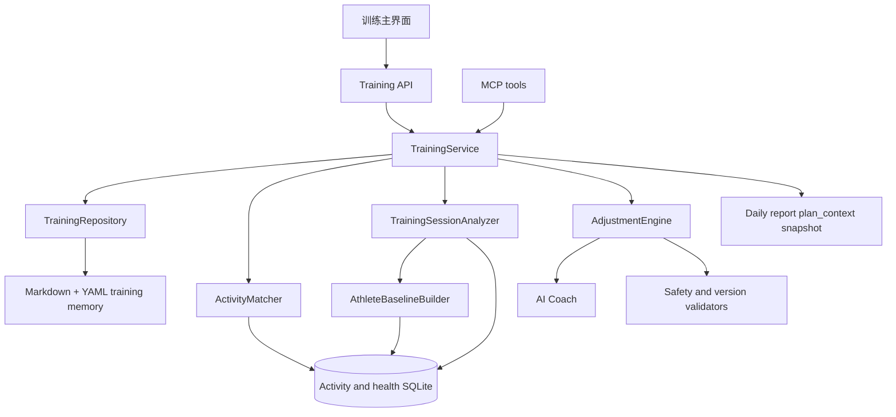

# 技术设计 — 交互式训练方案系统

> 版本: v0.2 · 日期: 2026-07-31
> 状态: 训练内容识别 v1 已本地实现并通过自动化测试；训练主界面、Adjustment Proposal 和完整训练方案系统仍为 Proposed
> 产品真相源: [training-experience.md](../product/training-experience.md)

## 1. 设计范围

本设计描述训练主界面、训练方案、周计划、今日训练、训练内容分析、执行反馈、活动匹配、调整提案和方案版本的目标架构。它不表示这些能力已经存在；当前运行时仍以 `active-plan.md`、日报 `plan_context` 快照和 `coach.py` 的整段 Markdown 写入为主。

## 2. 当前状态与缺口

- `coach.py` 的 `get_training_plan` 读取 `active-plan`，`save_training_plan` 接收完整 Markdown 并直接覆盖当前文件。
- `memory.py` 只把方案的少量字段复制进日报 `plan_context`。
- Web 首页展示日报快照，不直接读取实时训练方案。
- 当前没有周计划、训练反馈、待确认提案、版本校验和活动匹配的独立领域对象。
- 当前没有统一的训练内容分析层；活动类型主要来自 Provider 或活动名称，分段、个人基线与爬升没有形成可追溯分类。
- 教练历史工具从已生成日报读取近期训练，用户未生成日报的日期会从训练上下文缺失，即使 SQLite 中已有完整活动。
- Provider 已能返回部分累计爬升和活动详情，但汇总持久化、分段完整度与跨平台缺失语义尚未形成统一合同。
- 技术文档曾将 AI 对话定义为最终界面，与现有 Web 日报及目标训练主界面不一致。

## 3. 目标架构



训练 Web、CLI 和 MCP 共用同一业务服务，避免各入口分别实现状态迁移和写入规则。

## 4. 模块职责

| 组件 | 职责 |
|---|---|
| `TrainingService` | 聚合训练首页、创建草稿、接收反馈、审批提案和关闭周计划 |
| `TrainingRepository` | 读取和原子写入方案、周计划、提案、反馈、版本与执行记录 |
| `AdjustmentEngine` | 根据用户反馈、当前方案、训练数据和恢复状态生成结构化提案 |
| `TrainingValidator` | 校验版本、状态迁移、安全边界、历史日期和用户归属 |
| `ActivityMatcher` | 将计划训练与实际活动关联，保留无法匹配和人工确认状态 |
| `ActivityFactsNormalizer` | 将 Provider 活动汇总、详情与分段转换为保留来源和缺失语义的统一事实 |
| `AthleteBaselineBuilder` | 仅使用分析时点之前的近期原始活动、身体状态和有效档案建立个人能力参照 |
| `TrainingSessionAnalyzer` | 以确定性、版本化规则输出训练主类型、地形属性、置信度、证据和训练影响 |
| `TrainingPresenter` | 生成 Web、CLI 和 MCP 共用的结构化读模型 |

名称为目标职责，不要求实现时机械拆成同名文件；最终模块边界应结合现有 `memory.py`、`coach.py`、`storage.py` 和 `web.py` 决定。

## 5. 领域数据

### 5.1 Training Scheme

训练方案是长期策略，至少包含：

```yaml
type: training_scheme
plan_id: 10k-sub45-2026
version: 4
status: active
created_at: 2026-07-28T10:00:00+08:00
updated_at: 2026-07-28T10:30:00+08:00
goal:
  name: 10K 跑进 45 分钟
  target_date: 2026-10-18
constraints:
  available_days: [Tuesday, Wednesday, Thursday, Saturday, Sunday]
  max_session_minutes: 120
phases: []
weekly_pattern: {}
safety_guardrails: {}
```

### 5.2 Weekly Plan

周计划绑定一个方案版本，包含自然周、周目标、每日计划训练和当前状态。自然周按运动者本地日期的周一至周日计算；周目标累计只查询该边界内的 Actual Activity，不能复用负荷趋势所用的滚动 7 天窗口。长期方案调整或周内调整后，生成新版本但保留旧版本用于历史解释。

### 5.3 Planned Workout

计划训练包含稳定 ID、日期、训练类型、训练目的、距离或时长、强度区间、可接受替代方案和来源方案版本。训练内容不得只保存在 Markdown 正文中。

### 5.4 Training Feedback

反馈包含来源、发生时间、关联日期或计划训练、结构化类型和可选自由文本。MVP 类型包括：

```text
time_limited | fatigue | pain | schedule_conflict | weather | venue | post_workout
```

疼痛反馈必须包含部位、严重程度和是否影响日常活动等最小安全信息；系统只作训练风险路由，不作医疗诊断。

### 5.5 Adjustment Proposal

提案是不可直接执行的候选变更：

```yaml
type: adjustment_proposal
proposal_id: proposal-uuid
plan_id: 10k-sub45-2026
base_version: 3
status: pending
scope: today
reason: 用户只有 30 分钟
changes: []
impact: {}
risk_flags: []
data_basis: []
created_at: 2026-07-28T10:20:00+08:00
expires_at: 2026-07-29T00:00:00+08:00
```

### 5.6 Execution Record

执行记录把计划训练与一个或多个实际活动关联，状态包括 `completed`、`partially_completed`、`substituted`、`skipped` 和 `unmatched`。原始活动数据仍由 SQLite 持有，执行记录只保存引用和判断依据。

### 5.7 Actual Activity 与 Training Session Analysis

Actual Activity 是 Provider 同步的事实记录。Training Session Analysis 是可重算的派生解释，不能覆盖事实记录，也不能与 Execution Record 混用。

### 5.8 Activity Day State 与统计窗口

每日运动状态由共享领域层产生，展示层不得从空列表自行推断：

```text
training        = 至少存在一条 Actual Activity
confirmed_rest  = 当日 Activity Data Coverage 已完成，且没有 Actual Activity
unknown         = 同步未开始、进行中、失败或无法证明覆盖完成，且没有 Actual Activity
```

健康指标、步数或日报文件存在不构成 Activity Data Coverage。兼容字段 `is_rest_day` 仅在 `confirmed_rest` 时为 `true`；`unknown` 必须保留 `activity_state=unknown`，供 Web、CLI、日报和 AI 教练统一显示为数据未同步或状态未知。

共享日期函数 `natural_week_bounds(local_date)` 返回所在自然周的周一和周日。周计划与周目标调用该函数；ACWR、恢复趋势等明确命名为“近 7 天”的指标继续使用滚动窗口。AI 教练通过独立的自然周进度查询获得周累计，不得用 `get_training_history(days=7)` 代替。

```json
{
  "user_id": 42,
  "activity_id": "provider-activity-id",
  "algorithm_version": "session-analyzer-v1",
  "analyzed_at": "2026-07-31T09:00:00+08:00",
  "primary_type": "interval",
  "terrain": "hilly",
  "specialties": ["hill_repeats"],
  "confidence": 0.86,
  "data_quality": {
    "summary": "complete",
    "splits": "complete",
    "elevation": "complete",
    "athlete_baseline": "sufficient"
  },
  "evidence": [
    "检测到 6 组工作—恢复循环",
    "工作段强度接近个人阈值",
    "工作段集中在连续上坡"
  ],
  "training_implications": [
    "计入本周高强度课",
    "计入爬升专项负荷",
    "后续 24–48 小时避免再次安排高腿部负荷"
  ]
}
```

`primary_type` 与 `terrain` 分轴保存；组合名称只由 Presenter 生成。用户确认的纠正值作为独立 overlay 保存，读取时优先于自动值，不能删除原始分析证据。

## 6. 文件组织

继续使用用户隔离的 Markdown + YAML Memory，目标结构为：

```text
memory/plans/
├── active-plan.md
├── history/
│   └── <plan-id>-v<version>.md
├── weeks/
│   └── <plan-id>-<YYYY-Www>.md
├── proposals/
│   └── <proposal-id>.md
└── feedback/
    └── <date>-<feedback-id>.md

memory/auto/execution/
└── <plan-id>-<YYYY-Www>.md
```

`active-plan.md` 是当前生效读模型，历史版本不可覆盖。所有写入继续使用用户目录、`0600` 权限和同目录原子替换。

## 7. 实时读模型与日报快照

训练主界面必须通过训练服务读取实时方案、当前周计划和执行记录，不读取某份日报中的 `plan_context` 作为当前状态。

日报继续保存生成时的方案快照，用于解释当日建议依据。历史日报不得随着当前方案变化而被反向修改。

训练首页读模型至少包含：

```json
{
  "has_active_plan": true,
  "scheme": {},
  "today": {},
  "week": {},
  "pending_proposals": [],
  "sync_state": "current"
}
```

## 8. 写入与版本流程

```text
读取当前方案版本
→ 保存用户反馈
→ AI 生成结构化候选变更
→ 安全与业务规则校验
→ 创建 pending 提案
→ 用户查看差异
→ 用户批准并携带 base_version
→ 版本冲突检查
→ 原子保存历史版本和新 active 版本
→ 更新受影响周计划
→ 返回新版本
```

- 相同幂等键重复批准只返回既有结果。
- `base_version` 不是当前版本时返回冲突和最新方案摘要，不自动合并。
- 拒绝、过期或被新提案替代的提案不能批准。
- 历史日期的计划内容不可修改；修正匹配结论时记录新的执行判断。

## 9. Web API

目标接口：

| Method | Path | 用途 |
|---|---|---|
| `GET` | `/api/training/home` | 获取训练首页实时读模型 |
| `GET` | `/api/training/plan` | 获取完整训练方案和版本 |
| `POST` | `/api/training/plans` | 根据已有数据和用户约束创建草稿 |
| `POST` | `/api/training/plans/{id}/activate` | 确认并激活草稿 |
| `POST` | `/api/training/feedback` | 提交结构化反馈 |
| `POST` | `/api/training/proposals` | 为反馈生成调整提案 |
| `POST` | `/api/training/proposals/{id}/approve` | 按基础版本批准提案 |
| `POST` | `/api/training/proposals/{id}/reject` | 拒绝提案并可记录原因 |

所有接口使用当前应用账号鉴权和用户隔离路径；写请求支持幂等键，错误响应包含稳定错误码、原因和可操作建议。

## 10. CLI 与 MCP

CLI 必须保持单行、非交互、机器可读；需要用户确认的语义通过显式命令完成，而不是终端 prompt。

目标 MCP tools：

```text
get_training_home
get_training_plan
submit_training_feedback
propose_training_adjustment
approve_training_adjustment
reject_training_adjustment
```

现有 `get_training_plan` 保留并改为读取实时方案；直接覆盖式 `save_training_plan` 在新流程可用后废弃，由 propose/approve 两阶段工具替代。写入类工具不得加入默认 `autoApprove`。

## 11. 活动匹配

匹配按以下证据排序：

1. 用户明确关联；
2. 同日运动类型、开始时间、距离或时长和强度；
3. 一个计划训练与多个拆分活动的组合；
4. 合理时间窗口内的替代训练。

低置信度或同步尚未完成时保持 `unmatched`，不得直接写为 `skipped`。重复活动先按平台活动 ID 和现有入库规则去重。

## 12. 训练内容识别

> 实现状态：`ActivityFactsNormalizer`、`AthleteBaselineBuilder`、`TrainingSessionAnalyzer`、版本化 SQLite 派生记录、日报/教练/MCP 读取和同步详情补齐已完成。AnalyzerPolicy 仍需用真实多平台历史样本校准；用户纠正 overlay 仅完成数据表设计，尚无用户入口。

### 12.1 输入与事实优先级

```text
Provider summary + activity details + laps/splits
                    ↓
          ActivityFactsNormalizer
                    ↓
  NormalizedActivityFacts + AthleteBaseline
                    ↓
          TrainingSessionAnalyzer
                    ↓
       versioned TrainingSessionAnalysis
                    ↓
日报 / 执行记录 / 周复盘 / AdjustmentEngine
```

事实证据优先级为：原始分段与传感器事实、标准化活动汇总、Provider 明确类型、活动名称。Provider 标签和名称只能提高或降低置信度，不能在缺少结构证据时单独生成高置信度结论。

`NormalizedActivityFacts` 至少包含：

- 活动时间、时长、距离、运动类型和 Provider；
- 心率、配速、功率和步频的汇总值及有效样本状态；
- 有顺序的 laps/splits，包含时长、距离、强度指标和原始分段标签；
- 累计爬升、累计下降、单位距离爬升、连续爬坡段和坡度分布；
- 每个字段的来源、标准单位和缺失原因。

### 12.2 Athlete Baseline

基线默认使用活动发生前 28 天的完整原始活动；有效跑步样本不足时最多扩展至 42 天，并把不足状态写入 `data_quality`。基线只使用活动发生时已经存在的数据，禁止用未来成绩反向解释历史活动。

基线可以组合阈值配速/心率、临界功率、近期有氧稳定区间、近 7/28 天训练量以及活动当日恢复状态。已验证的用户档案优先于统计推断；人口通用区间只能作为低置信度降级值。

当前恢复状态参与“这堂课造成了什么刺激”和“接下来如何安排”的判断，不改变工作—恢复结构、路线和爬升等已经发生的事实。

### 12.3 分类规则

第一版使用可解释规则引擎，不让大模型直接从原始数组自由分类：

1. **间歇**：至少存在两组可辨认的工作—恢复交替，工作段与恢复段在相对配速、心率或功率上形成一致差异；Provider 的 `INTERVAL_ACTIVE` 等标签是强辅助证据。
2. **节奏**：存在连续、稳定的主体段，强度相对个人基线接近阈值，且不满足重复工作—恢复结构。
3. **有氧**：主体连续稳定，多数有效时间低于节奏强度，且没有明确间歇结构。
4. **未知**：证据冲突、有效数据不足，或置信度低于发布阈值。

地形独立判断：

- `hilly` 由单位距离爬升、连续爬坡段和坡度分布共同支持，不能只看活动名称；
- `trail` 需要 Provider 明确类型、用户确认或可靠路线表面证据，累计爬升本身不能证明越野；
- `mountain` 需要显著爬升密度、持续爬升/下降和路线证据的组合；
- 一次活动可以同时为 `interval + hilly`、`aerobic + trail` 或 `tempo + mountain`。

所有阈值属于版本化 `AnalyzerPolicy`，不得散落在 prompt 或展示代码中。首版默认值必须通过标注样本和历史回放确定；算法升级生成新版本，不原地篡改旧分析。

### 12.4 置信度与降级

Analyzer 分别计算结构、强度和地形证据，再聚合置信度。输出必须同时携带 `data_quality` 和证据，不允许只有一个无来源标签。

- 高置信度：可以进入统计、日报和 AdjustmentEngine 数据依据；
- 中置信度：界面显示“疑似”，建议中明确不确定性；
- 低置信度：返回 `unknown`，不据此调整后续关键课；
- 用户纠正：有效展示值以用户确认为准，自动结果、证据与算法版本仍保留。

### 12.5 持久化与重算

派生结果使用独立 SQLite 表，不向 `activities` 回写分类：

```sql
CREATE TABLE activity_analyses (
    analysis_id TEXT PRIMARY KEY,
    user_id INTEGER NOT NULL,
    activity_id TEXT NOT NULL,
    algorithm_version TEXT NOT NULL,
    input_fingerprint TEXT NOT NULL,
    analyzed_at TEXT NOT NULL,
    primary_type TEXT NOT NULL,
    terrain TEXT NOT NULL,
    confidence REAL NOT NULL,
    features_json TEXT NOT NULL,
    baseline_snapshot_json TEXT NOT NULL,
    specialties_json TEXT NOT NULL,
    evidence_json TEXT NOT NULL,
    data_quality_json TEXT NOT NULL,
    implications_json TEXT NOT NULL,
    UNIQUE (user_id, activity_id, algorithm_version, input_fingerprint)
);

CREATE TABLE activity_analysis_overrides (
    user_id INTEGER NOT NULL,
    activity_id TEXT NOT NULL,
    primary_type TEXT,
    terrain TEXT,
    reason TEXT,
    updated_at TEXT NOT NULL,
    PRIMARY KEY (user_id, activity_id)
);
```

`activity_analyses` 是不可变派生记录；`input_fingerprint` 覆盖活动事实与基线快照，使相同输入幂等、详情或基线变化时产生新记录。用户纠正单独写入 `activity_analysis_overrides`，不修改自动结果。旧分析保留用于解释历史日报；最新读模型选择当前算法版本、最新有效输入和用户 overlay。

### 12.6 日报、教练与计划集成

- 日报生成读取目标日期的 Actual Activity 和 Training Session Analysis；历史训练上下文直接查询 SQLite 原始活动及其分析，不依赖用户是否生成过历史日报。
- 日报保存当时使用的分析版本与证据快照，后续重算不反向修改历史日报。
- 教练 prompt 只负责解释结构化分析和提出建议，不能重新发明分类，也不能覆盖 Provider 原始负荷。
- 平台 `training_load` 原样保存；若后续引入 neurun 派生负荷，必须使用不同字段名、算法版本和单位语义。
- 高爬升、高强度或两者叠加可提高恢复关注度，并进入 Adjustment Proposal 的 `data_basis`；Analyzer 和 AI 都无权直接修改 active Training Scheme 或 Weekly Plan。

### 12.7 非目标

- 第一版不引入 LangChain 或其他 Agent 编排框架；
- 第一版不把该领域算法包装为运行时 Skill；未来 Skill 只能消费结构化结果并负责解释或追问；
- 不通过单一固定配速判断所有用户；
- 不以爬升替代训练负荷，也不以总爬升直接证明越野；
- 不进行医疗诊断或无确认的自动排课。

## 13. 安全与降级

- 疼痛反馈默认不生成加量或提高强度的提案。
- 高风险反馈仅允许降级、暂停或建议进一步评估。
- AI 输出必须经过结构化解析和确定性校验，不能直接作为文件内容写入。
- AI 不可用时返回可操作状态，保留已有方案读取和反馈记录能力。
- 训练建议属于运动辅助信息，不替代医疗诊断。
- 所有读写继续遵守 neurun Account 的用户数据隔离边界。

## 14. 迁移

首次启用新系统时：

1. 读取现有 `plans/active-plan.md`；
2. 将已能解析的目标、阶段、周跑量和周结构转换为 `training_scheme` v1；
3. 无法结构化的正文保留为 `legacy_notes`，不丢弃；
4. 保存不可变 v1 历史版本和新的 active 读模型；
5. 没有现有方案的用户进入产品空状态；
6. 迁移完成前不移除旧读取能力，迁移失败不覆盖原文件。

训练内容分析迁移采用旁路方式：先补齐可获得的活动汇总与详情，再按当前算法版本批量生成 `activity_analyses`。缺少分段或爬升的历史活动保留 `data_quality`，不伪造字段；迁移失败不影响原活动和日报读取。

## 15. 测试策略

- 领域状态迁移、提案版本冲突和幂等批准单元测试；
- 疼痛、疲劳和负荷边界的安全规则测试；
- 旧 `active-plan.md` 迁移和失败回滚测试；
- 活动完全匹配、拆分匹配、替代训练、重复数据和无法匹配测试；
- Training API 鉴权、用户隔离、错误码和并发测试；
- MCP schema 与业务服务一致性测试；
- 320px 移动端、键盘操作、状态非纯颜色表达和 `aria-live` 测试；
- 日报保留历史快照、训练页读取实时方案的回归测试。
- 有氧、节奏、间歇和未知分类的规则单元测试；
- 坡地、越野、山地与复合标签测试，验证爬升不会单独证明越野；
- 相同绝对配速在不同 Athlete Baseline 下产生不同刺激解释的测试；
- 缺少分段、心率、功率、爬升或历史日报时的降级测试；
- 只使用活动发生前数据、算法版本并存、详情补齐重算和用户纠正 overlay 测试；
- 山地专项进入建议依据但不能直接改写生效方案的边界测试。

## 16. 实现阶段

1. **数据与标注（进行中）**：已盘点 Provider 字段并建立自动化边界样例；真实多平台标注集和 AnalyzerPolicy 校准待完成。
2. **可识别（已完成 v1）**：归一化事实、个人基线、版本化 Analyzer、SQLite 历史上下文与日报只读接入。
3. **可感知**：只读 TrainingService、实时训练首页、训练证据展示和旧方案迁移读路径。
4. **可交互**：用户纠正、反馈、提案、批准、版本与 MCP 两阶段写入。
5. **可自适应**：活动匹配、执行记录、周复盘和下一周滚动提案。

实现开始时创建 `docs/process/YYYY-MM-DD-training-system.md` 记录实际模块拆分、迁移问题和验证结果。实现完成前，README 不得把本设计描述为已上线能力。
