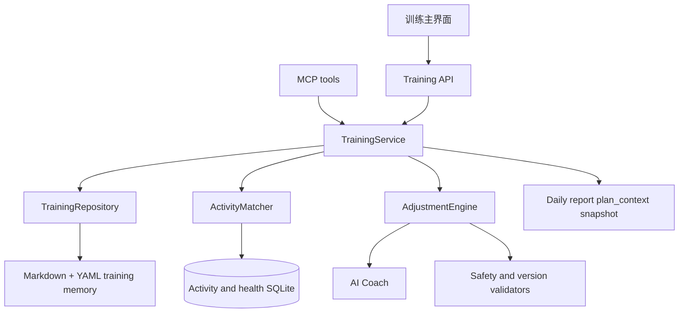

# 技术设计 — 交互式训练方案系统

> 版本: v0.1 · 日期: 2026-07-28
> 状态: Proposed，尚未实现或运行验证
> 产品真相源: [training-experience.md](../product/training-experience.md)

## 1. 设计范围

本设计描述训练主界面、训练方案、周计划、今日训练、执行反馈、活动匹配、调整提案和方案版本的目标架构。它不表示这些能力已经存在；当前运行时仍以 `active-plan.md`、日报 `plan_context` 快照和 `coach.py` 的整段 Markdown 写入为主。

## 2. 当前状态与缺口

- `coach.py` 的 `get_training_plan` 读取 `active-plan`，`save_training_plan` 接收完整 Markdown 并直接覆盖当前文件。
- `memory.py` 只把方案的少量字段复制进日报 `plan_context`。
- Web 首页展示日报快照，不直接读取实时训练方案。
- 当前没有周计划、训练反馈、待确认提案、版本校验和活动匹配的独立领域对象。
- 技术文档曾将 AI 对话定义为最终界面，与现有 Web 日报及目标训练主界面不一致。

## 3. 目标架构



训练 Web、CLI 和 MCP 共用同一业务服务，避免各入口分别实现状态迁移和写入规则。

## 4. 模块职责

| 组件 | 职责 |
|---|---|
| `TrainingService` | 聚合训练首页、创建草稿、接收反馈、审批提案和关闭周计划 |
| `TrainingRepository` | 读取和原子写入方案、周计划、提案、反馈、版本与执行记录 |
| `AdjustmentEngine` | 根据用户反馈、当前方案、训练数据和恢复状态生成结构化提案 |
| `TrainingValidator` | 校验版本、状态迁移、安全边界、历史日期和用户归属 |
| `ActivityMatcher` | 将计划训练与实际活动关联，保留无法匹配和人工确认状态 |
| `TrainingPresenter` | 生成 Web、CLI 和 MCP 共用的结构化读模型 |

名称为目标职责，不要求实现时机械拆成同名文件；最终模块边界应结合现有 `memory.py`、`coach.py`、`storage.py` 和 `web.py` 决定。

## 5. 领域数据

### 5.1 Training Scheme

训练方案是长期策略，至少包含：

```yaml
type: training_scheme
plan_id: 10k-sub45-2026
version: 4
status: active
created_at: 2026-07-28T10:00:00+08:00
updated_at: 2026-07-28T10:30:00+08:00
goal:
  name: 10K 跑进 45 分钟
  target_date: 2026-10-18
constraints:
  available_days: [Tuesday, Wednesday, Thursday, Saturday, Sunday]
  max_session_minutes: 120
phases: []
weekly_pattern: {}
safety_guardrails: {}
```

### 5.2 Weekly Plan

周计划绑定一个方案版本，包含自然周、周目标、每日计划训练和当前状态。长期方案调整或周内调整后，生成新版本但保留旧版本用于历史解释。

### 5.3 Planned Workout

计划训练包含稳定 ID、日期、训练类型、训练目的、距离或时长、强度区间、可接受替代方案和来源方案版本。训练内容不得只保存在 Markdown 正文中。

### 5.4 Training Feedback

反馈包含来源、发生时间、关联日期或计划训练、结构化类型和可选自由文本。MVP 类型包括：

```text
time_limited | fatigue | pain | schedule_conflict | weather | venue | post_workout
```

疼痛反馈必须包含部位、严重程度和是否影响日常活动等最小安全信息；系统只作训练风险路由，不作医疗诊断。

### 5.5 Adjustment Proposal

提案是不可直接执行的候选变更：

```yaml
type: adjustment_proposal
proposal_id: proposal-uuid
plan_id: 10k-sub45-2026
base_version: 3
status: pending
scope: today
reason: 用户只有 30 分钟
changes: []
impact: {}
risk_flags: []
data_basis: []
created_at: 2026-07-28T10:20:00+08:00
expires_at: 2026-07-29T00:00:00+08:00
```

### 5.6 Execution Record

执行记录把计划训练与一个或多个实际活动关联，状态包括 `completed`、`partially_completed`、`substituted`、`skipped` 和 `unmatched`。原始活动数据仍由 SQLite 持有，执行记录只保存引用和判断依据。

## 6. 文件组织

继续使用用户隔离的 Markdown + YAML Memory，目标结构为：

```text
memory/plans/
├── active-plan.md
├── history/
│   └── <plan-id>-v<version>.md
├── weeks/
│   └── <plan-id>-<YYYY-Www>.md
├── proposals/
│   └── <proposal-id>.md
└── feedback/
    └── <date>-<feedback-id>.md

memory/auto/execution/
└── <plan-id>-<YYYY-Www>.md
```

`active-plan.md` 是当前生效读模型，历史版本不可覆盖。所有写入继续使用用户目录、`0600` 权限和同目录原子替换。

## 7. 实时读模型与日报快照

训练主界面必须通过训练服务读取实时方案、当前周计划和执行记录，不读取某份日报中的 `plan_context` 作为当前状态。

日报继续保存生成时的方案快照，用于解释当日建议依据。历史日报不得随着当前方案变化而被反向修改。

训练首页读模型至少包含：

```json
{
  "has_active_plan": true,
  "scheme": {},
  "today": {},
  "week": {},
  "pending_proposals": [],
  "sync_state": "current"
}
```

## 8. 写入与版本流程

```text
读取当前方案版本
→ 保存用户反馈
→ AI 生成结构化候选变更
→ 安全与业务规则校验
→ 创建 pending 提案
→ 用户查看差异
→ 用户批准并携带 base_version
→ 版本冲突检查
→ 原子保存历史版本和新 active 版本
→ 更新受影响周计划
→ 返回新版本
```

- 相同幂等键重复批准只返回既有结果。
- `base_version` 不是当前版本时返回冲突和最新方案摘要，不自动合并。
- 拒绝、过期或被新提案替代的提案不能批准。
- 历史日期的计划内容不可修改；修正匹配结论时记录新的执行判断。

## 9. Web API

目标接口：

| Method | Path | 用途 |
|---|---|---|
| `GET` | `/api/training/home` | 获取训练首页实时读模型 |
| `GET` | `/api/training/plan` | 获取完整训练方案和版本 |
| `POST` | `/api/training/plans` | 根据已有数据和用户约束创建草稿 |
| `POST` | `/api/training/plans/{id}/activate` | 确认并激活草稿 |
| `POST` | `/api/training/feedback` | 提交结构化反馈 |
| `POST` | `/api/training/proposals` | 为反馈生成调整提案 |
| `POST` | `/api/training/proposals/{id}/approve` | 按基础版本批准提案 |
| `POST` | `/api/training/proposals/{id}/reject` | 拒绝提案并可记录原因 |

所有接口使用当前应用账号鉴权和用户隔离路径；写请求支持幂等键，错误响应包含稳定错误码、原因和可操作建议。

## 10. CLI 与 MCP

CLI 必须保持单行、非交互、机器可读；需要用户确认的语义通过显式命令完成，而不是终端 prompt。

目标 MCP tools：

```text
get_training_home
get_training_plan
submit_training_feedback
propose_training_adjustment
approve_training_adjustment
reject_training_adjustment
```

现有 `get_training_plan` 保留并改为读取实时方案；直接覆盖式 `save_training_plan` 在新流程可用后废弃，由 propose/approve 两阶段工具替代。写入类工具不得加入默认 `autoApprove`。

## 11. 活动匹配

匹配按以下证据排序：

1. 用户明确关联；
2. 同日运动类型、开始时间、距离或时长和强度；
3. 一个计划训练与多个拆分活动的组合；
4. 合理时间窗口内的替代训练。

低置信度或同步尚未完成时保持 `unmatched`，不得直接写为 `skipped`。重复活动先按平台活动 ID 和现有入库规则去重。

## 12. 安全与降级

- 疼痛反馈默认不生成加量或提高强度的提案。
- 高风险反馈仅允许降级、暂停或建议进一步评估。
- AI 输出必须经过结构化解析和确定性校验，不能直接作为文件内容写入。
- AI 不可用时返回可操作状态，保留已有方案读取和反馈记录能力。
- 训练建议属于运动辅助信息，不替代医疗诊断。
- 所有读写继续遵守 neurun Account 的用户数据隔离边界。

## 13. 迁移

首次启用新系统时：

1. 读取现有 `plans/active-plan.md`；
2. 将已能解析的目标、阶段、周跑量和周结构转换为 `training_scheme` v1；
3. 无法结构化的正文保留为 `legacy_notes`，不丢弃；
4. 保存不可变 v1 历史版本和新的 active 读模型；
5. 没有现有方案的用户进入产品空状态；
6. 迁移完成前不移除旧读取能力，迁移失败不覆盖原文件。

## 14. 测试策略

- 领域状态迁移、提案版本冲突和幂等批准单元测试；
- 疼痛、疲劳和负荷边界的安全规则测试；
- 旧 `active-plan.md` 迁移和失败回滚测试；
- 活动完全匹配、拆分匹配、替代训练、重复数据和无法匹配测试；
- Training API 鉴权、用户隔离、错误码和并发测试；
- MCP schema 与业务服务一致性测试；
- 320px 移动端、键盘操作、状态非纯颜色表达和 `aria-live` 测试；
- 日报保留历史快照、训练页读取实时方案的回归测试。

## 15. 实现阶段

1. **可感知**：只读 TrainingService、实时训练首页和旧方案迁移读路径。
2. **可交互**：反馈、提案、批准、版本与 MCP 两阶段写入。
3. **可自适应**：活动匹配、执行记录、周复盘和下一周滚动提案。

实现开始时创建 `docs/process/YYYY-MM-DD-training-system.md` 记录实际模块拆分、迁移问题和验证结果。实现完成前，README 不得把本设计描述为已上线能力。
